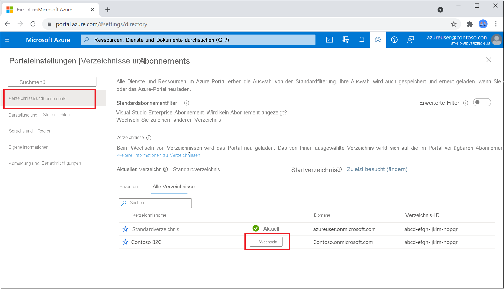

# Tutorial: Erstellen eines Azure Active Directory B2C-Mandanten

Bevor Ihre Anwendungen mit Azure Active Directory B2C (Azure AD B2C) interagieren können, müssen sie in einem von Ihnen verwalteten Mandanten registriert werden. 

> [!NOTE]
> Sie können bis zu 20 Mandanten pro Abonnement erstellen. Diese Beschränkung schützt vor Bedrohungen für Ihre Ressourcen, etwa vor Denial-of-Service-Angriffen, und wird sowohl im Azure-Portal als auch in der zugrunde liegenden Mandantenerstellungs-API erzwungen. Wenn Sie mehr als 20 Mandanten erstellen müssen, wenden Sie sich an den [Microsoft-Support](support-options.md).
> 
> Wenn Sie einen Mandantennamen wiederverwenden möchten, den Sie zuvor zu löschen versucht haben, aber bei der Eingabe des Domänennamens der Fehler „Wird bereits von einem anderen Verzeichnis verwendet.“ angezeigt wird, müssen Sie [die folgenden Schritte ausführen, um zuerst den Mandanten vollständig zu löschen](./faq.yml?tabs=app-reg-ga#how-do-i-delete-my-azure-ad-b2c-tenant-). Es ist mindestens die Rolle „Abonnementadministrator“ erforderlich. Nach dem Löschen des Mandanten müssen Sie sich möglicherweise zudem abmelden und wieder anmelden, bevor Sie den Domänennamen wiederverwenden können.

In diesem Artikel werden folgende Vorgehensweisen behandelt:

> [!div class="checklist"]
> * Erstellen eines Azure AD B2C-Mandanten
> * Verknüpfen Ihres Mandanten mit Ihrem Abonnement
> * Wechseln zu dem Verzeichnis, das Ihren Azure AD B2C-Mandanten enthält
> * Hinzufügen der Azure AD B2C-Ressource als **Favorit** im Azure-Portal

Im nächsten Tutorial erfahren Sie, wie Sie eine Anwendung registrieren.

## Voraussetzungen

- Ein Azure-Abonnement. Sollten Sie kein Abonnement besitzen, können Sie ein [kostenloses Konto](https://azure.microsoft.com/free/?WT.mc_id=A261C142F) erstellen, bevor Sie beginnen.

- Ein Azure-Konto, dem mindestens die Rolle [Mitwirkender](../role-based-access-control/built-in-roles.md) innerhalb des Abonnements oder einer Ressourcengruppe im Abonnement zugewiesen wurde, ist erforderlich. 

## Erstellen eines Azure AD B2C-Mandanten

1. Melden Sie sich beim [Azure-Portal](https://portal.azure.com/) an. 

1. Navigieren Sie zu dem Verzeichnis, das Ihr Abonnement enthält:
    1. Wählen Sie im Azure-Portal auf der Symbolleiste das Filtersymbol **Verzeichnisse und Abonnements** aus. 
    
        

    1. Navigieren Sie zu dem Verzeichnis, das Ihr Abonnement enthält, und wählen Sie daneben die Schaltfläche **Umschalten** aus. Beim Wechseln des Verzeichnisses wird das Portal neu geladen.

        

1. Fügen Sie **Microsoft.AzureActiveDirectory** als Ressourcenanbieter für das verwendete Azure-Abonnement hinzu ([weitere Informationen](../azure-resource-manager/management/resource-providers-and-types.md?WT.mc_id=Portal-Microsoft_Azure_Support#register-resource-provider-1)):

    1. Suchen Sie im Azure-Portal nach dem Eintrag **Abonnements**, und wählen Sie ihn aus.
    2. Wählen Sie Ihr Abonnement und dann im Menü auf der linken Seite **Ressourcenanbieter** aus. Wenn Ihnen das linke Menü nicht angezeigt wird, wählen Sie oben links auf der Seite das Symbol **Menü für < Name Ihres Abonnements > anzeigen** auf, um das Menü zu erweitern.
    3. Stellen Sie sicher, dass in der Zeile **Microsoft.AzureActiveDirectory** der Status **Registriert** angezeigt wird. Falls nicht, wählen Sie die Zeile und dann **Registrieren** aus.

1. Wählen Sie im Menü des Azure-Portals oder auf der **Startseite** die Option **Ressource erstellen** aus.

   

1. Suchen Sie nach **Azure Active Directory B2C**, und wählen Sie dann **Erstellen** aus.
2. Wählen Sie **Neuen Azure AD B2C-Mandanten erstellen**.

    

1. Geben Sie auf der Seite **Verzeichnis erstellen** Folgendes ein:

   - **Organisationsname**: Geben Sie einen Namen für Ihren Azure AD B2C-Mandanten ein.
   - **Name der Anfangsdomäne**: Geben Sie einen Domänennamen für Ihren Azure AD B2C-Mandanten ein.
   - **Land oder Region**: Wählen Sie in der Liste Ihr Land oder Ihre Region aus. Diese Auswahl kann später nicht mehr geändert werden.
   - **Abonnement**: Wählen Sie in der Liste Ihr Abonnement aus.
   - **Ressourcengruppe**: Wählen Sie die Ressourcengruppe aus, die den Mandanten enthalten soll, oder suchen Sie nach der Ressourcengruppe.

    

1. Klicken Sie auf **Überprüfen + erstellen**.
1. Überprüfen Sie Ihre Verzeichniseinstellungen. Klicken Sie anschließend auf **Erstellen**. [Hier](../azure-resource-manager/templates/common-deployment-errors.md) finden Sie weitere Informationen zum Beheben von Bereitstellungsfehlern.

Sie können mehrere Azure AD B2C-Mandanten zu Abrechnungszwecken mit einem einzelnen Azure-Abonnement verknüpfen. Zum Verknüpfen eines Mandanten müssen Sie auf dem Azure AD B2C-Mandanten ein Administrator sein, und Ihnen muss unter dem Azure-Abonnement mindestens die Rolle „Mitwirkender“ zugewiesen sein. Weitere Informationen finden Sie unter [Verknüpfen eines Azure AD B2C-Mandanten mit einem Abonnement](billing.md#link-an-azure-ad-b2c-tenant-to-a-subscription).

> [!NOTE]
> Wenn ein Azure AD B2C-Verzeichnis erstellt wird, wird automatisch eine Anwendung namens `b2c-extensions-app` im neuen Verzeichnis erstellt. Ändern oder löschen Sie sie nicht. Die Anwendung wird von Azure AD B2C zum Speichern von Benutzerdaten verwendet. Unter [Azure AD B2C: Erweiterungs-App](extensions-app.md) erhalten Sie weitere Informationen.

## Auswählen Ihres B2C-Mandantenverzeichnisses

Wenn Sie mit der Verwendung Ihres neuen Azure AD B2C-Mandanten beginnen möchten, müssen Sie zu dem Verzeichnis wechseln, das den Mandanten enthält:
1. Wählen Sie im Azure-Portal auf der Symbolleiste das Filtersymbol **Verzeichnisse und Abonnements** aus.
1. Navigieren Sie auf der Registerkarte **Alle Verzeichnisse** zu dem Verzeichnis, das Ihren Azure AD B2C-Mandanten enthält, und wählen Sie dann daneben die Schaltfläche **Umschalten** aus.

Wenn Ihr neuer Azure B2C-Mandant zunächst nicht in der Liste angezeigt wird, aktualisieren Sie Ihr Browserfenster, oder melden Sie sich ab und wieder neu an. Wählen Sie dann im Azure-Portal auf der Symbolleiste erneut das Filtersymbol **Verzeichnisse und Abonnements** aus.

## Hinzufügen von Azure AD B2C als Favorit (optional)

Dieser optionale Schritt erleichtert Ihnen die Auswahl Ihres Azure AD B2C-Mandanten in den folgenden Abschnitten und allen nachfolgenden Tutorials.

Statt jedes Mal, wenn Sie mit Ihrem Mandanten arbeiten möchten, in **Alle Dienste** nach *Azure AD B2C* suchen zu müssen, können Sie die Ressource als Favorit markieren. Anschließend können Sie sie im Abschnitt **Favoriten** des Portalmenüs auswählen, um schnell zu Ihrem Azure AD B2C-Mandanten zu navigieren.

Sie müssen diesen Vorgang nur einmal ausführen. Bevor Sie diese Schritte ausführen, müssen Sie in das Verzeichnis mit Ihrem Azure AD B2C-Mandanten gewechselt haben, wie im vorherigen Abschnitt, [Auswählen Ihres B2C-Mandantenverzeichnisses](#select-your-b2c-tenant-directory), beschrieben wurde.

1. Melden Sie sich beim [Azure-Portal](https://portal.azure.com) an.
1. Wählen Sie im Menü des Azure-Portals **Alle Dienste** aus.
1. Suchen Sie im Suchfeld **Alle Dienste** nach **Azure AD B2C**, zeigen Sie auf das Suchergebnis, und wählen Sie dann das Sternsymbol in der QuickInfo aus. Im Azure-Portal wird jetzt unter **Favoriten** **Azure AD B2C** angezeigt.
1. Wenn Sie die Position des neuen Favoriten ändern möchten, wählen Sie im Azure-Portalmenü **Azure AD B2C** aus, und ziehen Sie es dann nach oben oder unten an die gewünschte Position.

    

## Nächste Schritte

In diesem Artikel haben Sie Folgendes gelernt:

> [!div class="checklist"]
> * Erstellen eines Azure AD B2C-Mandanten
> * Verknüpfen Ihres Mandanten mit Ihrem Abonnement
> * Wechseln zu dem Verzeichnis, das Ihren Azure AD B2C-Mandanten enthält
> * Hinzufügen der Azure AD B2C-Ressource als **Favorit** im Azure-Portal

Als Nächstes erfahren Sie, wie Sie eine Webanwendung in Ihrem neuen Mandanten registrieren.

> [!div class="nextstepaction"]
> [Registrieren Ihrer Anwendungen](tutorial-register-applications.md)
