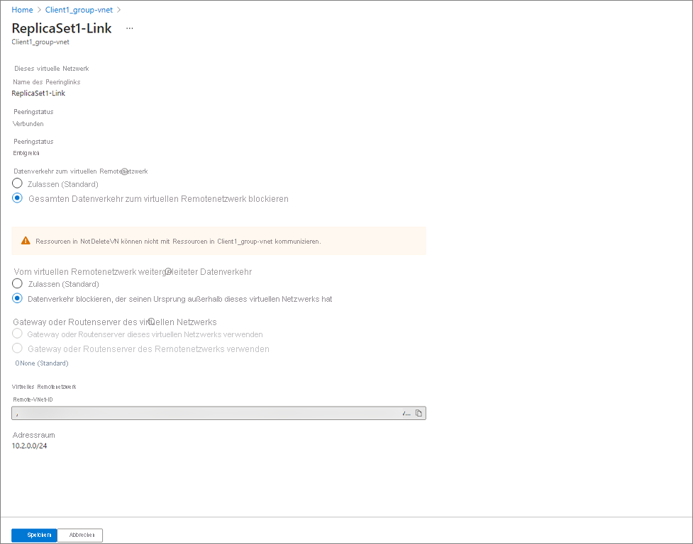

# Tutorial: Durchführen eines Notfallwiederherstellungsverfahrens mithilfe von Replikatgruppen in Azure AD Domain Services

In diesem Thema wird gezeigt, wie Sie mithilfe von Replikatgruppen ein Notfallwiederherstellungsverfahren in Azure AD Domain Services (Azure AD DS) durchführen.  Es wird simuliert, dass eine der Replikatgruppen durch Änderungen an den Eigenschaften des virtuellen Netzwerknetzwerks offline geschaltet wird, um den Clientzugriff darauf zu blockieren.  Es handelt sich um kein echtes Notfallwiederherstellungsverfahren, da die Replikatgruppe real nicht offline geschaltet wird. 

Das Notfallwiederherstellungsverfahren beinhaltet Folgendes: 

1. Ein Clientcomputer ist mit einer bestimmten Replikatgruppe verbunden. Er kann sich bei der Domäne authentifizieren und LDAP-Abfragen ausführen.
1. Die Verbindung des Clients mit der Replikatgruppe wird beendet. Dies geschieht durch Einschränkung des Netzwerkzugriffs.
1. Der Client stellt dann eine neue Verbindung mit der anderen Replikatgruppe her. Danach kann sich der Client bei der Domäne authentifizieren und LDAP-Abfragen ausführen. 
1. Das Domänenmitglied wird neu gestartet, und ein Domänenbenutzer kann sich nach dem Neustart anmelden.
1. Die Netzwerkeinschränkungen werden entfernt, und der Client kann eine Verbindung mit der ursprünglichen Replikatgruppe herstellen. 

## Voraussetzungen 

Zum Abschließen des Notfallwiederherstellungsverfahren müssen die folgenden Anforderungen erfüllt sein: 

- Eine aktive Azure AD DS-Instanz, die mit mindestens einer zusätzlichen Replikatgruppe bereitgestellt wurde. Die Domäne muss sich in einem fehlerfreien Status befinden. 
- Ein Clientcomputer muss mit der von Azure AD DS gehosteten Domäne verbunden sein.  Der Client muss sich in einem eigenen virtuellen Netzwerk befinden, das Peering virtueller Netzwerke muss mit beiden virtuellen Netzwerken der Replikatgruppe aktiviert sein, und das virtuelle Netzwerk muss über die IP-Adressen aller Domänencontroller in den Replikatgruppen verfügen, die in DNS aufgeführt sind. 

## Umgebungsvalidierung 

1. Melden Sie sich mit einem Domänenkonto beim Clientcomputer an. 
1. Installieren Sie Active Directory Domain Services-RSAT-Tools. 
1. Öffnen Sie ein PowerShell-Fenster mit erhöhten Rechten.
1. Führen Sie grundlegende Domänenüberprüfungen aus: 
   - Führen Sie `nslookup [domain]` aus, um sicherzustellen, dass die DNS-Auflösung ordnungsgemäß funktioniert. 
   - Führen Sie `nltest /dsgetdc:` aus, um eine Erfolgsmeldung zurückzugeben und anzugeben, welcher Domänencontroller gerade verwendet wird.
   - Führen Sie `nltest /dclist:` aus, um die vollständige Liste der Domänencontroller im Verzeichnis zurückzugeben. 
1. Führen Sie eine grundlegende Domänencontrollerüberprüfung auf jedem Domänencontroller im Verzeichnis aus (Sie können die vollständige Liste mit dem Befehl „nltest /dclist:“ abrufen): 
   - Führen Sie `nltest /sc_reset:[domain name]\[domain controller name]` aus, um eine sichere Verbindung mit dem Domänencontroller herzustellen. 
   - Führen Sie `Get-AdDomain` aus, um die grundlegenden Verzeichniseinstellungen abzurufen. 

## Durchführen eines Notfallwiederherstellungsverfahrens 

Sie führen diese Vorgänge für jede Replikatgruppe in der Azure AD DS-Instanz aus. Dadurch wird ein Ausfall für jede Replikatgruppe simuliert. Wenn Domänencontroller nicht erreichbar sind, führt der Client automatisch ein Failover auf einen erreichbaren Domänencontroller durch, und diese Umschaltung sollte für den Endbenutzer oder die Workload nahtlos erfolgen. Daher ist es wichtig, dass Anwendungen und Dienste nicht auf einen bestimmten Domänencontroller verweisen. 

1. Identifizieren Sie die Domänencontroller in der Replikatgruppe, deren Offlineschaltung simuliert werden soll. 
1. Stellen Sie auf dem Clientcomputer mithilfe von `nltest /sc_reset:[domain]\[domain controller name]` eine Verbindung mit einem der Domänencontroller her. 
1. Wechseln Sie im Azure-Portal zum Peering virtueller Netzwerke des Clients, und aktualisieren Sie die Eigenschaften, sodass der Datenverkehr zwischen dem Client und der Replikatgruppe blockiert wird. 
   1. Wählen Sie das Peer-Netzwerk aus, das aktualisiert werden soll. 
   1. Blockieren Sie den gesamten ein- oder ausgehenden Netzwerkdatenverkehr für das virtuelle Netzwerk. 
      
1. Versuchen Sie auf dem Clientcomputer, eine sichere Verbindung mit beiden Domänencontrollern aus Schritt 2 wiederherzustellen, indem Sie denselben „nltest“-Befehl verwenden. Diese Vorgänge sollten fehlschlagen, da die Netzwerkkonnektivität blockiert wurde. 
1. Führen Sie `Get-AdDomain` und `Get-AdForest` aus, um die grundlegenden Verzeichniseigenschaften abzurufen. Diese Aufrufe sind erfolgreich, da sie automatisch an einen der Domänencontroller in der anderen Replikatgruppe gerichtet werden. 
1. Starten Sie den Client neu, und melden Sie sich mit demselben Domänenkonto an. Dies zeigt, dass die Authentifizierung weiterhin wie erwartet funktioniert und Anmeldungen nicht blockiert werden. 
1. Wechseln Sie im Azure-Portal zum Peering virtueller Netzwerke des Clients, und aktualisieren Sie die Eigenschaften, damit die Blockierung des gesamten Datenverkehrs aufgehoben wird. Dadurch werden die in Schritt 3 vorgenommenen Änderungen rückgängig gemacht. 
1. Versuchen Sie auf dem Clientcomputer, eine sichere Verbindung mit den Domänencontrollern aus Schritt 2 wiederherzustellen, indem Sie denselben „nltest“-Befehl verwenden. Diese Vorgänge sollten erfolgreich sein, da die Blockierung der Netzwerkkonnektivität aufgehoben wurde. 

Diese Vorgänge zeigen, dass die Domäne weiterhin verfügbar ist, obwohl eine der Replikatgruppen für den Client nicht erreichbar ist. Führen Sie diese Schritte für jede Replikatgruppe in der Azure AD DS-Instanz aus. 

## Zusammenfassung 

Nachdem Sie diese Schritte abgeschlossen haben, sehen Sie, dass Domänenmitglieder weiterhin auf das Verzeichnis zugreifen, wenn eine der Replikatgruppen in Azure AD DS nicht erreichbar ist. Sie können das gleiche Verhalten simulieren, indem Sie den gesamten Netzwerkzugriff für eine Replikatgruppe anstelle eines Clientcomputers blockieren. Dies wird jedoch nicht empfohlen. Das Verhalten ändert sich aus Clientsicht nicht, wirkt sich jedoch auf die Integrität Ihrer Azure AD DS-Instanz aus, bis der Netzwerkzugriff wiederhergestellt ist. 

## Nächste Schritte

In diesem Tutorial haben Sie Folgendes gelernt:

> [!div class="checklist"]
> * Überprüfen der Clientkonnektivität mit Domänencontrollern in einer Replikatgruppe
> * Blockieren des Netzwerkdatenverkehrs zwischen dem Client und der Replikatgruppe
> * Überprüfen der Clientkonnektivität mit Domänencontrollern in einer anderen Replikatgruppe

Machen Sie sich mit der Funktionsweise von Replikatgruppen in Azure AD DS vertraut, um weitere Konzeptinformationen zu erhalten.

> [!div class="nextstepaction"]
> [Replikatgruppen: Konzepte und Features für Azure Active Directory Domain Services (Vorschau)][concepts-replica-sets]

<!-- INTERNAL LINKS -->
[replica-sets]: concepts-replica-sets.md
[tutorial-create-instance]: tutorial-create-instance-advanced.md
[create-azure-ad-tenant]: ../active-directory/fundamentals/sign-up-organization.md
[associate-azure-ad-tenant]: ../active-directory/fundamentals/active-directory-how-subscriptions-associated-directory.md
[howto-change-sku]: change-sku.md
[concepts-replica-sets]: concepts-replica-sets.md
