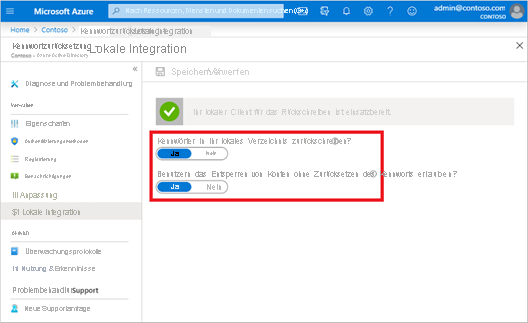

# <a name="tutorial-enable-cloud-sync-self-service-password-reset-writeback-to-an-on-premises-environment-preview"></a>Tutorial: Aktivieren der Cloudsynchronisierung für das Rückschreiben von Self-Service-Kennzurücksetzungen in eine lokale Umgebung (Vorschauversion)

Die Azure Active Directory Connect-Cloudsynchronisierung kann Azure AD-Kennwortänderungen in Echtzeit zwischen Benutzern in getrennten lokalen Active Directory Domain Services-Domänen (AD DS) synchronisieren. Die öffentliche Vorschau der Azure AD Connect-Cloudsynchronisierung kann zusammen mit [Azure Active Directory Connect](tutorial-enable-sspr-writeback.md) auf Domänenebene ausgeführt werden, um das Kennwortrückschreiben für zusätzliche Szenarien zu vereinfachen, z. B. für Benutzer, die sich aufgrund einer Unternehmensteilung oder -fusion in nicht verbundenen Domänen befinden. Sie können jeden Dienst in unterschiedlichen Domänen so konfigurieren, dass je nach Bedarf verschiedene Benutzergruppen als Ziel festgelegt werden. Die Azure Active Directory Connect-Cloudsynchronisierung nutzt den schlanken Azure AD-Agent für die Cloudbereitstellung, um die Einrichtung für das Rückschreiben von Self-Service-Kennwortzurücksetzungen (Self-Service Password Reset, SSPR) zu vereinfachen und eine sichere Möglichkeit zu bieten, Kennwortänderungen in der Cloud an ein lokales Verzeichnis zurückzusenden. 

Die Azure Active Directory Connect-Cloudsynchronisierung für das SSPR-Rückschreiben wird im Rahmen einer öffentlichen Vorschau unterstützt. Weitere Informationen zu Vorschauversionen finden Sie unter [Zusätzliche Nutzungsbestimmungen für Microsoft Azure-Vorschauen](https://azure.microsoft.com/support/legal/preview-supplemental-terms/).

## <a name="prerequisites"></a>Voraussetzungen 

- Ein Azure AD-Mandant mit mindestens einer aktivierten Azure AD Premium P1- oder -Testlizenz. Erstellen Sie ggf. [ein kostenloses Konto](https://azure.microsoft.com/free/?WT.mc_id=A261C142F). 
- Ein Konto mit einer der folgenden Rollen:
  - [Authentifizierungsrichtlinienadministrator](../roles/permissions-reference.md#authentication-policy-administrator) und [Hybrididentitätsadministrator](../roles/permissions-reference.md#hybrid-identity-administrator)
  - [Globaler Administrator](../roles/permissions-reference.md#global-administrator) 
- Für Self-Service-Kennwortzurücksetzung konfigurierte Azure AD-Instanz Absolvieren Sie bei Bedarf das Tutorial zum Aktivieren der Self-Service-Kennwortzurücksetzung von Azure AD. 
- Eine lokale AD DS-Umgebung, die mit Version 1.1.587 oder höher der Azure AD-Cloudsynchronisierung konfiguriert ist. Konfigurieren Sie die Azure AD Connect-Cloudsynchronisierung bei Bedarf mithilfe der Anweisungen in [diesem Tutorial](tutorial-enable-sspr.md). 
- Zum Aktivieren des Kennwortrückschreibens in der Azure AD Connect-Cloudsynchronisierung müssen signierte PowerShell-Skripts ausgeführt werden.
  - Stellen Sie sicher, dass die PowerShell-Ausführungsrichtlinie das Ausführen von Skripts zulässt. 
  - Die empfohlene Ausführungsrichtlinie während der Installation ist „RemoteSigned“. 
  - Weitere Informationen zum Festlegen der PowerShell-Ausführungsrichtlinie finden Sie unter [Set-ExecutionPolicy](/powershell/module/microsoft.powershell.security/set-executionpolicy). 


## <a name="deployment-steps"></a>Bereitstellungsschritte

1. [Konfigurieren von Kontoberechtigungen für den Azure AD Connect-Cloudsynchronisierungsdienst](#configure-azure-ad-connect-cloud-sync-service-account-permissions)
1. [Aktivieren des Kennwortrückschreibens in der Azure AD Connect-Cloudsynchronisierung](#enable-password-writeback-in-azure-ad-connect-cloud-sync)
1. [Aktivieren des Kennwortrückschreibens für Self-Service-Kennwortzurücksetzung](#enable-password-writeback-for-sspr)
 
### <a name="configure-azure-ad-connect-cloud-sync-service-account-permissions"></a>Konfigurieren von Kontoberechtigungen für den Azure AD Connect-Cloudsynchronisierungsdienst 

Berechtigungen für die Cloudsynchronisierung sind standardmäßig konfiguriert. Wenn Berechtigungen zurückgesetzt werden müssen, finden Sie unter [Problembehandlung](#troubleshooting) weitere Informationen zu den spezifischen Berechtigungen, die für das Kennwortrückschreiben erforderlich sind, und zum Festlegen dieser Berechtigungen mithilfe von PowerShell. 

### <a name="enable-password-writeback-in-azure-ad-connect-cloud-sync"></a>Aktivieren des Kennwortrückschreibens in der Azure AD Connect-Cloudsynchronisierung

Für die öffentliche Vorschau müssen Sie das Kennwortrückschreiben in der Azure AD Connect-Cloudsynchronisierung aktivieren, indem Sie das Cmdlet „Set-AADCloudSyncPasswordWritebackConfiguration“ und die Anmeldeinformationen des globalen Administrators des Mandanten verwenden: 

```powershell
Import-Module 'C:\\Program Files\\Microsoft Azure AD Connect Provisioning Agent\\Microsoft.CloudSync.Powershell.dll' 
Set-AADCloudSyncPasswordWritebackConfiguration -Enable $true -Credential $(Get-Credential)
``` 

### <a name="enable-password-writeback-for-sspr"></a>Aktivieren des Kennwortrückschreibens für Self-Service-Kennwortzurücksetzung 

Nachdem das Kennwortrückschreiben in der Azure AD Connect-Cloudsynchronisierung aktiviert wurde, überprüfen und konfigurieren Sie Azure AD SSPR für das Kennwortrückschreiben. Wenn Sie SSPR für die Nutzung des Kennwortrückschreibens aktivieren, wird für Benutzer, die ihr Kennwort ändern oder zurücksetzen, dieses aktualisierte Kennwort ebenfalls wieder mit der lokalen AD DS-Umgebung synchronisiert. 

Führen Sie zum Überprüfen und Aktivieren des Kennwortrückschreibens in SSPR die folgenden Schritte aus: 

1. Melden Sie sich mit dem globalen Administratorkonto beim Azure-Portal an. 
1. Navigieren Sie zu Azure Active Directory, klicken Sie auf **Kennwortzurücksetzung**, und wählen Sie dann **Lokale Integration** aus. 
1. Vergewissern Sie sich, dass der Agent für die Azure AD Connect-Cloudsynchronisierung eingerichtet ist.
1. Legen Sie **Kennwörter in Ihr lokales Verzeichnis zurückschreiben?** auf **Ja** fest. 
1. Legen Sie **Benutzern das Entsperren von Konten ohne Zurücksetzen ihres Kennworts erlauben?** auf **Ja** fest.
   
   

1. Wählen Sie **Speichern** aus, wenn Sie so weit sind. 

## <a name="clean-up-resources"></a>Bereinigen von Ressourcen

Wenn Sie die im Rahmen dieses Dokuments konfigurierte Funktionalität für das SSPR-Rückschreiben nicht mehr nutzen möchten, gehen Sie wie folgt vor: 

1. Melden Sie sich mit dem globalen Administratorkonto beim Azure-Portal an. 
1. Suchen Sie nach Azure Active Directory, und wählen Sie **Kennwortzurücksetzung** und dann **Lokale Integration** aus. 
1. Legen Sie **Kennwörter in Ihr lokales Verzeichnis zurückschreiben?** auf **Nein** fest. 
1. Legen Sie **Benutzern das Entsperren von Konten ohne Zurücksetzen ihres Kennworts erlauben?** auf **Nein** fest. 

Führen Sie auf Ihrem Server für die Azure AD Connect-Cloudsynchronisierung `Set-AADCloudSyncPasswordWritebackConfiguration` mit globalen Administratoranmeldeinformationen aus, um das Kennwortrückschreiben unter Verwendung der Azure AD Connect-Cloudsynchronisierung zu deaktivieren. 

```powershell
Import-Module ‘C:\\Program Files\\Microsoft Azure AD Connect Provisioning Agent\\Microsoft.CloudSync.Powershell.dll’ 
Set-AADCloudSyncPasswordWritebackConfiguration -Enable $false -Credential $(Get-Credential)
```

## <a name="supported-operations"></a>Unterstützte Vorgänge

Kennwörter werden in den folgenden Situationen für Endbenutzer und Administratoren zurückgeschrieben.


| Konto        | Unterstützte Vorgänge | 
|----------------|------------------------|
| Endbenutzer      |  Jegliche freiwillige Self-Service-Kennwortänderung durch einen Endbenutzer<br>Jegliche erzwungene Self-Service-Kennwortänderung durch einen Endbenutzer, beispielsweise bei Ablauf des Kennworts<br>Jegliche Self-Service-Kennwortzurücksetzung durch einen Endbenutzer über das Kennwortzurücksetzungsportal |
| Administrators |  Jegliche freiwillige Self-Service-Kennwortänderung durch einen Administrator<br>Jegliche erzwungene Self-Service-Kennwortänderung durch einen Administrator, beispielsweise bei Ablauf des Kennworts<br>Jegliche Self-Service-Kennwortzurücksetzung durch einen Administrator über das Kennwortzurücksetzungsportal<br> Jegliche durch einen Administrator initiierte Kennwortzurücksetzung durch einen Endbenutzer über das Azure-Portal<br>Jegliche durch einen Administrator initiierte Endbenutzerkennwortzurücksetzung über Microsoft Graph-API.                       |

## <a name="unsupported-operations"></a>Nicht unterstützte Vorgänge

Kennwörter werden in folgenden Situationen nicht zurückgeschrieben:

| Konto        | Nicht unterstützte Vorgänge | 
|----------------|------------------------|
| Endbenutzer      | Jede Zurücksetzung des eigenen Kennworts durch einen Endbenutzer über ein PowerShell-Cmdlet oder die Microsoft Graph-API                        |
| Administrators | Jede vom Administrator ausgelöste Kennwortzurücksetzung für Endbenutzer über ein PowerShell-Cmdlet<br>Jegliche durch einen Administrator initiierte Kennwortzurücksetzung durch den Endbenutzer über das Microsoft 365 Admin Center<br>Kein Administrator kann das Tool zum Zurücksetzen des Kennworts verwenden, um sein eigenes Kennwort oder das eines anderen Administrators in Azure AD zum Kennwortrückschreiben zurückzusetzen.                        |

## <a name="validation-scenarios"></a>Validierungsszenarios

Nutzen Sie die folgenden Verfahren, um Szenarien mit Kennwortrückschreibung zu prüfen. Alle Validierungsszenarien erfordern, dass die Cloudsynchronisierung installiert ist und der Benutzer sich im Geltungsbereich für das Kennwortrückschreiben befindet.  


|Szenario|Details |
|--------|--------|
| Kennwortzurücksetzung über die Anmeldeseite | Lassen Sie zwei Benutzer aus nicht verbundenen Domänen und Gesamtstrukturen eine Self-Service-Kennwortzurücksetzung durchführen. Sie könnten Azure AD Connect und Cloudsynchronisierung auch parallel bereitstellen und einen Benutzer im Geltungsbereich der Cloudsynchronisierungskonfiguration und einen anderen Benutzer im Geltungsbereich von Azure AD Connect anweisen, ihr Kennwort zurückzusetzen. |
| Erzwingen der Änderung abgelaufener Kennwörter | Lassen Sie zwei Benutzer aus getrennten Domänen und Gesamtstrukturen abgelaufene Kennwörter ändern. Sie könnten Azure AD Connect und Cloudsynchronisierung auch parallel bereitstellen und über einen Benutzer im Geltungsbereich der Cloudsynchronisierungskonfiguration und über einen anderen Benutzer im Geltungsbereich von Azure AD Connect verfügen. |
| Reguläre Kennwortänderung | Lassen Sie zwei Benutzer aus nicht verbundenen Domänen und Gesamtstrukturen eine routinemäßige Kennwortänderung durchführen. Sie könnten Azure AD Connect und Cloudsynchronisierung auch parallel bereitstellen und über einen Benutzer im Geltungsbereich der Cloudsynchronisierungskonfiguration und über einen anderen Benutzer im Geltungsbereich von Azure AD Connect verfügen.  |
| Administratorzurücksetzung des Benutzerkennworts | Lassen Sie zwei Benutzer aus nicht verbundenen Domänen und Gesamtstrukturen eine Kennwortzurücksetzung über das Azure-Verwaltungsportal oder das Portal für Mitarbeiter in Service und Produktion durchführen. Sie könnten Azure AD Connect und Cloudsynchronisierung auch parallel bereitstellen und über einen Benutzer im Geltungsbereich der Cloudsynchronisierungskonfiguration und über einen anderen Benutzer im Geltungsbereich von Azure AD Connect verfügen.  |
| Self-Service-Kontoentsperrung | Lassen Sie zwei Benutzer aus nicht verbundenen Domänen und Gesamtstrukturen Konten im SSPR-Portal entsperren, um das Kennwort zurückzusetzen. Sie könnten Azure AD Connect und Cloudsynchronisierung auch parallel bereitstellen und über einen Benutzer im Geltungsbereich der Cloudsynchronisierungskonfiguration und über einen anderen Benutzer im Geltungsbereich von Azure AD Connect verfügen. |

## <a name="troubleshooting"></a>Problembehandlung

Das verwaltete Dienstkonto für die Azure AD Connect-Cloudsynchronisierungsgruppe sollte standardmäßig über die folgenden Berechtigungen für das Kennwortrückschreiben verfügen: 

- Kennwort zurücksetzen
- Schreibberechtigungen für „lockoutTime“
- Schreibberechtigungen für „pwdLastSet“
- Erweiterte Rechte für „Abgelaufenes Kennwort wiederherstellen“ für das Stammobjekt jeder Domäne in dieser Gesamtstruktur, sofern noch nicht festgelegt. 

Wenn diese Berechtigungen nicht festgelegt sind, können Sie die Berechtigung „PasswordWriteBack“ für das Dienstkonto mit dem Cmdlet „Set-AADCloudSyncPermissions“ und den Anmeldeinformationen des lokalen Unternehmensadministrators festlegen: 

```powershell
Import-Module ‘C:\\Program Files\\Microsoft Azure AD Connect Provisioning Agent\\Microsoft.CloudSync.Powershell.dll’ 
Set-AADCloudSyncPermissions -PermissionType PasswordWriteBack -EACredential $(Get-Credential)
```

Nach dem Aktualisieren der Berechtigungen kann eine Stunde oder länger dauern, bis diese Berechtigungen an alle Objekte in Ihrem Verzeichnis repliziert wurden. 

Wenn Sie diese Berechtigungen nicht zuweisen, scheint die Rückschreibung ordnungsgemäß konfiguriert zu sein, aber die Benutzer erhalten möglicherweise Fehler, wenn sie ihre lokalen Kennwörter über die Cloud aktualisieren. Berechtigungen müssen für „Dieses und alle untergeordneten Objekte“ angewendet werden, damit „Abgelaufenes Kennwort wiederherstellen“ angezeigt wird. 

Wenn Kennwörter für einige Benutzerkonten nicht in das lokale Verzeichnis zurückgeschrieben werden, stellen Sie sicher, dass die Vererbung für das Konto in der lokalen AD DS-Umgebung nicht deaktiviert ist. Schreibberechtigungen für Kennwörter müssen auf Nachfolgerobjekte angewendet werden, damit die Funktion ordnungsgemäß funktioniert. 

Kennwortrichtlinien in der lokalen AD DS-Umgebung verhindern unter Umständen, dass Kennwortzurücksetzungen ordnungsgemäß verarbeitet werden. Wenn Sie diese Funktion testen und das Kennwort für Benutzer mehr als einmal pro Tag zurücksetzen möchten, muss die Gruppenrichtlinie für das Mindestalter von Kennwörtern auf 0 festgelegt werden. Diese Einstellung finden Sie in gpmc.msc unter „Computerkonfiguration“ > „Richtlinien“ > „Windows-Einstellungen“ > „Sicherheitseinstellungen“ > „Kontorichtlinien“. 

Warten Sie beim Aktualisieren der Gruppenrichtlinie, bis die aktualisierte Richtlinie repliziert wurde, oder verwenden Sie den Befehl „gpupdate /force“. 

Damit Kennwörter sofort geändert werden können, muss für Mindestalter für Kennwörter die Einstellung „0“ festgelegt werden. Wenn sich Benutzer aber an die lokalen Richtlinien halten und „Minimales Kennwortalter“ auf einen höheren Wert als 0 festgelegt ist, funktioniert das Kennwortrückschreiben auch nach dem Auswerten der lokalen Richtlinien noch. 

Weitere Informationen zum Überprüfen oder Einrichten der geeigneten Berechtigungen finden Sie unter [Konfigurieren der Kontoberechtigungen für Azure AD Connect](tutorial-enable-sspr-writeback.md#configure-account-permissions-for-azure-ad-connect). 

## <a name="next-steps"></a>Nächste Schritte

- Weitere Informationen zur Cloudsynchronisierung und einen Vergleich zwischen Azure AD Connect und Cloudsynchronisierung finden Sie unter [Worum handelt es sich bei der Azure AD Connect-Cloudsynchronisierung?](../cloud-sync/what-is-cloud-sync.md)
- Ein Tutorial zum Einrichten des Kennwortrückschreibens mithilfe von Azure AD Connect finden Sie unter [Tutorial: Aktivieren des Rückschreibens von Azure Active Directory-Self-Service-Kennzurücksetzungen in eine lokale Umgebung](tutorial-enable-sspr-writeback.md).
