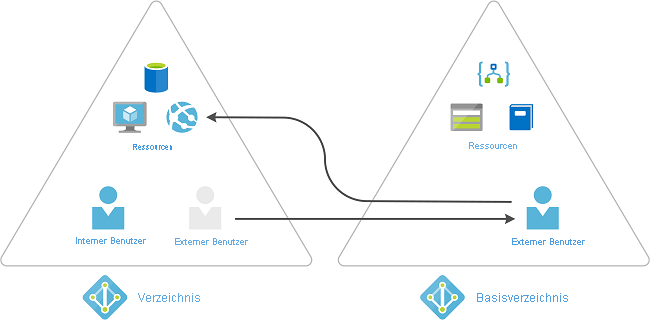

# Was ist Azure AD Privileged Identity Management?

 Privileged Identity Management (PIM) ist ein Dienst in Azure Active Directory (Azure AD), mit dem Sie den Zugriff auf wichtige Ressourcen innerhalb Ihrer Organisation verwalten, steuern und überwachen können. Diese Ressourcen umfassen Ressourcen in Azure AD, Azure und anderen Microsoft-Onlinediensten wie Microsoft 365 oder Microsoft Intune. Im folgenden Video werden wichtige PIM-Konzepte und -Features vorgestellt.
  

> [!VIDEO https://www.youtube.com/embed/f-0K7mRUPpQ]

## Argumente für die Verwendung

Unternehmen möchten die Anzahl der Personen minimieren, die auf sichere Informationen oder Ressourcen zugreifen können. Dadurch wird Risiko reduziert, dass

- ein böswilliger Akteur Zugriff erlangt
- ein autorisierter Benutzer, der versehentlich eine sensible Ressource beeinträchtigt

Benutzer müssen jedoch in Azure AD, Azure, Microsoft 365 oder SaaS-Apps weiterhin privilegierte Vorgänge ausführen. Unternehmen können Benutzern Just-in-Time privilegierten Zugriff auf Azure und Azure AD gewähren und überwachen, was diese Benutzer mit ihrem privilegierten Zugriff tun.

## Lizenzanforderungen

[!INCLUDE [Azure AD Premium P2 license](../../../includes/active-directory-p2-license.md)]

Weitere Informationen zu Lizenzen für Benutzer finden Sie unter [Lizenzanforderungen für die Verwendung von PIM](subscription-requirements.md).

## Behandelte Themen

Privileged Identity Management bietet eine zeit- und genehmigungsbasierte Rollenaktivierung, um die Risiken durch übermäßige, unnötige oder missbrauchte Zugriffsberechtigungen für wichtige Ressourcen zu verringern. Im Anschluss folgen einige der wichtigsten Features von Privileged Identity Management:

- Gewähren von privilegiertem **Just-In-Time**-Zugriff auf Azure AD- und Azure-Ressourcen
- Zuweisen von **zeitgebundenem** Zugriff auf Ressourcen (mit Start- und Enddatum)
- Anfordern einer **Genehmigung** bei der Aktivierung privilegierter Rollen
- Erzwingen der **mehrstufigen Authentifizierung** für alle Rollenaktivierungen
- Anfordern einer **Begründung**, um nachvollziehen zu können, warum Benutzer eine Aktivierung vornehmen
- Erhalten von **Benachrichtigungen**, wenn privilegierte Rollen aktiviert werden
- Durchführen von **Zugriffsüberprüfungen**, um zu prüfen, ob Benutzer die Rollen weiterhin benötigen
- Herunterladen eines **Überwachungsverlaufs** zur internen oder externen Überwachung
- Diese Überwachung verhindert das Entfernen der **letzten aktiven globalen Administrator**-Rollenzuweisung

## Verwendungsmöglichkeiten

Nachdem Sie Privileged Identity Management eingerichtet haben, werden im linken Navigationsmenü die Optionen **Aufgaben**, **Verwalten** und **Aktivität** angezeigt. Als Administrator wählen Sie zwischen verschiedenen Optionen, etwa zum Verwalten von **Azure AD-Rollen**, Verwalten von Rollen für **Azure-Ressourcen** oder Gruppen mit privilegiertem Zugriff. Bei Auswahl der zu verwaltenden Elementen werden die entsprechenden Optionen angezeigt.

## Berechtigungen und Rollen

Für Azure AD-Rollen in Privileged Identity Management gilt: Nur die Benutzer mit der Rolle „Administrator für privilegierte Rollen“ oder der Rolle „Globaler Administrator“ können Zuweisungen für andere Administratoren verwalten. Globale Administratoren, Sicherheitsadministratoren, globale Leser und Benutzer mit Leseberechtigung für die Sicherheitsfunktionen können auch die Azure AD-Rollen in Privileged Identity Management anzeigen.

Bei Azure-Ressourcenrollen in Privileged Identity Management können nur Abonnementadministratoren, Ressourcenbesitzer und Ressourcen-Benutzerzugriffsadministratoren Zuweisungen für andere Administratoren verwalten. Administratoren für privilegierte Rollen, Sicherheitsadministratoren und Benutzer mit Leseberechtigung für Sicherheitsfunktionen haben standardmäßig keinen Zugriff auf Azure-Ressourcenrollenzuweisungen in Privileged Identity Management.

## Begriff

Machen Sie sich zum besseren Verständnis von Privileged Identity Management und der zugehörigen Dokumentation mit den folgenden Begriffen vertraut:

| Begriff oder Konzept | Rollenzuweisungskategorie | BESCHREIBUNG |
| --- | --- | --- |
| Berechtigt | type | Eine Rollenzuweisung, bei der ein Benutzer mindestens eine Aktion ausführen muss, um die Rolle nutzen zu können. Wenn ein Benutzer zu einer Rolle berechtigt ist, kann er die Rolle aktivieren, wenn er privilegierte Aufgaben ausführen muss. Es gibt keinen Unterschied hinsichtlich des Zugriffs zwischen einer permanenten und einer berechtigten Rollenzuweisung. Der einzige Unterschied ist, dass einige Benutzer den Zugriff nicht jederzeit benötigen. |
| aktiv | type | Eine Rollenzuweisung, bei der ein Benutzer keine Aktion ausführen muss, um die Rolle nutzen zu können. Bei als aktiv zugewiesenen Benutzern sind die Berechtigungen der Rolle zugewiesen. |
| aktivieren |  | Das Ausführen mindestens einer Aktion zum Verwenden einer Rolle, zu der der Benutzer berechtigt ist. Beispiele für Aktionen sind eine erfolgreiche Multi-Factor Authentication-Überprüfung (MFA), die Angabe einer geschäftlichen Begründung oder das Anfordern einer Genehmigung von den angegebenen genehmigenden Personen. |
| zugewiesen | State | Ein Benutzer mit einer Rollenzuweisung vom Typ „aktiv“. |
| aktiviert | State | Ein Benutzer mit einer Rollenzuweisung vom Typ „berechtigt“, der die Aktionen zum Aktivieren der Rolle ausgeführt hat und nun aktiv ist. Nach der Aktivierung kann der Benutzer die Rolle für einen vorkonfigurierten Zeitraum nutzen. Danach muss sie erneut aktiviert werden. |
| dauerhaft berechtigt | Duration | Eine Rollenzuweisung, bei der ein Benutzer immer zum Aktivieren der Rolle berechtigt ist. |
| dauerhaft aktiv | Duration | Eine Rollenzuweisung, bei der ein Benutzer die Rolle jederzeit ohne vorherige Aktion verwenden kann. |
| zeitgebunden berechtigt | Duration | Eine Rollenzuweisung, bei der ein Benutzer nur innerhalb eines Zeitraums (Start- und Enddatum) zum Aktivieren der Rolle berechtigt ist. |
| zeitgebunden aktiv | Duration | Eine Rollenzuweisung, bei der ein Benutzer die Rolle nur innerhalb eines Zeitraums (Start- und Enddatum) verwenden kann |
| Just-in-Time-Zugriff (JIT) |  | Ein Modell, bei dem Benutzer temporäre Berechtigungen zum Ausführen privilegierter Aufgaben erhalten. Dieses Modell verhindert, dass böswillige oder nicht autorisierte Benutzer nach dem Ablauf der Berechtigungen Zugriff erhalten. Der Zugriff wird nur gewährt, wenn Benutzer ihn benötigen. |
| Prinzip des Zugriffs mit den geringsten Rechten |  | Eine empfohlene Sicherheitsmethode, bei der alle Benutzer nur die zum Ausführen der Aufgaben, für die sie autorisiert sind, mindestens erforderlichen Berechtigungen erhalten. Diese Methode minimiert die Anzahl von globalen Administratoren, indem stattdessen spezifische Administratorrollen für bestimmte Szenarien verwendet werden. |

## Verlängern und Erneuern von Zuweisungen

Nach der Einrichtung Ihrer zeitgebundenen Besitzer- oder Mitgliederzuweisungen fragen Sie sich vielleicht, was passiert, wenn eine Zuweisung abläuft. In dieser neuen Version bieten wir zwei Optionen für dieses Szenario:

- Verlängern: Wenn eine Rollenzuweisung demnächst abläuft, kann der Benutzer über Privileged Identity Management eine Verlängerung für die Rollenzuweisung anfordern.
- Erneuern: Wenn eine Rollenzuweisung bereits abgelaufen ist, kann der Benutzer über Privileged Identity Management eine Erneuerung für die Rollenzuweisung anfordern.

Diese beiden vom Benutzer initiierten Aktionen erfordern eine Genehmigung von einem globalen Administrator oder einem Administrator für privilegierte Rollen. Administratoren müssen sich nicht mit der Verwaltung von ablaufenden Zuweisungen befassen. Sie können einfach warten, bis die Erweiterungs- oder Verlängerungsanforderungen für eine einfache Genehmigung oder Verweigerung eintreffen.

## Szenarien

Privileged Identity Management unterstützt folgende Szenarien:

### Berechtigungen von Administratoren für privilegierte Rollen

- Aktivieren der Genehmigung für bestimmte Rollen
- Angeben von Genehmigungsbenutzern oder -gruppen für die Genehmigung von Anforderungen
- Anzeigen des Anforderungs- und Genehmigungsverlaufs für alle privilegierten Rollen

### Berechtigungen von genehmigenden Personen

- Anzeigen ausstehender Genehmigungen (Anforderungen)
- Genehmigen oder Ablehnen (einzelner oder mehrerer) Anforderungen zur Rechteerweiterung für Rollen
- Angeben einer Begründung für die Genehmigung/Ablehnung

### Berechtigungen von Benutzern mit berechtigter Rolle

- Anfordern der Aktivierung einer Rolle, die genehmigt werden muss
- Anzeigen des Status Ihrer Aktivierungsanforderung
- Fertigstellen Ihrer Aufgabe in Azure AD, wenn die Aktivierung genehmigt wurde

## Verwalten für privilegierte Azure AD-Zugriffsgruppen (Vorschau)

In Privileged Identity Management (PIM) kann nun die Berechtigung zur Mitgliedschaft in privilegierten Zugriffsgruppen oder zum Besitz privilegierter Zugriffsgruppen zugewiesen werden. Ab dieser Vorschauversion können Sie Cloudgruppen integrierte Azure AD-Rollen (Azure Active Directory) zuweisen und die Berechtigung und Aktivierung von Gruppenmitgliedern und -besitzern mithilfe von PIM verwalten. Weitere Informationen zu Gruppen, die in Azure AD Rollen zugewiesen werden können, finden Sie unter [Verwenden von Azure AD-Gruppen zum Verwalten von Rollenzuweisungen](../roles/groups-concept.md).

>[!Important]
> Verwenden Sie zum Zuweisen einer Gruppe mit privilegiertem Zugriff zu einer Rolle für den Administratorzugriff auf Exchange, Security & Compliance Center oder SharePoint die Funktion **Rollen und Administratoren** im Azure AD-Portal und nicht die Funktion für Gruppen mit privilegiertem Zugriff, um den Benutzer oder die Gruppe als berechtigt für die Aktivierung in der Gruppe festzulegen.

### Unterschiedliche Just-in-Time-Richtlinien für jede Gruppe

Einige Organisationen verwenden Tools wie Azure AD B2B-Zusammenarbeit (Business-to-Business), um ihre Partner als Gäste in Ihre Azure AD-Organisation einzuladen. Anstelle einer einzelnen Just-In-Time-Richtlinie für alle Zuweisungen zu einer privilegierten Rolle können Sie zwei unterschiedliche privilegierte Zugriffsgruppen mit jeweils eigenen Richtlinien erstellen. So können Sie weniger strenge Anforderungen für Ihre vertrauenswürdigen Mitarbeiter und strengere Anforderungen wie etwa einen Genehmigungsworkflow für Ihre Partner erzwingen, wenn diese eine Aktivierung in der zugewiesenen Gruppe anfordern.

### Aktivieren mehrerer Rollenzuweisungen in einer Anforderung

Mit der Vorschauversion privilegierter Zugriffsgruppen können Sie workloadspezifischen Administratoren mit einer einzelnen Just-In-Time-Anforderung schnell Zugriff auf mehrere Rollen gewähren. Ein Beispiel: Ihre Office-Administratoren der Ebene 3 benötigen ggf. täglich Just-In-Time-Zugriff auf die Rollen „Exchange-Administrator“, „Administrator für Office-Apps“, „Teams-Administrator“ und „Suchadministrator“, um Vorfälle sorgfältig untersuchen zu können. Früher war dies mit einem gewissen Zeitaufwand verbunden, da hierzu vier aufeinanderfolgende Anforderungen erforderlich waren. Nun können Sie stattdessen eine Gruppe namens „Office-Administratoren der Ebene 3“ erstellen, die Rollen zugewiesen werden kann. Diese Gruppe können Sie dann jeder der vier zuvor genannten Rollen (oder anderen integrierten Azure AD-Rollen) zuweisen und im Aktivitätsabschnitt der Gruppe für privilegierten Zugriff aktivieren. Nach der Aktivierung für privilegierten Zugriff können Sie die Just-In-Time-Einstellungen für Mitglieder der Gruppe konfigurieren und ihre Administratoren und Besitzer als berechtigt zuweisen. Wenn die Administratoren in die Gruppe aufsteigen, werden Sie zu Mitgliedern aller vier Azure AD-Rollen.

## Laden Sie Gastbenutzer ein, und weisen Sie ihnen Azure-Ressourcenrollen in Privileged Identity Management zu.

Azure Active Directory (Azure AD)-Gastbenutzer sind Teil der Business-to-Business (B2B)-Zusammenarbeitsfunktionen innerhalb von Azure AD, sodass Sie externe Gastbenutzer und Anbieter als Gäste in Azure AD verwalten können. Beispielsweise können Sie diese Privileged Identity Management-Funktionen für Azure-Identitätsaufgaben mit Gästen verwenden. Das gilt z. B. für das Zuweisen des Zugriffs auf bestimmte Azure-Ressourcen, das Angeben der Zuweisungsdauer und des Enddatums oder das Erfordern einer zweistufigen Überprüfung bei aktiver Zuweisung oder Aktivierung. Weitere Informationen zum Einladen eines Gasts in Ihr Unternehmen und zum Verwalten des Zugriffs finden Sie unter [Hinzufügen von B2B-Zusammenarbeitsbenutzern im Azure AD-Portal](../external-identities/add-users-administrator.md).

### Wann laden Sie Gäste ein?

Einige Beispiele für Situationen, in denen Sie möglicherweise Gäste in Ihre Organisation einladen:

- Zugriff für einen externen selbstständigen Anbieter, der nur über ein E-Mail-Konto verfügt, auf Ihre Azure-Ressourcen für ein Projekt
- Zugriff für einen externen Partner in einer großen Organisation, die lokale Active Directory-Verbunddienste (AD FS) verwendet, auf Ihre Kostenmanagementanwendung
- Temporärer Zugriff für Supporttechniker außerhalb Ihrer Organisation (z.B. Microsoft-Support) auf Ihre Azure-Ressource zur Behebung von Problemen

### Wie funktioniert Kollaboration mit B2B-Gästen?

Wenn Sie B2B Collaboration verwenden, können Sie einen externen Benutzer als Gast in Ihre Organisation einladen. Der Gast kann als Benutzer in Ihrer Organisation verwaltet werden, aber ein Gast muss in seiner eigenen Organisation authentifiziert sein, und nicht in Ihrer Azure AD-Organisation. Dies bedeutet, dass ein Gast, der keinen Zugriff mehr auf seine eigene Organisation hat, auch den Zugriff auf Ihre Organisation verlieren wird. Wenn der Gast beispielsweise seine Organisation verlässt, verliert er automatisch den Zugriff auf alle Ressourcen, die Sie in Azure AD für ihn freigegeben haben, ohne dass Sie etwas tun müssen. Weitere Informationen zur B2B-Zusammenarbeit finden Sie unter [Was ist der Gastbenutzerzugriff in Azure Active Directory-B2B?](../external-identities/what-is-b2b.md).

## Nächste Schritte

- [Lizenzanforderungen für die Verwendung von PIM](subscription-requirements.md)
- [Schützen des privilegierten Zugriffs für hybride und Cloudbereitstellungen in Azure AD](../roles/security-planning.md?toc=%2fazure%2factive-directory%2fprivileged-identity-management%2ftoc.json)
- [Bereitstellen von Azure AD Privileged Identity Management (PIM)](pim-deployment-plan.md)
