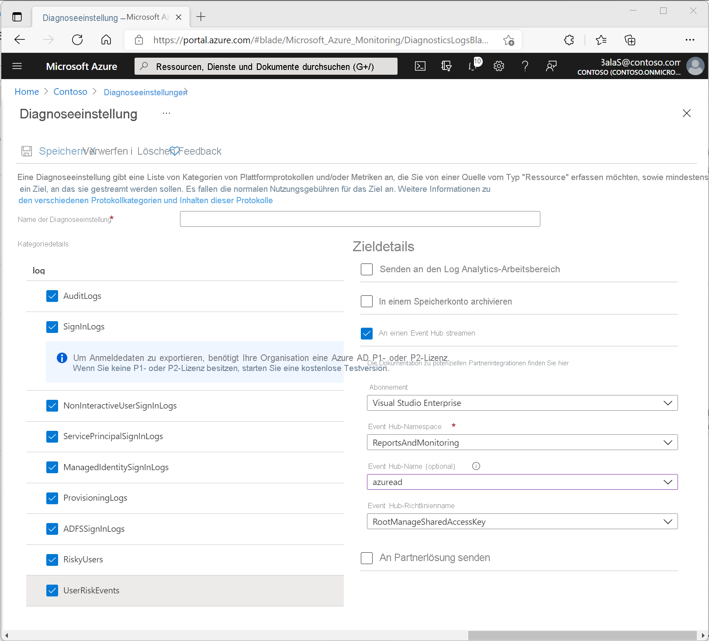

# Tutorial: Streamen von Azure Active Directory-Protokollen an einen Azure Event Hub

In diesem Tutorial erfahren Sie, wie Sie Azure Monitor-Diagnoseeinstellungen einrichten, um Azure Active Directory-Protokolle (Azure AD) an einen Azure Event Hub zu streamen. Verwenden Sie diesen Mechanismus, um Ihre Protokolle in Security Information & Event Management-Tools (SIEM) von Drittanbietern zu integrieren, beispielsweise Splunk und QRadar.

## Voraussetzungen 

Sie benötigen Folgendes, um dieses Feature verwenden zu können:

* Ein Azure-Abonnement. Falls Sie nicht über ein Azure-Abonnement verfügen, können Sie sich [für eine kostenlose Testversion registrieren](https://azure.microsoft.com/free/).
* Einen Azure AD-Mandanten.
* Einen Benutzer, der als *globaler Administrator* oder *Sicherheitsadministrator* für den Azure AD-Mandanten fungiert.
* Einen Event Hubs-Namespace und einen Event Hub in Ihrem Azure-Abonnement. Erfahren Sie, wie Sie einen [Event Hub erstellen](../../event-hubs/event-hubs-create.md).

## Streamen von Protokollen an einen Event Hub

1. Melden Sie sich beim [Azure-Portal](https://portal.azure.com) an. 

1. Wählen Sie **Azure Active Directory** > **Überwachungsprotokolle** aus. 

1. Wählen Sie **Einstellungen für das Exportieren von Daten** aus.  
    
1. Führen Sie im Bereich **Diagnoseeinstellungen** einen der folgenden Schritte aus:
    * Klicken Sie zum Ändern vorhandener Einstellungen auf **Einstellung bearbeiten**.
    * Klicken Sie zum Hinzufügen neuer Einstellungen auf **Diagnoseeinstellungen hinzufügen**.  
      Sie können maximal drei Einstellungen verwenden.

1. Aktivieren Sie das Kontrollkästchen **An einen Event Hub streamen**, und klicken Sie auf **Event Hub/Konfigurieren**.

   
   
   1. Wählen Sie das Azure-Abonnement und den Event Hubs-Namespace aus, an den Sie die Protokolle weiterleiten möchten.  
    Das Abonnement und der Event Hubs-Namespace müssen jeweils dem Azure AD-Mandanten zugeordnet sein, von dem die Protokolle gestreamt werden. Sie können einen Event Hub auch in dem Event Hubs-Namespace angeben, an den Protokolle gesendet werden sollen. Wenn kein Event Hub angegeben ist, wird im Namespace ein Event Hub mit dem Standardnamen **insights-logs-audit** erstellt.

   1. Wählen Sie eine beliebige Kombination der folgenden Elemente aus:
       - Aktivieren Sie das Kontrollkästchen **AuditLogs**, um Überwachungsprotokolle an den Event Hub zu senden. 
       - Aktivieren Sie das Kontrollkästchen **SignInLogs**, um die Anmeldeprotokolle der interaktiven Benutzer an den Event Hub zu senden.
       - Aktivieren Sie das Kontrollkästchen **NonInteractiveUserSignInLogs**, um die Anmeldeprotokolle der nicht interaktiven Benutzer an den Event Hub zu senden. 
       - Aktivieren Sie das Kontrollkästchen **ServicePrincipalSignInLogs,** um die Dienstprinzipal-Anmeldeprotokolle an den Event Hub zu senden.
       - Aktivieren Sie das Kontrollkästchen **ManagedIdentitySignInLogs,** um die Anmeldeprotokolle für verwaltete Identitäten an den Event Hub zu senden.
       - Aktivieren Sie das Kontrollkästchen **ProvisioningLogs**, um die Bereitstellungsprotokolle an den Event Hub zu senden.
       - Aktivieren Sie das Kontrollkästchen **ADFSSignInLogs**, um Anmeldungen zu senden, die von einem AD FS Connect Health-Agenten an Azure AD gesendet wurden.
       - Aktivieren Sie das Kontrollkästchen **RiskyUsers**, um Informationen zu Risikobenutzern zu senden.
       - Aktivieren Sie das Kontrollkästchen **UserRiskEvents**, um Informationen zu Risikoereignissen von Benutzern zu senden. 

       > [!NOTE]
       > Einige Anmeldekategorien enthalten abhängig von der Konfiguration Ihres Mandanten große Mengen an Protokolldaten. Im Allgemeinen können die nicht interaktiven Benutzer- und Dienstprinzipal-Anmeldungen fünf- bis zehnmal größer sein als die interaktiven Benutzeranmeldeinformationen.

   1. Klicken Sie auf **Speichern**, um die Einstellung zu speichern.

1. Überprüfen Sie nach ungefähr 15 Minuten, ob Ereignisse in Ihrem Event Hub angezeigt werden. Navigieren Sie hierzu im Portal zum Event Hub, und vergewissern Sie sich, dass die Anzahl von **eingehenden Nachrichten** größer als Null ist. 

    

## Zugreifen auf Daten aus Ihrem Event Hub

Nachdem die Daten im Event Hub angezeigt werden, stehen Ihnen zwei Möglichkeiten zur Verfügung, um auf die Daten zuzugreifen und sie zu lesen:

* **Konfigurieren eines unterstützten SIEM-Tools**. Zum Lesen von Daten aus dem Event Hub benötigen die meisten Tools die Event Hub-Verbindungszeichenfolge und bestimmte Berechtigungen für Ihr Azure-Abonnement. Drittanbietertools mit Azure Monitor-Integration sind u. a.:
    
    * **ArcSight**: Weitere Informationen zur Integration von Azure AD-Protokollen in ArcSight finden Sie unter [Integrieren von Azure Active Directory-Protokollen in ArcSight mit Azure Monitor](howto-integrate-activity-logs-with-arcsight.md).
    
    * **Splunk:** Weitere Informationen zur Integration von Azure AD-Protokollen in Splunk finden Sie unter [Integrieren von Azure AD-Protokollen in Splunk mit Azure Monitor (Vorschauversion)](./howto-integrate-activity-logs-with-splunk.md).
    
    * **IBM QRadar:** Das DSM und das Azure Event Hub-Protokoll stehen auf der [Supportseite von IBM](https://www.ibm.com/support) zum Download zur Verfügung. Weitere Informationen zur Integration in Azure finden Sie auf der Website zur [IBM QRadar Security Intelligence-Plattform 7.3.0](https://www.ibm.com/support/knowledgecenter/SS42VS_DSM/c_dsm_guide_microsoft_azure_overview.html?cp=SS42VS_7.3.0).
    
    * **Sumo Logic:** Wenn Sie Sumo Logic für die Verwendung von Daten aus einem Event Hub einrichten möchten, lesen Sie die Informationen unter [Install the Azure Active Directory App and View the Dashboards](https://help.sumologic.com/Send-Data/Applications-and-Other-Data-Sources/Azure_Active_Directory/Install_the_Azure_Active_Directory_App_and_View_the_Dashboards) (Installieren der Azure Active Directory-App und Anzeigen der Dashboards). 

* **Einrichten benutzerdefinierter Tools**. Wenn Ihr aktuelles SIEM-Tool in der Azure Monitor-Diagnose noch nicht unterstützt wird, können Sie mit der Event Hub-API benutzerdefinierte Tools einrichten. Weitere Informationen finden Sie unter [Erste Schritte zum Empfangen von Nachrichten von einem Event Hub](../../event-hubs/event-hubs-dotnet-standard-getstarted-send.md).

## Nächste Schritte

* [Erstellen von Diagnoseeinstellungen zum Senden von Plattformprotokollen und Metriken an verschiedene Ziele](../../azure-monitor/essentials/diagnostic-settings.md)
* [Integrieren von Azure Active Directory-Protokollen in ArcSight mit Azure Monitor](howto-integrate-activity-logs-with-arcsight.md)
* [Integrate Azure AD logs with Splunk by using Azure Monitor](./howto-integrate-activity-logs-with-splunk.md) (Integrieren von Azure AD-Protokollen in Splunk mithilfe von Azure Monitor)
* [Integrieren von Azure AD-Protokollen in SumoLogic mit Azure Monitor](howto-integrate-activity-logs-with-sumologic.md)
* [Integrieren von Azure AD Protokollen in Elastic mithilfe eines Event Hubs](https://github.com/Microsoft/azure-docs/blob/master/articles/active-directory/reports-monitoring/tutorial-azure-monitor-stream-logs-to-event-hub.md)
* [Interpret audit logs schema in Azure Monitor](./overview-reports.md) (Interpretieren des Überwachungsprotokollschemas in Azure Monitor)
* [Interpret sign-in logs schema in Azure Monitor](reference-azure-monitor-sign-ins-log-schema.md) (Interpretieren des Anmeldeprotokollschemas in Azure Monitor)
