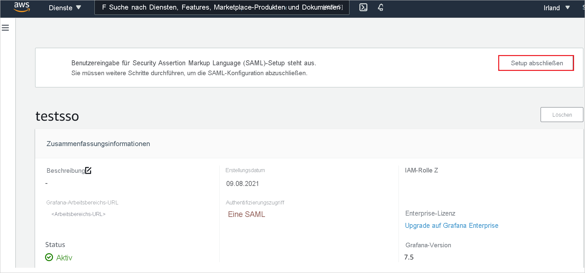
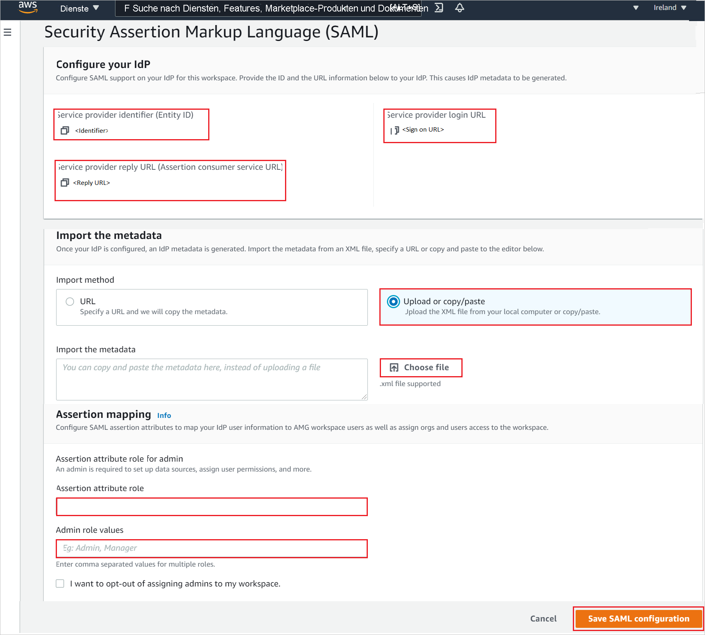

# Tutorial: Integration des einmaligen Anmeldens (Single Sign-On, SSO) von Azure Active Directory in Amazon Managed Grafana

In diesem Tutorial erfahren Sie, wie Sie Amazon Managed Grafana in Azure Active Directory (Azure AD) integrieren. Die Integration von Amazon Managed Grafana in Azure AD hat folgende Vorteile:

* Sie können in Azure AD steuern, wer Zugriff auf Amazon Managed Grafana haben soll.
* Sie können Ihren Benutzern ermöglichen, sich mit ihrem Azure AD-Konto automatisch bei Amazon Managed Grafana anzumelden.
* Verwalten Sie Ihre Konten zentral im Azure-Portal.

## Voraussetzungen

Für die ersten Schritte benötigen Sie Folgendes:

* Ein Azure AD-Abonnement Falls Sie über kein Abonnement verfügen, können Sie ein [kostenloses Azure-Konto](https://azure.microsoft.com/free/) verwenden.
* [Kostenloses Konto](https://aws.amazon.com/free/) für Amazon Web Services (AWS)
* Ein Amazon Managed Grafana-Abonnement, für das einmaliges Anmelden (Single Sign-On, SSO) aktiviert ist.

## Beschreibung des Szenarios

In diesem Tutorial konfigurieren und testen Sie das einmalige Anmelden von Azure AD in einer Testumgebung.

* Amazon Managed Grafana unterstützt **SP**-initiiertes einmaliges Anmelden.
* Amazon Managed Grafana unterstützt die **Just-In-Time**-Benutzerbereitstellung.

## Hinzufügen von Amazon Managed Grafana aus dem Katalog

Um die Integration von Amazon Managed Grafana in Azure AD zu konfigurieren, müssen Sie Amazon Managed Grafana über den Katalog Ihrer Liste mit den verwalteten SaaS-Apps hinzufügen.

1. Melden Sie sich mit einem Geschäfts-, Schul- oder Unikonto oder mit einem persönlichen Microsoft-Konto beim Azure-Portal an.
1. Wählen Sie im linken Navigationsbereich den Dienst **Azure Active Directory** aus.
1. Navigieren Sie zu **Unternehmensanwendungen**, und wählen Sie dann **Alle Anwendungen** aus.
1. Wählen Sie zum Hinzufügen einer neuen Anwendung **Neue Anwendung** aus.
1. Geben Sie im Abschnitt **Aus Katalog hinzufügen** den Suchbegriff **Amazon Managed Grafana** in das Suchfeld ein.
1. Wählen Sie im Ergebnisbereich die Option **Amazon Managed Grafana** aus, und fügen Sie dann die App hinzu. Warten Sie einige Sekunden, während die App Ihrem Mandanten hinzugefügt wird.

## Konfigurieren und Testen des einmaligen Anmeldens von Azure AD für Amazon Managed Grafana

Konfigurieren und testen Sie das einmalige Anmelden von Azure AD mit Amazon Managed Grafana mithilfe eines Testbenutzers namens **B. Simon**. Damit einmaliges Anmelden funktioniert, muss eine Linkbeziehung zwischen einem Azure AD-Benutzer und dem entsprechenden Benutzer in Amazon Managed Grafana eingerichtet werden.

Führen Sie die folgenden Schritte aus, um das einmalige Anmelden von Azure AD mit Amazon Managed Grafana zu konfigurieren und zu testen:

1. **[Konfigurieren des einmaligen Anmeldens von Azure AD](#configure-azure-ad-sso)** , um Ihren Benutzern die Verwendung dieses Features zu ermöglichen.
    1. **[Erstellen eines Azure AD-Testbenutzers](#create-an-azure-ad-test-user)** , um das einmalige Anmelden von Azure AD mit dem Testbenutzer B. Simon zu testen.
    1. **[Zuweisen des Azure AD-Testbenutzers](#assign-the-azure-ad-test-user)** , um B. Simon die Verwendung des einmaligen Anmeldens von Azure AD zu ermöglichen.
1. **[Konfigurieren des einmaligen Anmeldens für Amazon Managed Grafana](#configure-amazon-managed-grafana-sso)** , um die Einstellungen für einmaliges Anmelden auf der Anwendungsseite zu konfigurieren.
    1. **[Erstellen eines Testbenutzers für Amazon Managed Grafana](#create-amazon-managed-grafana-test-user)** , um in Amazon Managed Grafana ein Pendant von B. Simon zu erhalten, das mit der Benutzerdarstellung in Azure AD verknüpft ist.
1. **[Testen des einmaligen Anmeldens](#test-sso)** , um zu überprüfen, ob die Konfiguration funktioniert

## Konfigurieren des einmaligen Anmeldens (Single Sign-On, SSO) von Azure AD

Gehen Sie wie folgt vor, um das einmalige Anmelden von Azure AD im Azure-Portal zu aktivieren.

1. Suchen Sie im Azure-Portal auf der Anwendungsintegrationsseite für **Amazon Managed Grafana** den Abschnitt **Verwalten**, und wählen Sie **Einmaliges Anmelden** aus.
1. Wählen Sie auf der Seite **SSO-Methode auswählen** die Methode **SAML** aus.
1. Klicken Sie auf der Seite **Einmaliges Anmelden (SSO) mit SAML einrichten** auf das Stiftsymbol für **Grundlegende SAML-Konfiguration**, um die Einstellungen zu bearbeiten.

   

1. Führen Sie im Abschnitt **Grundlegende SAML-Konfiguration** die folgenden Schritte aus:

    a. Geben Sie im Textfeld **Bezeichner (Entitäts-ID)** eine URL im folgenden Format ein: `https://<namespace>.grafana-workspace.<region>.amazonaws.com/saml/metadata`.

    b. Geben Sie im Textfeld **Anmelde-URL** eine URL im folgenden Format ein: `https://<namespace>.grafana-workspace.<region>.amazonaws.com/login/saml`.

    > [!NOTE]
    > Hierbei handelt es sich um Beispielwerte. Ersetzen Sie diese Werte durch den tatsächlichen Bezeichner und die tatsächliche Anmelde-URL. Wenden Sie sich an das [Supportteam für den Amazon Managed Grafana-Client](https://aws.amazon.com/contact-us/), um diese Werte zu erhalten. Sie können sich auch die Muster im Abschnitt **Grundlegende SAML-Konfiguration** im Azure-Portal ansehen.

1. Die Amazon Managed Grafana-Anwendung erwartet die SAML-Assertionen in einem bestimmten Format. Daher müssen Sie Ihrer Konfiguration der SAML-Tokenattribute benutzerdefinierte Attributzuordnungen hinzufügen. Der folgende Screenshot zeigt die Liste der Standardattribute.

    

1. Darüber hinaus wird von der Amazon Managed Grafana-Anwendung erwartet, dass in der SAML-Antwort noch einige weitere Attribute zurückgegeben werden (siehe unten). Diese Attribute werden ebenfalls vorab aufgefüllt, Sie können sie jedoch nach Bedarf überprüfen.
    
    | Name | Quellattribut |
    | ----------| --------- |
    | displayName | user.displayname |
    | mail | user.userprincipalname |

1. Navigieren Sie auf der Seite **Einmaliges Anmelden (SSO) mit SAML einrichten** im Abschnitt **SAML-Signaturzertifikat** zu **Verbundmetadaten-XML**, und wählen Sie **Herunterladen** aus, um das Zertifikat herunterzuladen und auf Ihrem Computer zu speichern.

    

1. Kopieren Sie im Abschnitt **Amazon Managed Grafana einrichten** die entsprechenden URLs gemäß Ihren Anforderungen.

    

### Erstellen eines Azure AD-Testbenutzers

In diesem Abschnitt erstellen Sie im Azure-Portal einen Testbenutzer mit dem Namen B. Simon.

1. Wählen Sie im linken Bereich des Microsoft Azure-Portals **Azure Active Directory** > **Benutzer** > **Alle Benutzer** aus.
1. Wählen Sie oben im Bildschirm die Option **Neuer Benutzer** aus.
1. Führen Sie unter den Eigenschaften für **Benutzer** die folgenden Schritte aus:
   1. Geben Sie im Feld **Name** die Zeichenfolge `B.Simon` ein.  
   1. Geben Sie im Feld **Benutzername** die Zeichenfolge username@companydomain.extension ein. Beispiel: `B.Simon@contoso.com`.
   1. Aktivieren Sie das Kontrollkästchen **Kennwort anzeigen**, und notieren Sie sich den Wert aus dem Feld **Kennwort**.
   1. Klicken Sie auf **Erstellen**.

### Zuweisen des Azure AD-Testbenutzers

In diesem Abschnitt ermöglichen Sie B. Simon die Verwendung des einmaligen Anmeldens von Azure, indem Sie dem Benutzer Zugriff auf Amazon Managed Grafana gewähren.

1. Wählen Sie im Azure-Portal **Unternehmensanwendungen** > **Alle Anwendungen** aus.
1. Wählen Sie in der Anwendungsliste **Amazon Managed Grafana** aus.
1. Navigieren Sie auf der Übersichtsseite der App zum Abschnitt **Verwalten**, und wählen Sie **Benutzer und Gruppen** aus.
1. Wählen Sie **Benutzer hinzufügen** und anschließend im Dialogfeld **Zuweisung hinzufügen** die Option **Benutzer und Gruppen** aus.
1. Wählen Sie im Dialogfeld **Benutzer und Gruppen** in der Liste „Benutzer“ den Eintrag **B. Simon** aus, und klicken Sie dann unten auf dem Bildschirm auf die Schaltfläche **Auswählen**.
1. Wenn den Benutzern eine Rolle zugewiesen werden soll, können Sie sie im Dropdownmenü **Rolle auswählen** auswählen. Wurde für diese App keine Rolle eingerichtet, ist die Rolle „Standardzugriff“ ausgewählt.
1. Klicken Sie im Dialogfeld **Zuweisung hinzufügen** auf die Schaltfläche **Zuweisen**.

## Konfigurieren des SSO von Amazon Managed Grafana

1. Melden Sie sich bei der Amazon Managed Grafana-Konsole als Administrator an.

1. Klicken Sie auf **Arbeitsbereich erstellen**. 

    

1. Geben Sie auf der Seite **Specify workspace details** (Arbeitsbereichsdetails angeben) einen eindeutigen **Workspace name** (Arbeitsbereichsnamen) ein, und klicken Sie auf **Next** (Weiter).

    

1. Aktivieren Sie auf der Seite **Configure settings** (Einstellungen konfigurieren) das Kontrollkästchen **Security Assertion Markup Language (SAML)** , aktivieren Sie **Service managed** (Verwalteter Dienst) als Berechtigungstyp, und klicken Sie auf **Next** (Weiter).

    

1. Wählen Sie in den **Service managed permission settings** (Einstellungen für vom Dienst verwaltete Berechtigungen) die Option **Current account** (Aktuelles Konto) aus, und klicken Sie auf **Next** Weiter.

    

1. Überprüfen Sie auf der Seite **Review and create** (Überprüfen und erstellen) alle Arbeitsbereichsdetails, und klicken Sie auf **Create workspace** (Arbeitsbereich erstellen).

    

1. Klicken Sie nach dem Erstellen des Arbeitsbereichs auf **Complete setup** (Setup abschließen), um die SAML-Konfiguration abzuschließen.

    

1. Führen Sie auf der Seite **Security Assertion Markup Language (SAML)** die folgenden Schritte aus.

    

    1. Kopieren Sie den Wert für **Service provider identifier(Entity ID)** (Dienstanbieterbezeichner (Entitäts-ID)), und fügen Sie diesen Wert im Azure-Portal im Abschnitt **Grundlegende SAML-Konfiguration** in das Textfeld **Bezeichner** ein.

    1. Kopieren Sie den Wert für **Service provider reply URL (Assertion consumer service URL)** (Antwort-URL des Dienstanbieters (Assertionsverbraucherdienst-URL)), und fügen Sie ihn im Azure-Portal im Abschnitt **Grundlegende SAML-Konfiguration** in das Feld **Antwort-URL** ein.

    1. Kopieren Sie den Wert **Service provider login URL** (Dienstanbieter-Anmelde-URL), und fügen Sie diesen Wert im Azure-Portal im Abschnitt **Grundlegende SAML-Konfiguration** in das Textfeld **Anmelde-URL** ein.

    1. Öffnen Sie die heruntergeladene **Verbundmetadaten-XML** aus dem Azure-Portal im Editor, und laden Sie die XML-Datei durch Klicken auf **Datei auswählen** hoch.

    1. Tragen Sie im Abschnitt **Assertionszuordnung** die erforderlichen Werte gemäß Ihren Anforderungen ein.

    1. Klicken Sie auf **SAML-Konfiguration speichern**.

### Erstellen eines Amazon Managed Grafana-Testbenutzers

In diesem Abschnitt wird eine Benutzerin mit dem Namen Britta Simon in Amazon Managed Grafana erstellt. Amazon Managed Grafana unterstützt die Just-In-Time-Benutzerbereitstellung (standardmäßig aktiviert). Für Sie steht in diesem Abschnitt kein Aktionselement zur Verfügung. Ist ein Benutzer noch nicht in Amazon Managed Grafana vorhanden, wird nach der Authentifizierung ein neuer Benutzer erstellt.

## Testen des einmaligen Anmeldens 

In diesem Abschnitt testen Sie die Azure AD-Konfiguration für einmaliges Anmelden mit den folgenden Optionen: 

* Klicken Sie im Azure-Portal auf **Diese Anwendung testen**. Dadurch werden Sie zur Anmelde-URL für Amazon Managed Grafana weitergeleitet, wo Sie den Anmeldeflow initiieren können. 

* Rufen Sie direkt die Amazon Managed Grafana-Anmelde-URL auf, und initiieren Sie den Anmeldeflow.

* Sie können „Meine Apps“ von Microsoft verwenden. Wenn Sie unter „Meine Apps“auf die Kachel „Amazon Managed Grafana“ klicken, werden Sie zur Anmelde-URL für Amazon Managed Grafana weitergeleitet. Weitere Informationen zu „Meine Apps“ finden Sie in [dieser Einführung](https://support.microsoft.com/account-billing/sign-in-and-start-apps-from-the-my-apps-portal-2f3b1bae-0e5a-4a86-a33e-876fbd2a4510).

## Nächste Schritte

Nach dem Konfigurieren von Amazon Managed Grafana können Sie die Sitzungssteuerung erzwingen, die in Echtzeit vor der Exfiltration und Infiltration vertraulicher Unternehmensdaten schützt. Die Sitzungssteuerung basiert auf bedingtem Zugriff. [Erfahren Sie, wie Sie die Sitzungssteuerung mit Microsoft Defender for Cloud Apps erzwingen.](/cloud-app-security/proxy-deployment-aad)
