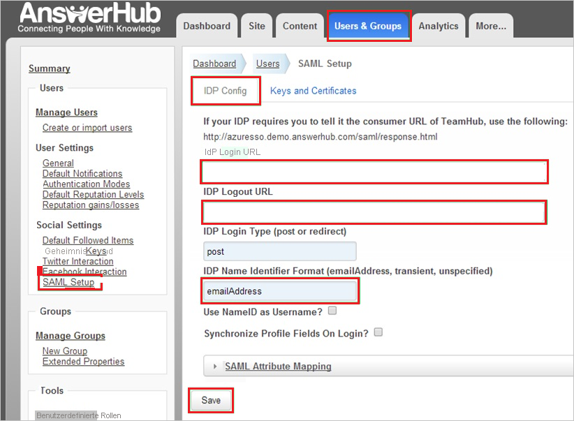

# Tutorial: Integration des einmaligen Anmeldens (Single Sign-On, SSO) von Azure AD mit AnswerHub

In diesem Tutorial erfahren Sie, wie Sie Azure Active Directory (Azure AD) in AnswerHub integrieren. Die Integration von AnswerHub in Azure AD ermöglicht Folgendes:

* Steuern Sie in Azure AD, wer Zugriff auf AnswerHub hat.
* Ermöglichen Sie es Ihren Benutzern, sich mit ihrem Azure AD-Konto automatisch bei AnswerHub anzumelden.
* Verwalten Sie Ihre Konten zentral im Azure-Portal.

## Voraussetzungen

Für die ersten Schritte benötigen Sie Folgendes:

* Ein Azure AD-Abonnement Falls Sie über kein Abonnement verfügen, können Sie ein [kostenloses Azure-Konto](https://azure.microsoft.com/free/) verwenden.
* AnswerHub-Abonnement, für das einmaliges Anmelden (Single Sign-On, SSO) aktiviert ist

## Beschreibung des Szenarios

In diesem Tutorial konfigurieren und testen Sie das einmalige Anmelden von Azure AD in einer Testumgebung.

* AnswerHub unterstützt SP-initiiertes einmaliges Anmelden.

## Hinzufügen von AnswerHub aus dem Katalog

Zum Konfigurieren der Integration von Azure AD in AnswerHub müssen Sie AnswerHub aus dem Katalog der Liste mit den verwalteten SaaS-Apps hinzufügen.

1. Melden Sie sich mit einem Geschäfts-, Schul- oder Unikonto oder mit einem persönlichen Microsoft-Konto beim Azure-Portal an.
1. Wählen Sie im linken Navigationsbereich den Dienst **Azure Active Directory** aus.
1. Navigieren Sie zu **Unternehmensanwendungen**, und wählen Sie dann **Alle Anwendungen** aus.
1. Wählen Sie zum Hinzufügen einer neuen Anwendung **Neue Anwendung** aus.
1. Geben Sie im Abschnitt **Aus Katalog hinzufügen** den Suchbegriff **AnswerHub** in das Suchfeld ein.
1. Wählen Sie im Ergebnisbereich **AnswerHub** aus, und fügen Sie dann die App hinzu. Warten Sie einige Sekunden, während die App Ihrem Mandanten hinzugefügt wird.

## Einrichten und Testen des einmaligen Anmeldens von Azure AD für AnswerHub

Konfigurieren und testen Sie das einmalige Anmelden von Azure AD mit AnswerHub mithilfe eines Testbenutzers mit dem Namen **B. Simon**. Damit einmaliges Anmelden funktioniert, muss eine Linkbeziehung zwischen einem Azure AD-Benutzer und dem entsprechenden Benutzer in AnswerHub eingerichtet werden.

Führen Sie zum Konfigurieren und Testen des einmaligen Anmeldens von Azure AD mit AnswerHub die folgenden Schritte aus:

1. **[Konfigurieren des einmaligen Anmeldens von Azure AD](#configure-azure-ad-sso)** , um Ihren Benutzern die Verwendung dieses Features zu ermöglichen.
    1. **[Erstellen eines Azure AD-Testbenutzers](#create-an-azure-ad-test-user)** , um das einmalige Anmelden von Azure AD mit dem Testbenutzer B. Simon zu testen.
    1. **[Zuweisen des Azure AD-Testbenutzers](#assign-the-azure-ad-test-user)** , um B. Simon die Verwendung des einmaligen Anmeldens von Azure AD zu ermöglichen.
1. **[Konfigurieren des einmaligen Anmeldens für AnswerHub](#configure-answerhub-sso)**, um die Einstellungen für einmaliges Anmelden auf der Anwendungsseite zu konfigurieren
    1. **[Erstellen eines AnswerHub-Testbenutzers](#create-answerhub-test-user)**, um eine Entsprechung von B. Simon in AnswerHub zu erhalten, die mit ihrer Darstellung in Azure AD verknüpft ist
1. **[Testen des einmaligen Anmeldens](#test-sso)** , um zu überprüfen, ob die Konfiguration funktioniert

## Konfigurieren des einmaligen Anmeldens (Single Sign-On, SSO) von Azure AD

Gehen Sie wie folgt vor, um das einmalige Anmelden von Azure AD im Azure-Portal zu aktivieren.

1. Navigieren Sie im Azure-Portal auf der Anwendungsintegrationsseite für **AnswerHub** zum Abschnitt **Verwalten**, und wählen Sie **Einmaliges Anmelden** aus.
1. Wählen Sie auf der Seite **SSO-Methode auswählen** die Methode **SAML** aus.
1. Klicken Sie auf der Seite **Einmaliges Anmelden (SSO) mit SAML einrichten** auf das Stiftsymbol für **Grundlegende SAML-Konfiguration**, um die Einstellungen zu bearbeiten.

   

4. Führen Sie im Abschnitt **Grundlegende SAML-Konfiguration** die folgenden Schritte aus:

    a. Geben Sie im Feld **Bezeichner (Entitäts-ID)** eine URL mit diesem Muster ein: `https://<company>.answerhub.com`.
    
    b. Geben Sie im Feld **Anmelde-URL** eine URL mit diesem Muster ein: `https://<company>.answerhub.com`.

    > [!NOTE]
    > Hierbei handelt es sich um Beispielwerte. Ersetzen Sie diese Werte durch den tatsächlichen Bezeichner und die tatsächliche Anmelde-URL. Wenden Sie sich an das [Supportteam von AnswerHub](mailto:success@answerhub.com), um die Werte zu erhalten. Sie können sich auch die Muster im Abschnitt **Grundlegende SAML-Konfiguration** im Azure-Portal ansehen.

5. Wählen Sie auf der Seite **Einmaliges Anmelden (SSO) mit SAML einrichten** im Abschnitt **SAML-Signaturzertifikat** den Link **Herunterladen** neben **Zertifikat (Base64)** gemäß Ihren Anforderungen aus, und speichern Sie das Zertifikat auf Ihrem Computer.

    

6. Kopieren Sie im Abschnitt **AnswerHub einrichten** die entsprechende URL (bzw. mehrere) gemäß Ihren Anforderungen.

    

### Erstellen eines Azure AD-Testbenutzers

In diesem Abschnitt erstellen Sie im Azure-Portal einen Testbenutzer mit dem Namen B. Simon.

1. Wählen Sie im linken Bereich des Microsoft Azure-Portals **Azure Active Directory** > **Benutzer** > **Alle Benutzer** aus.
1. Wählen Sie oben im Bildschirm die Option **Neuer Benutzer** aus.
1. Führen Sie unter den Eigenschaften für **Benutzer** die folgenden Schritte aus:
   1. Geben Sie im Feld **Name** die Zeichenfolge `B.Simon` ein.  
   1. Geben Sie im Feld **Benutzername** die Zeichenfolge username@companydomain.extension ein. Beispiel: `B.Simon@contoso.com`.
   1. Aktivieren Sie das Kontrollkästchen **Kennwort anzeigen**, und notieren Sie sich den Wert aus dem Feld **Kennwort**.
   1. Klicken Sie auf **Erstellen**.

### Zuweisen des Azure AD-Testbenutzers

In diesem Abschnitt ermöglichen Sie B. Simon die Verwendung des einmaligen Anmeldens von Azure, indem Sie ihr Zugriff auf AnswerHub gewähren.

1. Wählen Sie im Azure-Portal **Unternehmensanwendungen** > **Alle Anwendungen** aus.
1. Wählen Sie in der Anwendungsliste den Eintrag **AnswerHub** aus.
1. Navigieren Sie auf der Übersichtsseite der App zum Abschnitt **Verwalten**, und wählen Sie **Benutzer und Gruppen** aus.
1. Wählen Sie **Benutzer hinzufügen** und anschließend im Dialogfeld **Zuweisung hinzufügen** die Option **Benutzer und Gruppen** aus.
1. Wählen Sie im Dialogfeld **Benutzer und Gruppen** in der Liste „Benutzer“ den Eintrag **B. Simon** aus, und klicken Sie dann unten auf dem Bildschirm auf die Schaltfläche **Auswählen**.
1. Wenn den Benutzern eine Rolle zugewiesen werden soll, können Sie sie im Dropdownmenü **Rolle auswählen** auswählen. Wurde für diese App keine Rolle eingerichtet, ist die Rolle „Standardzugriff“ ausgewählt.
1. Klicken Sie im Dialogfeld **Zuweisung hinzufügen** auf die Schaltfläche **Zuweisen**.

## Konfigurieren des einmaligen Anmeldens für AnswerHub

In diesem Abschnitt richten Sie einmaliges Anmelden für AnswerHub ein.  

**Konfigurieren Sie einmaliges Anmelden für AnswerHub wie folgt:**

1. Melden Sie sich in einem anderen Webbrowserfenster bei der AnswerHub-Unternehmenswebsite als Administrator an.

    > [!NOTE]
    > Wenden Sie sich an das [Supportteam von AnswerHub](mailto:success@answerhub.com.), falls Sie Hilfe beim Konfigurieren von AnswerHub benötigen.

2. Wechseln Sie zu **Administration**.

3. Wählen Sie auf der Registerkarte **Benutzer und Gruppen** im linken Bereich im Abschnitt **Social Settings** (Einstellungen für soziale Netzwerke) die Option **SAML Setup** (SAML-Setup).

4. Führen Sie auf der Registerkarte **IDP Config** (IDP-Konfiguration) die folgenden Schritte aus:

      

    a. Fügen Sie im Feld **IDP Login Url** (IDP-Anmelde-URL) die **Anmelde-URL** ein, die Sie aus dem Azure-Portal kopiert haben.

    b. Fügen Sie im Feld **IDP Logout URL** (IDP-Abmelde-URL) die **Abmelde-URL** ein, die Sie aus dem Azure-Portal kopiert haben.

    c. Geben Sie im Feld **IDP Name Identifier Format** (IDP-Namensbezeichnerformat) den Wert für den **Bezeichner** ein, den Sie im Azure-Portal im Abschnitt **Benutzerattribute** ausgewählt haben.

    d. Wählen Sie **Keys and Certificates** (Schlüssel und Zertifikate).

5. Führen Sie im Abschnitt **Keys and Certificates** (Schlüssel und Zertifikate) die folgenden Schritte aus:

      

    a. Öffnen Sie das Base64-codierte Zertifikat, das Sie über das Azure-Portal heruntergeladen haben, im Editor, und kopieren Sie seinen Inhalt. Fügen Sie den Inhalt dann in das Feld **IDP Public Key (x509 Format)** (Öffentlicher IDP-Schlüssel (X.509-Format)) ein.

    b. Wählen Sie **Speichern** aus.

6. Wählen Sie auf der Registerkarte **IDP Config** (IDP-Konfiguration) die Option **Speichern**.

### Erstellen eines AnswerHub-Testbenutzers

Damit sich Azure AD-Benutzer an AnswerHub anmelden können, müssen Sie diese in AnswerHub hinzufügen. In AnswerHub wird diese Aufgabe manuell durchgeführt.

**Richten Sie wie folgt ein Benutzerkonto ein:**

1. Melden Sie sich bei Ihrer **AnswerHub** -Unternehmenswebsite als Administrator an.

2. Wechseln Sie zu **Administration**.

3. Wählen Sie die Registerkarte **Benutzer und Gruppen**.

4. Wählen Sie im linken Bereich im Abschnitt **Benutzer verwalten** die Option **Create or import users** (Benutzer erstellen oder importieren) und dann **Benutzer und Gruppen**.

    

5. Geben Sie in den entsprechenden Feldern die **E-Mail-Adresse**, den **Benutzernamen** und das **Kennwort** eines gültigen Azure AD-Kontos ein, das Sie hinzufügen möchten, und wählen Sie anschließend **Speichern**.

> [!NOTE]
> Sie können beliebige andere Tools für die Erstellung von Benutzerkonten oder die von AnswerHub bereitgestellte API verwenden, um Azure AD-Benutzerkonten einzurichten.

## Testen des einmaligen Anmeldens

In diesem Abschnitt testen Sie die Azure AD-Konfiguration für einmaliges Anmelden mit den folgenden Optionen: 

* Klicken Sie im Azure-Portal auf **Diese Anwendung testen**. Dadurch werden Sie zur Anmelde-URL für AnswerHub weitergeleitet, wo Sie den Anmeldeflow initiieren können. 

* Rufen Sie direkt die AnswerHub-Anmelde-URL auf, und initiieren Sie den Anmeldeflow.

* Sie können „Meine Apps“ von Microsoft verwenden. Wenn Sie unter „Meine Apps“ auf die Kachel „AnswerHub“ klicken, werden Sie zur Anmelde-URL für AnswerHub weitergeleitet. Weitere Informationen zu „Meine Apps“ finden Sie in [dieser Einführung](../user-help/my-apps-portal-end-user-access.md).

## Nächste Schritte

Nach dem Konfigurieren von AnswerHub können Sie die Sitzungssteuerung erzwingen, die in Echtzeit vor der Exfiltration und Infiltration vertraulicher Unternehmensdaten schützt. Die Sitzungssteuerung basiert auf bedingtem Zugriff. [Erfahren Sie, wie Sie die Sitzungssteuerung mit Microsoft Defender for Cloud Apps erzwingen.](/cloud-app-security/proxy-deployment-aad)
