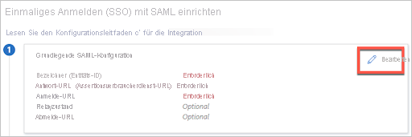
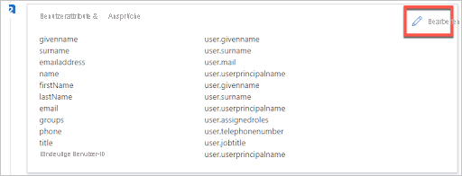

# Tutorial: Integration des einmaligen Anmeldens (Single Sign-On, SSO) von Azure Active Directory mit AppNeta Performance Manager

In diesem Tutorial erfahren Sie, wie Sie AppNeta Performance Manager in Azure Active Directory (Azure AD) integrieren. Die Integration von AppNeta Performance Manager in Azure AD ermöglicht Folgendes:

- Steuern Sie in Azure AD, wer Zugriff auf AppNeta Performance Manager hat.
- Ermöglichen Sie es Ihren Benutzern, sich mit ihren Azure AD-Konten automatisch bei AppNeta Performance Manager anzumelden.
- Verwalten Sie Ihre Konten zentral im Azure-Portal.

## Voraussetzungen

Für die ersten Schritte benötigen Sie Folgendes:

- Ein Azure AD-Abonnement Falls Sie über kein Abonnement verfügen, können Sie ein [kostenloses Azure-Konto](https://azure.microsoft.com/free/) verwenden.
- AppNeta Performance Manager-Abonnement, für das einmaliges Anmelden (Single Sign-On, SSO) aktiviert ist

## Beschreibung des Szenarios

In diesem Tutorial konfigurieren und testen Sie das einmalige Anmelden von Azure AD in einer Testumgebung.

- AppNeta Performance Manager unterstützt **SP**-initiiertes SSO.
- AppNeta Performance Manager unterstützt die **Just-In-Time**-Benutzerbereitstellung.

> [!NOTE]
> Der Bezeichner dieser Anwendung ist ein fester Zeichenfolgenwert, daher kann in einem Mandanten nur eine Instanz konfiguriert werden.

## Hinzufügen von AppNeta Performance Manager aus dem Katalog

Um die Integration von AppNeta Performance Manager in Azure AD zu konfigurieren, müssen Sie AppNeta Performance Manager aus dem Katalog zu Ihrer Liste mit den verwalteten SaaS-Apps hinzufügen.

1. Melden Sie sich mit einem Geschäfts-, Schul- oder Unikonto oder mit einem persönlichen Microsoft-Konto beim Azure-Portal an.
1. Wählen Sie im linken Navigationsbereich den Dienst **Azure Active Directory** aus.
1. Navigieren Sie zu **Unternehmensanwendungen**, und wählen Sie dann **Alle Anwendungen** aus.
1. Wählen Sie zum Hinzufügen einer neuen Anwendung **Neue Anwendung** aus.
1. Geben Sie im Abschnitt **Aus Katalog hinzufügen** den Suchbegriff **AppNeta Performance Manager** in das Suchfeld ein.
1. Wählen Sie im Ergebnisbereich **AppNeta Performance Manager** aus, und fügen Sie dann die App hinzu. Warten Sie einige Sekunden, während die App Ihrem Mandanten hinzugefügt wird.

## Konfigurieren und Testen des einmaligen Anmeldens von Azure AD für AppNeta Performance Manager

Konfigurieren und testen Sie das einmalige Anmelden von Azure AD mit AppNeta Performance Manager mithilfe eines Testbenutzers mit dem Namen **B. Simon**. Damit einmaliges Anmelden funktioniert, muss eine Linkbeziehung zwischen einem Azure AD-Benutzer und dem entsprechenden Benutzer in AppNeta Performance Manager eingerichtet werden.

Führen Sie die folgenden Schritte aus, um das einmalige Anmelden von Azure AD mit AppNeta Performance Manager zu konfigurieren und zu testen:

1. **[Konfigurieren des einmaligen Anmeldens von Azure AD](#configure-azure-ad-sso)** , um Ihren Benutzern die Verwendung dieses Features zu ermöglichen.
   1. **[Erstellen eines Azure AD-Testbenutzers](#create-an-azure-ad-test-user)** , um das einmalige Anmelden von Azure AD mit dem Testbenutzer B. Simon zu testen.
   1. **[Zuweisen des Azure AD-Testbenutzers](#assign-the-azure-ad-test-user)** , um B. Simon die Verwendung des einmaligen Anmeldens von Azure AD zu ermöglichen.
1. **[Konfigurieren des einmaligen Anmeldens für AppNeta Performance Manager](#configure-appneta-performance-manager-sso)** , um die Einstellungen für einmaliges Anmelden auf der Anwendungsseite zu konfigurieren
   1. **[Erstellen eines AppNeta Performance Manager-Testbenutzers](#create-appneta-performance-manager-test-user)** , um in AppNeta Performance Manager ein Pendant zu B. Simon zu erhalten, das mit ihrer Darstellung in Azure AD verknüpft ist
1. **[Testen des einmaligen Anmeldens](#test-sso)** , um zu überprüfen, ob die Konfiguration funktioniert

## Konfigurieren des einmaligen Anmeldens (Single Sign-On, SSO) von Azure AD

Gehen Sie wie folgt vor, um das einmalige Anmelden von Azure AD im Azure-Portal zu aktivieren.

1. Navigieren Sie im Azure-Portal auf der Anwendungsintegrationsseite für **AppNeta Performance Manager** zum Abschnitt **Verwalten**, und wählen Sie **Einmaliges Anmelden** aus.
1. Wählen Sie auf der Seite **SSO-Methode auswählen** die Methode **SAML** aus.
1. Klicken Sie auf der Seite **Einmaliges Anmelden (SSO) mit SAML einrichten** auf das Stiftsymbol für **Grundlegende SAML-Konfiguration**, um die Einstellungen zu bearbeiten.

   

1. Geben Sie im Abschnitt **Grundlegende SAML-Konfiguration** die Werte für die folgenden Felder ein:

   a. Geben Sie im Textfeld **Anmelde-URL** eine URL im folgenden Format ein: `https://<subdomain>.pm.appneta.com`.

   b. Geben Sie im Feld „Antwort-URL (Assertionsverbraucherdienst-URL)“ Folgendes ein: `https://sso.connect.pingidentity.com/sso/sp/ACS.saml2`

   > [!NOTE]
   > Der oben genannte Wert für die Anmelde-URL ist ein Beispiel. Ersetzen Sie diesen Wert durch die tatsächliche Anmelde-URL. Diesen Wert erhalten Sie vom [Kundensupportteam für AppNeta Performance Manager](mailto:support@appneta.com). Sie können sich auch die Muster im Abschnitt **Grundlegende SAML-Konfiguration** im Azure-Portal ansehen.

1. Die AppNeta Performance Manager-Anwendung erwartet die SAML-Assertionen in einem bestimmten Format. Daher müssen Sie Ihrer Konfiguration der SAML-Tokenattribute benutzerdefinierte Attributzuordnungen hinzufügen. Der folgende Screenshot zeigt die Liste der Standardattribute:

   

1. Darüber hinaus wird von der AppNeta Performance Manager-Anwendung erwartet, dass in der SAML-Antwort noch einige weitere Attribute zurückgegeben werden (siehe unten). Diese Attribute werden ebenfalls vorab mit Daten aufgefüllt, Sie können sie jedoch nach Bedarf überprüfen.

   | Name      | Quellattribut       |
   | --------- | ---------------------- |
   | firstName | user.givenname         |
   | lastName  | user.surname           |
   | email     | user.userprincipalname |
   | name      | user.userprincipalname |
   | groups    | user.assignedroles     |
   | phone     | user.telephonenumber   |
   | title     | user.jobtitle          |
   |           |                        |

1. Um Ihre SAML-Gruppenassertionen ordnungsgemäß zu übergeben, müssen Sie App-Rollen konfigurieren und den Wert entsprechend den Rollenzuordnungen festlegen, die in AppNeta Performance Manager festgelegt sind. Wählen Sie unter **Azure Active Directory** > **App-Registrierungen** >  **Alle Anwendungen** die Option **Appneta Performance Manager** aus.
1. Klicken Sie im linken Bereich auf **App-Rollen**.
1. Klicken Sie auf **App-Rolle erstellen**.
1. Führen Sie im Bereich **App-Rolle erstellen** die folgenden Schritte aus:
   1. Geben Sie unter **Anzeigename** einen Namen für die Rolle ein.
   1. Wählen Sie unter **Zulässige Membertypen** die Option **Benutzer/Gruppen** aus.
   1. Geben Sie unter **Wert** den Wert der Sicherheitsgruppe ein, die in Ihren AppNeta Performance Manager-Rollenzuordnungen festgelegt ist.
   1. Geben Sie unter **Beschreibung** eine Beschreibung für die Rolle ein.
   1. Klicken Sie auf **Übernehmen**.

1. Nachdem Sie die Rollen erstellt haben, müssen Sie die Rollen Ihren Benutzern und Gruppen zuordnen. Navigieren Sie zu **Azure Active Directory** > **Unternehmensanwendungen** > **Appneta Performance Manager** > **Benutzer und Gruppen**.
1. Wählen Sie einen Benutzer oder eine Gruppe aus, und weisen Sie dann die entsprechende App-Rolle für den Benutzer oder die Gruppe zu.
1. Nachdem Sie die App-Rollen zugeordnet haben, navigieren Sie zu **Azure Active Directory** > **Unternehmensanwendungen** > **Appneta Performance Manager** > **Einmaliges Anmelden**.
1. Navigieren Sie auf der Seite **Einmaliges Anmelden (SSO) mit SAML einrichten** im Abschnitt **SAML-Signaturzertifikat** zu **Verbundmetadaten-XML**, und wählen Sie **Herunterladen** aus, um das Zertifikat herunterzuladen und auf Ihrem Computer zu speichern.

   

### Erstellen eines Azure AD-Testbenutzers

In diesem Abschnitt erstellen Sie im Azure-Portal einen Testbenutzer mit dem Namen B. Simon.

1. Wählen Sie im linken Bereich des Microsoft Azure-Portals **Azure Active Directory** > **Benutzer** > **Alle Benutzer** aus.
1. Wählen Sie oben im Bildschirm die Option **Neuer Benutzer** aus.
1. Führen Sie unter den Eigenschaften für **Benutzer** die folgenden Schritte aus:
   1. Geben Sie im Feld **Name** die Zeichenfolge `B.Simon` ein.
   1. Geben Sie im Feld **Benutzername** die Zeichenfolge username@companydomain.extension ein. Beispiel: `B.Simon@contoso.com`.
   1. Aktivieren Sie das Kontrollkästchen **Kennwort anzeigen**, und notieren Sie sich den Wert aus dem Feld **Kennwort**.
   1. Klicken Sie auf **Erstellen**.

### Zuweisen des Azure AD-Testbenutzers

In diesem Abschnitt ermöglichen Sie B. Simon die Verwendung des einmaligen Anmeldens von Azure, indem Sie ihr Zugriff auf AppNeta Performance Manager gewähren.

1. Wählen Sie im Azure-Portal **Unternehmensanwendungen** > **Alle Anwendungen** aus.
1. Wählen Sie in der Liste der Anwendungen die Anwendung **AppNeta Performance Manager** aus.
1. Navigieren Sie auf der Übersichtsseite der App zum Abschnitt **Verwalten**, und wählen Sie **Benutzer und Gruppen** aus.
1. Wählen Sie **Benutzer hinzufügen** und anschließend im Dialogfeld **Zuweisung hinzufügen** die Option **Benutzer und Gruppen** aus.
1. Wählen Sie im Dialogfeld **Benutzer und Gruppen** in der Liste „Benutzer“ den Eintrag **B. Simon** aus, und klicken Sie dann unten auf dem Bildschirm auf die Schaltfläche **Auswählen**.
1. Wenn Sie die Rollen wie oben beschrieben eingerichtet haben, können Sie sie in der Dropdownliste **Rolle auswählen** auswählen.
1. Klicken Sie im Dialogfeld **Zuweisung hinzufügen** auf die Schaltfläche **Zuweisen**.

   > [!NOTE]
   > In der Praxis fügen Sie der Anwendung Gruppen anstelle einzelner Benutzer hinzu.

## Konfigurieren des einmaligen Anmeldens für AppNeta Performance Manager

Um einmaliges Anmelden auf der **AppNeta Performance Manager**-Seite zu konfigurieren, müssen Sie die heruntergeladene **Verbundmetadaten-XML**-Datei an das [Supportteam von AppNeta Performance Manager](mailto:support@appneta.com) senden. Es führt die Einrichtung durch, damit die SAML-SSO-Verbindung auf beiden Seiten richtig festgelegt ist.

### Erstellen eines AppNeta Performance Manager-Testbenutzers

In diesem Abschnitt wird in AppNeta Performance Manager ein Benutzer namens B. Simon erstellt. AppNeta Performance Manager unterstützt die Just-In-Time-Benutzerbereitstellung (standardmäßig aktiviert). Für Sie steht in diesem Abschnitt kein Aktionselement zur Verfügung. Ist ein Benutzer noch nicht in AppNeta Performance Manager vorhanden, wird nach der Authentifizierung ein neuer Benutzer erstellt.

> [!Note]
> Setzen Sie sich mit dem [Supportteam von AppNeta Performance Manager](mailto:support@appneta.com) in Verbindung, wenn Sie einen Benutzer manuell erstellen müssen.

## Testen des einmaligen Anmeldens

In diesem Abschnitt testen Sie die Azure AD-Konfiguration für einmaliges Anmelden mit den folgenden Optionen:

- Wählen Sie im Azure-Portal die Option **Diese Anwendung testen** aus. Dadurch werden Sie zur Anmelde-URL für AppNeta Performance Manager weitergeleitet. Dort können Sie den Anmeldeflow initiieren.

- Rufen Sie direkt die AppNeta Performance Manager-Anmelde-URL auf, und initiieren Sie den Anmeldeflow.

- Sie können „Meine Apps“ von Microsoft verwenden. Wenn Sie im Portal „Meine Apps“ auf die Kachel „AppNeta Performance Manager“ klicken, werden Sie zur Anmelde-URL für AppNeta Performance Manager weitergeleitet. Weitere Informationen zum Portal „Meine Apps“ finden Sie in dieser [Einführung](../user-help/my-apps-portal-end-user-access.md).

## Nächste Schritte

Nach dem Konfigurieren von AppNeta Performance Manager können Sie Sitzungssteuerung erzwingen, die in Echtzeit vor der Exfiltration und Infiltration Ihrer vertraulichen Unternehmensdaten schützt. Die Sitzungssteuerung basiert auf bedingtem Zugriff. [Hier](/cloud-app-security/proxy-deployment-any-app) erfahren Sie, wie Sie die Sitzungssteuerung mit Microsoft Cloud App Security erzwingen.
