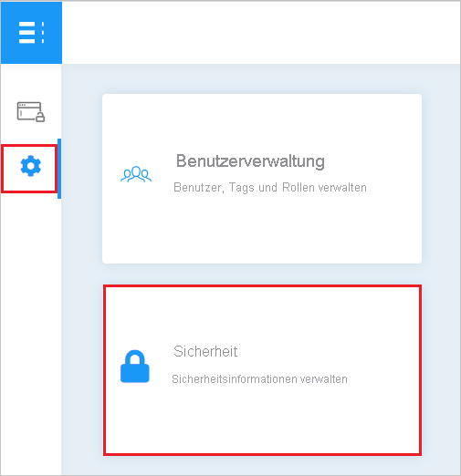
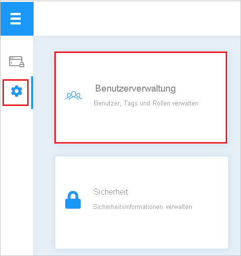

# Tutorial: Integration des einmaligen Anmeldens (Single Sign-On, SSO) von Azure Active Directory mit Britive

In diesem Tutorial erfahren Sie, wie Sie Britive in Azure Active Directory (Azure AD) integrieren. Die Integration von Britive in Azure AD ermöglicht Folgendes:

* Sie können in Azure AD steuern, wer Zugriff auf Britive haben soll.
* Sie können es Ihren Benutzern ermöglichen, sich mit ihrem Azure AD-Konto automatisch bei Britive anzumelden.
* Verwalten Sie Ihre Konten zentral im Azure-Portal.

## Voraussetzungen

Für die ersten Schritte benötigen Sie Folgendes:

* Ein Azure AD-Abonnement Falls Sie über kein Abonnement verfügen, können Sie ein [kostenloses Azure-Konto](https://azure.microsoft.com/free/) verwenden.
* Britive-Abonnement, für das einmaliges Anmelden aktiviert ist

## Beschreibung des Szenarios

In diesem Tutorial konfigurieren und testen Sie das einmalige Anmelden von Azure AD in einer Testumgebung.

* Britive unterstützt **SP**-initiiertes einmaliges Anmelden.
* Britive unterstützt [Automatisierte Benutzerbereitstellung](britive-provisioning-tutorial.md).

## Hinzufügen von Britive aus dem Katalog

Zum Konfigurieren der Integration von Britive in Azure AD müssen Sie Britive aus dem Katalog der Liste mit den verwalteten SaaS-Apps hinzufügen.

1. Melden Sie sich mit einem Geschäfts-, Schul- oder Unikonto oder mit einem persönlichen Microsoft-Konto beim Azure-Portal an.
1. Wählen Sie im linken Navigationsbereich den Dienst **Azure Active Directory** aus.
1. Navigieren Sie zu **Unternehmensanwendungen**, und wählen Sie dann **Alle Anwendungen** aus.
1. Wählen Sie zum Hinzufügen einer neuen Anwendung **Neue Anwendung** aus.
1. Geben Sie im Abschnitt **Aus Katalog hinzufügen** den Suchbegriff **Britive** in das Suchfeld ein.
1. Wählen Sie im Ergebnisbereich die Option **Britive** aus, und fügen Sie dann die App hinzu. Warten Sie einige Sekunden, während die App Ihrem Mandanten hinzugefügt wird.

## Konfigurieren und Testen von Azure AD-SSO für Britive

Konfigurieren und testen Sie das einmalige Anmelden von Azure AD mit Britive mithilfe eines Testbenutzers mit dem Namen **B. Simon**. Damit einmaliges Anmelden funktioniert, muss eine Linkbeziehung zwischen einem Azure AD-Benutzer und dem entsprechenden Benutzer in Britive eingerichtet werden.

Führen Sie zum Konfigurieren und Testen von Azure AD-SSO mit Britive die folgenden Schritte aus:

1. **[Konfigurieren des einmaligen Anmeldens von Azure AD](#configure-azure-ad-sso)** , um Ihren Benutzern die Verwendung dieses Features zu ermöglichen.
    1. **[Erstellen eines Azure AD-Testbenutzers](#create-an-azure-ad-test-user)** , um das einmalige Anmelden von Azure AD mit dem Testbenutzer B. Simon zu testen.
    1. **[Zuweisen des Azure AD-Testbenutzers](#assign-the-azure-ad-test-user)** , um B. Simon die Verwendung des einmaligen Anmeldens von Azure AD zu ermöglichen.
1. **[Konfigurieren des einmaligen Anmeldens für Britive](#configure-britive-sso)** , um die Einstellungen für einmaliges Anmelden auf der Anwendungsseite zu konfigurieren.
    1. **[Erstellen eines Britive-Testbenutzers](#create-britive-test-user)** , um in Britive eine Entsprechung von B. Simon zu erhalten, die mit der Benutzerdarstellung in Azure AD verknüpft ist.
1. **[Testen des einmaligen Anmeldens](#test-sso)** , um zu überprüfen, ob die Konfiguration funktioniert

## Konfigurieren des einmaligen Anmeldens (Single Sign-On, SSO) von Azure AD

Gehen Sie wie folgt vor, um das einmalige Anmelden von Azure AD im Azure-Portal zu aktivieren.

1. Navigieren Sie im Azure-Portal auf der Anwendungsintegrationsseite für **Britive** zum Abschnitt **Verwalten**, und wählen Sie **Einmaliges Anmelden** aus.
1. Wählen Sie auf der Seite **SSO-Methode auswählen** die Methode **SAML** aus.
1. Klicken Sie auf der Seite **Einmaliges Anmelden (SSO) mit SAML einrichten** auf das Stiftsymbol für **Grundlegende SAML-Konfiguration**, um die Einstellungen zu bearbeiten.

   

1. Geben Sie im Abschnitt **Grundlegende SAML-Konfiguration** die Werte für die folgenden Felder ein:

    a. Geben Sie im Textfeld **Anmelde-URL** eine URL im folgenden Format ein: `https://<TENANTNAME>.britive-app.com/sso`.

    b. Geben Sie im Textfeld **Bezeichner (Entitäts-ID)** eine URL im folgenden Format ein: `urn:amazon:cognito:sp:<UNIQUE_ID>`.

    > [!NOTE]
    > Hierbei handelt es sich um Beispielwerte. Ersetzen Sie diese Werte durch die tatsächliche Anmelde-URL und den tatsächlichen Bezeichner. Dies wird später in diesem Tutorial beschrieben. Sie können sich auch die Muster im Abschnitt **Grundlegende SAML-Konfiguration** im Azure-Portal ansehen.

1. Navigieren Sie auf der Seite **Einmaliges Anmelden (SSO) mit SAML einrichten** im Abschnitt **SAML-Signaturzertifikat** zu **Verbundmetadaten-XML**, und wählen Sie **Herunterladen** aus, um das Zertifikat herunterzuladen und auf Ihrem Computer zu speichern.

    

1. Kopieren Sie im Abschnitt **Britive einrichten** die entsprechenden URLs gemäß Ihren Anforderungen.

    

### Erstellen eines Azure AD-Testbenutzers

In diesem Abschnitt erstellen Sie im Azure-Portal einen Testbenutzer mit dem Namen B. Simon.

1. Wählen Sie im linken Bereich des Microsoft Azure-Portals **Azure Active Directory** > **Benutzer** > **Alle Benutzer** aus.
1. Wählen Sie oben im Bildschirm die Option **Neuer Benutzer** aus.
1. Führen Sie unter den Eigenschaften für **Benutzer** die folgenden Schritte aus:
   1. Geben Sie im Feld **Name** die Zeichenfolge `B.Simon` ein.  
   1. Geben Sie im Feld **Benutzername** die Zeichenfolge username@companydomain.extension ein. Beispiel: `B.Simon@contoso.com`.
   1. Aktivieren Sie das Kontrollkästchen **Kennwort anzeigen**, und notieren Sie sich den Wert aus dem Feld **Kennwort**.
   1. Klicken Sie auf **Erstellen**.

### Zuweisen des Azure AD-Testbenutzers

In diesem Abschnitt ermöglichen Sie B. Simon die Verwendung des einmaligen Anmeldens von Azure, indem Sie ihr Zugriff auf Britive gewähren.

1. Wählen Sie im Azure-Portal **Unternehmensanwendungen** > **Alle Anwendungen** aus.
1. Wählen Sie in der Anwendungsliste die Anwendung **Britive** aus.
1. Navigieren Sie auf der Übersichtsseite der App zum Abschnitt **Verwalten**, und wählen Sie **Benutzer und Gruppen** aus.
1. Wählen Sie **Benutzer hinzufügen** und anschließend im Dialogfeld **Zuweisung hinzufügen** die Option **Benutzer und Gruppen** aus.
1. Wählen Sie im Dialogfeld **Benutzer und Gruppen** in der Liste „Benutzer“ den Eintrag **B. Simon** aus, und klicken Sie dann unten auf dem Bildschirm auf die Schaltfläche **Auswählen**.
1. Wenn den Benutzern eine Rolle zugewiesen werden soll, können Sie sie im Dropdownmenü **Rolle auswählen** auswählen. Wurde für diese App keine Rolle eingerichtet, ist die Rolle „Standardzugriff“ ausgewählt.
1. Klicken Sie im Dialogfeld **Zuweisung hinzufügen** auf die Schaltfläche **Zuweisen**.

## Konfigurieren des einmaligen Anmeldens für Britive

1. Melden Sie sich in einem anderen Webbrowserfenster bei der Britive-Website als Administrator an.

1. Klicken Sie auf das Symbol **Administratoreinstellungen**, und wählen Sie **Sicherheit** aus.

    

1. Wählen Sie **SSO-Konfiguration** aus, und führen Sie die folgenden Schritte aus:

    

    a. Kopieren Sie den Wert im Feld **Audience/Entity ID** (Zielgruppen-/Entitäts-ID), und fügen Sie ihn im Azure-Portal im Abschnitt **Grundlegende SAML-Konfiguration** in das Textfeld **Bezeichner (Entitäts-ID)** ein.

    b. Kopieren Sie den Wert für **Initiate SSO URL** (URL für SSO-Initiierung), und fügen Sie ihn im Azure-Portal im Abschnitt **Grundlegende SAML-Konfiguration** in das Textfeld **Anmelde-URL** ein.

    c. Klicken Sie auf **UPLOAD SAML METADATA** (SAML-METADATENDATEI HOCHLADEN), um die heruntergeladene XML-Metadatendatei hochzuladen. Nach dem Hochladen der Metadatendatei werden die obigen Werte automatisch eingefügt und die Änderungen gespeichert.

### Erstellen eines Britive-Testbenutzers

1. Melden Sie sich in einem anderen Webbrowserfenster bei der Britive-Website als Administrator an.

1. Klicken Sie auf das Symbol **Administratoreinstellungen**, und wählen Sie **Benutzerverwaltung** aus.

    

1. Klicken Sie auf **BENUTZER HINZUFÜGEN**.

    

1. Geben Sie alle Benutzerdetails ein, die gemäß den Anforderungen Ihrer Organisation erforderlich sind, und klicken Sie auf **BENUTZER HINZUFÜGEN**.

    

> [!NOTE]
>Außerdem unterstützt Britive automatische Benutzerbereitstellung. Weitere Informationen zum Konfigurieren der automatischen Benutzerbereitstellung finden Sie [hier](./britive-provisioning-tutorial.md).

## Testen des einmaligen Anmeldens

In diesem Abschnitt testen Sie die Azure AD-Konfiguration für einmaliges Anmelden mit den folgenden Optionen: 

* Klicken Sie im Azure-Portal auf **Diese Anwendung testen**. Durch diesen Schritt werden Sie zur Anmelde-URL für Britive weitergeleitet. Dort können Sie den Anmeldeflow initiieren. 

* Rufen Sie die Anmelde-URL von Britive direkt auf, und initiieren Sie den Anmeldeflow.

* Sie können „Meine Apps“ von Microsoft verwenden. Wenn Sie in „Meine Apps“ auf die Kachel „Britive“ klicken, werden Sie zur Anmelde-URL für Britive weitergeleitet. Weitere Informationen zu „Meine Apps“ finden Sie in [dieser Einführung](../user-help/my-apps-portal-end-user-access.md).

## Nächste Schritte

Nach dem Konfigurieren von Britive können Sie Sitzungssteuerung erzwingen, die in Echtzeit vor der Exfiltration und Infiltration vertraulicher Unternehmensdaten schützt. Die Sitzungssteuerung basiert auf bedingtem Zugriff. [Erfahren Sie, wie Sie die Sitzungssteuerung mit Microsoft Defender for Cloud Apps erzwingen.](/cloud-app-security/proxy-deployment-aad)
