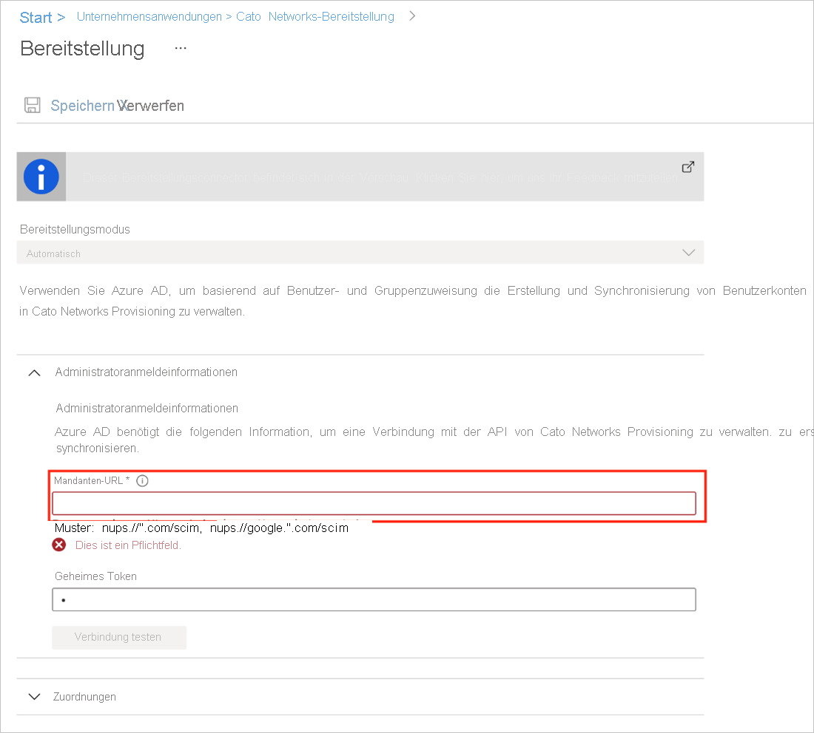
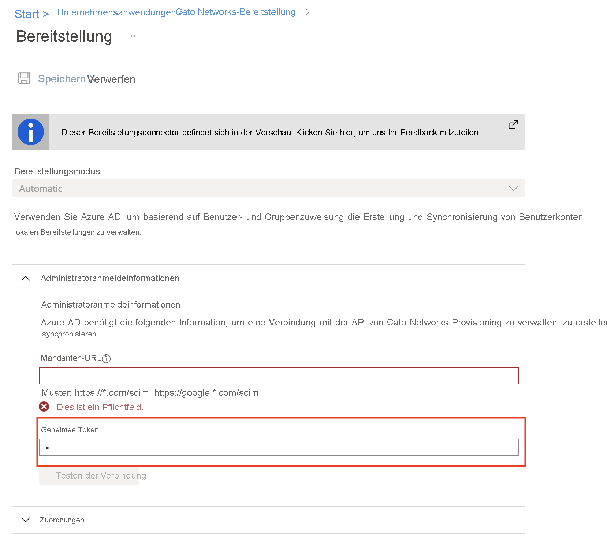

# Tutorial: Konfigurieren von Cato Networks für die automatische Benutzerbereitstellung

In diesem Tutorial werden die Schritte beschrieben, die Sie in Cato Networks und in Azure Active Directory (Azure AD) ausführen müssen, um die automatische Benutzerbereitstellung zu konfigurieren. Nach der Konfiguration stellt Azure AD mithilfe des Azure AD-Bereitstellungsdiensts automatisch Benutzer und Gruppen für [Cato Networks](https://www.catonetworks.com/) bereit bzw. hebt deren Bereitstellung auf. Wichtige Details zum Zweck und zur Funktionsweise dieses Diensts sowie häufig gestellte Fragen finden Sie unter [Automatisieren der Bereitstellung und Bereitstellungsaufhebung von Benutzern für SaaS-Anwendungen mit Azure Active Directory](../app-provisioning/user-provisioning.md). 

## Unterstützte Funktionen
> [!div class="checklist"]
> * Erstellen von Benutzern in Cato Networks
> * Entfernen von Benutzern aus Cato Networks, wenn diese keinen Zugriff mehr benötigen
> * Synchronisieren von Benutzerattributen zwischen Azure AD und Cato Networks
> * Bereitstellen von Gruppen und Gruppenmitgliedschaften in Cato Networks

## Voraussetzungen

Das diesem Tutorial zu Grunde liegende Szenario setzt voraus, dass Sie bereits über die folgenden Voraussetzungen verfügen:

* [Azure AD-Mandant](../develop/quickstart-create-new-tenant.md) 
* Ein Benutzerkonto in Azure AD mit der [Berechtigung](../roles/permissions-reference.md) für die Konfiguration von Bereitstellungen (z. B. Anwendungsadministrator, Cloudanwendungsadministrator, Anwendungsbesitzer oder Globaler Administrator). 
* Ein [Cato Networks](https://www.catonetworks.com/)-Konto
* Ein Administratorkonto in Cato Networks mit Administratorberechtigungen
* Lizenz mit einer ausreichenden Anzahl von Benutzern

## Schritt 1: Planen der Bereitstellung
1. Erfahren Sie, [wie der Bereitstellungsdienst funktioniert](../app-provisioning/user-provisioning.md).
1. Bestimmen Sie, wer [in den Bereitstellungsbereich](../app-provisioning/define-conditional-rules-for-provisioning-user-accounts.md) einbezogen werden soll.
1. Legen Sie fest, welche Daten [zwischen Azure AD und Cato Networks zugeordnet werden sollen](../app-provisioning/customize-application-attributes.md). 

## Schritt 2: Konfigurieren von Cato Networks für die Unterstützung der Bereitstellung mit Azure AD

1. Melden Sie sich bei Ihrem Konto in der [Cato Networks-Anwendung](https://cc2.catonetworks.com) an.
1. Wählen Sie im Navigationsmenü **Configuration > Global Settings** (Konfiguration > Globale Einstellungen) aus, und erweitern Sie dann den Abschnitt **VPN Settings** (VPN-Einstellungen).
        
1. Erweitern Sie den Abschnitt **SCIM Provisioning** (SCIM-Bereitstellung), und aktivieren Sie die SCIM-Bereitstellung, indem Sie auf **Enable SCIM Provisioning** (SCIM-Bereitstellung aktivieren) klicken.
         
1. Kopieren Sie die Basis-URL und das Bearertoken aus der Cato-Verwaltungsanwendung in die SCIM-App im Azure-Portal:
   1. Kopieren Sie in der Cato-Verwaltungsanwendung (im Abschnitt **SCIM Provisioning** (SCIM-Bereitstellung)) die Basis-URL.
   1. Fügen Sie im Azure-Portal in der Cato Networks-SCIM-App auf der Registerkarte **Bereitstellung** die Basis-URL in das Feld **Mandanten-URL** ein.
        
   1. Klicken Sie in der Cato-Verwaltungsanwendung (im Abschnitt **SCIM Provisioning** (SCIM-Bereitstellung)) auf **Generate Token** (Token generieren), und kopieren Sie das Bearertoken.
   1. Fügen Sie im Azure-Portal in der Cato Networks-SCIM-App das Bearertoken in das Feld **Secret Token** (Geheimes Token) ein.
        
1. Klicken Sie in der Cato-Verwaltungsanwendung (im Abschnitt **SCIM Provisioning** (SCIM-Bereitstellung)) auf **Save** (Speichern). Die SCIM-Bereitstellung zwischen Ihrem Cato-Konto und Azure AD ist konfiguriert. 
        
1. Testen Sie die Verbindung zwischen der Azure-SCIM-App und der Cato-Cloud. Klicken Sie im Azure-Portal in der Cato Networks-SCIM-App auf der Registerkarte **Bereitstellung** auf **Verbindung testen**.         
                                  

## Schritt 3: Hinzufügen von Cato Networks aus dem Azure AD-Anwendungskatalog

Fügen Sie Cato Networks aus dem Azure AD-Anwendungskatalog hinzu, um mit dem Verwalten der Bereitstellung in Cato Networks zu beginnen. [Hier](../manage-apps/add-application-portal.md) erfahren Sie mehr über das Hinzufügen einer Anwendung aus dem Katalog. 

## Schritt 4. Definieren der Benutzer für den Bereitstellungsbereich 

Mit dem Azure AD-Bereitstellungsdienst können Sie anhand der Zuweisung zur Anwendung oder aufgrund von Attributen für den Benutzer/die Gruppe festlegen, wer in die Bereitstellung einbezogen werden soll. Wenn Sie sich dafür entscheiden, anhand der Zuweisung festzulegen, wer für Ihre App bereitgestellt werden soll, können Sie der Anwendung mithilfe der folgenden [Schritte](../manage-apps/assign-user-or-group-access-portal.md) Benutzer und Gruppen zuweisen. Wenn Sie allein anhand der Attribute des Benutzers oder der Gruppe auswählen möchten, wer bereitgestellt wird, können Sie einen [hier](../app-provisioning/define-conditional-rules-for-provisioning-user-accounts.md) beschriebenen Bereichsfilter verwenden. 

* Beim Zuweisen von Benutzern und Gruppen zu Cato Networks müssen Sie eine andere Rolle als **Standardzugriff** auswählen. Benutzer mit der Rolle „Standardzugriff“ werden von der Bereitstellung ausgeschlossen und in den Bereitstellungsprotokollen als „nicht effektiv berechtigt“ gekennzeichnet. Wenn für die Anwendung nur die Rolle „Standardzugriff“ verfügbar ist, können Sie das [Anwendungsmanifest aktualisieren](../develop/howto-add-app-roles-in-azure-ad-apps.md) und weitere Rollen hinzufügen. 

* Fangen Sie klein an. Testen Sie die Bereitstellung mit einer kleinen Gruppe von Benutzern und Gruppen, bevor Sie sie für alle freigeben. Wenn der Bereitstellungsbereich auf zugewiesene Benutzer und Gruppen festgelegt ist, können Sie die Bereitstellung durch Zuweisen von einem oder zwei Benutzern oder Gruppen zur App kontrollieren. Ist der Bereich auf alle Benutzer und Gruppen festgelegt, können Sie einen [attributbasierten Bereichsfilter](../app-provisioning/define-conditional-rules-for-provisioning-user-accounts.md) angeben. 

## Schritt 5: Konfigurieren der automatischen Benutzerbereitstellung für Cato Networks 

In diesem Abschnitt werden die Schritte zum Konfigurieren des Azure AD-Bereitstellungsdiensts für das Erstellen, Aktualisieren und Deaktivieren von Benutzern und/oder Gruppen in Cato Networks auf der Grundlage von Benutzer- und/oder Gruppenzuweisungen in Azure AD erläutert.

### So konfigurieren Sie die automatische Benutzerbereitstellung für Cato Networks in Azure AD:

1. Melden Sie sich beim [Azure-Portal](https://portal.azure.com) an. Wählen Sie **Unternehmensanwendungen** und dann **Alle Anwendungen**.

    

1. Wählen Sie in der Anwendungsliste den Eintrag **Cato Networks** aus.

    

1. Wählen Sie die Registerkarte **Bereitstellung**.

    

1. Legen Sie den **Bereitstellungsmodus** auf **Automatisch** fest.

    

1. Geben Sie im Abschnitt **Administratoranmeldeinformationen** die Mandanten-URL und das geheime Token für Cato Networks ein. Klicken Sie auf **Verbindung testen**, um sicherzustellen, dass Azure AD eine Verbindung mit Cato Networks herstellen kann. Vergewissern Sie sich bei einem Verbindungsfehler, dass Ihr Cato Networks-Konto über Administratorberechtigungen verfügt, und wiederholen Sie den Vorgang.

    

1. Geben Sie im Feld **Benachrichtigungs-E-Mail** die E-Mail-Adresse einer Person oder Gruppe ein, die Benachrichtigungen zu Bereitstellungsfehlern erhalten soll, und aktivieren Sie das Kontrollkästchen **Bei Fehler E-Mail-Benachrichtigung senden**.

    

1. Wählen Sie **Speichern** aus.

1. Wählen Sie im Abschnitt **Zuordnungen** die Option **Azure Active Directory-Benutzer mit Cato Networks synchronisieren** aus.

1. Überprüfen Sie im Abschnitt **Attributzuordnung** die Benutzerattribute, die von Azure AD mit Cato Networks synchronisiert werden. Mit den als **übereinstimmende** Eigenschaften ausgewählten Attribute werden die Benutzerkonten in Cato Networks bei Updatevorgängen abgeglichen. Wenn Sie sich dafür entscheiden, das [übereinstimmende Zielattribut](../app-provisioning/customize-application-attributes.md) zu ändern, müssen Sie sicherstellen, dass die Cato Networks-API das Filtern von Benutzern anhand dieses Attributs unterstützt. Wählen Sie die Schaltfläche **Speichern**, um alle Änderungen zu übernehmen.

   |attribute|type|Unterstützung für das Filtern|
   |---|---|---|
   |userName|String|&check;
   |emails[type eq "work"].value|String|
   |aktiv|Boolean|
   |externalId|String|
   |name.givenName|String|
   |name.familyName|String|
   |phoneNumbers[type eq "work"].value|String|

1. Wählen Sie im Abschnitt **Zuordnungen** die Option **Azure Active Directory-Gruppen mit Cato Networks synchronisieren** aus.

1. Überprüfen Sie im Abschnitt **Attributzuordnung** die Gruppenattribute, die von Azure AD mit Cato Networks synchronisiert werden. Mit den als **übereinstimmende** Eigenschaften ausgewählten Attribute werden die Gruppen in Cato Networks bei Updatevorgängen abgeglichen. Wählen Sie die Schaltfläche **Speichern**, um alle Änderungen zu übernehmen.

      |attribute|type|Unterstützung für das Filtern|
      |---|---|---|
      |displayName|String|&check;
      |externalId|String|
      |members|Verweis|

1. Wenn Sie Bereichsfilter konfigurieren möchten, lesen Sie die Anweisungen unter [Attributbasierte Anwendungsbereitstellung mit Bereichsfiltern](../app-provisioning/define-conditional-rules-for-provisioning-user-accounts.md).

1. Um den Azure AD-Bereitstellungsdienst für Cato Networks zu aktivieren, ändern Sie im Abschnitt **Einstellungen** den **Bereitstellungsstatus** in **Ein**.

    

1. Legen Sie die Benutzer und/oder Gruppen fest, die in Cato Networks bereitgestellt werden sollen. Wählen Sie dazu im Abschnitt **Einstellungen** unter **Bereich** die gewünschten Werte aus.

    

1. Wenn Sie fertig sind, klicken Sie auf **Speichern**.

    

Durch diesen Vorgang wird der erstmalige Synchronisierungszyklus für alle Benutzer und Gruppen gestartet, die im Abschnitt **Einstellungen** unter **Bereich** definiert wurden. Der erste Zyklus dauert länger als nachfolgende Zyklen, die ungefähr alle 40 Minuten erfolgen, solange der Azure AD-Bereitstellungsdienst ausgeführt wird. 

## Schritt 6: Überwachen der Bereitstellung
Nachdem Sie die Bereitstellung konfiguriert haben, können Sie mit den folgenden Ressourcen die Bereitstellung überwachen:

* Mithilfe der [Bereitstellungsprotokolle](../reports-monitoring/concept-provisioning-logs.md) können Sie ermitteln, welche Benutzer erfolgreich bzw. nicht erfolgreich bereitgestellt wurden.
* Anhand der [Fortschrittsleiste](../app-provisioning/application-provisioning-when-will-provisioning-finish-specific-user.md) können Sie den Status des Bereitstellungszyklus überprüfen und den Fortschritt der Bereitstellung verfolgen.
* Wenn sich die Bereitstellungskonfiguration in einem fehlerhaften Zustand zu befinden scheint, wird die Anwendung unter Quarantäne gestellt. Weitere Informationen zu den verschiedenen Quarantänestatus finden Sie [hier](../app-provisioning/application-provisioning-quarantine-status.md).  

## Weitere Ressourcen

* [Verwalten der Benutzerkontobereitstellung für Unternehmens-Apps](../app-provisioning/configure-automatic-user-provisioning-portal.md)
* [Was bedeuten Anwendungszugriff und einmaliges Anmelden mit Azure Active Directory?](../manage-apps/what-is-single-sign-on.md)

## Nächste Schritte

* [Erfahren Sie, wie Sie Protokolle überprüfen und Berichte zu Bereitstellungsaktivitäten abrufen.](../app-provisioning/check-status-user-account-provisioning.md)