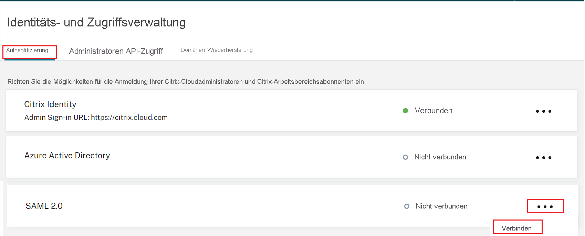
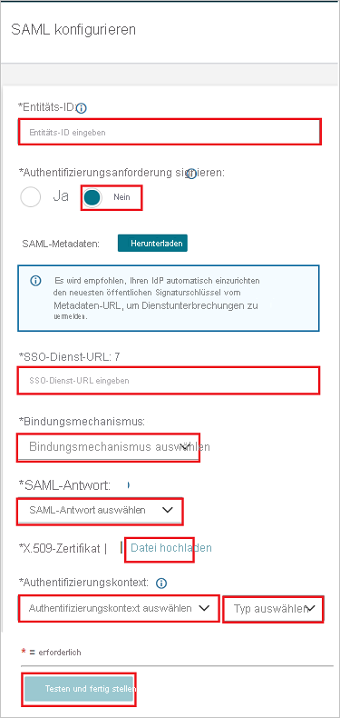

# Tutorial: Integration des einmaligen Anmeldens (SSO) von Azure Active Directory mit Citrix Cloud SAML SSO

In diesem Tutorial erfahren Sie, wie Sie Citrix Cloud SAML SSO in Azure Active Directory (Azure AD) integrieren. Die Integration von Citrix Cloud SAML SSO in Azure AD ermöglicht Ihnen Folgendes:

* Sie können in Azure AD steuern, wer Zugriff auf Citrix Cloud SAML SSO haben soll.
* Sie können es Ihren Benutzern ermöglichen, sich mit ihren Azure AD-Konten automatisch bei Citrix Cloud SAML SSO anzumelden.
* Verwalten Sie Ihre Konten zentral im Azure-Portal.

## Voraussetzungen

Für die ersten Schritte benötigen Sie Folgendes:

* Ein Azure AD-Abonnement Falls Sie über kein Abonnement verfügen, können Sie ein [kostenloses Azure-Konto](https://azure.microsoft.com/free/) verwenden.
* Ein Citrix Cloud-Abonnement. Falls Sie kein Abonnement besitzen, können Sie sich für eins registrieren. 

## Beschreibung des Szenarios

In diesem Tutorial konfigurieren und testen Sie das einmalige Anmelden von Azure AD in einer Testumgebung.

* Citrix Cloud SAML SSO unterstützt **SP-** initiiertes einmaliges Anmelden.

> [!NOTE]
> Der Bezeichner dieser Anwendung ist ein fester Zeichenfolgenwert, daher kann in einem Mandanten nur eine Instanz konfiguriert werden.

## Hinzufügen von Citrix Cloud SAML SSO aus dem Katalog

Zum Konfigurieren der Integration von Citrix Cloud SAML SSO in Azure AD müssen Sie die Insignia SAML SSO-App aus dem Katalog zu Ihrer Liste der verwalteten SaaS-Apps hinzufügen.

1. Melden Sie sich mit einem Geschäfts-, Schul- oder Unikonto oder mit einem persönlichen Microsoft-Konto beim Azure-Portal an.
1. Wählen Sie im linken Navigationsbereich den Dienst **Azure Active Directory** aus.
1. Navigieren Sie zu **Unternehmensanwendungen**, und wählen Sie dann **Alle Anwendungen** aus.
1. Wählen Sie zum Hinzufügen einer neuen Anwendung **Neue Anwendung** aus.
1. Geben Sie im Abschnitt **Aus dem Katalog hinzufügen** den Suchbegriff **Citrix Cloud SAML SSO** in das Suchfeld ein.
1. Wählen Sie im Ergebnisbereich **Citrix Cloud SAML SSO** aus, und fügen Sie dann die App hinzu. Warten Sie einige Sekunden, während die App Ihrem Mandanten hinzugefügt wird.

## Konfigurieren und Testen des einmaligen Anmeldens von Azure AD für Citrix Cloud SAML SSO

Konfigurieren und testen Sie das einmalige Anmelden von Azure AD mit Citrix Cloud SAML SSO mithilfe eines Testbenutzers namens **B. Simon**. Damit einmaliges Anmelden funktioniert, muss eine Linkbeziehung zwischen einem Azure AD Benutzer und dem entsprechenden Benutzer in Citrix Cloud SAML SSO eingerichtet werden. Dieser Benutzer muss auch in Ihrem Active Directory vorhanden sein, das mit Azure AD Connect und Ihrem Azure AD-Abonnement synchronisiert ist.

Führen Sie zum Konfigurieren und Testen des einmaligen Anmeldens von Azure AD mit Citrix Cloud SAML SSO die folgenden Schritte aus:

1. **[Konfigurieren des einmaligen Anmeldens von Azure AD](#configure-azure-ad-sso)** , um Ihren Benutzern die Verwendung dieses Features zu ermöglichen.
    1. **[Erstellen eines Azure AD-Testbenutzers](#create-an-azure-ad-test-user)** , um das einmalige Anmelden von Azure AD mit dem Testbenutzer B. Simon zu testen.
    1. **[Zuweisen des Azure AD-Testbenutzers](#assign-the-azure-ad-test-user)** , um B. Simon die Verwendung des einmaligen Anmeldens von Azure AD zu ermöglichen.
1. **[Konfigurieren des einmaligen Anmeldens für Citrix Cloud SAML SSO](#configure-citrix-cloud-saml-sso)** , um die Einstellungen für einmaliges Anmelden auf der Anwendungsseite zu konfigurieren.
1. **[Testen des einmaligen Anmeldens](#test-sso)** , um zu überprüfen, ob die Konfiguration funktioniert

## Konfigurieren des einmaligen Anmeldens (Single Sign-On, SSO) von Azure AD

Gehen Sie wie folgt vor, um das einmalige Anmelden von Azure AD im Azure-Portal zu aktivieren.

1. Navigieren Sie im Azure-Portal auf der Anwendungsintegrationsseite für **Citrix Cloud SAML SSO** zum Abschnitt **Verwalten** und wählen Sie **Einmaliges Anmelden** aus.
1. Wählen Sie auf der Seite **SSO-Methode auswählen** die Methode **SAML** aus.
1. Klicken Sie auf der Seite **Einmaliges Anmelden (SSO) mit SAML einrichten** auf das Stiftsymbol für **Grundlegende SAML-Konfiguration**, um die Einstellungen zu bearbeiten.

   

1. Führen Sie im Abschnitt **Grundlegende SAML-Konfiguration** den folgenden Schritt aus:

    Geben Sie im Textfeld **Anmelde-URL** eine URL im folgenden Format ein: `https://<SUBDOMAIN>.cloud.com`

    > [!NOTE]
    > Dieser Wert entspricht nicht dem tatsächlichen Wert. Aktualisieren Sie den Wert mit Ihrer Citrix-Arbeitsbereichs-URL. Greifen Sie auf Ihr Citrix Cloud-Konto zu, um den Wert abzurufen. Sie können sich auch die Muster im Abschnitt **Grundlegende SAML-Konfiguration** im Azure-Portal ansehen.

1. Die Citrix Cloud SAML SSO-Anwendung erwartet die SAML-Assertionen in einem bestimmten Format. Daher müssen Sie Ihrer Konfiguration der SAML-Tokenattribute benutzerdefinierte Attributzuordnungen hinzufügen. Der folgende Screenshot zeigt die Liste der Standardattribute.

    

1. Zusätzlich zu den oben genannten erwartet die Citrix Cloud SAML SSO-Anwendung einige weitere Attribute, die in der SAML-Antwort zurückgegeben werden müssen und die unten aufgeführt sind. Diese Attribute sind ebenfalls vorab aufgefüllt, aber Sie können sie gemäß Ihren Anforderungen überprüfen. Die in der SAML-Antwort übergebenen Werte sollten den Active Directory-Attributen des Benutzers zugeordnet werden.
    
    | Name | Quellattribut |
    | -----|-----|
    | cip_sid | user.onpremisesecurityidentifier |
    | cip_upn | user.userprincipalname |
    | cip_oid | ObjectGUID (Erweiterungs-Attribut) |
    | cip_email | user.mail |
    | displayName | user.displayname |

    > [!NOTE]
    > ObjectGUID muss gemäß Ihren Anforderungen manuell konfiguriert werden.

1. Navigieren Sie auf der Seite **Einmaliges Anmelden (SSO) mit SAML einrichten** im Abschnitt **SAML-Signaturzertifikat** zum Eintrag **Zertifikat (PEM)** . Wählen Sie **Herunterladen** aus, um das Zertifikat herunterzuladen, und speichern Sie es auf Ihrem Computer.

    

1. Kopieren Sie im Abschnitt **Einrichten von Citrix Cloud SAML SSO** die entsprechende/n URL(s) basierend auf Ihren Anforderungen.

    

### Erstellen eines Azure AD-Testbenutzers

In diesem Abschnitt erstellen Sie im Azure-Portal einen Testbenutzer mit dem Namen B. Simon.

1. Wählen Sie im linken Bereich des Microsoft Azure-Portals **Azure Active Directory** > **Benutzer** > **Alle Benutzer** aus.
1. Wählen Sie oben im Bildschirm die Option **Neuer Benutzer** aus.
1. Führen Sie unter den Eigenschaften für **Benutzer** die folgenden Schritte aus:
   1. Geben Sie im Feld **Name** die Zeichenfolge `B.Simon` ein.  
   1. Geben Sie im Feld **Benutzername** die Zeichenfolge username@companydomain.extension ein. Beispiel: `B.Simon@contoso.com`.
   1. Aktivieren Sie das Kontrollkästchen **Kennwort anzeigen**, und notieren Sie sich den Wert aus dem Feld **Kennwort**.
   1. Klicken Sie auf **Erstellen**.

    > [!NOTE]
    > Dieser Benutzer muss von einem Active Directory synchronisiert werden. Damit das einmalige Anmelden funktioniert, muss eine Linkbeziehung zwischen einem Azure AD-Benutzer und dem entsprechenden Benutzer in Citrix Cloud SAML SSO eingerichtet werden.
    
### Zuweisen des Azure AD-Testbenutzers

In diesem Abschnitt ermöglichen Sie B. Simon die Verwendung des einmaligen Anmeldens von Azure, indem Sie dem Benutzer den Zugriff auf Citrix Cloud SAML SSO gewähren.

1. Wählen Sie im Azure-Portal **Unternehmensanwendungen** > **Alle Anwendungen** aus.
1. Wählen Sie in der Anwendungsliste die Anwendung **Citrix Cloud SAML SSO** aus.
1. Navigieren Sie auf der Übersichtsseite der App zum Abschnitt **Verwalten**, und wählen Sie **Benutzer und Gruppen** aus.
1. Wählen Sie **Benutzer hinzufügen** und anschließend im Dialogfeld **Zuweisung hinzufügen** die Option **Benutzer und Gruppen** aus.
1. Wählen Sie im Dialogfeld **Benutzer und Gruppen** in der Liste „Benutzer“ den Eintrag **B. Simon** aus, und klicken Sie dann unten auf dem Bildschirm auf die Schaltfläche **Auswählen**.
1. Wenn den Benutzern eine Rolle zugewiesen werden soll, können Sie sie im Dropdownmenü **Rolle auswählen** auswählen. Wurde für diese App keine Rolle eingerichtet, ist die Rolle „Standardzugriff“ ausgewählt.
1. Klicken Sie im Dialogfeld **Zuweisung hinzufügen** auf die Schaltfläche **Zuweisen**.

## Konfigurieren von Citrix Cloud SAML SSO

1. Melden Sie sich bei der Citrix Cloud SAML SSO-Unternehmenswebsite als Administrator an.

1. Navigieren Sie zu dem Menü „Citrix Cloud“ und wählen Sie **Identitäts- und Zugriffsverwaltung** aus.

     

1. Suchen Sie in dem Abschnitt **Authentifizierung** nach **SAML 2.0** und wählen Sie **Verbinden** aus dem Menü mit den Auslassungspunkten.

    

1. Führen Sie auf der Seite **Konfigurieren von SAML** die folgenden Schritte aus.

    

    a. Fügen Sie in das Textfeld **Entity ID** (Entitäts-ID) den Wert für den **Azure AD-Bezeichner** ein, den Sie aus dem Azure-Portal kopiert haben.

    b. Wählen Sie unter  **Authentifizierungsanforderungen signieren** die Option **Nein** aus.

    c. Fügen Sie in das Textfeld **SSO Service-URL** den Wert der **Anmelde-URL** ein, den Sie aus dem Azure-Portal kopiert haben.

    d. Wählen Sie die aus dem Dropdown-Menü die Option **Bindungsmechanismus**. Sie können hier entweder die **HTTP-POST** oder die **HTTP-Umleitung**-Bindung auswählen.

    e. Wählen Sie aus dem Dropdown-Menü unter **SAML Antwort** die Option **Entweder Antwort oder Assertion signieren** aus.

    f. Laden Sie das **Zertifikat (PEM)** vom Azure-Portal in den Abschnitt **X.509 Zertifikat** hoch.

    g. Wählen Sie aus dem Dropdown-Menü unter **Authentifizierungskontext** die Option **Nicht angegeben** und dann **Exakt** aus.

    h. Klicken Sie auf **Testen und Fertig stellen**.

## Testen des einmaligen Anmeldens 

In diesem Abschnitt testen Sie die Azure AD-Konfiguration für einmaliges Anmelden mit den folgenden Optionen: 

* Greifen Sie direkt auf Ihre Citrix Arbeitsbereich-URL zu und initiieren Sie von dort aus den Anmeldeablauf.

* Melden Sie sich mit Ihrer AD-Synced Active Directory-Benutzeranmeldung in Ihrem Citrix-Arbeitsbereich an, um den Test abzuschließen.

## Nächste Schritte

Nach dem Konfigurieren von Citrix Cloud SAML SSO können Sie die Sitzungssteuerung erzwingen, die Ihre vertraulichen Unternehmensdaten in Echtzeit vor der Exfiltration und Infiltration schützt. Die Sitzungssteuerung basiert auf bedingtem Zugriff. [Erfahren Sie, wie Sie die Sitzungssteuerung mit Microsoft Defender for Cloud Apps erzwingen.](/cloud-app-security/proxy-deployment-aad)
