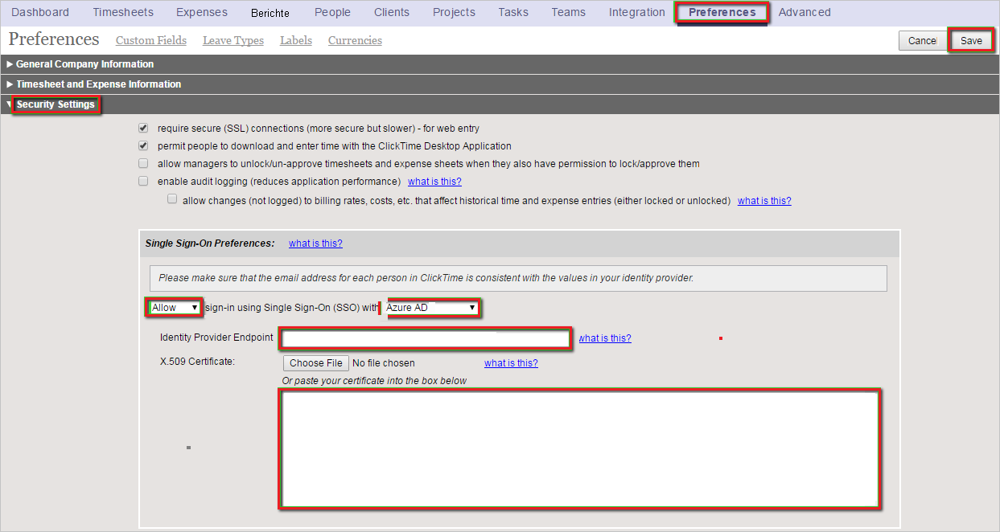
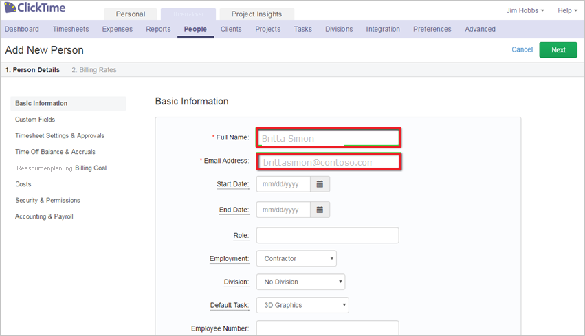

# Tutorial: Integration von Azure AD-SSO in ClickTime

In diesem Tutorial erfahren Sie, wie Sie ClickTime in Azure Active Directory (Azure AD) integrieren. Die Integration von ClickTime in Azure AD ermöglicht Folgendes:

* Steuern in Azure AD, wer Zugriff auf ClickTime besitzt.
* Benutzer können sich mit ihren Azure AD-Konten automatisch bei ClickTime anmelden.
* Verwalten Sie Ihre Konten zentral im Azure-Portal.

## Voraussetzungen

Für die ersten Schritte benötigen Sie Folgendes:

* Ein Azure AD-Abonnement Falls Sie über kein Abonnement verfügen, können Sie ein [kostenloses Azure-Konto](https://azure.microsoft.com/free/) verwenden.
* Ein ClickTime-Abonnement, für das einmaliges Anmelden (SSO) aktiviert ist.

## Beschreibung des Szenarios

In diesem Tutorial konfigurieren und testen Sie das einmalige Anmelden von Azure AD in einer Testumgebung.

* ClickTime unterstützt **IDP**-initiiertes einmaliges Anmelden.

> [!NOTE]
> Der Bezeichner dieser Anwendung ist ein fester Zeichenfolgenwert, daher kann in einem Mandanten nur eine Instanz konfiguriert werden.

## Hinzufügen von ClickTime aus dem Katalog

Zum Konfigurieren der Integration von ClickTime in Azure AD müssen Sie ClickTime über den Katalog der Liste mit den verwalteten SaaS-Apps hinzufügen.

1. Melden Sie sich mit einem Geschäfts-, Schul- oder Unikonto oder mit einem persönlichen Microsoft-Konto beim Azure-Portal an.
1. Wählen Sie im linken Navigationsbereich den Dienst **Azure Active Directory** aus.
1. Navigieren Sie zu **Unternehmensanwendungen**, und wählen Sie dann **Alle Anwendungen** aus.
1. Wählen Sie zum Hinzufügen einer neuen Anwendung **Neue Anwendung** aus.
1. Geben Sie im Abschnitt **Aus Katalog hinzufügen** den Suchbegriff **ClickTime** in das Suchfeld ein.
1. Wählen Sie im Ergebnisbereich **ClickTime** aus, und fügen Sie die App dann hinzu. Warten Sie einige Sekunden, während die App Ihrem Mandanten hinzugefügt wird.

## Konfigurieren und Testen von Azure AD-SSO für ClickTime

Konfigurieren und testen Sie Azure AD-SSO mit ClickTime mithilfe eines Testbenutzers mit dem Namen **B. Simon**. Damit einmaliges Anmelden funktioniert, muss eine Linkbeziehung zwischen einem Azure AD-Benutzer und dem entsprechenden Benutzer in ClickTime eingerichtet werden.

Führen Sie zum Konfigurieren und Testen des einmaligen Anmeldens von Azure AD für ClickTime die folgenden Schritte aus:

1. **[Konfigurieren des einmaligen Anmeldens von Azure AD](#configure-azure-ad-sso)** , um Ihren Benutzern die Verwendung dieses Features zu ermöglichen.
    1. **[Erstellen eines Azure AD-Testbenutzers](#create-an-azure-ad-test-user)** , um das einmalige Anmelden von Azure AD mit dem Testbenutzer B. Simon zu testen.
    1. **[Zuweisen des Azure AD-Testbenutzers](#assign-the-azure-ad-test-user)** , um B. Simon die Verwendung des einmaligen Anmeldens von Azure AD zu ermöglichen.
1. **[Konfigurieren von SSO für ClickTime](#configure-clicktime-sso)** , um die Einstellungen für einmaliges Anmelden auf der Anwendungsseite zu konfigurieren.
    1. **[Erstellen eines ClickTime-Testbenutzers](#create-clicktime-test-user)** , um eine Entsprechung von B. Simon in ClickTime zu erhalten, die mit der Darstellung des Benutzers in Azure AD verknüpft ist.
1. **[Testen des einmaligen Anmeldens](#test-sso)** , um zu überprüfen, ob die Konfiguration funktioniert

## Konfigurieren des einmaligen Anmeldens (Single Sign-On, SSO) von Azure AD

Gehen Sie wie folgt vor, um das einmalige Anmelden von Azure AD im Azure-Portal zu aktivieren.

1. Navigieren Sie im Azure-Portal auf der Anwendungsintegrationsseite für **ClickTime** zum Abschnitt **Verwalten**, und wählen Sie **Einmaliges Anmelden** aus.
1. Wählen Sie auf der Seite **SSO-Methode auswählen** die Methode **SAML** aus.
1. Klicken Sie auf der Seite **Einmaliges Anmelden (SSO) mit SAML einrichten** auf das Stiftsymbol für **Grundlegende SAML-Konfiguration**, um die Einstellungen zu bearbeiten.

   

4. Führen Sie auf der Seite **Einmaliges Anmelden (SSO) mit SAML einrichten** die folgenden Schritte aus:

    a. Geben Sie im Textfeld **Bezeichner** die URL `https://app.clicktime.com/sp/` ein.

    b. Geben Sie im Textfeld **Antwort-URL** eine der folgenden URLs ein:

    | **Antwort-URL** |
    |----|
    | `https://app.clicktime.com/Login/` |
    | `https://app.clicktime.com/App/Login/Consume.aspx` |

4. Klicken Sie auf der Seite **Einmaliges Anmelden (SSO) mit SAML einrichten** im Abschnitt **SAML-Signaturzertifikat** auf **Herunterladen**, um das Ihrer Anforderung entsprechende **Zertifikat (Base64)** aus den angegebenen Optionen herunterzuladen und auf Ihrem Computer zu speichern.

    

6. Kopieren Sie im Abschnitt **ClickTime einrichten** die entsprechenden URLs gemäß Ihren Anforderungen.

    

### Erstellen eines Azure AD-Testbenutzers 

In diesem Abschnitt erstellen Sie im Azure-Portal einen Testbenutzer mit dem Namen B. Simon.

1. Wählen Sie im linken Bereich des Microsoft Azure-Portals **Azure Active Directory** > **Benutzer** > **Alle Benutzer** aus.
1. Wählen Sie oben im Bildschirm die Option **Neuer Benutzer** aus.
1. Führen Sie unter den Eigenschaften für **Benutzer** die folgenden Schritte aus:
   1. Geben Sie im Feld **Name** die Zeichenfolge `B.Simon` ein.  
   1. Geben Sie im Feld **Benutzername** die Zeichenfolge username@companydomain.extension ein. Beispiel: `B.Simon@contoso.com`.
   1. Aktivieren Sie das Kontrollkästchen **Kennwort anzeigen**, und notieren Sie sich den Wert aus dem Feld **Kennwort**.
   1. Klicken Sie auf **Erstellen**.

### Zuweisen des Azure AD-Testbenutzers

In diesem Abschnitt ermöglichen Sie B. Simon die Verwendung von Azure-SSO, indem Sie Zugriff auf ClickTime gewähren.

1. Wählen Sie im Azure-Portal **Unternehmensanwendungen** > **Alle Anwendungen** aus.
1. Wählen Sie in der Anwendungsliste **ClickTime** aus.
1. Navigieren Sie auf der Übersichtsseite der App zum Abschnitt **Verwalten**, und wählen Sie **Benutzer und Gruppen** aus.
1. Wählen Sie **Benutzer hinzufügen** und anschließend im Dialogfeld **Zuweisung hinzufügen** die Option **Benutzer und Gruppen** aus.
1. Wählen Sie im Dialogfeld **Benutzer und Gruppen** in der Liste „Benutzer“ den Eintrag **B. Simon** aus, und klicken Sie dann unten auf dem Bildschirm auf die Schaltfläche **Auswählen**.
1. Wenn den Benutzern eine Rolle zugewiesen werden soll, können Sie sie im Dropdownmenü **Rolle auswählen** auswählen. Wurde für diese App keine Rolle eingerichtet, ist die Rolle „Standardzugriff“ ausgewählt.
1. Klicken Sie im Dialogfeld **Zuweisung hinzufügen** auf die Schaltfläche **Zuweisen**.

## Konfigurieren von SSO für ClickTime

1. Melden Sie sich in einem anderen Webbrowserfenster bei der ClickTime-Unternehmenswebsite als Administrator an.

1. Klicken Sie oben auf der Symbolleiste auf **Preferences**, und klicken Sie dann auf **Sicherheitseinstellungen**.

1. Führen Sie im Konfigurationsabschnitt **Single Sign-On Preferences** die folgenden Schritte aus:

    

    a.  Wählen Sie **Zulassen** für das einmalige Anmelden (SSO) mit **Azure AD**.

    b. Fügen Sie in das Textfeld **Identity Provider Endpoint** (Endpunkt des Identitätsanbieters) den Wert der **Anmelde-URL** ein, den Sie aus dem Azure-Portal kopiert haben.

    c.  Öffnen Sie in **Editor** das **Base64-codierte Zertifikat**, das Sie aus dem Azure-Portal heruntergeladen haben, kopieren Sie den Inhalt, und fügen Sie ihn anschließend in das Textfeld **X.509-Zertifikat** ein.

    d.  Klicken Sie auf **Speichern**.

### Erstellen eines ClickTime-Testbenutzers

Damit sich Azure AD-Benutzer bei ClickTime anmelden können, müssen sie in ClickTime bereitgestellt werden.  
Im Fall von ClickTime ist die Bereitstellung eine manuelle Aufgabe.

> [!NOTE]
> Sie können Azure AD-Benutzerkonten auch mithilfe anderer Tools zum Erstellen von ClickTime-Benutzerkonten oder mithilfe der von ClickTime bereitgestellten APIs erstellen.

**Führen Sie zum Bereitstellen eines Benutzerkontos die folgenden Schritte aus:**

1. Melden Sie sich bei Ihrem **ClickTime** -Mandanten an.

1. Klicken Sie auf der Symbolleiste oben auf **Firma** und dann auf **Personen**.

    

1. Klicken Sie auf **Person hinzufügen**.

    

1. Führen Sie im Abschnitt "New Person" die folgenden Schritte aus:

    

    a.  Geben Sie im entsprechenden Textfeld den **vollständigen Namen** des Benutzers, z.B. **Britta Simon**, ein. 

    b.  Geben Sie im Textfeld **email address** (E-Mail-Adresse) die E-Mail-Adresse des Benutzers ein, z. B. **brittasimon\@contoso.com**.

    > [!NOTE]
    > Wenn Sie möchten, können Sie zusätzliche Eigenschaften des neuen Personenobjekts festlegen.

    c.  Klicken Sie auf **Speichern**.

## Testen des einmaligen Anmeldens

In diesem Abschnitt testen Sie die Azure AD-Konfiguration für einmaliges Anmelden mit den folgenden Optionen:

* Klicken Sie im Azure-Portal auf „Diese Anwendung testen“. Dadurch sollten Sie automatisch bei der ClickTime-Instanz angemeldet werden, für die Sie einmaliges Anmelden eingerichtet haben.

* Sie können „Meine Apps“ von Microsoft verwenden. Wenn Sie unter „Meine Apps“ auf die Kachel „ClickTime“ klicken, sollten Sie automatisch bei der ClickTime-Instanz angemeldet werden, für die Sie einmaliges Anmelden eingerichtet haben. Weitere Informationen zu „Meine Apps“ finden Sie in [dieser Einführung](../user-help/my-apps-portal-end-user-access.md).

## Nächste Schritte

Nach dem Konfigurieren von ClickTime können Sie Sitzungssteuerung erzwingen, die in Echtzeit vor der Exfiltration und Infiltration vertraulicher Unternehmensdaten schützt. Die Sitzungssteuerung basiert auf bedingtem Zugriff. [Erfahren Sie, wie Sie die Sitzungssteuerung mit Microsoft Defender for Cloud Apps erzwingen.](/cloud-app-security/proxy-deployment-aad)
