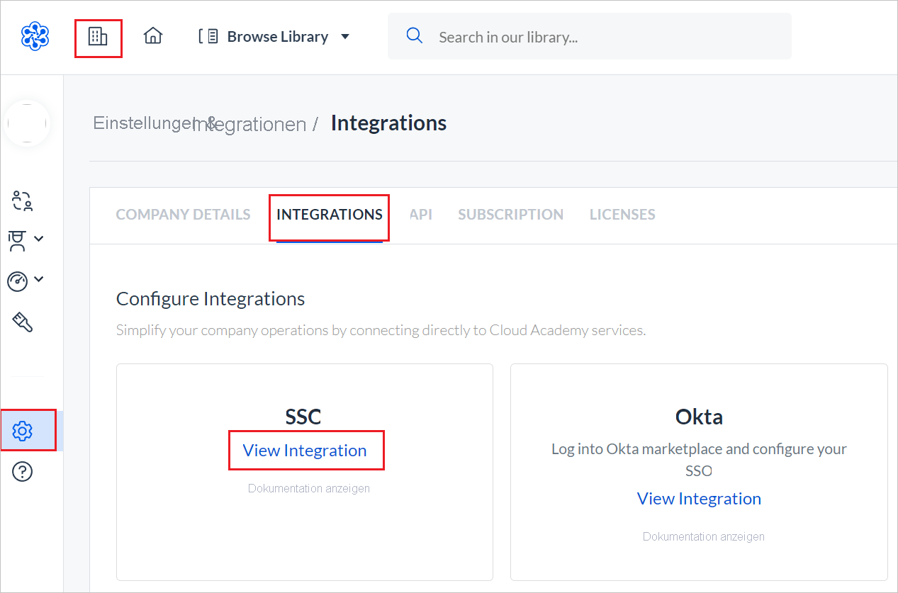
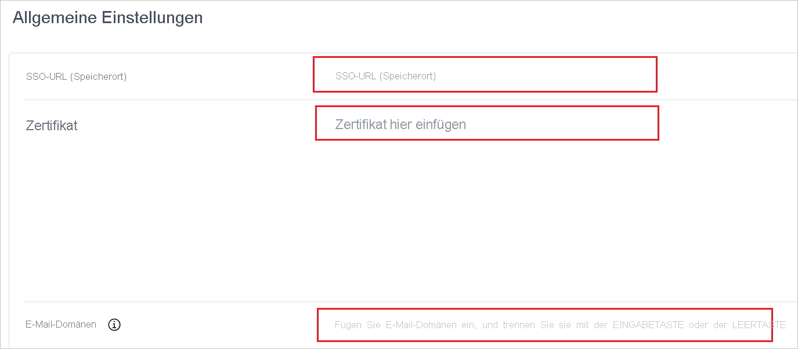
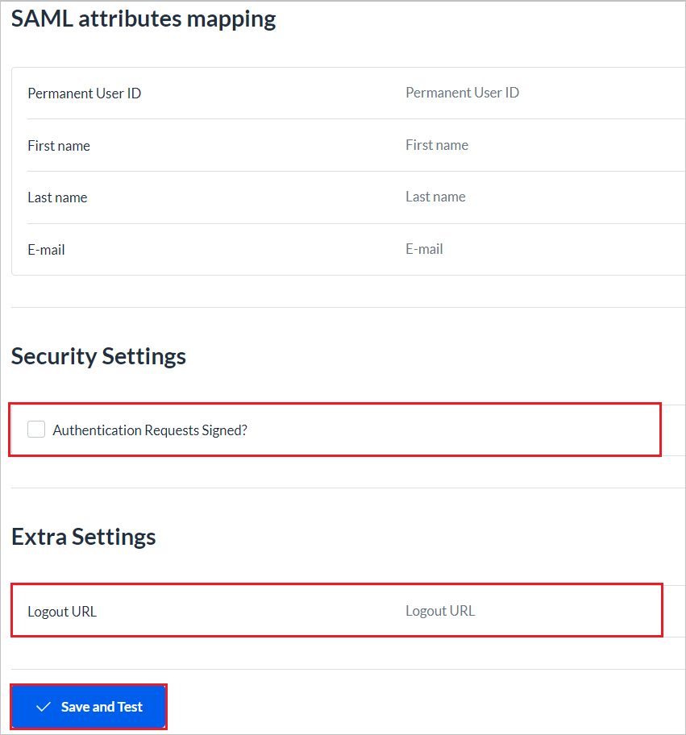

# Tutorial: Integration des einmaligen Anmeldens (Single Sign-On, SSO) von Azure Active Directory mit Cloud Academy - SSO

In diesem Tutorial erfahren Sie, wie Sie Cloud Academy - SSO in Azure Active Directory (Azure AD) integrieren. Die Integration von Cloud Academy - SSO in Azure AD ermöglicht Folgendes:

* Steuern Sie mithilfe von Azure AD, wer auf Cloud Academy - SSO zugreifen kann.
* Ermöglichen Sie es Ihren Benutzern, sich mit ihren Azure AD-Konten automatisch bei Cloud Academy - SSO anzumelden.
* Verwalten Sie Ihre Konten zentral im Azure-Portal.

## Voraussetzungen

Für die ersten Schritte benötigen Sie Folgendes:

* Ein Azure AD-Abonnement Falls Sie über kein Abonnement verfügen, können Sie ein [kostenloses Azure-Konto](https://azure.microsoft.com/free/) verwenden.
* Ein Abonnement für Cloud Academy - SSO, für das einmaliges Anmelden (Single Sign-On, SSO) aktiviert ist

## Beschreibung des Tutorials

In diesem Tutorial konfigurieren und testen Sie das einmalige Anmelden von Azure AD in einer Testumgebung.

* Cloud Academy - SSO unterstützt **SP**-initiiertes einmaliges Anmelden.
* Cloud Academy - SSO unterstützt die **Just-In-Time**-Benutzerbereitstellung.
* Cloud Academy – SSO unterstützt die [automatische Benutzerbereitstellung](cloud-academy-sso-provisioning-tutorial.md).

## Hinzufügen von Cloud Academy - SSO aus dem Katalog

Zum Konfigurieren der Integration von Cloud Academy - SSO in Azure AD müssen Sie Cloud Academy - SSO aus dem Katalog der Liste mit den verwalteten SaaS-Apps hinzufügen:

1. Melden Sie sich mit einem Geschäfts-, Schul- oder Unikonto oder mit einem persönlichen Microsoft-Konto beim Azure-Portal an.
1. Wählen Sie im linken Bereich **Azure Active Directory** aus.
1. Navigieren Sie zu **Unternehmensanwendungen**, und wählen Sie die Option **Alle Anwendungen** aus.
1. Wählen Sie zum Hinzufügen einer Anwendung **Neue Anwendung** aus.
1. Geben Sie im Abschnitt **Aus Katalog hinzufügen** den Suchbegriff **Cloud Academy - SSO** in das Suchfeld ein.
1. Wählen Sie im Ergebnisbereich **Cloud Academy - SSO** aus, und fügen Sie dann die App hinzu. Warten Sie einige Sekunden, während die App Ihrem Mandanten hinzugefügt wird.

## Konfigurieren und Testen des einmaligen Anmeldens von Azure AD für Cloud Academy - SSO

Sie konfigurieren und testen das einmalige Anmelden von Azure AD mit Cloud Academy - SSO mithilfe eines Testbenutzers mit dem Namen **B. Simon**. Damit einmaliges Anmelden funktioniert, muss eine Linkbeziehung zwischen einem Azure AD-Benutzer und dem entsprechenden Benutzer in Cloud Academy - SSO eingerichtet werden.

Führen Sie zum Konfigurieren und Testen des einmaligen Anmeldens von Azure AD mit Cloud Academy - SSO diese allgemeinen Schritte aus:

1. **[Konfigurieren des einmaligen Anmeldens von Azure AD](#configure-azure-ad-sso)** , um Ihren Benutzern die Verwendung dieses Features zu ermöglichen.
    1. **[Erstellen eines Azure AD-Testbenutzers](#create-an-azure-ad-test-user)** , um das einmalige Anmelden von Azure AD zu testen.
    1. **[Gewähren der Zugriffsberechtigungen für den Testbenutzer](#grant-access-to-the-test-user)** , um dem Benutzer die Verwendung des einmaligen Anmeldens von Azure AD zu ermöglichen.
1. **[Konfigurieren des einmaligen Anmeldens für Cloud Academy - SSO](#configure-single-sign-on-for-cloud-academy)** auf der Anwendungsseite
    1. **[Erstellen eines Testbenutzers für Cloud Academy - SSO](#create-a-cloud-academy-test-user)** als Pendant zur Azure AD-Darstellung des Benutzers
1. **[Testen des einmaligen Anmeldens](#test-sso)** , um zu überprüfen, ob die Konfiguration funktioniert.

## Konfigurieren des einmaligen Anmeldens (Single Sign-On, SSO) von Azure AD

Gehen Sie wie folgt vor, um das einmalige Anmelden von Azure AD im Azure-Portal zu aktivieren:

1. Wählen Sie im Azure-Portal auf der Anwendungsintegrationsseite für **Cloud Academy - SSO** im Abschnitt **Verwalten** die Option **Einmaliges Anmelden** aus.
1. Wählen Sie auf der Seite **SSO-Methode auswählen** die Methode **SAML** aus.
1. Wählen Sie auf der Seite **Einmaliges Anmelden (SSO) mit SAML einrichten** das Stiftsymbol für **Grundlegende SAML-Konfiguration** aus, um die Einstellungen zu bearbeiten:

   

1. Führen Sie im Abschnitt **Grundlegende SAML-Konfiguration** die folgenden Schritte aus:

    a. Geben Sie im Textfeld **Anmelde-URL** eine der folgenden URLs ein:
    
    | Anmelde-URL |
    |--------------|
    | `https://cloudacademy.com/login/enterprise/` |
    | `https://app.qa.com/login/enterprise/` |
    |
    
    b. Geben Sie im Textfeld **Antwort-URL** eine der folgenden URLs ein:
    
    | Antwort-URL |
    |--------------|
    | `https://cloudacademy.com/labs/social/complete/saml/` |
    | `https://app.qa.com/labs/social/complete/saml/` |
    |
1. Wählen Sie auf der Seite **Einmaliges Anmelden (SSO) mit SAML einrichten** im Abschnitt **SAML-Signaturzertifikat** die Kopierschaltfläche aus, um die **App-Verbundmetadaten-URL** zu kopieren. Speichern Sie die URL.

    

### Erstellen eines Azure AD-Testbenutzers

In diesem Abschnitt erstellen Sie im Azure-Portal einen Testbenutzer mit dem Namen B. Simon.

1. Wählen Sie im linken Bereich des Azure-Portals den Dienst **Azure Active Directory** aus. Wählen Sie **Benutzer** und dann **Alle Benutzer** aus.
1. Wählen Sie oben im Bildschirm die Option **Neuer Benutzer** aus.
1. Führen Sie in den **Benutzereigenschaften** die folgenden Schritte aus:
   1. Geben Sie im Feld **Name** den Namen **B.Simon** ein.  
   1. Geben Sie im Feld **Benutzername** Folgendes ein: \<username>@\<companydomain>.\<extension>. Beispiel: `B.Simon@contoso.com`.
   1. Aktivieren Sie **Kennwort anzeigen**, und notieren Sie sich den Wert, der im Feld **Kennwort** angezeigt wird.
   1. Klicken Sie auf **Erstellen**.

### Gewähren von Zugriff für den Testbenutzer

In diesem Abschnitt ermöglichen Sie B. Simon die Verwendung des einmaligen Anmeldens von Azure, indem Sie ihr Zugriff auf Cloud Academy - SSO gewähren.

1. Wählen Sie im Azure-Portal **Unternehmensanwendungen** > **Alle Anwendungen** aus.
1. Wählen Sie in der Anwendungsliste **Cloud Academy - SSO** aus.
1. Navigieren Sie auf der Übersichtsseite der App zum Abschnitt **Verwalten**, und wählen Sie **Benutzer und Gruppen** aus:
1. Wählen Sie die Schaltfläche **Benutzer hinzufügen** und anschließend im Dialogfeld **Zuweisung hinzufügen** die Option **Benutzer und Gruppen** aus:
1. Wählen Sie im Dialogfeld **Benutzer und Gruppen** in der Liste **Benutzer** den Eintrag **B. Simon** aus, und klicken Sie dann am unteren Bildschirmrand auf die Schaltfläche **Auswählen**.
1. Wenn den Benutzern eine Rolle zugewiesen werden soll, können Sie sie im Dropdownmenü **Rolle auswählen** auswählen. Wurde für diese App keine Rolle eingerichtet, ist die Rolle „Standardzugriff“ ausgewählt.
1. Wählen Sie im Dialogfeld **Zuweisung hinzufügen** die Option **Zuweisen** aus.

## Konfigurieren des einmaligen Anmeldens für Cloud Academy

1. Melden Sie sich in einem anderen Browserfenster bei der Unternehmenswebsite von Cloud Academy - SSO als Administrator an.

1. Klicken Sie auf der Startseite auf das Symbol für das **Azure-Integrationsteam**, und wählen Sie dann im linken Menü **Settings** (Einstellungen) aus.

1. Wählen Sie auf der Registerkarte **INTEGRATIONS** (INTEGRATIONEN) die Karte **SSO** aus.

    

1. Klicken Sie auf **Start Configuring** (Mit Konfiguration beginnen).

    

1. Führen Sie auf der Seite „General Settings“ (Allgemeine Einstellungen) die folgenden Schritte aus:

    

    a. Fügen Sie im Feld **SSO URL (Location)** (SSO-URL (Standort)) den Wert der Anmelde-URL ein, den Sie aus dem Azure-Portal kopiert haben.

    c. Öffnen Sie das aus dem Azure-Portal heruntergeladene Base64-Zertifikat in Editor. Fügen Sie den Inhalt in das Feld **Certificate** (Zertifikat) ein.

    d. Geben Sie im Feld **Email Domains** (E-Mail-Domänen) alle Domänenwerte ein, die Ihr Unternehmen für Benutzer-E-Mails verwendet.

1. Führen Sie die folgenden Schritte auf der im Anschluss angegebenen Seite aus:

    

    a. Füllen Sie im Abschnitt **SAML Attributes Mapping** (SAML-Attributzuordnungen) die erforderlichen Felder mit den Quellattributwerten aus.

    b. Aktivieren Sie im Abschnitt **Security Settings** (Sicherheitseinstellungen) das Kontrollkästchen **Authentication Requests Signed?** (Authentifizierungsanforderungen signiert?), um diesen Wert auf **True** festzulegen.

    c. Geben Sie im Abschnitt **Extra Settings (Optional)** (Zusätzliche Einstellungen (Optional)) in das Feld **Abmelde-URL** den Wert der Abmelde-URL ein, den Sie aus dem Azure-Portal kopiert haben.

1. Klicken Sie auf **Save and Test** (Speichern und testen).

> [!NOTE]
> Weitere Informationen zum Konfigurieren von Cloud Academy - SSO finden Sie im Artikel zum [Einrichten des einmaligen Anmeldens](https://support.cloudacademy.com/hc/articles/360043908452-Setting-Up-Single-Sign-On).

### Erstellen eines Cloud Academy-Testbenutzers

In diesem Abschnitt wird in Cloud Academy - SSO ein Benutzer mit dem Namen Britta Simon erstellt. Cloud Academy - SSO unterstützt die Just-in-Time-Benutzerbereitstellung, die standardmäßig aktiviert ist. Für Sie steht in diesem Abschnitt kein Aktionselement zur Verfügung. Wenn in Cloud Academy - SSO noch kein Benutzer vorhanden, wird nach der Authentifizierung ein neuer Benutzer erstellt.

Außerdem unterstützt Cloud Academy – SSO die automatische Benutzerbereitstellung. Weitere Informationen zum Konfigurieren der automatischen Benutzerbereitstellung finden Sie [hier](./cloud-academy-sso-provisioning-tutorial.md).

## Testen des einmaligen Anmeldens 

In diesem Abschnitt testen Sie die Azure AD-Konfiguration für einmaliges Anmelden mit den folgenden Optionen: 

* Klicken Sie im Azure-Portal auf **Diese Anwendung testen**. Dadurch werden Sie zur Anmelde-URL für Cloud Academy - SSO weitergeleitet, wo Sie den Anmeldeflow initiieren können. 

* Navigieren Sie direkt zur Anmelde-URL für Cloud Academy - SSO, und initiieren Sie den Anmeldeflow.

* Sie können „Meine Apps“ von Microsoft verwenden. Wenn Sie in „Meine Apps“auf die Kachel „Cloud Academy - SSO“ klicken, werden Sie zur Anmelde-URL für Cloud Academy - SSO weitergeleitet. Weitere Informationen zu „Meine Apps“ finden Sie in [dieser Einführung](https://support.microsoft.com/account-billing/sign-in-and-start-apps-from-the-my-apps-portal-2f3b1bae-0e5a-4a86-a33e-876fbd2a4510).

## Nächste Schritte

Nach dem Konfigurieren von Cloud Academy - SSO können Sie die Sitzungssteuerung erzwingen, die in Echtzeit vor der Exfiltration und Infiltration vertraulicher Unternehmensdaten schützt. Die Sitzungssteuerung basiert auf bedingtem Zugriff. [Hier](/cloud-app-security/proxy-deployment-any-app) erfahren Sie, wie Sie die Sitzungssteuerung mit Microsoft Cloud App Security erzwingen.
