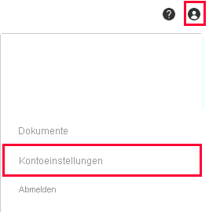
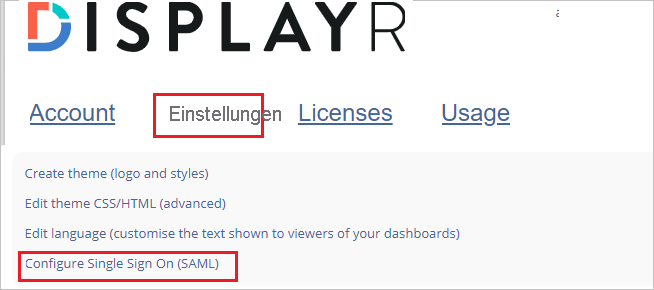

# Tutorial: Integrieren von Displayr in Azure Active Directory

In diesem Tutorial erfahren Sie, wie Sie Displayr in Azure Active Directory (Azure AD) integrieren. Bei der Integration von Displayr in Azure AD haben Sie folgende Möglichkeiten:

* Steuern Sie in Azure AD, wer Zugriff auf Displayr hat.
* Ermöglichen Sie es Ihren Benutzern, sich mit ihren Azure AD-Konten automatisch bei Displayr anzumelden.
* Verwalten Sie Ihre Konten zentral im Azure-Portal.

## Voraussetzungen

Für die ersten Schritte benötigen Sie Folgendes:

* Ein Azure AD-Abonnement Falls Sie über kein Abonnement verfügen, können Sie ein [kostenloses Azure-Konto](https://azure.microsoft.com/free/) verwenden.
* Displayr-Unternehmen, für das einmaliges Anmelden (SSO) aktiviert ist.

## Beschreibung des Szenarios

In diesem Tutorial erfahren Sie, wie Sie das einmalige Anmelden von Azure AD in Ihrem Displayr-Unternehmen konfigurieren.

* Displayr unterstützt **SP-initiiertes** einmaliges Anmelden.

## Hinzufügen von Displayr aus dem Katalog

Zum Konfigurieren der Integration von Displayr in Azure AD müssen Sie Displayr aus dem Katalog der Liste mit den verwalteten SaaS-Apps hinzufügen.

1. Melden Sie sich mit einem Geschäfts-, Schul- oder Unikonto oder mit einem persönlichen Microsoft-Konto beim Azure-Portal an.
1. Wählen Sie im linken Navigationsbereich den Dienst **Azure Active Directory** aus.
1. Navigieren Sie zu **Unternehmensanwendungen**, und wählen Sie dann **Alle Anwendungen** aus.
1. Wählen Sie zum Hinzufügen einer neuen Anwendung **Neue Anwendung** aus.
1. Geben Sie im Abschnitt **Aus Katalog hinzufügen** den Suchbegriff **Displayr** in das Suchfeld ein.
1. Wählen Sie **Displayr** im Ergebnisbereich aus, und fügen Sie dann die App hinzu. Warten Sie einige Sekunden, während die App Ihrem Mandanten hinzugefügt wird.

## Konfigurieren des einmaligen Anmeldens von Azure AD für Displayr

Führen Sie zum Konfigurieren des einmaligen Anmeldens von Azure AD in Displayr die folgenden Schritte aus:

1. **[Konfigurieren des einmaligen Anmeldens von Azure AD](#configure-azure-ad-sso)** , um Ihren Benutzern die Verwendung dieses Features zu ermöglichen
1. **[Konfigurieren des einmaligen Anmeldens für Displayr](#configure-displayr-sso)** , um die Einstellungen für einmaliges Anmelden auf der Anwendungsseite zu konfigurieren
1. **[Beschränken Sie den Zugriff auf bestimmte Benutzer,](#restrict-access-to-specific-users)** um einzuschränken, welche Ihrer Azure AD-Benutzer sich bei Displayr anmelden können.
1. **[Testen des einmaligen Anmeldens](#test-sso)** , um zu überprüfen, ob die Konfiguration funktioniert

## Konfigurieren des einmaligen Anmeldens (Single Sign-On, SSO) von Azure AD

Gehen Sie wie folgt vor, um das einmalige Anmelden von Azure AD im Azure-Portal zu aktivieren.

1. Navigieren Sie im Azure-Portal auf der Anwendungsintegrationsseite für **Displayr** zum Abschnitt **Verwalten**, und wählen Sie **Einmaliges Anmelden** aus.
1. Wählen Sie auf der Seite **SSO-Methode auswählen** die Methode **SAML** aus.
1. Klicken Sie auf der Seite **Einmaliges Anmelden (SSO) mit SAML einrichten** auf das Stiftsymbol für **Grundlegende SAML-Konfiguration**, um die Einstellungen zu bearbeiten.

   

1. Führen Sie im Abschnitt **Grundlegende SAML-Konfiguration** die folgenden Schritte aus:

    a. Geben Sie im Textfeld **Bezeichner (Entitäts-ID)** einen Wert im folgenden Format ein: `<YOURDOMAIN>.displayr.com`.
    
    b. Geben Sie im Textfeld **Antwort-URL** die folgende URL ein: `https://app.displayr.com/Login/ProcessSamlResponse`.
    
    c. Geben Sie im Textfeld **Anmelde-URL** eine URL im folgenden Format ein: `https://<YOURDOMAIN>.displayr.com`

    d. Klicken Sie auf **Speichern**.

    >[!NOTE]
    >Hierbei handelt es sich um Beispielwerte. Ersetzen Sie diese Werte durch den tatsächlichen Bezeichner und die tatsächliche Anmelde-URL. Diese Werte erhalten Sie vom [Supportteam für den Displayr-Client](mailto:support@displayr.com). Sie können sich auch die Muster im Abschnitt „Grundlegende SAML-Konfiguration“ im Azure-Portal ansehen.

1. Suchen Sie auf der Seite **Einmaliges Anmelden (SSO) mit SAML einrichten** im Abschnitt **SAML-Signaturzertifikat** den Eintrag **Zertifikat (Base64)** . Wählen Sie **Herunterladen** aus, um das Zertifikat herunterzuladen, und speichern Sie es auf Ihrem Computer.

   

1. Die Displayr-Anwendung erwartet die SAML-Assertionen in einem bestimmten Format. Daher müssen Sie Ihrer Konfiguration der SAML-Tokenattribute benutzerdefinierte Attributzuordnungen hinzufügen. Der folgende Screenshot zeigt die Liste der Standardattribute. Klicken Sie auf das Symbol **Bearbeiten**, um das Dialogfeld „Benutzerattribute“ zu öffnen.

   

1. Darüber hinaus wird von der Displayr-Anwendung erwartet, dass in der SAML-Antwort noch einige weitere Attribute zurückgegeben werden. Führen Sie im Dialogfeld **Gruppenansprüche (Vorschau)** im Abschnitt **Benutzerattribute und Ansprüche** die folgenden Schritte aus:

   a. Klicken Sie auf **Gruppenanspruch hinzufügen**.

      

   b. Wählen Sie **Alle Gruppen** aus der Optionsfeldliste aus.

   c. Wählen Sie **Quellattribut** von **Gruppen-ID** aus.

   f. Klicken Sie auf **Speichern**.

1. Kopieren Sie im Abschnitt **Displayr einrichten** die entsprechenden URLs gemäß Ihren Anforderungen.

   

## Konfigurieren des einmaligen Anmeldens für Displayr

1. Wenn Sie die Konfiguration in Displayr automatisieren möchten, müssen Sie die **Browsererweiterung „Meine Apps“ für die sichere Anmeldung** installieren, indem Sie auf **Erweiterung installieren** klicken.

    

2. Klicken Sie nach dem Hinzufügen der Erweiterung zum Browser auf **Displayr einrichten**, um zur Anwendung Displayr weitergeleitet zu werden. Geben Sie dort die Administratoranmeldeinformationen ein, um sich bei Displayr anzumelden. Die Browsererweiterung konfiguriert die Anwendung automatisch für Sie und automatisiert die Schritte 3 bis 6.

    

3. Wenn Sie Displayr manuell einrichten möchten, öffnen Sie ein neues Webbrowserfenster, melden Sie sich bei der Displayr-Unternehmenswebsite als Administrator an, und führen Sie die folgenden Schritte aus:

4. Klicken Sie auf das Symbol **Benutzer**, und navigieren Sie dann zu **Kontoeinstellungen**.

    

5. Wechseln Sie aus dem Hauptmenü zu **Einstellungen**, und scrollen Sie nach unten, um auf **Einmaliges Anmelden konfigurieren (SAML)** zu klicken.

    

6. Führen Sie auf der Seite **Einmaliges Anmelden (SAML)** die folgenden Schritte aus:

    

    a. Aktivieren Sie das Kontrollkästchen **Einmaliges Anmelden aktivieren (SAML)** .

    b. Kopieren Sie in Azure AD im Abschnitt **Grundlegende SAML-Konfiguration** den tatsächlichen Wert für **Bezeichner**, und fügen Sie ihn ins Textfeld **Issuer** (Aussteller) ein.

    c. Fügen Sie in das Textfeld **Anmelde-URL** den Wert der **Anmelde-URL** ein, den Sie aus dem Azure-Portal kopiert haben.

    d. Fügen Sie in das Textfeld **Abmelde-URL** den Wert der **Abmelde-URL** ein, den Sie aus dem Azure-Portal kopiert haben.

    e. Öffnen Sie das Zertifikat (Base64) im Editor, kopieren Sie den Inhalt, und fügen Sie ihn in das Textfeld **Certificate** (Zertifikat) ein.

    f. **Gruppenzuordnungen** sind optional.

    g. Klicken Sie auf **Speichern**.  

### Einschränken des Zugriffs auf bestimmte Benutzer

Standardmäßig können sich alle Benutzer im Mandanten, in dem Sie die Displayr-Anwendung hinzugefügt haben, mithilfe von SSO bei Displayr anmelden. Wenn Sie den Zugriff auf bestimmte Benutzer oder Gruppen einschränken möchten, finden Sie unter [Einschränken Ihrer Azure AD-App auf eine Gruppe von Benutzern in einem Azure AD-Mandanten](../develop/howto-restrict-your-app-to-a-set-of-users.md) weitere Informationen.

## Testen des einmaligen Anmeldens

In diesem Abschnitt testen Sie die Azure AD-Konfiguration für einmaliges Anmelden mit den folgenden Optionen: 

* Klicken Sie im Azure-Portal auf **Diese Anwendung testen**. Dadurch werden Sie zur Anmelde-URL für Displayr weitergeleitet, wo Sie den Anmeldeflow initiieren können. 

* Rufen Sie direkt die Anmelde-URL für Displayr auf, und initiieren Sie den Anmeldeflow.

* Sie können „Meine Apps“ von Microsoft verwenden. Wenn Sie in „Meine Apps“ auf die Kachel „Displayr“ klicken, werden Sie zur Anmelde-URL für Displayr weitergeleitet. Weitere Informationen zu „Meine Apps“ finden Sie in [dieser Einführung](https://support.microsoft.com/account-billing/sign-in-and-start-apps-from-the-my-apps-portal-2f3b1bae-0e5a-4a86-a33e-876fbd2a4510).

## Nächste Schritte

Nach dem Konfigurieren von Displayr können Sie die Sitzungssteuerung erzwingen, die in Echtzeit vor der Exfiltration und Infiltration vertraulicher Unternehmensdaten schützt. Die Sitzungssteuerung basiert auf bedingtem Zugriff. [Erfahren Sie, wie Sie die Sitzungssteuerung mit Microsoft Defender for Cloud Apps erzwingen.](/cloud-app-security/proxy-deployment-aad)
