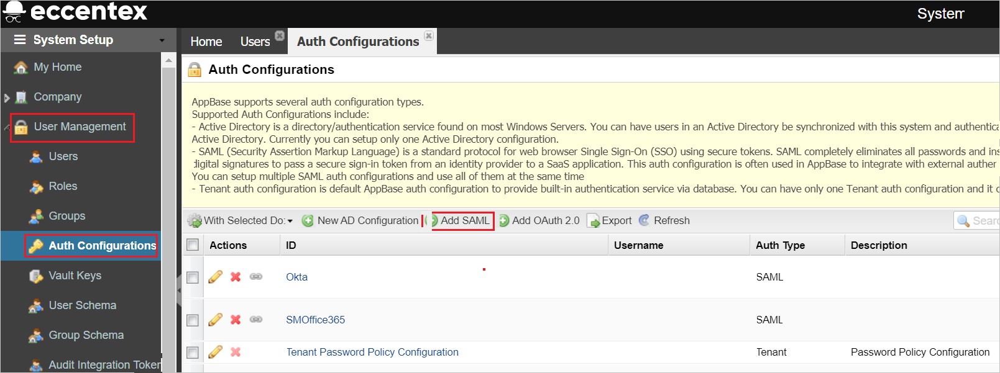

# Tutorial: Integrieren von Eccentex AppBase for Azure in das einmalige Anmelden (Single Sign-On, SSO) von Azure Active Directory

In diesem Tutorial erfahren Sie, wie Sie Eccentex AppBase for Azure in Azure Active Directory (Azure AD) integrieren. Die Integration von Eccentex AppBase for Azure in Azure AD ermöglicht Folgendes:

* Sie können in Azure AD steuern, wer Zugriff auf Eccentex AppBase for Azure hat.
* Sie können Ihren Benutzern ermöglichen, sich mit ihren Azure AD-Konten automatisch bei Eccentex AppBase for Azure anzumelden.
* Verwalten Sie Ihre Konten zentral im Azure-Portal.

## Voraussetzungen

Für die ersten Schritte benötigen Sie Folgendes:

* Ein Azure AD-Abonnement Falls Sie über kein Abonnement verfügen, können Sie ein [kostenloses Azure-Konto](https://azure.microsoft.com/free/) verwenden.
* Ein Eccentex AppBase for Azure-Abonnement, für das einmaliges Anmelden (Single Sign-On, SSO) aktiviert ist.

## Beschreibung des Szenarios

In diesem Tutorial konfigurieren und testen Sie das einmalige Anmelden von Azure AD in einer Testumgebung.

* Eccentex AppBase for Azure unterstützt **SP**-initiiertes einmaliges Anmelden.

* Eccentex AppBase for Azure unterstützt die **Just-in-Time**-Benutzerbereitstellung.

## Hinzufügen von Eccentex AppBase for Azure aus dem Katalog

Zum Konfigurieren der Integration von Eccentex AppBase for Azure in Azure AD müssen Sie Ihrer Liste der verwalteten SaaS-Apps Eccentex AppBase for Azure aus dem Katalog hinzufügen.

1. Melden Sie sich mit einem Geschäfts-, Schul- oder Unikonto oder mit einem persönlichen Microsoft-Konto beim Azure-Portal an.
1. Wählen Sie im linken Navigationsbereich den Dienst **Azure Active Directory** aus.
1. Navigieren Sie zu **Unternehmensanwendungen**, und wählen Sie dann **Alle Anwendungen** aus.
1. Wählen Sie zum Hinzufügen einer neuen Anwendung **Neue Anwendung** aus.
1. Geben Sie im Abschnitt **Aus Katalog hinzufügen** im Suchfeld den Suchbegriff **Eccentex AppBase for Azure** ein.
1. Wählen Sie im Ergebnisbereich den Eintrag **Eccentex AppBase for Azure** aus, und fügen Sie dann die App hinzu. Warten Sie einige Sekunden, während die App Ihrem Mandanten hinzugefügt wird.

## Konfigurieren und Testen des einmaligen Anmeldens von Azure AD für Eccentex AppBase for Azure

Konfigurieren und testen Sie das einmalige Anmelden von Azure AD für Eccentex AppBase for Azure mithilfe eines Testbenutzers mit dem Namen **B. Simon**. Damit einmaliges Anmelden funktioniert, muss eine Linkbeziehung zwischen einem Azure AD-Benutzer und dem entsprechenden Benutzer in Eccentex AppBase for Azure eingerichtet werden.

Führen Sie zum Konfigurieren und Testen des einmaligen Anmeldens von Azure AD für Eccentex AppBase for Azure die folgenden Schritte aus:

1. **[Konfigurieren des einmaligen Anmeldens von Azure AD](#configure-azure-ad-sso)** , um Ihren Benutzern die Verwendung dieses Features zu ermöglichen.
    1. **[Erstellen eines Azure AD-Testbenutzers](#create-an-azure-ad-test-user)** , um das einmalige Anmelden von Azure AD mit dem Testbenutzer B. Simon zu testen.
    1. **[Zuweisen des Azure AD-Testbenutzers](#assign-the-azure-ad-test-user)** , um B. Simon die Verwendung des einmaligen Anmeldens von Azure AD zu ermöglichen.
1. **[Konfigurieren des einmaligen Anmeldens für Eccentex AppBase for Azure](#configure-eccentex-appbase-for-azure-sso)** , um die Einstellungen für einmaliges Anmelden auf der Anwendungsseite zu konfigurieren.
    1. **[Erstellen eines Eccentex AppBase for Azure-Testbenutzers](#create-eccentex-appbase-for-azure-test-user)** , um in Eccentex AppBase for Azure eine Entsprechung von B. Simon zu erhalten, die mit der Benutzerdarstellung in Azure AD verknüpft ist.
1. **[Testen des einmaligen Anmeldens](#test-sso)** , um zu überprüfen, ob die Konfiguration funktioniert

## Konfigurieren des einmaligen Anmeldens (Single Sign-On, SSO) von Azure AD

Gehen Sie wie folgt vor, um das einmalige Anmelden von Azure AD im Azure-Portal zu aktivieren.

1. Navigieren Sie im Azure-Portal auf der Anwendungsintegrationsseite für **Eccentex AppBase for Azure** zum Abschnitt **Verwalten**, und wählen Sie **Einmaliges Anmelden** aus.
1. Wählen Sie auf der Seite **SSO-Methode auswählen** die Methode **SAML** aus.
1. Klicken Sie auf der Seite **Einmaliges Anmelden (SSO) mit SAML einrichten** auf das Stiftsymbol für **Grundlegende SAML-Konfiguration**, um die Einstellungen zu bearbeiten.

   

1. Führen Sie im Abschnitt **Grundlegende SAML-Konfiguration** die folgenden Schritte aus:

    a. Geben Sie im Textfeld **Bezeichner (Entitäts-ID)** eine URL in einem der folgenden Formate ein:

    | **Identifier** |
    |--------|
    | `https://<CustomerName>.appbase.com/Ecx.Web` |
    | `https://<CustomerName>.eccentex.com:<PortNumber>/Ecx.Web` |

    b. Geben Sie im Textfeld **Anmelde-URL** eine URL in einem der folgenden Formate ein:

    | **Anmelde-URL** |
    |---------|
    | `https://<CustomerName>.appbase.com/Ecx.Web/Account/sso?tenantCode=<TenantCode>&authCode=<AuthConfigurationCode>`|
    | `https://<CustomerName>.eccentex.com:<PortNumber>/Ecx.Web/Account/sso?tenantCode=<TenantCode>&authCode=<AuthConfigurationCode>` |

    > [!NOTE]
    > Hierbei handelt es sich um Beispielwerte. Ersetzen Sie diese Werte durch den tatsächlichen Bezeichner und die tatsächliche Anmelde-URL. Wenden Sie sich an das [Kundensupportteam von Eccentex AppBase for Azure](mailto:eccentex.support@eccentex.com), um diese Werte zu erhalten. Sie können sich auch die Muster im Abschnitt **Grundlegende SAML-Konfiguration** im Azure-Portal ansehen.

1. Navigieren Sie auf der Seite **Einmaliges Anmelden (SSO) mit SAML einrichten** im Abschnitt **SAML-Signaturzertifikat** zum Eintrag **Zertifikat (Rohdaten)** . Wählen Sie **Herunterladen** aus, um das Zertifikat herunterzuladen, und speichern Sie es auf Ihrem Computer.

    

1. Kopieren Sie im Abschnitt **Eccentex AppBase for Azure einrichten** die entsprechenden URLs gemäß Ihren Anforderungen.

    

### Erstellen eines Azure AD-Testbenutzers

In diesem Abschnitt erstellen Sie im Azure-Portal einen Testbenutzer mit dem Namen B. Simon.

1. Wählen Sie im linken Bereich des Microsoft Azure-Portals **Azure Active Directory** > **Benutzer** > **Alle Benutzer** aus.
1. Wählen Sie oben im Bildschirm die Option **Neuer Benutzer** aus.
1. Führen Sie unter den Eigenschaften für **Benutzer** die folgenden Schritte aus:
   1. Geben Sie im Feld **Name** die Zeichenfolge `B.Simon` ein.  
   1. Geben Sie im Feld **Benutzername** die Zeichenfolge username@companydomain.extension ein. Beispiel: `B.Simon@contoso.com`.
   1. Aktivieren Sie das Kontrollkästchen **Kennwort anzeigen**, und notieren Sie sich den Wert aus dem Feld **Kennwort**.
   1. Klicken Sie auf **Erstellen**.

### Zuweisen des Azure AD-Testbenutzers

In diesem Abschnitt ermöglichen Sie B. Simon die Verwendung des einmaligen Anmeldens von Azure, indem Sie ihr Zugriff auf Eccentex AppBase for Azure gewähren.

1. Wählen Sie im Azure-Portal **Unternehmensanwendungen** > **Alle Anwendungen** aus.
1. Wählen Sie in der Anwendungsliste die Anwendung **Eccentex AppBase for Azure** aus.
1. Navigieren Sie auf der Übersichtsseite der App zum Abschnitt **Verwalten**, und wählen Sie **Benutzer und Gruppen** aus.
1. Wählen Sie **Benutzer hinzufügen** und anschließend im Dialogfeld **Zuweisung hinzufügen** die Option **Benutzer und Gruppen** aus.
1. Wählen Sie im Dialogfeld **Benutzer und Gruppen** in der Liste „Benutzer“ den Eintrag **B. Simon** aus, und klicken Sie dann unten auf dem Bildschirm auf die Schaltfläche **Auswählen**.
1. Wenn den Benutzern eine Rolle zugewiesen werden soll, können Sie sie im Dropdownmenü **Rolle auswählen** auswählen. Wurde für diese App keine Rolle eingerichtet, ist die Rolle „Standardzugriff“ ausgewählt.
1. Klicken Sie im Dialogfeld **Zuweisung hinzufügen** auf die Schaltfläche **Zuweisen**.

## Konfigurieren des einmaligen Anmeldens für Eccentex AppBase for Azure

1. Melden Sie sich als Administrator bei der Eccentex AppBase for Azure-Unternehmenswebsite an.

1. Klicken Sie auf das **Zahnradsymbol**, und klicken Sie dann auf **Benutzer verwalten**.

    

1. Navigieren Sie zu **Benutzerverwaltung** > **Authentifizierungskonfigurationen**, und klicken Sie auf die Schaltfläche **SAML hinzufügen**.

    

1. Führen Sie auf der Seite **Neue SAML-Konfiguration** die folgenden Schritte aus.

    

    1. Geben Sie im Textfeld **Name** einen kurzen Namen für die Konfiguration ein. 

    1. Geben Sie im Textfeld **Aussteller-URL** die Azure-**Anwendungs-ID** ein, die Sie aus dem Azure-Portal kopiert haben.

    1. Kopieren Sie den Wert der **Anwendungs-URL**, und fügen Sie diesen Wert im Azure-Portal im Abschnitt **Grundlegende SAML-Konfiguration** in das Textfeld **Bezeichner (Entitäts-ID)** ein.

    1. Wählen Sie im Dropdownfeld **AppBase-Onboarding neuer Benutzer** den Eintrag **Nur auf Einladung** aus.

    1. Wählen Sie im Dropdownfeld **AppBase-Authentifizierungsfehlerverhalten** den Eintrag **Fehlerseite anzeigen** aus.

    1. Wählen Sie die **Signaturhashmethode** und die **Signaturmethode** gemäß Ihrer Zertifikatverschlüsselung aus.

    1. Wählen Sie im Dropdownfeld **Zertifikat verwenden** den Eintrag **Manuelles Hochladen** aus.

    1. Wählen Sie im Dropdownfeld **Name der Authentifizierungskontextklasse** den Eintrag **Kennwort** aus.

    1. Wählen Sie im Dropdownfeld **Bindung für Dienstanbieter an Identitätsanbieter** den Eintrag **HTTP-Redirect** aus.

        > [!NOTE]
        > Stellen Sie sicher, dass das Kontrollkästchen **Ausgehende Anforderungen signieren** deaktiviert ist.

    1. Kopieren Sie den Wert der **Assertionsverbraucherdienst-URL**, und fügen Sie diesen Wert im Azure-Portal im Abschnitt **Grundlegende SAML-Konfiguration** in das Textfeld **Antwort-URL** ein.

    1. Fügen Sie im Textfeld **Authentifizierungsanforderungsziel-URL** den Wert der **Anmelde-URL** ein, den Sie aus dem Azure-Portal kopiert haben.

    1. Fügen Sie im Textfeld **Dienstanbieterressourcen-URL** den Wert der **Anmelde-URL** ein, den Sie aus dem Azure-Portal kopiert haben.

    1. Fügen Sie im Textfeld **Artefaktidentifikations-URL** den Wert der **Anmelde-URL** ein, den Sie aus dem Azure-Portal kopiert haben.

    1. Wählen Sie im Dropdownfeld **Protokollbindung für Authentifizierungsanforderung** den Eintrag **HTTP-POST** aus.

    1. Wählen Sie im Dropdownfeld **Richtlinie für Namens-ID der Authentifizierungsanforderung** den Eintrag **Beständig** aus.

    1. Fügen Sie im Textfeld **Artefaktantwort-URL** den Wert der **Anmelde-URL** ein, den Sie aus dem Azure-Portal kopiert haben.

    1. Aktivieren Sie das Kontrollkästchen **Antwortsignaturüberprüfung erzwingen**.

    1. Öffnen Sie das aus dem Azure-Portal heruntergeladene **Zertifikat (Rohdaten)** im Editor, und fügen Sie den Inhalt in das Textfeld **Hochladen gegenseitiger SAML-Zertifikate** ein.

    1. Wählen Sie im Dropdownfeld **Protokollbindung für Abmeldeantwort** den Eintrag **HTTP-POST** aus.

    1. Fügen Sie im Textfeld **Benutzerdefinierte AppBase-Abmelde-URL** den Wert der **Abmelde-URL** ein, den Sie aus dem Azure-Portal kopiert haben.
    
    1. Klicken Sie auf **Speichern**.

### Erstellen eines Eccentex AppBase for Azure-Testbenutzers

In diesem Abschnitt wird in Eccentex AppBase for Azure ein Benutzer mit dem Namen Britta Simon erstellt. Eccentex AppBase for Azure unterstützt die Just-in-Time-Benutzerbereitstellung, die standardmäßig aktiviert ist. Für Sie steht in diesem Abschnitt kein Aktionselement zur Verfügung. Wenn in Eccentex AppBase for Azure noch kein Benutzer vorhanden ist, wird nach der Authentifizierung ein neuer Benutzer erstellt.

## Testen des einmaligen Anmeldens 

In diesem Abschnitt testen Sie die Azure AD-Konfiguration für einmaliges Anmelden mit den folgenden Optionen: 

* Klicken Sie im Azure-Portal auf **Diese Anwendung testen**. Dadurch werden Sie zur Anmelde-URL für Eccentex AppBase for Azure weitergeleitet, wo Sie den Anmeldeflow initiieren können. 

* Navigieren Sie direkt zur Anmelde-URL für Eccentex AppBase for Azure, und initiieren Sie dort den Anmeldeflow.

* Sie können „Meine Apps“ von Microsoft verwenden. Wenn Sie in „Meine Apps“ auf die Kachel „Eccentex AppBase for Azure“ klicken, werden Sie zur Anmelde-URL für Eccentex AppBase for Azure weitergeleitet. Weitere Informationen zu „Meine Apps“ finden Sie in [dieser Einführung](https://support.microsoft.com/account-billing/sign-in-and-start-apps-from-the-my-apps-portal-2f3b1bae-0e5a-4a86-a33e-876fbd2a4510).

## Nächste Schritte

Nach dem Konfigurieren von Eccentex AppBase for Azure können Sie die Sitzungssteuerung erzwingen, die in Echtzeit vor der Exfiltration und Infiltration vertraulicher Unternehmensdaten schützt. Die Sitzungssteuerung basiert auf bedingtem Zugriff. [Erfahren Sie, wie Sie die Sitzungssteuerung mit Microsoft Defender for Cloud Apps erzwingen.](/cloud-app-security/proxy-deployment-aad)
