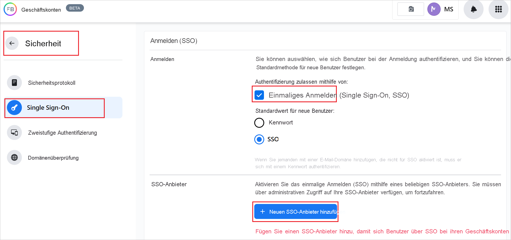
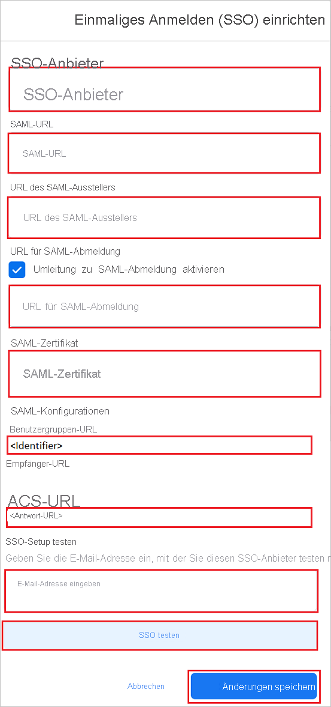

# Tutorial: Azure Active Directory Einmaliges Anmelden (SSO)-Integration mit Facebook-Geschäftskonten

In diesem Tutorial lernen Sie, wie Sie Facebook-Geschäftskonten in Azure Active Directory (Azure AD) integrieren können. Wenn Sie Facebook-Geschäftskonten mit Azure AD integrieren, können Sie:

* In Azure AD steuern, wer Zugriff auf Facebook-Geschäftskonten hat.
* Aktivieren Sie, dass Ihre Benutzer automatisch mit ihren Azure AD-Konten bei Facebook-Geschäftskonten angemeldet werden.
* Verwalten Sie Ihre Konten zentral im Azure-Portal.

## Voraussetzungen

Für die ersten Schritte benötigen Sie Folgendes:

* Ein Azure AD-Abonnement Falls Sie über kein Abonnement verfügen, können Sie ein [kostenloses Azure-Konto](https://azure.microsoft.com/free/) verwenden.
* Ein Abonnement für Facebook-Geschäftskonten mit Einmaligem Anmelden (SSO).

## Beschreibung des Szenarios

In diesem Tutorial konfigurieren und testen Sie das einmalige Anmelden von Azure AD in einer Testumgebung.

* Facebook-Geschäftskonten unterstützt **SP und IDP** veranlasstes SSO.

## Hinzufügen von Facebook-Geschäftskonten aus dem Katalog

Um die Integration von Facebook-Geschäftskonten in Azure AD zu konfigurieren, müssen Sie Facebook-Geschäftskonten aus dem Katalog zu Ihrer Liste der verwalteten SaaS-Anwendungen hinzufügen.

1. Melden Sie sich mit einem Geschäfts-, Schul- oder Unikonto oder mit einem persönlichen Microsoft-Konto beim Azure-Portal an.
1. Wählen Sie im linken Navigationsbereich den Dienst **Azure Active Directory** aus.
1. Navigieren Sie zu **Unternehmensanwendungen**, und wählen Sie dann **Alle Anwendungen** aus.
1. Wählen Sie zum Hinzufügen einer neuen Anwendung **Neue Anwendung** aus.
1. Geben Sie im Abschnitt **Hinzufügen aus dem Katalog** geben Sie  **Facebook-Geschäftskonten** in das Suchfeld ein.
1. Wählen Sie **Facebook-Geschäftskonten** im Ergebnisfeld und fügen Sie dann die Anwendung hinzu. Warten Sie einige Sekunden, während die App Ihrem Mandanten hinzugefügt wird.

## Azure AD SSO für Facebook-Geschäftskonten konfigurieren und testen

Konfigurieren und testen Sie Azure AD SSO mit Facebook-Geschäftskonten unter Verwendung eines Testbenutzers namens **B.Simon**. Damit SSO funktioniert, müssen Sie eine Verknüpfungsbeziehung zwischen einem Azure AD-Benutzer und dem entsprechenden Benutzer in Facebook-Geschäftskonten herstellen.

Um Azure AD SSO mit Facebook-Geschäftskonten zu konfigurieren und auszuprobieren, führen Sie die folgenden Schritte durch:

1. **[Konfigurieren des einmaligen Anmeldens von Azure AD](#configure-azure-ad-sso)** , um Ihren Benutzern die Verwendung dieses Features zu ermöglichen.
    1. **[Erstellen eines Azure AD-Testbenutzers](#create-an-azure-ad-test-user)** , um das einmalige Anmelden von Azure AD mit dem Testbenutzer B. Simon zu testen.
    1. **[Zuweisen des Azure AD-Testbenutzers](#assign-the-azure-ad-test-user)** , um B. Simon die Verwendung des einmaligen Anmeldens von Azure AD zu ermöglichen.
1. **[Konfigurieren von Facebook-Geschäftskonten](#configure-facebook-work-accounts-sso)** , um die Einstellungen für einmaliges Anmelden auf der Anwendungsseite zu konfigurieren.
    1. **[Erstellen von einem Test-Benutzer eines Facebook-Geschäftskontos](#create-facebook-work-accounts-test-user)** , um ein Gegenüber von B. Simon in Facebook-Geschäftskonto zu erhalten, die mit ihrer Azure AD-Darstellung verknüpft ist.
1. **[Testen des einmaligen Anmeldens](#test-sso)** , um zu überprüfen, ob die Konfiguration funktioniert

## Konfigurieren des einmaligen Anmeldens (Single Sign-On, SSO) von Azure AD

Gehen Sie wie folgt vor, um das einmalige Anmelden von Azure AD im Azure-Portal zu aktivieren.

1. Suchen Sie im Azure-Portal auf der Anwendungsintegrationsseite für **Facebook Geschäftskonten** den Abschnitt **Verwalten** und wählen Sie **Einmaliges Anmelden aus.**
1. Wählen Sie auf der Seite **SSO-Methode auswählen** die Methode **SAML** aus.
1. Klicken Sie auf der Seite **Einmaliges Anmelden (SSO) mit SAML einrichten** auf das Stiftsymbol für **Grundlegende SAML-Konfiguration**, um die Einstellungen zu bearbeiten.

   

1. Führen Sie im Abschnitt **Grundlegende SAML-Konfiguration** die folgenden Schritte aus, wenn Sie die Anwendung im **IDP-initiierten** Modus konfigurieren möchten:

    a. Geben Sie im Textfeld **Bezeichner** eine URL im folgenden Format ein: `https://work.facebook.com/company/<ID>`

    b. Geben Sie im Textfeld **Antwort-URL** eine URL im folgenden Format ein: ` https://work.facebook.com/work/saml.php?__cid=<ID>`

1. Klicken Sie auf **Zusätzliche URLs festlegen**, und führen Sie den folgenden Schritt aus, wenn Sie die Anwendung im **SP-initiierten Modus** konfigurieren möchten:

    Geben Sie im Textfeld **Anmelde-URL** die URL ein: `https://work.facebook.com`.

    > [!NOTE]
    > Hierbei handelt es sich um Beispielwerte. Aktualisieren Sie diese Werte mit dem eigentlichen Bezeichner und der Antwort-URL. Wenden Sie sich an das Clientsupportteam von [Facebook Geschäftskonten](mailto:WorkplaceSupportPartnerships@fb.com), um diese Werte zu erhalten. Sie können sich auch die Muster im Abschnitt **Grundlegende SAML-Konfiguration** im Azure-Portal ansehen.

1. Navigieren Sie auf der Seite **Einmaliges Anmelden (SSO) mit SAML einrichten** im Abschnitt **SAML-Signaturzertifikat** zum Eintrag **Zertifikat (Base64)** . Wählen Sie **Herunterladen** aus, um das Zertifikat herunterzuladen, und speichern Sie es auf Ihrem Computer.

    

1. Kopieren Sie im Abschnitt **Einrichten von Abschnitt Facebook-Geschäftskonten** die entsprechenden URL(s) aufgrund von Ihren Anforderungen.

    

### Erstellen eines Azure AD-Testbenutzers

In diesem Abschnitt erstellen Sie im Azure-Portal einen Testbenutzer mit dem Namen B. Simon.

1. Wählen Sie im linken Bereich des Microsoft Azure-Portals **Azure Active Directory** > **Benutzer** > **Alle Benutzer** aus.
1. Wählen Sie oben im Bildschirm die Option **Neuer Benutzer** aus.
1. Führen Sie unter den Eigenschaften für **Benutzer** die folgenden Schritte aus:
   1. Geben Sie im Feld **Name** die Zeichenfolge `B.Simon` ein.  
   1. Geben Sie im Feld **Benutzername** die Zeichenfolge username@companydomain.extension ein. Beispiel: `B.Simon@contoso.com`.
   1. Aktivieren Sie das Kontrollkästchen **Kennwort anzeigen**, und notieren Sie sich den Wert aus dem Feld **Kennwort**.
   1. Klicken Sie auf **Erstellen**.

### Zuweisen des Azure AD-Testbenutzers

In diesem Abschnitt ermöglichen Sie B.Simon die Nutzung von Azure Einmaliges Anmelden, indem Sie den Zugriff auf Facebook-Geschäftskonten gewähren.

1. Wählen Sie im Azure-Portal **Unternehmensanwendungen** > **Alle Anwendungen** aus.
1. Wählen Sie in der Anwendungsliste **Facebook-Geschäftskonten** aus.
1. Navigieren Sie auf der Übersichtsseite der App zum Abschnitt **Verwalten**, und wählen Sie **Benutzer und Gruppen** aus.
1. Wählen Sie **Benutzer hinzufügen** und anschließend im Dialogfeld **Zuweisung hinzufügen** die Option **Benutzer und Gruppen** aus.
1. Wählen Sie im Dialogfeld **Benutzer und Gruppen** in der Liste „Benutzer“ den Eintrag **B. Simon** aus, und klicken Sie dann unten auf dem Bildschirm auf die Schaltfläche **Auswählen**.
1. Wenn den Benutzern eine Rolle zugewiesen werden soll, können Sie sie im Dropdownmenü **Rolle auswählen** auswählen. Wurde für diese App keine Rolle eingerichtet, ist die Rolle „Standardzugriff“ ausgewählt.
1. Klicken Sie im Dialogfeld **Zuweisung hinzufügen** auf die Schaltfläche **Zuweisen**.

## Konfigurieren von SSO für Facebook-Geschäftskonten

1. Melden Sie sich bei Ihren Facebook-Geschäftskonten Ihrer Unternehmensseite als Administrator an.

1. Gehen Sie zu **Sicherheit** > **Einmaliges Anmelden**.

1. Aktivieren Sie das Kontrollkästchen **Einmaliges Anmelden (SSO)** und klicken Sie auf **+Hinzufügen von neuem SSO-Anbieter**.

    

1. Führen Sie auf der Seite **Einmaliges Anmelden (SSO) einrichten** die folgenden Schritte aus:

    

    1. Geben Sie einen gültigen **Namen des SSO-Anbieters** ein.

    1. Fügen Sie in das Textfeld **SAML URL** den Wert der **Anmelde-URL** ein, den Sie aus dem Azure-Portal kopiert haben.

    1. Fügen Sie in das Textfeld **SAML Zertifikataussteller URL** den Wert **Azure AD Bezeichner** ein, den Sie aus dem Azure-Portal kopiert haben.

    1. **Aktivieren Sie das Kontrollkästchen SAML Abmeldeumleitung** und fügen Sie in das Textfeld **SAML Abmelde-URL** den Wert **Abmelde-URL** ein, den Sie aus dem Azure-Portal kopiert haben.

    1. Öffnen Sie das aus dem Azure-Portal heruntergeladene **Zertifikat (Base64)** in Notepad und fügen Sie den Inhalt in das Textfeld **SAML-Zertifikat** ein.

    1. Kopieren Sie den Wert **Zielgruppen-URL** und fügen Sie diesen Wert in das Textfeld **Bezeichner** im Abschnitt **Grundlegende SAML Konfiguration** im Azure-Portal ein.

    1. Kopieren Sie den Wert **Überwachungssammeldienste (ACS) URL** und fügen Sie diesen Wert in das Textfeld **Reply URL** im Abschnitt **Grundlegende SAML Konfiguration** im Azure-Portal ein.

    1. Geben Sie im Abschnitt **Test SSO Einrichtung** eine gültige E-Mail in das Textfeld ein und klicken Sie auf **Test SSO**.

    1. Klicken Sie auf **Änderungen speichern**.

### Erstellen von einem Facebook-Geschäftskonto-Testbenutzers

In diesem Abschnitt erstellen Sie einen Benutzer namens Britta Simon in Facebook-Geschäftskonten. Arbeiten Sie mit dem [Facebook-Geschäftskonten-Supportteam](mailto:WorkplaceSupportPartnerships@fb.com) zusammen, um die Benutzer in der Facebook-Geschäftskonten-Plattform hinzuzufügen. Benutzer müssen erstellt und aktiviert werden, damit Sie einmaliges Anmelden verwenden können.

## Testen des einmaligen Anmeldens 

In diesem Abschnitt testen Sie die Azure AD-Konfiguration für einmaliges Anmelden mit den folgenden Optionen: 

#### SP-initiiert:

* Klicken Sie im Azure-Portal auf **Diese Anwendung testen**. Dadurch werden Sie zur Facebook Geschäftskonten Anmeldungs-URL umgeleitet, wo Sie den Anmeldeflow veranlassen können.  

* Gehen Sie direkt zur Facebook Work Geschäftskonten Anmeldungs-URL und veranlassen Sie den Anmeldevorgang von dort aus.

#### IDP-initiiert:

* Klicken Sie im Azure-Portal auf **Diese App testen** und Sie sollten automatisch bei den Facebook-Geschäftskonten angemeldet werden, für die Sie das SSO eingerichtet haben. 

Sie können auch den Microsoft-Bereich „Meine Apps“ verwenden, um die Anwendung in einem beliebigen Modus zu testen. Wenn Sie auf die Kachel Facebook-Geschäftskonten in Meine Apps klicken, werden Sie, wenn Sie im SP-Modus konfiguriert sind, zur Anmeldeseite der Anwendung weitergeleitet, um den Anmeldevorgang zu veranlassen, und wenn Sie im IDP-Modus konfiguriert sind, sollten Sie automatisch bei den Facebook-Geschäftskonten angemeldet werden, für die Sie das SSO eingerichtet haben. Weitere Informationen zu „Meine Apps“ finden Sie in [dieser Einführung](../user-help/my-apps-portal-end-user-access.md).

## Nächste Schritte

Nachdem Sie die Facebook-Geschäftskonten konfiguriert haben, können Sie die Sitzungskontrolle erzwingen, die vor Exfiltrieren und Infiltrieren der vertraulichen Daten Ihrer Organisation in Echtzeit schützt. Die Sitzungssteuerung basiert auf bedingtem Zugriff. [Erfahren Sie, wie Sie die Sitzungssteuerung mit Microsoft Defender for Cloud Apps erzwingen.](/cloud-app-security/proxy-deployment-aad)
