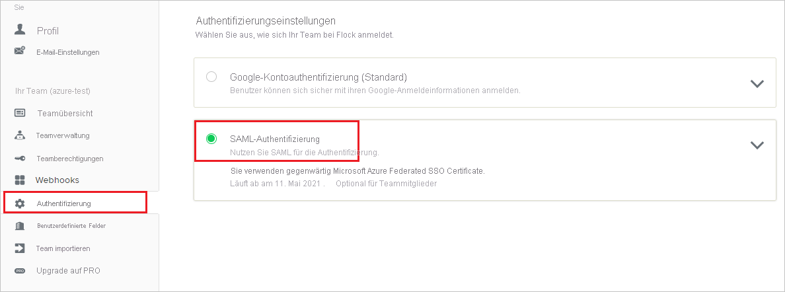
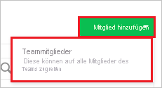

# Tutorial: Azure Active Directory-Integration in Flock

In diesem Tutorial erfahren Sie, wie Sie Flock in Azure Active Directory (Azure AD) integrieren. Die Integration von Flock in Azure AD ermöglicht Folgendes:

* Steuern in Azure AD, wer Zugriff auf Flock besitzt.
* Benutzer können sich mit ihren Azure AD-Konten automatisch bei Flock anmelden.
* Verwalten Sie Ihre Konten zentral im Azure-Portal.

## Voraussetzungen

Für die ersten Schritte benötigen Sie Folgendes:

* Ein Azure AD-Abonnement Falls Sie über kein Abonnement verfügen, können Sie ein [kostenloses Azure-Konto](https://azure.microsoft.com/free/) verwenden.
* Flock-Abonnement, für das einmaliges Anmelden (Single Sign-On, SSO) aktiviert ist.

## Beschreibung des Szenarios

In diesem Tutorial konfigurieren und testen Sie das einmalige Anmelden von Azure AD in einer Testumgebung.

* Flock unterstützt **SP**-initiiertes einmaliges Anmelden.
* Flock unterstützt [Automatisierte Benutzerbereitstellung](flock-provisioning-tutorial.md).

## Hinzufügen von Flock aus dem Katalog

Zum Konfigurieren der Integration von Flock in Azure AD müssen Sie Flock aus dem Katalog der Liste mit den verwalteten SaaS-Apps hinzufügen.

1. Melden Sie sich mit einem Geschäfts-, Schul- oder Unikonto oder mit einem persönlichen Microsoft-Konto beim Azure-Portal an.
1. Wählen Sie im linken Navigationsbereich den Dienst **Azure Active Directory** aus.
1. Navigieren Sie zu **Unternehmensanwendungen**, und wählen Sie dann **Alle Anwendungen** aus.
1. Wählen Sie zum Hinzufügen einer neuen Anwendung **Neue Anwendung** aus.
1. Geben Sie im Abschnitt **Aus Katalog hinzufügen** den Suchbegriff **Flock** in das Suchfeld ein.
1. Wählen Sie im Ergebnisbereich **Flock** aus, und fügen Sie die App dann hinzu. Warten Sie einige Sekunden, während die App Ihrem Mandanten hinzugefügt wird.

## Konfigurieren und Testen von Azure AD-SSO für Flock

Konfigurieren und testen Sie Azure AD-SSO mit Flock mithilfe eines Testbenutzers mit dem Namen **B. Simon**. Damit einmaliges Anmelden funktioniert, muss eine Linkbeziehung zwischen einem Azure AD-Benutzer und dem entsprechenden Benutzer in Flock eingerichtet werden.

Führen Sie die folgenden Schritte aus, um Azure AD-SSO mit Flock zu konfigurieren und zu testen:

1. **[Konfigurieren des einmaligen Anmeldens von Azure AD](#configure-azure-ad-sso)** , um Ihren Benutzern die Verwendung dieses Features zu ermöglichen.
    1. **[Erstellen eines Azure AD-Testbenutzers](#create-an-azure-ad-test-user)** , um das einmalige Anmelden mit Azure AD mit dem Testbenutzer Britta Simon zu testen.
    1. **[Zuweisen des Azure AD-Testbenutzers](#assign-the-azure-ad-test-user)** , um Britta Simon für das einmalige Anmelden von Azure AD zu aktivieren.
2. **[Konfigurieren von SSO für Flock](#configure-flock-sso)** , um die Einstellungen für einmaliges Anmelden auf der Anwendungsseite zu konfigurieren.
    1. **[Erstellen eines Flock-Testbenutzers](#create-flock-test-user)** , um in Flock ein Pendant von Britta Simon zu erhalten, das mit ihrer Darstellung in Azure AD verknüpft ist.
1. **[Testen des einmaligen Anmeldens](#test-sso)** , um zu überprüfen, ob die Konfiguration funktioniert

## Konfigurieren des einmaligen Anmeldens (Single Sign-On, SSO) von Azure AD

Gehen Sie wie folgt vor, um das einmalige Anmelden von Azure AD im Azure-Portal zu aktivieren.

1. Navigieren Sie im Azure-Portal auf der Anwendungsintegrationsseite für **Flock** zum Abschnitt **Verwalten**, und wählen Sie **Einmaliges Anmelden** aus.
1. Wählen Sie auf der Seite **SSO-Methode auswählen** die Methode **SAML** aus.
1. Klicken Sie auf der Seite **Einmaliges Anmelden (SSO) mit SAML einrichten** auf das Stiftsymbol für **Grundlegende SAML-Konfiguration**, um die Einstellungen zu bearbeiten.

   

4. Führen Sie im Abschnitt **Grundlegende SAML-Konfiguration** die folgenden Schritte aus:

    a. Geben Sie im Textfeld **Anmelde-URL** eine URL im folgenden Format ein: `https://<subdomain>.flock.com/`.

    b. Geben Sie im Textfeld **Bezeichner (Entitäts-ID)** eine URL im folgenden Format ein: `https://<subdomain>.flock.com/`.

    > [!NOTE]
    > Hierbei handelt es sich um Beispielwerte. Ersetzen Sie diese Werte durch die tatsächliche Anmelde-URL und den tatsächlichen Bezeichner. Wenden Sie sich an das [Supportteam von Flock](mailto:support@flock.com), um diese Werte zu erhalten. Sie können sich auch die Muster im Abschnitt **Grundlegende SAML-Konfiguration** im Azure-Portal ansehen.

4. Klicken Sie auf der Seite **Einmaliges Anmelden (SSO) mit SAML einrichten** im Abschnitt **SAML-Signaturzertifikat** auf **Herunterladen**, um das Ihrer Anforderung entsprechende **Zertifikat (Base64)** aus den angegebenen Optionen herunterzuladen und auf Ihrem Computer zu speichern.

    

6. Kopieren Sie im Abschnitt **Flock einrichten** die entsprechenden URLs gemäß Ihren Anforderungen.

    

### Erstellen eines Azure AD-Testbenutzers

In diesem Abschnitt erstellen Sie im Azure-Portal einen Testbenutzer mit dem Namen B. Simon.

1. Wählen Sie im linken Bereich des Microsoft Azure-Portals **Azure Active Directory** > **Benutzer** > **Alle Benutzer** aus.
1. Wählen Sie oben im Bildschirm die Option **Neuer Benutzer** aus.
1. Führen Sie unter den Eigenschaften für **Benutzer** die folgenden Schritte aus:
   1. Geben Sie im Feld **Name** die Zeichenfolge `B.Simon` ein.  
   1. Geben Sie im Feld **Benutzername** die Zeichenfolge username@companydomain.extension ein. Beispiel: `B.Simon@contoso.com`.
   1. Aktivieren Sie das Kontrollkästchen **Kennwort anzeigen**, und notieren Sie sich den Wert aus dem Feld **Kennwort**.
   1. Klicken Sie auf **Erstellen**.

### Zuweisen des Azure AD-Testbenutzers

In diesem Abschnitt ermöglichen Sie B. Simon die Verwendung des einmaligen Anmeldens von Azure, indem Sie Zugriff auf Flock gewähren.

1. Wählen Sie im Azure-Portal **Unternehmensanwendungen** > **Alle Anwendungen** aus.
1. Wählen Sie in der Anwendungsliste **Flock** aus.
1. Navigieren Sie auf der Übersichtsseite der App zum Abschnitt **Verwalten**, und wählen Sie **Benutzer und Gruppen** aus.
1. Wählen Sie **Benutzer hinzufügen** und anschließend im Dialogfeld **Zuweisung hinzufügen** die Option **Benutzer und Gruppen** aus.
1. Wählen Sie im Dialogfeld **Benutzer und Gruppen** in der Liste „Benutzer“ den Eintrag **B. Simon** aus, und klicken Sie dann unten auf dem Bildschirm auf die Schaltfläche **Auswählen**.
1. Wenn den Benutzern eine Rolle zugewiesen werden soll, können Sie sie im Dropdownmenü **Rolle auswählen** auswählen. Wurde für diese App keine Rolle eingerichtet, ist die Rolle „Standardzugriff“ ausgewählt.
1. Klicken Sie im Dialogfeld **Zuweisung hinzufügen** auf die Schaltfläche **Zuweisen**.

## Konfigurieren von SSO für Flock

1. Melden Sie sich in einem anderen Webbrowserfenster auf der Flock-Unternehmenswebsite als Administrator an.

2. Wählen Sie im linken Navigationsbereich die Registerkarte **Authentication** (Authentifizierung) und dann **SAML Authentication** (SAML-Authentifizierung) aus.

    

3. Führen Sie im Abschnitt für die **SAML-Authentifizierung** die folgenden Schritte aus:

    

    a. Fügen Sie im Textfeld **SAML 2.0 Endpoint(HTTP)** (SAML 2.0-Endpunkt [HTTP]) den Wert der **Anmelde-URL** ein, den Sie aus dem Azure-Portal kopiert haben.

    b. Fügen Sie im Textfeld **Identity Provider Issuer** (Aussteller des Identitätsanbieters) den Wert von **Azure AD-Bezeichner** ein, den Sie aus dem Azure-Portal kopiert haben.

    c. Öffnen Sie im Editor das **Zertifikat (Base64)** , das Sie im Azure-Portal heruntergeladen haben, und fügen Sie den Inhalt in das Textfeld **Public Certificate** (Öffentliches Zertifikat) ein.

    d. Klicken Sie auf **Speichern**.

### Erstellen eines Flock-Testbenutzers

Damit sich Azure AD-Benutzer bei Flock anmelden können, müssen sie in Flock bereitgestellt werden. Im Fall von Flock muss die Bereitstellung manuell ausgeführt werden.

**Führen Sie zum Bereitstellen eines Benutzerkontos die folgenden Schritte aus:**

1. Melden Sie sich auf der Flock-Unternehmenswebsite als Administrator an.

2. Klicken Sie im linken Navigationsbereich auf **Manage Team** (Team verwalten).

    

3. Klicken Sie auf die Registerkarte **Add Member** (Mitglied hinzufügen), und wählen Sie **Team Members** (Teammitglieder) aus.

    

4. Geben Sie die E-Mail-Adresse des Benutzers ein, z. B. **Brittasimon\@contoso.com**, und wählen Sie dann **Add Users** (Benutzer hinzufügen) aus.

    

> [!NOTE]
>Außerdem unterstützt Flock automatische Benutzerbereitstellung. Weitere Informationen zum Konfigurieren der automatischen Benutzerbereitstellung finden Sie [hier](./flock-provisioning-tutorial.md).

## Testen des einmaligen Anmeldens 

In diesem Abschnitt testen Sie die Azure AD-Konfiguration für einmaliges Anmelden mit den folgenden Optionen: 

* Klicken Sie im Azure-Portal auf **Diese Anwendung testen**. Dadurch werden Sie zur Anmelde-URL für Flock weitergeleitet. Dort können Sie den Anmeldeflow initiieren. 

* Navigieren Sie direkt zur Anmelde-URL von Flock, und initiieren Sie dort den Anmeldeflow.

* Sie können „Meine Apps“ von Microsoft verwenden. Wenn Sie in „Meine Apps“auf die Kachel „Flock“ klicken, werden Sie zur Anmelde-URL für Flock weitergeleitet. Weitere Informationen zu „Meine Apps“ finden Sie in [dieser Einführung](../user-help/my-apps-portal-end-user-access.md).

## Nächste Schritte

Nach dem Konfigurieren von Flock können Sie Sitzungssteuerung erzwingen, die in Echtzeit vor der Exfiltration und Infiltration vertraulicher Unternehmensdaten schützt. Die Sitzungssteuerung basiert auf bedingtem Zugriff. [Erfahren Sie, wie Sie die Sitzungssteuerung mit Microsoft Defender for Cloud Apps erzwingen.](/cloud-app-security/proxy-deployment-any-app)
