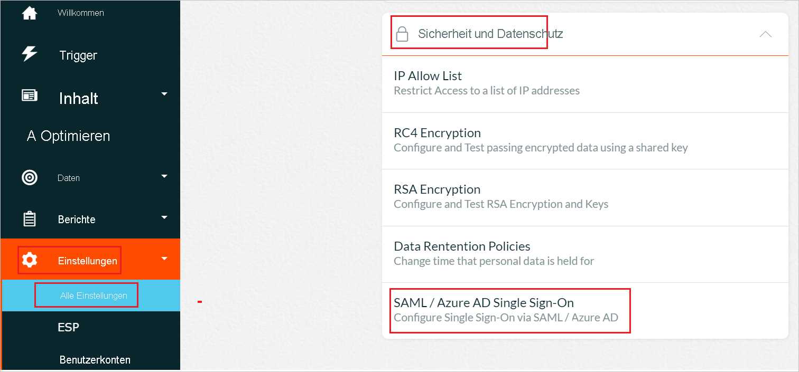
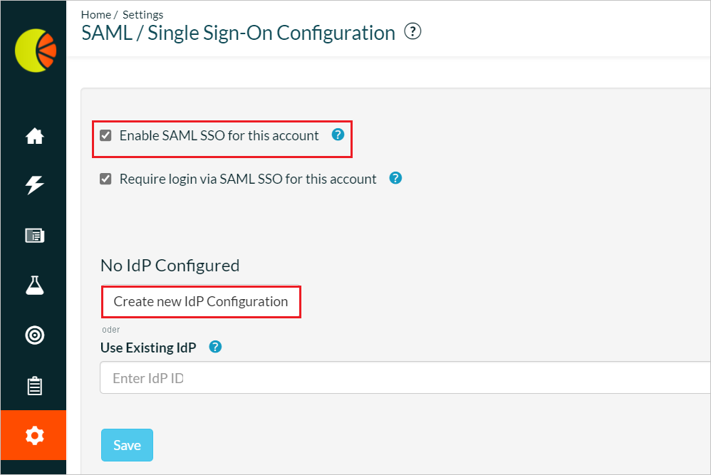
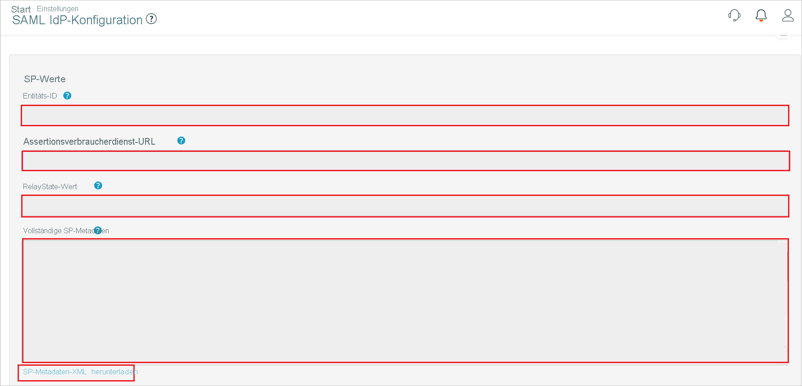
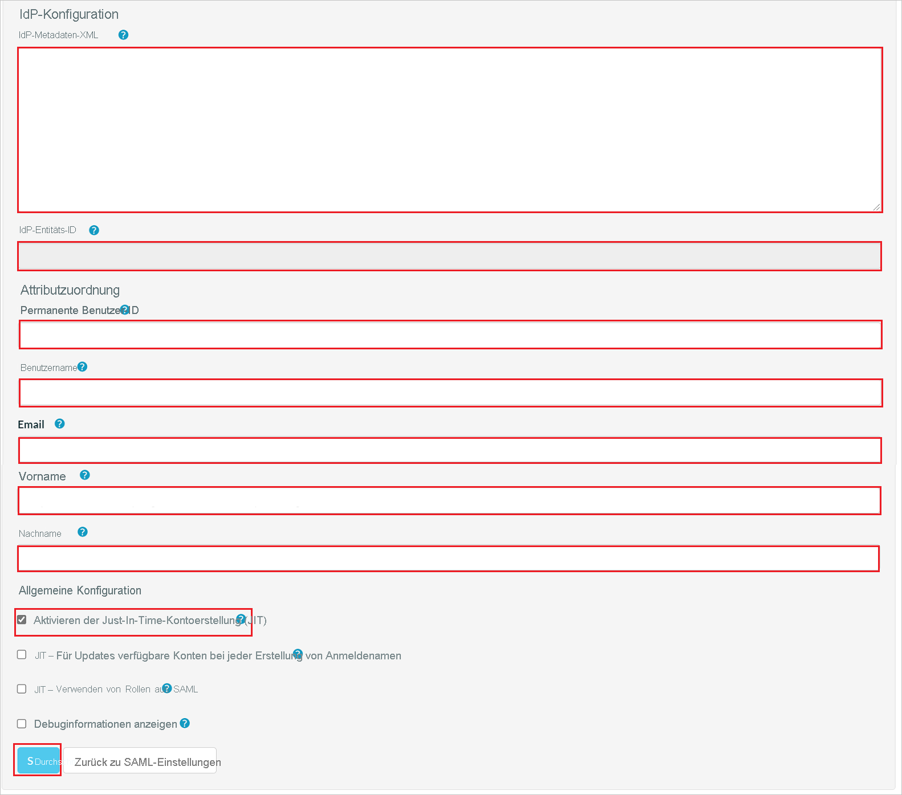

# Tutorial: Integrieren von Fresh Relevance in das einmalige Anmelden (Single Sign-On, SSO) von Azure Active Directory

In diesem Tutorial erfahren Sie, wie Sie Fresh Relevance in Azure Active Directory (Azure AD) integrieren. Die Integration von Fresh Relevance in Azure AD ermöglicht Folgendes:

* Sie können in Azure AD steuern, wer Zugriff auf Fresh Relevance hat.
* Sie können Ihren Benutzern ermöglichen, sich mit ihren Azure AD-Konten automatisch bei Fresh Relevance anzumelden.
* Verwalten Sie Ihre Konten zentral im Azure-Portal.

## Voraussetzungen

Für die ersten Schritte benötigen Sie Folgendes:

* Ein Azure AD-Abonnement Falls Sie über kein Abonnement verfügen, können Sie ein [kostenloses Azure-Konto](https://azure.microsoft.com/free/) verwenden.
* Ein Fresh Relevance-Abonnement, für das einmaliges Anmelden (Single Sign-On, SSO) aktiviert ist.

## Beschreibung des Szenarios

In diesem Tutorial konfigurieren und testen Sie das einmalige Anmelden von Azure AD in einer Testumgebung.

* Fresh Relevance unterstützt **IDP**-initiiertes einmaliges Anmelden.

* Fresh Relevance unterstützt die **Just-In-Time**-Benutzerbereitstellung.

## Hinzufügen von Fresh Relevance aus dem Katalog

Zum Konfigurieren der Integration von Fresh Relevance in Azure AD müssen Sie Ihrer Liste der verwalteten SaaS-Apps Fresh Relevance aus dem Katalog hinzufügen.

1. Melden Sie sich mit einem Geschäfts-, Schul- oder Unikonto oder mit einem persönlichen Microsoft-Konto beim Azure-Portal an.
1. Wählen Sie im linken Navigationsbereich den Dienst **Azure Active Directory** aus.
1. Navigieren Sie zu **Unternehmensanwendungen**, und wählen Sie dann **Alle Anwendungen** aus.
1. Wählen Sie zum Hinzufügen einer neuen Anwendung **Neue Anwendung** aus.
1. Geben Sie im Abschnitt **Aus Katalog hinzufügen** im Suchfeld den Suchbegriff **Fresh Relevance** ein.
1. Wählen Sie im Ergebnisbereich den Eintrag **Fresh Relevance** aus, und fügen Sie dann die App hinzu. Warten Sie einige Sekunden, während die App Ihrem Mandanten hinzugefügt wird.

## Konfigurieren und Testen des einmaligen Anmeldens von Azure AD für Fresh Relevance

Konfigurieren und testen Sie das einmalige Anmelden von Azure AD für Fresh Relevance mithilfe eines Testbenutzers mit dem Namen **B. Simon**. Damit einmaliges Anmelden funktioniert, muss eine Linkbeziehung zwischen einem Azure AD-Benutzer und dem entsprechenden Benutzer in Fresh Relevance eingerichtet werden.

Führen Sie die folgenden Schritte aus, um das einmalige Anmelden von Azure AD für Fresh Relevance zu konfigurieren und zu testen:

1. **[Konfigurieren des einmaligen Anmeldens von Azure AD](#configure-azure-ad-sso)** , um Ihren Benutzern die Verwendung dieses Features zu ermöglichen.
    1. **[Erstellen eines Azure AD-Testbenutzers](#create-an-azure-ad-test-user)** , um das einmalige Anmelden von Azure AD mit dem Testbenutzer B. Simon zu testen.
    1. **[Zuweisen des Azure AD-Testbenutzers](#assign-the-azure-ad-test-user)** , um B. Simon die Verwendung des einmaligen Anmeldens von Azure AD zu ermöglichen.
1. **[Konfigurieren des einmaligen Anmeldens für Fresh Relevance](#configure-fresh-relevance-sso)** , um die Einstellungen für einmaliges Anmelden auf der Anwendungsseite zu konfigurieren.
    1. **[Erstellen eines Fresh Relevance-Testbenutzers](#create-fresh-relevance-test-user)** , um in Fresh Relevance eine Entsprechung von B. Simon zu erhalten, die mit der Benutzerdarstellung in Azure AD verknüpft ist.
1. **[Testen des einmaligen Anmeldens](#test-sso)** , um zu überprüfen, ob die Konfiguration funktioniert

## Konfigurieren des einmaligen Anmeldens (Single Sign-On, SSO) von Azure AD

Gehen Sie wie folgt vor, um das einmalige Anmelden von Azure AD im Azure-Portal zu aktivieren.

1. Navigieren Sie im Azure-Portal auf der Anwendungsintegrationsseite für **Fresh Relevance** zum Abschnitt **Verwalten**, und wählen Sie **Einmaliges Anmelden** aus.
1. Wählen Sie auf der Seite **SSO-Methode auswählen** die Methode **SAML** aus.
1. Klicken Sie auf der Seite **Einmaliges Anmelden (SSO) mit SAML einrichten** auf das Stiftsymbol für **Grundlegende SAML-Konfiguration**, um die Einstellungen zu bearbeiten.

   

1. Führen Sie im Abschnitt **Grundlegende SAML-Konfiguration** die folgenden Schritte aus, wenn Sie über eine **Dienstanbieter-Metadatendatei** verfügen:

    a. Klicken Sie auf **Metadatendatei hochladen**.

    

    b. Klicken Sie auf das **Ordnerlogo**, wählen Sie die Metadatendatei aus, und klicken Sie auf **Hochladen**.

    

    c. Nach dem erfolgreichen Upload der Metadatendatei werden die Werte unter **Bezeichner** und **Antwort-URL** im Abschnitt „Grundlegende SAML-Konfiguration“ automatisch eingefügt.

    > [!Note]
    > Falls die Werte **Bezeichner** und **Antwort-URL** nicht automatisch aufgefüllt werden, geben Sie die erforderlichen Werte manuell ein.

    d. Geben Sie im Textfeld **Relayzustand** einen Wert nach dem folgenden Muster ein: `<ID>`

1. Klicken Sie auf der Seite **Einmaliges Anmelden (SSO) mit SAML einrichten** im Abschnitt **SAML-Signaturzertifikat** auf die Schaltfläche „Kopieren“, um die **App-Verbundmetadaten-URL** zu kopieren, und speichern Sie sie auf Ihrem Computer.

    

### Erstellen eines Azure AD-Testbenutzers

In diesem Abschnitt erstellen Sie im Azure-Portal einen Testbenutzer mit dem Namen B. Simon.

1. Wählen Sie im linken Bereich des Microsoft Azure-Portals **Azure Active Directory** > **Benutzer** > **Alle Benutzer** aus.
1. Wählen Sie oben im Bildschirm die Option **Neuer Benutzer** aus.
1. Führen Sie unter den Eigenschaften für **Benutzer** die folgenden Schritte aus:
   1. Geben Sie im Feld **Name** die Zeichenfolge `B.Simon` ein.  
   1. Geben Sie im Feld **Benutzername** die Zeichenfolge username@companydomain.extension ein. Beispiel: `B.Simon@contoso.com`.
   1. Aktivieren Sie das Kontrollkästchen **Kennwort anzeigen**, und notieren Sie sich den Wert aus dem Feld **Kennwort**.
   1. Klicken Sie auf **Erstellen**.

### Zuweisen des Azure AD-Testbenutzers

In diesem Abschnitt ermöglichen Sie B. Simon die Verwendung des einmaligen Anmeldens von Azure, indem Sie ihr Zugriff auf Fresh Relevance gewähren.

1. Wählen Sie im Azure-Portal **Unternehmensanwendungen** > **Alle Anwendungen** aus.
1. Wählen Sie in der Anwendungsliste den Eintrag **Fresh Relevance** aus.
1. Navigieren Sie auf der Übersichtsseite der App zum Abschnitt **Verwalten**, und wählen Sie **Benutzer und Gruppen** aus.
1. Wählen Sie **Benutzer hinzufügen** und anschließend im Dialogfeld **Zuweisung hinzufügen** die Option **Benutzer und Gruppen** aus.
1. Wählen Sie im Dialogfeld **Benutzer und Gruppen** in der Liste „Benutzer“ den Eintrag **B. Simon** aus, und klicken Sie dann unten auf dem Bildschirm auf die Schaltfläche **Auswählen**.
1. Wenn den Benutzern eine Rolle zugewiesen werden soll, können Sie sie im Dropdownmenü **Rolle auswählen** auswählen. Wurde für diese App keine Rolle eingerichtet, ist die Rolle „Standardzugriff“ ausgewählt.
1. Klicken Sie im Dialogfeld **Zuweisung hinzufügen** auf die Schaltfläche **Zuweisen**.

## Konfigurieren des einmaligen Anmeldens für Fresh Relevance

1. Melden Sie sich bei der Fresh Relevance-Unternehmenswebsite als Administrator an.

1. Wechseln Sie zu **Einstellungen** > **Alle Einstellungen** > **Sicherheit und Datenschutz**, und klicken Sie auf **Einmaliges Anmelden über SAML/Azure AD**.

    

1. Aktivieren Sie auf der Seite **Konfiguration für SAML/einmaliges Anmelden** das Kontrollkästchen **SAML-SSO für dieses Konto aktivieren**, und klicken Sie dann auf die Schaltfläche **Neue IdP-Konfiguration erstellen**. 

    

1. Führen Sie auf der Seite **Konfiguration für SAML-IdP** die folgenden Schritte aus:

    

    

    a. Kopieren Sie den Wert von **Entitäts-ID**, und fügen Sie diesen Wert im Azure-Portal im Abschnitt **Grundlegende SAML-Konfiguration** in das Textfeld **Bezeichner (Entitäts-ID)** ein.

    b. Kopieren Sie die **Assertionsverbraucherdienst-URL**, und fügen Sie diese URL im Azure-Portal im Abschnitt **Grundlegende SAML-Konfiguration** in das Textfeld **Antwort-URL** ein.

    c. Kopieren Sie den **Relayzustandswert**, und fügen Sie diesen Wert im Azure-Portal im Abschnitt **Grundlegende SAML-Konfiguration** in das Textfeld **Relayzustand** ein.

    d. Klicken Sie auf **SP-Metadaten-XML herunterladen**, und laden Sie die Metadatendatei im Azure-Portal im Abschnitt **Grundlegende SAML-Konfiguration** hoch.

    e. Kopieren Sie die **App-Verbundmetadaten-URL** aus dem Azure-Portal in Editor, und fügen Sie den Inhalt in das Textfeld **IdP-Metadaten-XML** ein. Klicken Sie dann auf die Schaltfläche **Speichern**.

    f. Bei erfolgreicher Ausführung werden Informationen wie die **Entitäts-ID** Ihres Identitätsanbieters im Textfeld **IdP-Entitäts-ID** angezeigt.

    g. Füllen Sie im Abschnitt **Attributzuordnung** die erforderlichen Felder manuell aus, deren Werte Sie aus dem Azure-Portal kopiert haben.

    h. Aktivieren Sie im Abschnitt **Allgemeine Konfiguration** das Kontrollkästchen **Just-In-Time-Kontoerstellung (JIT) zulassen**, und klicken Sie dann auf **Speichern**.

    > [!NOTE]
    > Wenn diese Parameter nicht ordnungsgemäß zugeordnet sind, kann die Anmeldung/Kontoerstellung nicht erfolgreich ausgeführt werden, und es wird ein Fehler angezeigt. Aktivieren Sie das Kontrollkästchen **Debuginformationen anzeigen**, damit erweiterte Attributdebugginginformationen bei Anmeldefehlern vorübergehend angezeigt werden.

### Erstellen eines Fresh Relevance-Testbenutzers

In diesem Abschnitt wird in Fresh Relevance ein Benutzer mit dem Namen Britta Simon erstellt. Fresh Relevance unterstützt die Just-in-Time-Benutzerbereitstellung, die standardmäßig aktiviert ist. Für Sie steht in diesem Abschnitt kein Aktionselement zur Verfügung. Wenn in Fresh Relevance noch kein Benutzer vorhanden ist, wird nach der Authentifizierung ein neuer Benutzer erstellt.

## Testen des einmaligen Anmeldens 

In diesem Abschnitt testen Sie die Azure AD-Konfiguration für einmaliges Anmelden mit den folgenden Optionen:

* Klicken Sie im Azure-Portal auf „Diese Anwendung testen“. Dadurch sollten Sie automatisch bei der Fresh Relevance-Instanz angemeldet werden, für die Sie einmaliges Anmelden eingerichtet haben.

* Sie können „Meine Apps“ von Microsoft verwenden. Wenn Sie in „Meine Apps“ auf die Kachel „Fresh Relevance“ klicken, sollten Sie automatisch bei der Fresh Relevance-Instanz angemeldet werden, für die Sie einmaliges Anmelden eingerichtet haben. Weitere Informationen zu „Meine Apps“ finden Sie in [dieser Einführung](https://support.microsoft.com/account-billing/sign-in-and-start-apps-from-the-my-apps-portal-2f3b1bae-0e5a-4a86-a33e-876fbd2a4510).

## Nächste Schritte

Nach dem Konfigurieren von Fresh Relevance können Sie die Sitzungssteuerung erzwingen, die in Echtzeit vor der Exfiltration und Infiltration vertraulicher Unternehmensdaten schützt. Die Sitzungssteuerung basiert auf bedingtem Zugriff. [Erfahren Sie, wie Sie die Sitzungssteuerung mit Microsoft Defender for Cloud Apps erzwingen.](/cloud-app-security/proxy-deployment-aad)
