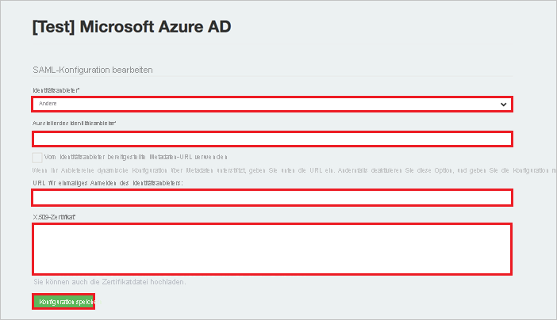

# Tutorial: Integration des einmaligen Anmeldens (Single Sign-On, SSO) von Azure AD in GaggleAMP

In diesem Tutorial erfahren Sie, wie Sie GaggleAMP in Azure Active Directory (Azure AD) integrieren. Die Integration von GaggleAMP in Azure AD ermöglicht Folgendes:

* Steuern Sie in Azure AD, wer auf GaggleAMP zugreifen kann.
* Ermöglichen Sie Ihren Benutzern die automatische Anmeldung bei GaggleAMP über ihre Azure AD-Konten.
* Verwalten Sie Ihre Konten zentral im Azure-Portal.

## Voraussetzungen

Für die ersten Schritte benötigen Sie Folgendes:

* Ein Azure AD-Abonnement Falls Sie über kein Abonnement verfügen, können Sie ein [kostenloses Azure-Konto](https://azure.microsoft.com/free/) verwenden.
* Ein GaggleAMP-Abonnement, für das einmaliges Anmelden (SSO) aktiviert ist

## Beschreibung des Szenarios

In diesem Tutorial konfigurieren und testen Sie das einmalige Anmelden von Azure AD in einer Testumgebung.

* GaggleAMP unterstützt **SP**- und **IDP**-initiiertes einmaliges Anmelden.

* GaggleAMP unterstützt die **Just-in-Time**-Benutzerbereitstellung.

> [!NOTE]
> Der Bezeichner dieser Anwendung ist ein fester Zeichenfolgenwert, daher kann in einem Mandanten nur eine Instanz konfiguriert werden.

## Hinzufügen von GaggleAMP aus dem Katalog

Zum Konfigurieren der Integration von GaggleAMP in Azure AD müssen Sie GaggleAMP aus dem Katalog der Liste der verwalteten SaaS-Apps hinzufügen.

1. Melden Sie sich mit einem Geschäfts-, Schul- oder Unikonto oder mit einem persönlichen Microsoft-Konto beim Azure-Portal an.
1. Wählen Sie im linken Navigationsbereich den Dienst **Azure Active Directory** aus.
1. Navigieren Sie zu **Unternehmensanwendungen**, und wählen Sie dann **Alle Anwendungen** aus.
1. Wählen Sie zum Hinzufügen einer neuen Anwendung **Neue Anwendung** aus.
1. Geben Sie im Abschnitt **Aus Katalog hinzufügen** den Suchbegriff **GaggleAMP** in das Suchfeld ein.
1. Wählen Sie im Ergebnisbereich **GaggleAMP** aus, und fügen Sie dann die App hinzu. Warten Sie einige Sekunden, während die App Ihrem Mandanten hinzugefügt wird.

## Konfigurieren und Testen des einmaligen Anmeldens von Azure AD für GaggleAMP

Konfigurieren und testen Sie Azure AD-SSO mit GaggleAMP unter Verwendung eines Testbenutzers namens **B.Simon**. Damit einmaliges Anmelden funktioniert, muss eine Linkbeziehung zwischen einem Azure AD-Benutzer und dem entsprechenden Benutzer in GaggleAMP eingerichtet werden.

Um einmaliges Anmelden von Azure AD in GaggleAMP zu konfigurieren und zu testen, führen Sie die folgenden Schritte aus:

1. **[Konfigurieren des einmaligen Anmeldens von Azure AD](#configure-azure-ad-sso)** , um Ihren Benutzern die Verwendung dieses Features zu ermöglichen.
    1. **[Erstellen eines Azure AD-Testbenutzers](#create-an-azure-ad-test-user)** , um das einmalige Anmelden von Azure AD mit dem Testbenutzer B. Simon zu testen.
    1. **[Zuweisen des Azure AD-Testbenutzers](#assign-the-azure-ad-test-user)** , um B. Simon die Verwendung des einmaligen Anmeldens von Azure AD zu ermöglichen.
1. **[Konfigurieren des einmaligen Anmeldens für GaggleAMP](#configure-gaggleamp-sso)** , um die Einstellungen für einmaliges Anmelden auf Anwendungsseite zu konfigurieren.
    1. **[Erstellen eines GaggleAMP-Testbenutzers](#create-gaggleamp-test-user)** , um ein Pendant von B.Simon in GaggleAMP zu erhalten, das mit ihrer Darstellung in Azure AD verknüpft ist.
1. **[Testen des einmaligen Anmeldens](#test-sso)** , um zu überprüfen, ob die Konfiguration funktioniert

## Konfigurieren des einmaligen Anmeldens (Single Sign-On, SSO) von Azure AD

Gehen Sie wie folgt vor, um das einmalige Anmelden von Azure AD im Azure-Portal zu aktivieren.

1. Suchen Sie im Azure-Portal auf der Anwendungsintegrationsseite für **GaggleAMP** den Abschnitt **Verwalten**, und wählen Sie **Einmaliges Anmelden** aus.
1. Wählen Sie auf der Seite **SSO-Methode auswählen** die Methode **SAML** aus.
1. Klicken Sie auf der Seite **Einmaliges Anmelden (SSO) mit SAML einrichten** auf das Stiftsymbol für **Grundlegende SAML-Konfiguration**, um die Einstellungen zu bearbeiten.

   

4. Führen Sie im Abschnitt **Grundlegende SAML-Konfiguration** die folgenden Schritte aus, wenn Sie die Anwendung im **IDP-initiierten** Modus konfigurieren möchten:

    Geben Sie im Textfeld **Bezeichner** die URL `https://accounts.gaggleamp.com/auth/saml/callback` ein.

5. Klicken Sie auf **Zusätzliche URLs festlegen**, und führen Sie den folgenden Schritt aus, wenn Sie die Anwendung im **SP-initiierten Modus** konfigurieren möchten:

    Geben Sie im Textfeld **Anmelde-URL** eine URL im folgenden Format ein: `https://gaggleamp.com/i/<customerid>`

    > [!NOTE]
    > Dieser Wert entspricht nicht dem tatsächlichen Wert. Ersetzen Sie diesen Wert durch die tatsächliche Anmelde-URL. Wenden Sie sich an das [Clientsupportteam von GaggleAMP](mailto:sales@gaggleamp.com), um diesen Wert zu erhalten. Sie können sich auch die Muster im Abschnitt **Grundlegende SAML-Konfiguration** im Azure-Portal ansehen.

6. Klicken Sie auf der Seite **Einmaliges Anmelden (SSO) mit SAML einrichten** im Abschnitt **SAML-Signaturzertifikat** auf **Herunterladen**, um das Ihrer Anforderung entsprechende **Zertifikat (Base64)** aus den angegebenen Optionen herunterzuladen und auf Ihrem Computer zu speichern.

    

7. Kopieren Sie im Abschnitt **GaggleAMP einrichten** die entsprechenden URLs gemäß Ihren Anforderungen.

    

### Erstellen eines Azure AD-Testbenutzers 

In diesem Abschnitt erstellen Sie im Azure-Portal einen Testbenutzer mit dem Namen B. Simon.

1. Wählen Sie im linken Bereich des Microsoft Azure-Portals **Azure Active Directory** > **Benutzer** > **Alle Benutzer** aus.
1. Wählen Sie oben im Bildschirm die Option **Neuer Benutzer** aus.
1. Führen Sie unter den Eigenschaften für **Benutzer** die folgenden Schritte aus:
   1. Geben Sie im Feld **Name** die Zeichenfolge `B.Simon` ein.  
   1. Geben Sie im Feld **Benutzername** die Zeichenfolge username@companydomain.extension ein. Beispiel: `B.Simon@contoso.com`.
   1. Aktivieren Sie das Kontrollkästchen **Kennwort anzeigen**, und notieren Sie sich den Wert aus dem Feld **Kennwort**.
   1. Klicken Sie auf **Erstellen**.

### Zuweisen des Azure AD-Testbenutzers

In diesem Abschnitt ermöglichen Sie B.Simon die Verwendung des einmaligen Anmeldens von Azure, indem Sie ihr Zugriff auf GaggleAMP gewähren.

1. Wählen Sie im Azure-Portal **Unternehmensanwendungen** > **Alle Anwendungen** aus.
1. Wählen Sie in der Anwendungsliste den Eintrag **GaggleAMP** aus.
1. Navigieren Sie auf der Übersichtsseite der App zum Abschnitt **Verwalten**, und wählen Sie **Benutzer und Gruppen** aus.
1. Wählen Sie **Benutzer hinzufügen** und anschließend im Dialogfeld **Zuweisung hinzufügen** die Option **Benutzer und Gruppen** aus.
1. Wählen Sie im Dialogfeld **Benutzer und Gruppen** in der Liste „Benutzer“ den Eintrag **B. Simon** aus, und klicken Sie dann unten auf dem Bildschirm auf die Schaltfläche **Auswählen**.
1. Wenn den Benutzern eine Rolle zugewiesen werden soll, können Sie sie im Dropdownmenü **Rolle auswählen** auswählen. Wurde für diese App keine Rolle eingerichtet, ist die Rolle „Standardzugriff“ ausgewählt.
1. Klicken Sie im Dialogfeld **Zuweisung hinzufügen** auf die Schaltfläche **Zuweisen**.

## Konfigurieren des einmaligen Anmeldens für GaggleAMP

1. Navigieren Sie in einer anderen Browserinstanz zu der SAML SSO-Seite, die das Gaggle-Supportteam für Sie erstellt hat (beispielsweise: *https://accounts.gaggleamp.com/saml_configurations/oXH8sQcP79dOzgFPqrMTyw/edit* ).

2. Führen Sie auf der Seite **SAML-SSO** die folgenden Schritte aus:  
   
    

    a. Wählen Sie **Sonstige** im Dropdownmenü **Identitätsanbieter** aus.
    
    b. Fügen Sie in das Textfeld **Identity Provider Issuer** (Aussteller des Identitätsanbieters) den Wert für **Azure AD-Bezeichner** ein, den Sie aus dem Azure-Portal kopiert haben.
    
    c. Fügen Sie in das Textfeld **Identity Provider Single Sign-On URL** (URL für einmaliges Anmelden des Identitätsanbieters) den Wert der **Anmelde-URL** ein, den Sie aus dem Azure-Portal kopiert haben.
    
    d. Öffnen Sie die heruntergeladene Datei **Zertifikat (Base64)** in Editor, kopieren Sie den Inhalt in die Zwischenablage, und fügen Sie ihn anschließend in das Textfeld **X.509-Zertifikat** ein.
    
    e. Klicken Sie auf **Speichern**.

### Erstellen eines GaggleAMP-Testbenutzers

In diesem Abschnitt wird ein Benutzer mit dem Namen Britta Simon in GaggleAMP erstellt. GaggleAMP unterstützt die Just-in-Time-Benutzerbereitstellung, die standardmäßig aktiviert ist. Für Sie steht in diesem Abschnitt kein Aktionselement zur Verfügung. Ist ein Benutzer noch nicht in GaggleAMP vorhanden, wird nach der Authentifizierung ein neuer Benutzer erstellt.

## Testen des einmaligen Anmeldens 

In diesem Abschnitt testen Sie die Azure AD-Konfiguration für einmaliges Anmelden mit den folgenden Optionen: 

#### SP-initiiert:

* Klicken Sie im Azure-Portal auf **Diese Anwendung testen**. Dadurch werden Sie zur Anmelde-URL für GaggleAMP weitergeleitet, sodass Sie den Anmeldeflow starten können.  

* Rufen Sie direkt die Anmelde-URL für GaggleAMP auf, und leiten Sie von dort aus den Anmeldeflow ein.

#### IDP-initiiert:

* Klicken Sie im Azure-Portal auf **Diese Anwendung testen**. Dadurch sollten Sie automatisch bei der GaggleAMP-Instanz angemeldet werden, für die Sie einmaliges Anmelden eingerichtet haben. 

Sie können auch den Microsoft-Bereich „Meine Apps“ verwenden, um die Anwendung in einem beliebigen Modus zu testen. Wenn Sie unter „Meine Apps“ auf die Kachel „GaggleAMP“ klicken, geschieht Folgendes: Wenn Sie den SP-Modus konfiguriert haben, werden Sie zum Starten des Anmeldeflows zur Anmeldeseite der Anwendung weitergeleitet, und wenn Sie den IDP-Modus konfiguriert haben, sollten Sie automatisch bei der GaggleAMP-Instanz angemeldet werden, für die Sie einmaliges Anmelden eingerichtet haben. Weitere Informationen zu „Meine Apps“ finden Sie in [dieser Einführung](../user-help/my-apps-portal-end-user-access.md).

## Nächste Schritte

Nach dem Konfigurieren von GaggleAMP können Sie die Sitzungssteuerung erzwingen, die in Echtzeit vor der Exfiltration und Infiltration vertraulicher Unternehmensdaten schützt. Die Sitzungssteuerung basiert auf bedingtem Zugriff. [Erfahren Sie, wie Sie die Sitzungssteuerung mit Microsoft Defender for Cloud Apps erzwingen.](/cloud-app-security/proxy-deployment-aad)
