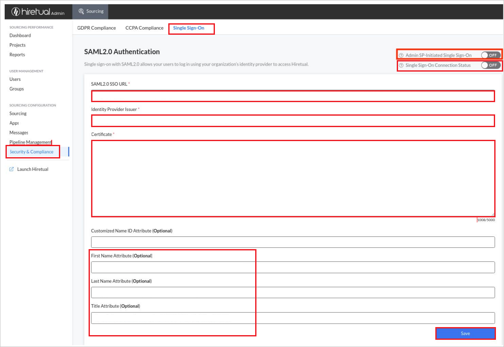

# Tutorial: Azure AD-SSO-Integration in Hiretual-SSO

In diesem Tutorial erfahren Sie, wie Sie Hiretual-SSO in Azure Active Directory (Azure AD) integrieren. Die Integration von Hiretual-SSO in Azure AD ermöglicht Folgendes:

* Steuern Sie in Azure AD, wer Zugriff auf Hiretual-SSO hat.
* Ermöglichen Sie Ihren Benutzern, sich mit ihren Azure AD-Konten automatisch bei Hiretual-SSO anzumelden.
* Verwalten Sie Ihre Konten zentral im Azure-Portal.

## Voraussetzungen

Für die ersten Schritte benötigen Sie Folgendes:

* Ein Azure AD-Abonnement Falls Sie über kein Abonnement verfügen, können Sie ein [kostenloses Azure-Konto](https://azure.microsoft.com/free/) verwenden.
* Hiretual-SSO-Abonnement, für das einmaliges Anmelden (Single Sign-On, SSO) aktiviert ist.

## Beschreibung des Szenarios

In diesem Tutorial konfigurieren und testen Sie das einmalige Anmelden von Azure AD in einer Testumgebung.

* Hiretual-SSO unterstützt **SP- und IDP-initiiertes** einmaliges Anmelden.

> [!NOTE]
> Der Bezeichner dieser Anwendung ist ein fester Zeichenfolgenwert, daher kann in einem Mandanten nur eine Instanz konfiguriert werden.

## Hinzufügen von Hiretual-SSO aus dem Katalog

Zum Konfigurieren der Integration von Hiretual-SSO in Azure AD müssen Sie Hiretual-SSO aus dem Katalog zur Liste der verwalteten SaaS-Apps hinzufügen.

1. Melden Sie sich mit einem Geschäfts-, Schul- oder Unikonto oder mit einem persönlichen Microsoft-Konto beim Azure-Portal an.
1. Wählen Sie im linken Navigationsbereich den Dienst **Azure Active Directory** aus.
1. Navigieren Sie zu **Unternehmensanwendungen**, und wählen Sie dann **Alle Anwendungen** aus.
1. Wählen Sie zum Hinzufügen einer neuen Anwendung **Neue Anwendung** aus.
1. Geben Sie im Abschnitt **Aus Katalog hinzufügen** den Suchbegriff **Hiretual-SSO** in das Suchfeld ein.
1. Wählen Sie im Ergebnisbereich **Hiretual-SSO** aus, und fügen Sie dann die App hinzu. Warten Sie einige Sekunden, während die App Ihrem Mandanten hinzugefügt wird.

## Konfigurieren und Testen des einmaligen Anmeldens von Azure AD für Hiretual-SSO

Konfigurieren und testen Sie das einmalige Anmelden von Azure AD mit Hiretual-SSO mithilfe eines Testbenutzers namens **B. Simon**. Damit einmaliges Anmelden funktioniert, muss eine Linkbeziehung zwischen einem Azure AD-Benutzer und dem entsprechenden Benutzer in Hiretual-SSO eingerichtet werden.

Führen Sie die folgenden Schritte aus, um das einmalige Anmelden von Azure AD mit Hiretual-SSO zu konfigurieren und zu testen:

1. **[Konfigurieren des einmaligen Anmeldens von Azure AD](#configure-azure-ad-sso)** , um Ihren Benutzern die Verwendung dieses Features zu ermöglichen.
    1. **[Erstellen eines Azure AD-Testbenutzers](#create-an-azure-ad-test-user)** , um das einmalige Anmelden von Azure AD mit dem Testbenutzer B. Simon zu testen.
    1. **[Zuweisen des Azure AD-Testbenutzers](#assign-the-azure-ad-test-user)** , um B. Simon die Verwendung des einmaligen Anmeldens von Azure AD zu ermöglichen.
1. **[Konfigurieren des einmaligen Anmeldens für Hiretual-SSO](#configure-hiretual-sso)** , um die Einstellungen für einmaliges Anmelden auf der Anwendungsseite zu konfigurieren.
    1. **[Erstellen eines Hiretual-SSO-Testbenutzers](#create-hiretual-sso-test-user)** , um in Hiretual-SSO eine Entsprechung von B. Simon zu erhalten, die mit der Benutzerdarstellung in Azure AD verknüpft ist.
1. **[Testen des einmaligen Anmeldens](#test-sso)** , um zu überprüfen, ob die Konfiguration funktioniert

## Konfigurieren des einmaligen Anmeldens (Single Sign-On, SSO) von Azure AD

Gehen Sie wie folgt vor, um das einmalige Anmelden von Azure AD im Azure-Portal zu aktivieren.

1. Navigieren Sie im Azure-Portal auf der Anwendungsintegrationsseite für **Hiretual-SSO** zum Abschnitt **Verwalten**, und wählen Sie **Einmaliges Anmelden** aus.
1. Wählen Sie auf der Seite **SSO-Methode auswählen** die Methode **SAML** aus.
1. Klicken Sie auf der Seite **Einmaliges Anmelden (SSO) mit SAML einrichten** auf das Stiftsymbol für **Grundlegende SAML-Konfiguration**, um die Einstellungen zu bearbeiten.

   

1. Führen Sie im Abschnitt **Grundlegende SAML-Konfiguration** die folgenden Schritte aus, wenn Sie die Anwendung im **IDP-initiierten** Modus konfigurieren möchten:

    a. Geben Sie im Textfeld **Antwort-URL** eine URL im folgenden Format ein: `https://api.hiretual.com/v1/users/saml/login/<teamId>`

1. Klicken Sie auf **Zusätzliche URLs festlegen**, und führen Sie den folgenden Schritt aus, wenn Sie die Anwendung im **SP-initiierten Modus** konfigurieren möchten:

    Geben Sie im Textfeld **Anmelde-URL** die URL ein: `https://app.hiretual.com/`.

    > [!NOTE]
    > Dieser Wert entspricht nicht dem tatsächlichen Wert. Aktualisieren Sie den Wert mit der richtigen Antwort-URL. Diese Werte erhalten Sie vom [Supportteam für den Hiretual-SSO-Client](mailto:support@hiretual.com). Sie können sich auch die Muster im Abschnitt **Grundlegende SAML-Konfiguration** im Azure-Portal ansehen.

1. Die Hiretual-SSO-Anwendung erwartet die SAML-Assertionen in einem bestimmten Format. Daher müssen Sie Ihrer Konfiguration der SAML-Tokenattribute benutzerdefinierte Attributzuordnungen hinzufügen. Der folgende Screenshot zeigt die Liste der Standardattribute.

    

1. Darüber hinaus erwartet die Hiretual-SSO-Anwendung, dass in der SAML-Antwort noch einige weitere Attribute zurückgegeben werden (siehe unten). Diese Attribute werden ebenfalls vorab aufgefüllt, Sie können sie jedoch nach Bedarf überprüfen.
    
    | Name | Quellattribut |
    | ---------- | --------- |
    | firstName | user.givenname |
    | title | user.jobtitle |
    | lastName | user.surname |

1. Klicken Sie auf der Seite **Einmaliges Anmelden (SSO) mit SAML einrichten** im Abschnitt **SAML-Signaturzertifikat** auf die Schaltfläche „Kopieren“, um die **App-Verbundmetadaten-URL** zu kopieren, und speichern Sie sie auf Ihrem Computer.

    

### Erstellen eines Azure AD-Testbenutzers

In diesem Abschnitt erstellen Sie im Azure-Portal einen Testbenutzer mit dem Namen B. Simon.

1. Wählen Sie im linken Bereich des Microsoft Azure-Portals **Azure Active Directory** > **Benutzer** > **Alle Benutzer** aus.
1. Wählen Sie oben im Bildschirm die Option **Neuer Benutzer** aus.
1. Führen Sie unter den Eigenschaften für **Benutzer** die folgenden Schritte aus:
   1. Geben Sie im Feld **Name** die Zeichenfolge `B.Simon` ein.  
   1. Geben Sie im Feld **Benutzername** die Zeichenfolge username@companydomain.extension ein. Beispiel: `B.Simon@contoso.com`.
   1. Aktivieren Sie das Kontrollkästchen **Kennwort anzeigen**, und notieren Sie sich den Wert aus dem Feld **Kennwort**.
   1. Klicken Sie auf **Erstellen**.

### Zuweisen des Azure AD-Testbenutzers

In diesem Abschnitt ermöglichen Sie B. Simon die Verwendung des einmaligen Anmeldens von Azure, indem Sie Zugriff auf Hiretual-SSO gewähren.

1. Wählen Sie im Azure-Portal **Unternehmensanwendungen** > **Alle Anwendungen** aus.
1. Wählen Sie in der Anwendungsliste den Eintrag **Hiretual-SSO** aus.
1. Navigieren Sie auf der Übersichtsseite der App zum Abschnitt **Verwalten**, und wählen Sie **Benutzer und Gruppen** aus.
1. Wählen Sie **Benutzer hinzufügen** und anschließend im Dialogfeld **Zuweisung hinzufügen** die Option **Benutzer und Gruppen** aus.
1. Wählen Sie im Dialogfeld **Benutzer und Gruppen** in der Liste „Benutzer“ den Eintrag **B. Simon** aus, und klicken Sie dann unten auf dem Bildschirm auf die Schaltfläche **Auswählen**.
1. Wenn den Benutzern eine Rolle zugewiesen werden soll, können Sie sie im Dropdownmenü **Rolle auswählen** auswählen. Wurde für diese App keine Rolle eingerichtet, ist die Rolle „Standardzugriff“ ausgewählt.
1. Klicken Sie im Dialogfeld **Zuweisung hinzufügen** auf die Schaltfläche **Zuweisen**.

## Konfigurieren von Hiretual-SSO

1. Melden Sie sich bei der Hiretual-SSO-Unternehmenswebsite als Administrator an.

1. Wechseln Sie zu **Security & Compliance** > **Single Sign-On** (Sicherheit & Compliance > Einmaliges Anmelden).

1. Führen Sie auf der Seite **SAML2.0 Authentication** (SAML2.0-Authentifizierung) die folgenden Schritte aus:

    

    1. Fügen Sie in das Textfeld **SAML2.0 SSO URL** (SAML2.0-SSO-URL) den Wert der **User access URL** (Benutzerzugriffs-URL) ein, den Sie aus dem Azure-Portal kopiert haben.

    1. Kopieren Sie den Wert **Entity ID** (Entitäts-ID) aus der Metadatendatei, und fügen Sie ihn in das Textfeld **Identity Provider Issuer** (Aussteller des Identitätsanbieters) ein.

    1. Kopieren Sie **X509 Certificate** (X509-Zertifikat) aus der Metadatendatei, und fügen Sie den Inhalt in das Textfeld **Certificate** (Zertifikat) ein.

    1. Füllen Sie die erforderlichen Attribute manuell gemäß Ihren Anforderungen aus, und klicken Sie auf **Save** (Speichern).

    1. Aktivieren Sie die Schaltfläche **Single Sign-On Connection Status** (SSO-Verbindungsstatus).

    1. Testen Sie zuerst die Integration des einmaligen Anmeldens, und aktivieren Sie dann die Schaltfläche **Admin SP-Initiated Single Sign-On** (SP-initiiertes einmaliges Anmelden verwalten). 

    > [!NOTE]
    > Wenn bei Ihrer SSO-Konfiguration Fehler oder Ihrer Anmeldung bei Hiretual-SSO Web App/Extension Probleme auftreten, nachdem Sie „Admin SP-Initiated Single Sign-On“ (SP-initiiertes einmaliges Anmelden verwalten) aktiviert haben, wenden Sie sich an das Supportteam von [Hiretual-SSO](mailto:support@hiretual.com).
    
### Erstellen eines Hiretual-SSO-Testbenutzers

In diesem Abschnitt erstellen Sie in Hiretual-SSO eine Benutzerin namens Britta Simon. Wenden Sie sich an das [Supportteam von Hiretual-SSO](mailto:support@hiretual.com), um die Benutzer auf der Hiretual-SSO-Plattform hinzuzufügen. Benutzer müssen erstellt und aktiviert werden, damit Sie einmaliges Anmelden verwenden können.

## Testen des einmaligen Anmeldens 

In diesem Abschnitt testen Sie die Azure AD-Konfiguration für einmaliges Anmelden mit den folgenden Optionen: 

#### SP-initiiert:

* Klicken Sie im Azure-Portal auf **Diese Anwendung testen**. Dadurch werden Sie zur Anmelde-URL für Hiretual-SSO weitergeleitet. Dort können Sie den Anmeldeflow initiieren.  

* Navigieren Sie direkt zur Hiretual-SSO-Anmelde-URL, und initiieren Sie dort den Anmeldeflow.

#### IDP-initiiert:

* Klicken Sie im Azure-Portal auf **Diese Anwendung testen**. Dadurch sollten Sie automatisch bei der Hiretual-SSO-Instanz angemeldet werden, für die Sie einmaliges Anmelden eingerichtet haben. 

Sie können auch den Microsoft-Bereich „Meine Apps“ verwenden, um die Anwendung in einem beliebigen Modus zu testen. Beim Klicken auf die Kachel „Hiretual-SSO“ in „Meine Apps“ geschieht Folgendes: Wenn Sie die Anwendung im SP-Modus konfiguriert haben, werden Sie zum Initiieren des Anmeldeflows zur Anmeldeseite der Anwendung weitergeleitet. Wenn Sie die Anwendung im IDP-Modus konfiguriert haben, sollten Sie automatisch bei der Hiretual-SSO-Instanz angemeldet werden, für die Sie einmaliges Anmelden eingerichtet haben. Weitere Informationen zu „Meine Apps“ finden Sie in [dieser Einführung](../user-help/my-apps-portal-end-user-access.md).

## Nächste Schritte

Nach dem Konfigurieren des einmaligen Anmeldens von Hiretual-SSO können Sie die Sitzungssteuerung erzwingen, die in Echtzeit vor der Exfiltration und Infiltration vertraulicher Unternehmensdaten schützt. Die Sitzungssteuerung basiert auf bedingtem Zugriff. [Erfahren Sie, wie Sie die Sitzungssteuerung mit Microsoft Defender for Cloud Apps erzwingen.](/cloud-app-security/proxy-deployment-aad)
