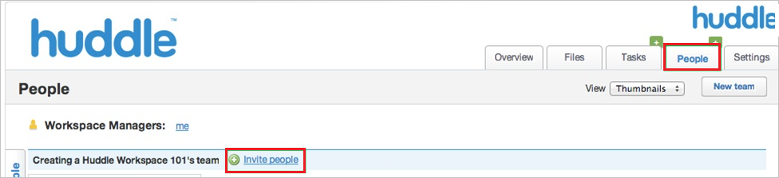

# Tutorial: Integration des einmaligen Anmeldens (Single Sign-On, SSO) von Azure AD in Huddle

In diesem Tutorial erfahren Sie, wie Sie Huddle in Azure Active Directory (Azure AD) integrieren. Die Integration von Huddle in Azure AD ermöglicht Folgendes:

* Steuern in Azure AD, wer Zugriff auf Huddle besitzt.
* Benutzer können sich mit ihren Azure AD-Konten automatisch bei Huddle anmelden.
* Verwalten Sie Ihre Konten zentral im Azure-Portal.

## Voraussetzungen

Für die ersten Schritte benötigen Sie Folgendes:

* Ein Azure AD-Abonnement Falls Sie über kein Abonnement verfügen, können Sie ein [kostenloses Azure-Konto](https://azure.microsoft.com/free/) verwenden.
* Ein Huddle-Abonnement, für das einmaliges Anmelden (SSO) aktiviert ist.

## Beschreibung des Szenarios

In diesem Tutorial konfigurieren und testen Sie das einmalige Anmelden von Azure AD in einer Testumgebung.

* Huddle unterstützt **SP- und IDP-initiiertes** einmaliges Anmelden.

> [!NOTE]
> Der Bezeichner dieser Anwendung ist ein fester Zeichenfolgenwert, daher kann in einem Mandanten nur eine Instanz konfiguriert werden.

## Hinzufügen von Huddle aus dem Katalog

Zum Konfigurieren der Integration von Huddle in Azure AD müssen Sie Huddle über den Katalog der Liste mit den verwalteten SaaS-Apps hinzufügen.

1. Melden Sie sich mit einem Geschäfts-, Schul- oder Unikonto oder mit einem persönlichen Microsoft-Konto beim Azure-Portal an.
1. Wählen Sie im linken Navigationsbereich den Dienst **Azure Active Directory** aus.
1. Navigieren Sie zu **Unternehmensanwendungen**, und wählen Sie dann **Alle Anwendungen** aus.
1. Wählen Sie zum Hinzufügen einer neuen Anwendung **Neue Anwendung** aus.
1. Geben Sie im Abschnitt **Aus Katalog hinzufügen** den Suchbegriff **Huddle** in das Suchfeld ein.
1. Wählen Sie im Ergebnisbereich **Huddle** aus, und fügen Sie die App dann hinzu. Warten Sie einige Sekunden, während die App Ihrem Mandanten hinzugefügt wird.

## Konfigurieren und Testen von Azure AD-SSO für Huddle

Konfigurieren und testen Sie das einmalige Anmelden von Azure AD mit Huddle mithilfe eines Testbenutzers mit dem Namen **B. Simon**. Damit einmaliges Anmelden funktioniert, muss eine Linkbeziehung zwischen einem Azure AD-Benutzer und dem entsprechenden Benutzer in Huddle eingerichtet werden.

Führen Sie zum Konfigurieren und Testen des einmaligen Anmeldens von Azure AD mit Huddle die folgenden Schritte aus:

1. **[Konfigurieren des einmaligen Anmeldens von Azure AD](#configure-azure-ad-sso)** , um Ihren Benutzern die Verwendung dieses Features zu ermöglichen
    1. **[Erstellen eines Azure AD-Testbenutzers](#create-an-azure-ad-test-user)** , um das einmalige Anmelden von Azure AD mit dem Testbenutzer B. Simon zu testen.
    1. **[Zuweisen des Azure AD-Testbenutzers](#assign-the-azure-ad-test-user)** , um B. Simon für das einmalige Anmelden von Azure AD zu aktivieren.
1. **[Konfigurieren des einmaliges Anmeldens für Huddle](#configure-huddle-sso)** , um die Einstellungen für einmaliges Anmelden auf der Anwendungsseite zu konfigurieren.
    1. **[Erstellen eines Huddle-Testbenutzers](#create-huddle-test-user)** , um in Huddle eine Entsprechung von B. Simon zu erhalten, die mit der Darstellung in Azure AD verknüpft ist.
1. **[Testen des einmaligen Anmeldens](#test-sso)** , um zu überprüfen, ob die Konfiguration funktioniert

## Konfigurieren des einmaligen Anmeldens (Single Sign-On, SSO) von Azure AD

Gehen Sie wie folgt vor, um das einmalige Anmelden von Azure AD im Azure-Portal zu aktivieren.

1. Navigieren Sie im Azure-Portal auf der Anwendungsintegrationsseite für **Huddle** zum Abschnitt **Verwalten**, und wählen Sie **Einmaliges Anmelden** aus.
1. Wählen Sie auf der Seite **SSO-Methode auswählen** die Methode **SAML** aus.
1. Klicken Sie auf der Seite **Einmaliges Anmelden (SSO) mit SAML einrichten** auf das Stiftsymbol für **Grundlegende SAML-Konfiguration**, um die Einstellungen zu bearbeiten.

   

4. Führen Sie im Abschnitt **Grundlegende SAML-Konfiguration** die folgenden Schritte aus, wenn Sie die Anwendung im **IDP**-initiierten Modus konfigurieren möchten:

    > [!NOTE]
    > Ihre Huddle-Instanz wird von der Domäne, die Sie unten eingeben, automatisch erkannt.

    a. Geben Sie im Textfeld **Bezeichner** eine der folgenden URLs ein:

    | **Identifier** |
    |------|
    | `https://login.huddle.net` |
    | `https://login.huddle.com` |

    b. Geben Sie im Textfeld **Antwort-URL** eine der folgenden URLs ein:

    | **Antwort-URL** |
    |----|
    | `https://login.huddle.net/saml/browser-sso` |
    | `https://login.huddle.com/saml/browser-sso` |
    | `https://login.huddle.com/saml/idp-initiated-sso` |

5. Klicken Sie auf **Zusätzliche URLs festlegen**, und führen Sie den folgenden Schritt aus, wenn Sie die Anwendung im **SP-initiierten Modus** konfigurieren möchten:

    Geben Sie im Textfeld **Anmelde-URL** eine URL im folgenden Format ein:

    | **Anmelde-URL** |
    |----|
    | `https://<customsubdomain>.huddle.com` |
    | `https://us.huddle.com` |
      
    > [!NOTE]
    > Der Wert der Anmelde-URL entspricht nicht dem tatsächlichen Wert. Ersetzen Sie diesen Wert durch die tatsächliche Anmelde-URL. Wenden Sie sich an das [Kundensupportteam von Huddle](https://huddle.zendesk.com), um diesen Wert zu erhalten.

6. Klicken Sie auf der Seite **Einmaliges Anmelden (SSO) mit SAML einrichten** im Abschnitt **SAML-Signaturzertifikat** auf **Herunterladen**, um das Ihrer Anforderung entsprechende **Zertifikat (Base64)** aus den angegebenen Optionen herunterzuladen und auf Ihrem Computer zu speichern.

    

7. Kopieren Sie im Abschnitt **Huddle einrichten** die entsprechenden URLs gemäß Ihren Anforderungen.

    

### Erstellen eines Azure AD-Testbenutzers

In diesem Abschnitt erstellen Sie im Azure-Portal einen Testbenutzer mit dem Namen B. Simon.

1. Wählen Sie im linken Bereich des Microsoft Azure-Portals **Azure Active Directory** > **Benutzer** > **Alle Benutzer** aus.
1. Wählen Sie oben im Bildschirm die Option **Neuer Benutzer** aus.
1. Führen Sie unter den Eigenschaften für **Benutzer** die folgenden Schritte aus:
   1. Geben Sie im Feld **Name** die Zeichenfolge `B. Simon` ein.  
   1. Geben Sie im Feld **Benutzername** die Zeichenfolge username@companydomain.extension ein. Beispiel: `B. Simon@contoso.com`.
   1. Aktivieren Sie das Kontrollkästchen **Kennwort anzeigen**, und notieren Sie sich den Wert aus dem Feld **Kennwort**.
   1. Klicken Sie auf **Erstellen**.

### Zuweisen des Azure AD-Testbenutzers

In diesem Abschnitt ermöglichen Sie B. Simon die Verwendung des einmaligen Anmeldens von Azure, indem Sie Zugriff auf Huddle gewähren.

1. Wählen Sie im Azure-Portal **Unternehmensanwendungen** > **Alle Anwendungen** aus.
1. Wählen Sie in der Anwendungsliste **Huddle** aus.
1. Navigieren Sie auf der Übersichtsseite der App zum Abschnitt **Verwalten**, und wählen Sie **Benutzer und Gruppen** aus.
1. Wählen Sie **Benutzer hinzufügen** und anschließend im Dialogfeld **Zuweisung hinzufügen** die Option **Benutzer und Gruppen** aus.
1. Wählen Sie im Dialogfeld **Benutzer und Gruppen** in der Liste „Benutzer“ den Eintrag **B. Simon** aus, und klicken Sie dann am unteren Bildschirmrand auf die Schaltfläche **Auswählen**.
1. Wenn Sie einen beliebigen Rollenwert in der SAML-Assertion erwarten, wählen Sie im Dialogfeld **Rolle auswählen** die entsprechende Rolle für den Benutzer in der Liste aus, und klicken Sie dann im unteren Bildschirmbereich auf die Schaltfläche **Auswählen**.
1. Klicken Sie im Dialogfeld **Zuweisung hinzufügen** auf die Schaltfläche **Zuweisen**.

## Konfigurieren von SSO für Huddle

Zum Konfigurieren des einmaligen Anmeldens aufseiten von **Huddle** müssen Sie das heruntergeladene **Zertifikat (Base64)** und die kopierten URLs aus dem Azure-Portal an das [Supportteam von Huddle](https://huddle.zendesk.com/) senden. Es führt die Einrichtung durch, damit die SAML-SSO-Verbindung auf beiden Seiten richtig festgelegt ist.

> [!NOTE]
> Das einmalige Anmelden muss vom Supportteam von Huddle aktiviert werden. Sie erhalten eine Benachrichtigung, sobald die Konfiguration abgeschlossen ist.

### Erstellen eines Huddle-Testbenutzers

Damit sich Azure AD-Benutzer bei Huddle anmelden können, müssen sie in Huddle bereitgestellt werden. Im Fall von Huddle ist die Bereitstellung eine manuelle Aufgabe.

**Um die Benutzerbereitstellung zu konfigurieren, führen Sie die folgenden Schritte durch:**

1. Melden Sie sich auf Ihrer **Huddle**-Unternehmenswebsite als Administrator an.

2. Klicken Sie auf **Workspace**.

3. Klicken Sie auf **Personen \> Personen einladen**.

    

4. Führen Sie im Abschnitt **Create a new invitation** die folgenden Schritte aus:
  
    
  
    a. Wählen Sie **Team** in der Liste **Choose a team to invite people to join** aus.

    b. Geben Sie die **E-Mail-Adresse** eines gültigen Azure AD-Kontos, das Sie bereitstellen möchten, in das Textfeld **Enter email address for people you'd like to invite** (E-Mail-Adresse für Personen eingeben, die Sie einladen möchten) ein.

    c. Klicken Sie auf **Einladen**.

    > [!NOTE]
    > Der Besitzer des Azure AD-Kontos erhält eine E-Mail mit einem Link zur Bestätigung des Kontos, bevor es aktiv wird.

> [!NOTE]
> Sie können Azure AD-Benutzerkonten auch mithilfe anderer Tools zum Erstellen von Huddle-Benutzerkonten oder mithilfe der von Huddle bereitgestellten APIs erstellen.

## Testen des einmaligen Anmeldens

In diesem Abschnitt testen Sie die Azure AD-Konfiguration für einmaliges Anmelden mit den folgenden Optionen: 

#### SP-initiiert:

* Klicken Sie im Azure-Portal auf **Diese Anwendung testen**. Dadurch werden Sie zur Anmelde-URL für Huddle weitergeleitet. Dort können Sie den Anmeldeflow initiieren.  

* Rufen Sie die Huddle-Anmelde-URL direkt auf, und initiieren Sie den Anmeldeflow.

#### IDP-initiiert:

* Klicken Sie im Azure-Portal auf **Diese Anwendung testen**. Dadurch sollten Sie automatisch bei der Huddle-Instanz angemeldet werden, für die Sie einmaliges Anmelden eingerichtet haben. 

Sie können auch den Microsoft-Bereich „Meine Apps“ verwenden, um die Anwendung in einem beliebigen Modus zu testen. Beim Klicken auf die Kachel „Huddle“ in „Meine Apps“ geschieht Folgendes: Wenn Sie die Anwendung im SP-Modus konfiguriert haben, werden Sie zum Initiieren des Anmeldeflows zur Anmeldeseite der Anwendung weitergeleitet. Wenn Sie die Anwendung im IDP-Modus konfiguriert haben, sollten Sie automatisch bei der Huddle-Instanz angemeldet werden, für die Sie einmaliges Anmelden eingerichtet haben. Weitere Informationen zu „Meine Apps“ finden Sie in [dieser Einführung](../user-help/my-apps-portal-end-user-access.md).

## Nächste Schritte

Nach dem Konfigurieren von Huddle können Sie Sitzungssteuerung erzwingen, die in Echtzeit vor der Exfiltration und Infiltration vertraulicher Unternehmensdaten schützt. Die Sitzungssteuerung basiert auf bedingtem Zugriff. [Erfahren Sie, wie Sie die Sitzungssteuerung mit Microsoft Defender for Cloud Apps erzwingen.](/cloud-app-security/proxy-deployment-aad)
