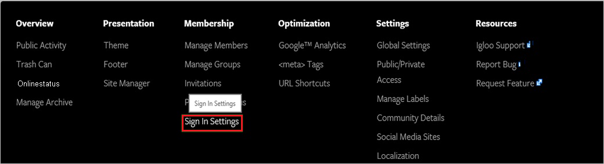
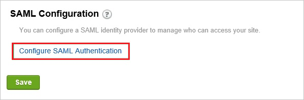

# Tutorial: Integration des einmaligen Anmeldens (Single Sign-On, SSO) von Azure AD mit Igloo Software

In diesem Tutorial erfahren Sie, wie Sie Igloo Software in Azure Active Directory (Azure AD) integrieren. Die Integration von Igloo Software in Azure AD ermöglicht Folgendes:

* Steuern Sie in Azure AD, wer Zugriff auf Igloo Software hat.
* Ermöglichen Sie es Ihren Benutzern, sich mit ihren Azure AD-Konten automatisch bei Igloo Software anzumelden.
* Verwalten Sie Ihre Konten zentral im Azure-Portal.

## Voraussetzungen

Für die ersten Schritte benötigen Sie Folgendes:

* Ein Azure AD-Abonnement Falls Sie über kein Abonnement verfügen, können Sie ein [kostenloses Azure-Konto](https://azure.microsoft.com/free/) verwenden.
* Igloo Software-Abonnement, für das einmaliges Anmelden (Single Sign-On, SSO) aktiviert ist

## Beschreibung des Szenarios

In diesem Tutorial konfigurieren und testen Sie das einmalige Anmelden von Azure AD in einer Testumgebung.

* Igloo Software unterstützt **SP**-initiiertes einmaliges Anmelden.
* Igloo Software unterstützt die **Just-In-Time**-Benutzerbereitstellung.

## Hinzufügen von Igloo Software aus dem Katalog

Zum Konfigurieren der Integration von Igloo Software in Azure AD müssen Sie Igloo Software aus dem Katalog zur Liste der verwalteten SaaS-Apps hinzufügen.

1. Melden Sie sich mit einem Geschäfts-, Schul- oder Unikonto oder mit einem persönlichen Microsoft-Konto beim Azure-Portal an.
1. Wählen Sie im linken Navigationsbereich den Dienst **Azure Active Directory** aus.
1. Navigieren Sie zu **Unternehmensanwendungen**, und wählen Sie dann **Alle Anwendungen** aus.
1. Wählen Sie zum Hinzufügen einer neuen Anwendung **Neue Anwendung** aus.
1. Geben Sie im Abschnitt **Aus Katalog hinzufügen** den Suchbegriff **Igloo Software** in das Suchfeld ein.
1. Wählen Sie im Ergebnisbereich **Igloo Software** aus, und fügen Sie dann die App hinzu. Warten Sie einige Sekunden, während die App Ihrem Mandanten hinzugefügt wird.

## Konfigurieren und Testen des einmaligen Anmeldens von Azure AD für Igloo Software

Konfigurieren und testen Sie das einmalige Anmelden von Azure AD mit Igloo Software mithilfe eines Testbenutzers mit dem Namen **B. Simon**. Damit einmaliges Anmelden funktioniert, muss eine Linkbeziehung zwischen einem Azure AD-Benutzer und dem entsprechenden Benutzer in Igloo Software eingerichtet werden.

Führen Sie zum Konfigurieren und Testen des einmaligen Anmeldens von Azure AD mit Igloo Software die folgenden Schritte aus:

1. **[Konfigurieren des einmaligen Anmeldens von Azure AD](#configure-azure-ad-sso)** , um Ihren Benutzern die Verwendung dieses Features zu ermöglichen.
    1. **[Erstellen eines Azure AD-Testbenutzers](#create-an-azure-ad-test-user)** , um das einmalige Anmelden von Azure AD mit dem Testbenutzer B. Simon zu testen.
    1. **[Zuweisen des Azure AD-Testbenutzers](#assign-the-azure-ad-test-user)** , um B. Simon die Verwendung des einmaligen Anmeldens von Azure AD zu ermöglichen.
1. **[Konfigurieren des einmaligen Anmeldens für Igloo Software](#configure-igloo-software-sso)** , um die Einstellungen für einmaliges Anmelden auf der Anwendungsseite zu konfigurieren
    1. **[Erstellen eines Igloo Software-Testbenutzers](#create-igloo-software-test-user)** , um ein Pendant von B. Simon in Igloo Software zu erhalten, das mit ihrer Darstellung in Azure AD verknüpft ist
1. **[Testen des einmaligen Anmeldens](#test-sso)** , um zu überprüfen, ob die Konfiguration funktioniert

## Konfigurieren des einmaligen Anmeldens (Single Sign-On, SSO) von Azure AD

Gehen Sie wie folgt vor, um das einmalige Anmelden von Azure AD im Azure-Portal zu aktivieren.

1. Navigieren Sie im Azure-Portal auf der Anwendungsintegrationsseite für **Igloo Software** zum Abschnitt **Verwalten**, und wählen Sie **Einmaliges Anmelden** aus.
1. Wählen Sie auf der Seite **SSO-Methode auswählen** die Methode **SAML** aus.
1. Klicken Sie auf der Seite **Einmaliges Anmelden (SSO) mit SAML einrichten** auf das Stiftsymbol für **Grundlegende SAML-Konfiguration**, um die Einstellungen zu bearbeiten.

   

4. Führen Sie im Abschnitt **Grundlegende SAML-Konfiguration** die folgenden Schritte aus:

    a. Geben Sie im Feld **Bezeichner** eine URL im folgenden Format ein: `https://<company name>.igloocommmunities.com/saml.digest`.

    b. Geben Sie im Textfeld **Antwort-URL** eine URL im folgenden Format ein: `https://<company name>.igloocommmunities.com/saml.digest`
    
    c. Geben Sie im Textfeld **Anmelde-URL** eine URL im folgenden Format ein: `https://<company name>.igloocommmunities.com`

    > [!NOTE]
    > Hierbei handelt es sich um Beispielwerte. Ersetzen Sie diese Werte durch die tatsächlichen Werte für Bezeichner, Antwort-URL und Anmelde-URL. Wenden Sie sich an das [Clientsupportteam von Igloo Software](https://www.igloosoftware.com/services/support), um diese Werte zu erhalten. Sie können sich auch die Muster im Abschnitt **Grundlegende SAML-Konfiguration** im Azure-Portal ansehen.

5. Klicken Sie auf der Seite **Einmaliges Anmelden (SSO) mit SAML einrichten** im Abschnitt **SAML-Signaturzertifikat** auf **Herunterladen**, um das Ihrer Anforderung entsprechende **Zertifikat (Base64)** aus den angegebenen Optionen herunterzuladen und auf Ihrem Computer zu speichern.

    

6. Kopieren Sie im Abschnitt **Igloo Software einrichten** die entsprechenden URLs gemäß Ihren Anforderungen.

    

### Erstellen eines Azure AD-Testbenutzers

In diesem Abschnitt erstellen Sie im Azure-Portal einen Testbenutzer mit dem Namen B. Simon.

1. Wählen Sie im linken Bereich des Microsoft Azure-Portals **Azure Active Directory** > **Benutzer** > **Alle Benutzer** aus.
1. Wählen Sie oben im Bildschirm die Option **Neuer Benutzer** aus.
1. Führen Sie unter den Eigenschaften für **Benutzer** die folgenden Schritte aus:
   1. Geben Sie im Feld **Name** die Zeichenfolge `B.Simon` ein.  
   1. Geben Sie im Feld **Benutzername** die Zeichenfolge username@companydomain.extension ein. Beispiel: `B.Simon@contoso.com`.
   1. Aktivieren Sie das Kontrollkästchen **Kennwort anzeigen**, und notieren Sie sich den Wert aus dem Feld **Kennwort**.
   1. Klicken Sie auf **Erstellen**.

### Zuweisen des Azure AD-Testbenutzers

In diesem Abschnitt ermöglichen Sie B. Simon die Verwendung des einmaligen Anmeldens von Azure, indem Sie ihr Zugriff auf Igloo Software gewähren.

1. Wählen Sie im Azure-Portal **Unternehmensanwendungen** > **Alle Anwendungen** aus.
1. Wählen Sie in der Anwendungsliste **Igloo Software** aus.
1. Navigieren Sie auf der Übersichtsseite der App zum Abschnitt **Verwalten**, und wählen Sie **Benutzer und Gruppen** aus.
1. Wählen Sie **Benutzer hinzufügen** und anschließend im Dialogfeld **Zuweisung hinzufügen** die Option **Benutzer und Gruppen** aus.
1. Wählen Sie im Dialogfeld **Benutzer und Gruppen** in der Liste „Benutzer“ den Eintrag **B. Simon** aus, und klicken Sie dann unten auf dem Bildschirm auf die Schaltfläche **Auswählen**.
1. Wenn den Benutzern eine Rolle zugewiesen werden soll, können Sie sie im Dropdownmenü **Rolle auswählen** auswählen. Wurde für diese App keine Rolle eingerichtet, ist die Rolle „Standardzugriff“ ausgewählt.
1. Klicken Sie im Dialogfeld **Zuweisung hinzufügen** auf die Schaltfläche **Zuweisen**.

## Konfigurieren des einmaligen Anmeldens für Igloo Software

1. Melden Sie sich in einem anderen Webbrowserfenster bei der Igloo Software-Unternehmenswebsite als Administrator an.

2. Wechseln Sie zum **Control Panel**.

     

3. Klicken Sie auf der Registerkarte **Membership** auf **Sign In Settings**.

    

4. Klicken Sie im Abschnitt "SAML Configuration" auf **Configure SAML Authentication**.

    

5. Führen Sie im Abschnitt **General Configuration** die folgenden Schritte aus:

    

    a. Geben Sie in das Textfeld **Connection Name** einen benutzerdefinierten Namen für Ihre Konfiguration ein.

    b. Fügen Sie in das Textfeld **IdP Login URL** (IdP-Anmelde-URL) den Wert der **Anmelde-URL** ein, den Sie aus dem Azure-Portal kopiert haben.

    c. Fügen Sie in das Textfeld **IdP Logout URL** (IdP-Abmelde-URL) den Wert der **Abmelde-URL** ein, den Sie aus dem Azure-Portal kopiert haben.

    d. Wählen Sie für **Abmeldeantwort und HTTP-Anforderungstyp** die Option **POST** aus.

    e. Öffnen Sie das **Base64**-codierte Zertifikat im Editor, das Sie aus dem Azure-Portal heruntergeladen haben, kopieren Sie den Inhalt des Zertifikats in die Zwischenablage, und fügen Sie ihn anschließend in das Textfeld **Öffentliches Zertifikat** ein.

6. Führen Sie in der **Response and Authentication Configuration** die folgenden Schritte aus:

    
  
    a. Wählen Sie als **Identity Provider** den Wert **Microsoft ADFS** aus.

    b. Wählen Sie als **Identifier Type** den Typ **Email Address** aus. 

    c. Geben Sie in das Textfeld **Email Attribute** den Wert **emailaddress** ein.

    d. Geben Sie in das Textfeld **First Name Attribute** den Wert **givenname** ein.

    e. Geben Sie in das Textfeld **Last Name Attribute** den Wert **surname** ein.

7. Führen Sie die folgenden Schritte aus, um die Konfiguration abzuschließen:

     

    a. Wählen Sie als **User creation on Sign in** den Wert **Create a new user in your site when they sign in** aus.

    b. Wählen Sie als **Sign in Settings** den Wert **Use SAML button on "Sign in" screen** aus.

    c. Klicken Sie auf **Speichern**.

### Erstellen eines Testbenutzers für Igloo Software

Für das Konfigurieren der Benutzerbereitstellung in Igloo Software steht kein Aktionselement zur Verfügung.  

Wenn ein zugewiesener Benutzer versucht, sich über den Zugriffsbereich bei Igloo Software anzumelden, überprüft Igloo Software, ob der Benutzer vorhanden ist.  Ist noch kein Benutzerkonto verfügbar, wird es von Igloo Software automatisch erstellt.

## Testen des einmaligen Anmeldens

In diesem Abschnitt testen Sie die Azure AD-Konfiguration für einmaliges Anmelden mit den folgenden Optionen: 

* Klicken Sie im Azure-Portal auf **Diese Anwendung testen**. Dadurch werden Sie zur Anmelde-URL für Igloo Software weitergeleitet, wo Sie den Anmeldeflow initiieren können. 

* Rufen Sie direkt die Igloo Software-Anmelde-URL auf, und initiieren Sie den Anmeldeflow.

* Sie können „Meine Apps“ von Microsoft verwenden. Wenn Sie unter „Meine Apps“ auf die Kachel „Igloo Software“ klicken, werden Sie zur Anmelde-URL für Igloo Software umgeleitet. Weitere Informationen zu „Meine Apps“ finden Sie in [dieser Einführung](../user-help/my-apps-portal-end-user-access.md).

## Nächste Schritte

Nach dem Konfigurieren von Igloo Software können Sie die Sitzungssteuerung erzwingen, die in Echtzeit vor der Exfiltration und Infiltration vertraulicher Unternehmensdaten schützt. Die Sitzungssteuerung basiert auf bedingtem Zugriff. [Erfahren Sie, wie Sie die Sitzungssteuerung mit Microsoft Defender for Cloud Apps erzwingen.](/cloud-app-security/proxy-deployment-aad)
