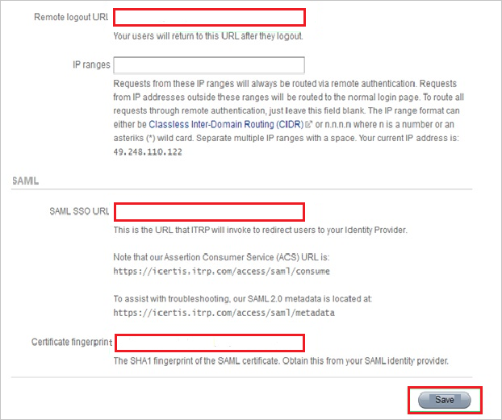
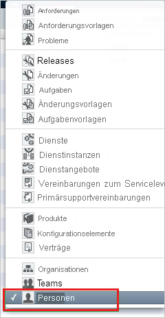
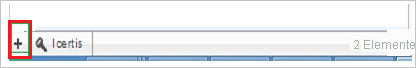
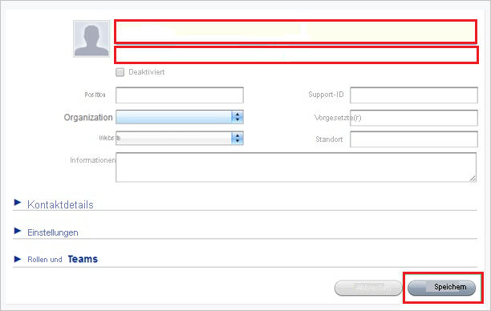

# Tutorial: Integration des einmaligen Anmeldens (Single Sign-On, SSO) von Azure AD mit ITRP

In diesem Tutorial erfahren Sie, wie Sie ITRP in Azure Active Directory (Azure AD) integrieren. Die Integration von ITRP in Azure AD ermöglicht Folgendes:

* Steuern Sie in Azure AD, wer Zugriff auf ITRP hat.
* Ermöglichen Sie es Ihren Benutzern, sich mit ihren Azure AD-Konten automatisch bei ITRP anzumelden.
* Verwalten Sie Ihre Konten zentral im Azure-Portal.

## Voraussetzungen

Um die Azure AD-Integration mit ITRP konfigurieren zu können, benötigen Sie Folgendes:

* Ein Azure AD-Abonnement Sollten Sie nicht über eine Azure AD-Umgebung verfügen, können Sie ein [kostenloses Konto](https://azure.microsoft.com/free/) verwenden.
* Ein ITRP-Abonnement, für das einmaliges Anmelden aktiviert ist

## Beschreibung des Szenarios

In diesem Tutorial konfigurieren und testen Sie das einmalige Anmelden von Azure AD in einer Testumgebung.

* ITRP unterstützt SP-initiiertes einmaliges Anmelden.

## Hinzufügen von ITRP aus dem Katalog

Zum Konfigurieren der Integration von ITRP in Azure AD müssen Sie ITRP aus dem Katalog der Liste mit den verwalteten SaaS-Apps hinzufügen.

1. Melden Sie sich mit einem Geschäfts-, Schul- oder Unikonto oder mit einem persönlichen Microsoft-Konto beim Azure-Portal an.
1. Wählen Sie im linken Navigationsbereich den Dienst **Azure Active Directory** aus.
1. Navigieren Sie zu **Unternehmensanwendungen**, und wählen Sie dann **Alle Anwendungen** aus.
1. Wählen Sie zum Hinzufügen einer neuen Anwendung **Neue Anwendung** aus.
1. Geben Sie im Abschnitt **Aus Katalog hinzufügen** den Suchbegriff **ITRP** in das Suchfeld ein.
1. Wählen Sie im Ergebnisbereich **ITRP** aus, und fügen Sie dann die App hinzu. Warten Sie einige Sekunden, während die App Ihrem Mandanten hinzugefügt wird.

## Konfigurieren und Testen des einmaligen Anmeldens von Azure AD für ITRP

Konfigurieren und testen Sie das einmalige Anmelden von Azure AD mit ITRP mithilfe eines Testbenutzers namens **B. Simon**. Damit einmaliges Anmelden funktioniert, muss eine Linkbeziehung zwischen einem Azure AD-Benutzer und dem entsprechenden Benutzer in ITRP eingerichtet werden.

Führen Sie zum Konfigurieren und Testen des einmaligen Anmeldens von Azure AD mit ITRP die folgenden Schritte aus:

1. **[Konfigurieren des einmaligen Anmeldens von Azure AD](#configure-azure-ad-sso)** , um Ihren Benutzern die Verwendung dieses Features zu ermöglichen.
    1. **[Erstellen eines Azure AD-Testbenutzers](#create-an-azure-ad-test-user)** , um das einmalige Anmelden von Azure AD mit dem Testbenutzer B. Simon zu testen.
    1. **[Zuweisen des Azure AD-Testbenutzers](#assign-the-azure-ad-test-user)** , um B. Simon die Verwendung des einmaligen Anmeldens von Azure AD zu ermöglichen.
1. **[Konfigurieren des einmaligen Anmeldens für ITRP](#configure-itrp-sso)** , um die Einstellungen für einmaliges Anmelden auf der Anwendungsseite zu konfigurieren
    1. **[Erstellen eines ITRP-Testbenutzers](#create-an-itrp-test-user)** , um eine Entsprechung von B. Simon in ITRP zu erhalten, die mit ihrer Darstellung in Azure AD verknüpft ist
1. **[Testen des einmaligen Anmeldens](#test-sso)** , um zu überprüfen, ob die Konfiguration funktioniert

## Konfigurieren des einmaligen Anmeldens (Single Sign-On, SSO) von Azure AD

Gehen Sie wie folgt vor, um das einmalige Anmelden von Azure AD im Azure-Portal zu aktivieren.

1. Navigieren Sie im Azure-Portal auf der Anwendungsintegrationsseite für **ITRP** zum Abschnitt **Verwalten**, und wählen Sie **Einmaliges Anmelden** aus.
1. Wählen Sie auf der Seite **SSO-Methode auswählen** die Methode **SAML** aus.
1. Klicken Sie auf der Seite **Einmaliges Anmelden (SSO) mit SAML einrichten** auf das Stiftsymbol für **Grundlegende SAML-Konfiguration**, um die Einstellungen zu bearbeiten.

   

4. Führen Sie im Dialogfeld **Grundlegende SAML-Konfiguration** die folgenden Schritte aus:

    1. Geben Sie im Textfeld **Bezeichner (Entitäts-ID)** eine URL nach folgendem Muster ein: 

       `https://<tenant-name>.itrp.com`

    1. Geben Sie im Textfeld **Anmelde-URL** eine URL nach folgendem Muster ein:
    
       `https://<tenant-name>.itrp.com`   

    > [!NOTE]
    > Diese Werte sind Platzhalter. Sie müssen die tatsächlichen Werte für Bezeichner und Anmelde-URL verwenden. Die Werte erhalten Sie vom [Supportteam von ITRP](https://www.4me.com/support/). Sie können sich auch die Muster im Azure-Portal im Dialogfeld **Grundlegende SAML-Konfiguration** ansehen.

5. Wählen Sie im Abschnitt **SAML-Signaturzertifikat** das Symbol **Bearbeiten** aus, um das Dialogfeld **SAML-Signaturzertifikat** zu öffnen:

    

6. Kopieren Sie im Dialogfeld **SAML-Signaturzertifikat** den Wert **Fingerabdruck**, und speichern Sie ihn:.

    

7. Kopieren Sie im Abschnitt **ITRP einrichten** die entsprechenden URLs gemäß Ihren Anforderungen:

    

### Erstellen eines Azure AD-Testbenutzers

In diesem Abschnitt erstellen Sie im Azure-Portal einen Testbenutzer mit dem Namen B. Simon.

1. Wählen Sie im linken Bereich des Microsoft Azure-Portals **Azure Active Directory** > **Benutzer** > **Alle Benutzer** aus.
1. Wählen Sie oben im Bildschirm die Option **Neuer Benutzer** aus.
1. Führen Sie unter den Eigenschaften für **Benutzer** die folgenden Schritte aus:
   1. Geben Sie im Feld **Name** die Zeichenfolge `B.Simon` ein.  
   1. Geben Sie im Feld **Benutzername** die Zeichenfolge username@companydomain.extension ein. Beispiel: `B.Simon@contoso.com`.
   1. Aktivieren Sie das Kontrollkästchen **Kennwort anzeigen**, und notieren Sie sich den Wert aus dem Feld **Kennwort**.
   1. Klicken Sie auf **Erstellen**.

### Zuweisen des Azure AD-Testbenutzers

In diesem Abschnitt ermöglichen Sie B. Simon die Verwendung des einmaligen Anmeldens von Azure, indem Sie ihr Zugriff auf ITRP gewähren.

1. Wählen Sie im Azure-Portal **Unternehmensanwendungen** > **Alle Anwendungen** aus.
1. Wählen Sie in der Anwendungsliste **ITRP** aus.
1. Navigieren Sie auf der Übersichtsseite der App zum Abschnitt **Verwalten**, und wählen Sie **Benutzer und Gruppen** aus.
1. Wählen Sie **Benutzer hinzufügen** und anschließend im Dialogfeld **Zuweisung hinzufügen** die Option **Benutzer und Gruppen** aus.
1. Wählen Sie im Dialogfeld **Benutzer und Gruppen** in der Liste „Benutzer“ den Eintrag **B. Simon** aus, und klicken Sie dann unten auf dem Bildschirm auf die Schaltfläche **Auswählen**.
1. Wenn den Benutzern eine Rolle zugewiesen werden soll, können Sie sie im Dropdownmenü **Rolle auswählen** auswählen. Wurde für diese App keine Rolle eingerichtet, ist die Rolle „Standardzugriff“ ausgewählt.
1. Klicken Sie im Dialogfeld **Zuweisung hinzufügen** auf die Schaltfläche **Zuweisen**.

## Konfigurieren des einmaligen Anmeldens für ITRP

1. Melden Sie sich in einem neuen Webbrowserfenster auf der ITRP-Unternehmenswebsite als Administrator an.

1. Wählen Sie im oberen Fensterbereich das Symbol **Settings** (Einstellungen) aus.

    

1. Wählen Sie im linken Bereich **Single Sign-On** (Einmaliges Anmelden) aus:

    

1. Führen Sie im Konfigurationsabschnitt **Single Sign-On** (Einmaliges Anmelden) die folgenden Schritte aus:

    

    

    1. Wählen Sie **Aktiviert**.

    1. Fügen Sie im Feld **Remote logout URL** (Remoteabmelde-URL) den Wert der **Abmelde-URL** ein, den Sie aus dem Azure-Portal kopiert haben.

    1. Fügen Sie im Feld **SAML SSO URL** (SAML-SSO-URL) den Wert der **Anmelde-URL** ein, den Sie aus dem Azure-Portal kopiert haben.

    1. Fügen Sie in das Textfeld **Certificate Fingerprint** (Zertifikatsfingerabdruck) den Wert **Fingerabdruck** des Zertifikats ein, den Sie aus dem Azure-Portal kopiert haben.

    1. Wählen Sie **Speichern** aus.

### Erstellen eines ITRP-Testbenutzers

Damit sich Azure AD-Benutzer bei ITRP anmelden können, müssen Sie sie in ITRP hinzufügen. Sie müssen diese manuell hinzufügen.

Zum Erstellen eines Benutzerkontos führen Sie die folgenden Schritte aus:

1. Melden Sie sich bei Ihrem ITRP-Mandanten an.

1. Wählen Sie im oberen Fensterbereich das Symbol **Records** (Datensätze) aus.

    

1. Wählen Sie im Menü **People** (Personen) aus:

    

1. Wählen Sie das Pluszeichen ( **+** ) aus, um eine neue Person hinzuzufügen:

    

1. Führen Sie im Dialogfeld **Add New Person** (Neue Person hinzufügen) die folgenden Schritte aus:

    

    1. Geben Sie den Namen und die E-Mail-Adresse eines gültigen Azure AD-Kontos ein, das Sie hinzufügen möchten.

    1. Wählen Sie **Speichern** aus.

> [!NOTE]
> Sie können Azure AD-Benutzerkonten mithilfe beliebiger Tools zum Erstellen von Benutzerkonten oder mithilfe der von ITRP bereitgestellten API erstellen.

## Testen des einmaligen Anmeldens

In diesem Abschnitt testen Sie die Azure AD-Konfiguration für einmaliges Anmelden mit den folgenden Optionen: 

* Klicken Sie im Azure-Portal auf **Diese Anwendung testen**. Dadurch werden Sie zur Anmelde-URL für ITRP weitergeleitet, wo Sie den Anmeldeflow initiieren können. 

* Rufen Sie direkt die ITRP-Anmelde-URL auf, und initiieren Sie den Anmeldeflow.

* Sie können „Meine Apps“ von Microsoft verwenden. Wenn Sie unter „Meine Apps“ auf die Kachel „ITRP“ klicken, werden Sie zur Anmelde-URL für ITRP weitergeleitet. Weitere Informationen zu „Meine Apps“ finden Sie in [dieser Einführung](../user-help/my-apps-portal-end-user-access.md).

## Nächste Schritte

Nach dem Konfigurieren von ITRP können Sie die Sitzungssteuerung erzwingen, die in Echtzeit vor der Exfiltration und Infiltration vertraulicher Unternehmensdaten schützt. Die Sitzungssteuerung basiert auf bedingtem Zugriff. [Erfahren Sie, wie Sie die Sitzungssteuerung mit Microsoft Defender for Cloud Apps erzwingen.](/cloud-app-security/proxy-deployment-aad)
