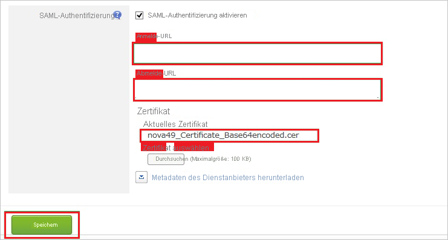
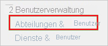
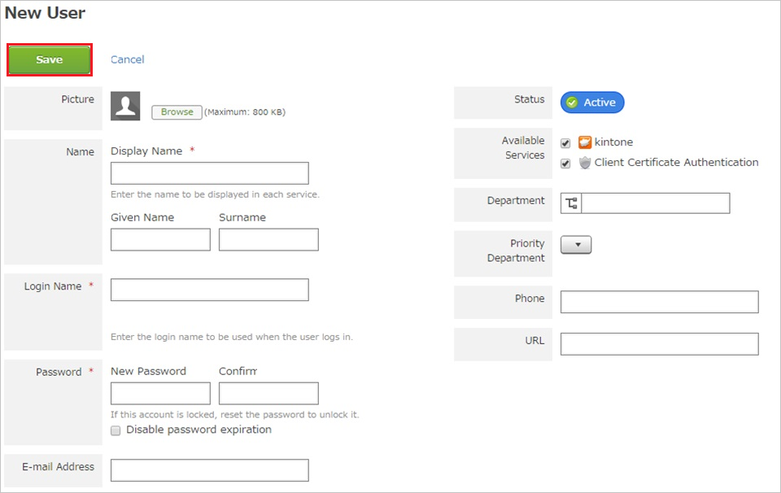

# Tutorial: Azure AD SSO-Integration mit Kintone

In diesem Tutorial lernen Sie, wie Sie Kintone mit Azure Active Directory (Azure AD) integrieren können. Wenn Sie Kintone mit Azure AD integrieren: können Sie:

* In Azure AD kontrollieren, wer Zugang zu Kintone hat.
* Aktivieren, dass Ihre Benutzer automatisch mit ihren Azure AD-Konten bei Kintone angemeldet werden.
* Verwalten Sie Ihre Konten zentral im Azure-Portal.

## Voraussetzungen

Um die Azure AD-Integration mit Kintone konfigurieren zu können, benötigen Sie Folgendes:

* Ein Azure AD-Abonnement Sollten Sie nicht über eine Azure AD-Umgebung verfügen, können Sie ein [kostenloses Konto](https://azure.microsoft.com/free/) verwenden.
* Abonnement von Kintone mit aktiviertem einmaligem Anmelden.

## Beschreibung des Szenarios

In diesem Tutorial konfigurieren und testen Sie das einmalige Anmelden von Azure AD in einer Testumgebung.

* Kintone unterstützt **SP** veranlasstes SSO.

## Kintone aus dem Katalog hinzufügen

Zum Konfigurieren der Integration von Kintone in Azure AD müssen Sie Kintone aus dem Katalog der Liste der verwalteten SaaS-Apps hinzufügen.

1. Melden Sie sich mit einem Geschäfts-, Schul- oder Unikonto oder mit einem persönlichen Microsoft-Konto beim Azure-Portal an.
1. Wählen Sie im linken Navigationsbereich den Dienst **Azure Active Directory** aus.
1. Navigieren Sie zu **Unternehmensanwendungen**, und wählen Sie dann **Alle Anwendungen** aus.
1. Wählen Sie zum Hinzufügen einer neuen Anwendung **Neue Anwendung** aus.
1. Geben Sie im Abschnitt **Aus dem Katalog hinzufügen** **Kintone** in das Suchfeld ein.
1. Wählen Sie **Kintone** aus dem Ergebnisbereich aus und fügen Sie dann die App hinzu. Warten Sie einige Sekunden, während die App Ihrem Mandanten hinzugefügt wird.

## Konfigurieren und testen Sie Azure AD SSO für Kintone

Konfigurieren und testen Sie Azure AD SSO mit Kintone unter Verwendung eines Testbenutzers namens **B.Simon0**. Damit SSO funktioniert, müssen Sie eine Verknüpfungsbeziehung zwischen einem Azure AD-Benutzer und dem entsprechenden Benutzer in Kintone herstellen.

Um Azure AD SSO mit Kintone zu konfigurieren und zu testen, führen Sie die folgenden Schritte durch:

1. **[Konfigurieren des einmaligen Anmeldens von Azure AD](#configure-azure-ad-sso)** , um Ihren Benutzern die Verwendung dieses Features zu ermöglichen.
    1. **[Erstellen eines Azure AD-Testbenutzers](#create-an-azure-ad-test-user)** , um das einmalige Anmelden von Azure AD mit dem Testbenutzer B. Simon zu testen.
    1. **[Zuweisen des Azure AD-Testbenutzers](#assign-the-azure-ad-test-user)** , um B. Simon die Verwendung des einmaligen Anmeldens von Azure AD zu ermöglichen.
1. **[Kintone SSO](#configure-kintone-sso)** konfigurieren, um die Einstellungen für Einmaliges Anmelden auf der Anwendungsseite zu konfigurieren.
    1. **[Kintone-Testbenutzer erstellen](#create-kintone-test-user)** , um ein Gegenüber von B.Simon in Kintone zu haben, das mit der Azure AD-Darstellung des Benutzers verknüpft ist.
1. **[Testen des einmaligen Anmeldens](#test-sso)** , um zu überprüfen, ob die Konfiguration funktioniert

## Konfigurieren des einmaligen Anmeldens (Single Sign-On, SSO) von Azure AD

Gehen Sie wie folgt vor, um das einmalige Anmelden von Azure AD im Azure-Portal zu aktivieren.

1. Suchen Sie Im Azure-Portal auf der Seite Anwendungsintegration von **Kintone** en Abschnitt **Verwalten** und wählen Sie **Einmaliges Anmelden** aus.
1. Wählen Sie auf der Seite **SSO-Methode auswählen** die Methode **SAML** aus.
1. Klicken Sie auf der Seite **Einmaliges Anmelden (SSO) mit SAML einrichten** auf das Stiftsymbol für **Grundlegende SAML-Konfiguration**, um die Einstellungen zu bearbeiten.

   

4. Führen Sie im Abschnitt **Grundlegende SAML-Konfiguration** die folgenden Schritte aus:

    a. Geben Sie im Textfeld **Bezeichner (Entitäts-ID)** eine URL in einem der folgenden Formate ein:
    
   | **Identifier** |
   |---|
   | `https://<companyname>.cybozu.com` |
   | `https://<companyname>.kintone.com` |
    
    b. Geben Sie im Textfeld **Anmelde-URL** eine URL im folgenden Format ein: `https://<companyname>.kintone.com`.

    > [!NOTE]
    > Hierbei handelt es sich um Beispielwerte. Ersetzen Sie diese Werte durch den tatsächlichen Bezeichner und die tatsächliche Anmelde-URL. Wenden Sie sich an das [Clientsupportteam von Kintone](https://www.kintone.com/contact/), um diese Werte zu erhalten. Sie können sich auch die Muster im Abschnitt **Grundlegende SAML-Konfiguration** im Azure-Portal ansehen.

5. Klicken Sie auf der Seite **Einmaliges Anmelden (SSO) mit SAML einrichten** im Abschnitt **SAML-Signaturzertifikat** auf **Herunterladen**, um das Ihrer Anforderung entsprechende **Zertifikat (Base64)** aus den angegebenen Optionen herunterzuladen und auf Ihrem Computer zu speichern.

    

6. Kopieren Sie im Abschnitt **Kintone einrichten** die entsprechenden URLs gemäß Ihren Anforderungen.

    

### Erstellen eines Azure AD-Testbenutzers

In diesem Abschnitt erstellen Sie im Azure-Portal einen Testbenutzer mit dem Namen B. Simon.

1. Wählen Sie im linken Bereich des Microsoft Azure-Portals **Azure Active Directory** > **Benutzer** > **Alle Benutzer** aus.
1. Wählen Sie oben im Bildschirm die Option **Neuer Benutzer** aus.
1. Führen Sie unter den Eigenschaften für **Benutzer** die folgenden Schritte aus:
   1. Geben Sie im Feld **Name** die Zeichenfolge `B.Simon` ein.  
   1. Geben Sie im Feld **Benutzername** die Zeichenfolge username@companydomain.extension ein. Beispiel: `B.Simon@contoso.com`.
   1. Aktivieren Sie das Kontrollkästchen **Kennwort anzeigen**, und notieren Sie sich den Wert aus dem Feld **Kennwort**.
   1. Klicken Sie auf **Erstellen**.

### Zuweisen des Azure AD-Testbenutzers

In diesem Abschnitt aktivieren Sie B.Simon, um Azure Einmaliges Anmelden zu verwenden, indem Sie Kintone Zugriff gewähren.

1. Wählen Sie im Azure-Portal **Unternehmensanwendungen** > **Alle Anwendungen** aus.
1. Wählen Sie in der Anwendungsliste **Kintone** aus.
1. Navigieren Sie auf der Übersichtsseite der App zum Abschnitt **Verwalten**, und wählen Sie **Benutzer und Gruppen** aus.
1. Wählen Sie **Benutzer hinzufügen** und anschließend im Dialogfeld **Zuweisung hinzufügen** die Option **Benutzer und Gruppen** aus.
1. Wählen Sie im Dialogfeld **Benutzer und Gruppen** in der Liste „Benutzer“ den Eintrag **B. Simon** aus, und klicken Sie dann unten auf dem Bildschirm auf die Schaltfläche **Auswählen**.
1. Wenn den Benutzern eine Rolle zugewiesen werden soll, können Sie sie im Dropdownmenü **Rolle auswählen** auswählen. Wurde für diese App keine Rolle eingerichtet, ist die Rolle „Standardzugriff“ ausgewählt.
1. Klicken Sie im Dialogfeld **Zuweisung hinzufügen** auf die Schaltfläche **Zuweisen**.

## Konfigurieren von SSO für Kintone

1. Melden Sie sich in einem anderen Webbrowserfenster an der **Kintone**-Unternehmenswebsite als Administrator an.

1. Klicken Sie auf das Symbol **Einstellungen**.

    

1. Klicken Sie auf **Benutzer und Systemadministration**.

    

1. Klicken Sie unter **Systemadministration \> Sicherheit** auf **Anmelden**.

    

1. Klicken Sie auf **SAML-Authentifizierung aktivieren**.

    

1. Führen Sie im Abschnitt für die SAML-Authentifizierung die folgenden Schritte aus:

    

    a. Fügen Sie in das Textfeld **Login URL** (Anmelde-URL) den Wert der **Anmelde-URL** ein, den Sie aus dem Azure-Portal kopiert haben.

    b. Fügen Sie in das Textfeld **Logout URL** (Abmelde-URL) den Wert der **Abmelde-URL** ein, den Sie aus dem Azure-Portal kopiert haben.

    c. Klicken Sie auf **Durchsuchen**, um die aus dem Azure-Portal heruntergeladene Zertifikatdatei hochzuladen.

    d. Klicken Sie auf **Speichern**.

### Erstellen eines Kintone-Testbenutzers

Damit sich Azure AD-Benutzer bei Kintone anmelden können, müssen sie in Kintone bereitgestellt werden. Im Fall von Kintone ist die Bereitstellung eine manuelle Aufgabe.

### Führen Sie zum Bereitstellen eines Benutzerkontos die folgenden Schritte aus:

1. Melden Sie sich an der **Kintone**-Unternehmenswebsite als Administrator an.

1. Klicken Sie auf das Symbol **Einstellungen**.

    

1. Klicken Sie auf **Benutzer und Systemadministration**.

    

1. Klicken Sie unter **Benutzerverwaltung** auf **Abteilungen und Benutzer**.

    

1. Klicken Sie auf **Neuer Benutzer**.

    

1. Führen Sie im Abschnitt **Neuer Benutzer** die folgenden Schritte aus:

    

    a. Geben Sie **Anzeigename**, **Anmeldename**, **Neues Kennwort**, **Kennwort bestätigen**, **E-Mail-Adresse** und weitere Details eines gültigen Azure AD-Kontos, das Sie bereitstellen möchten, in die entsprechenden Textfelder ein.

    b. Klicken Sie auf **Speichern**.

> [!NOTE]
> Sie können Azure AD-Benutzerkonten auch mit anderen Tools zum Erstellen von Kintone-Benutzerkonten oder mit den APIs von Kintone bereitstellen.

## Testen des einmaligen Anmeldens

In diesem Abschnitt testen Sie die Azure AD-Konfiguration für einmaliges Anmelden mit den folgenden Optionen: 

* Klicken Sie im Azure-Portal auf **Diese Anwendung testen**. Dies wird Sie zur Kintone Anmelde-URL umleiten, wo Sie den Anmeldevorgang veranlassen können. 

* Gehen Sie direkt zur Anmelde-URL von Kintone und veranlassen Sie den Anmeldevorgang von dort aus.

* Sie können „Meine Apps“ von Microsoft verwenden. Wenn Sie in Meine Apps auf die Kintone-Kachel klicken, wird diese zur Anmelde-URL von Kintone umgeleitet. Weitere Informationen zu „Meine Apps“ finden Sie in [dieser Einführung](../user-help/my-apps-portal-end-user-access.md).

## Nächste Schritte

Nachdem Sie Kintone konfiguriert haben, können Sie die Sitzungskontrolle durchsetzen, die vor Exfiltrieren und Infiltrieren der sensiblen Daten Ihres Unternehmens in Echtzeit schützt. Die Sitzungssteuerung basiert auf bedingtem Zugriff. [Erfahren Sie, wie Sie die Sitzungssteuerung mit Microsoft Defender for Cloud Apps erzwingen.](/cloud-app-security/proxy-deployment-aad)
