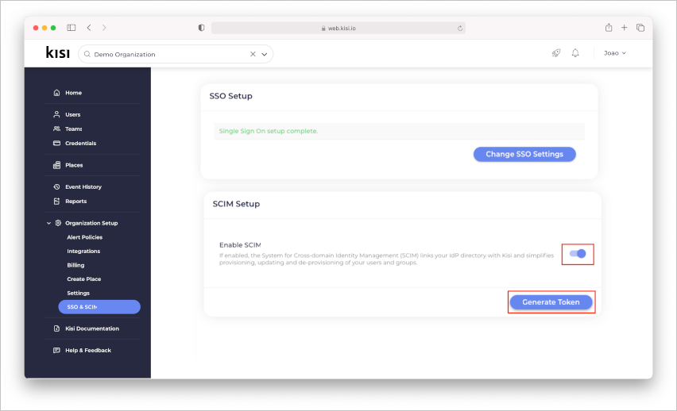

# Tutorial: Konfigurieren von Kisi Physical Security für die automatische Benutzerbereitstellung

In diesem Tutorial werden die Schritte beschrieben, die Sie in Kisi Physical Security und in Azure Active Directory (Azure AD) ausführen müssen, um die automatische Benutzerbereitstellung zu konfigurieren. Nach der Konfiguration stellt Azure AD mithilfe des Azure AD-Bereitstellungsdiensts Benutzer und Gruppen in [Kisi Physical Security](https://www.getkisi.com/) automatisch bereit bzw. hebt die Bereitstellung von Benutzern und Gruppen auf. Wichtige Details zum Zweck und zur Funktionsweise dieses Diensts sowie häufig gestellte Fragen finden Sie unter [Automatisieren der Bereitstellung und Bereitstellungsaufhebung von Benutzern für SaaS-Anwendungen mit Azure Active Directory](../app-provisioning/user-provisioning.md). 

## Unterstützte Funktionen
> [!div class="checklist"]
> * Erstellen von Benutzern in Kisi Physical Security
> * Entfernen von Benutzern in Kisi Physical Security, wenn sie keinen Zugriff mehr benötigen
> * Synchronisieren von Benutzerattributen zwischen Azure AD und Kisi Physical Security
> * Bereitstellen von Gruppen und Gruppenmitgliedschaften in Kisi Physical Security
> * [Einmaliges Anmelden](kisi-physical-security-tutorial.md) bei Kisi Physical Security (empfohlen)

## Voraussetzungen

Das diesem Tutorial zu Grunde liegende Szenario setzt voraus, dass Sie bereits über die folgenden Voraussetzungen verfügen:

* [Einen Azure AD-Mandanten](../develop/quickstart-create-new-tenant.md) 
* Ein Benutzerkonto in Azure AD mit der [Berechtigung](../roles/permissions-reference.md) für die Konfiguration von Bereitstellungen (z. B. Anwendungsadministrator, Cloudanwendungsadministrator, Anwendungsbesitzer oder Globaler Administrator). 
* Eine [Lizenz der Kisi-Organisation](https://www.getkisi.com/enterprise)

## Schritt 1: Planen der Bereitstellung
1. Erfahren Sie, [wie der Bereitstellungsdienst funktioniert](../app-provisioning/user-provisioning.md).
1. Bestimmen Sie, wer [in den Bereitstellungsbereich](../app-provisioning/define-conditional-rules-for-provisioning-user-accounts.md) einbezogen werden soll.
1. Legen Sie fest, welche Daten [zwischen Azure AD und Kisi Physical Security zugeordnet werden sollen](../app-provisioning/customize-application-attributes.md). 

## Schritt 2: Konfigurieren von Kisi Physical Security zur Unterstützung der Bereitstellung mit Azure AD

### Generieren Sie ein geheimes Token in Kisi.

* Melden Sie sich mit Ihrem Kisi-Organisationskonto an.

* Klicken Sie unter „Organization Setup“ (Organisationssetup) auf „SSO & SCIM“ (SSO und SCIM).

* Aktivieren Sie „Enable SCIM“ (SCIM aktivieren), und klicken Sie auf „Generate Token“ (Token generieren).

    

* Kopieren Sie das Token. (Dieses Token wird nur einmal angezeigt.)

## Schritt 3: Hinzufügen von Kisi Physical Security aus dem Azure AD-Anwendungskatalog

Fügen Sie Kisi Physical Security aus dem Azure AD-Anwendungskatalog hinzu, um mit der Verwaltung der Bereitstellung in Kisi Physical Security zu beginnen. Wenn Sie Kisi Physical Security zuvor für das einmalige Anmelden (Single Sign-On, SSO) eingerichtet haben, können Sie dieselbe Anwendung verwenden. Es ist jedoch empfehlenswert, beim erstmaligen Testen der Integration eine separate App zu erstellen. [Hier](../manage-apps/add-application-portal.md) erfahren Sie mehr über das Hinzufügen einer Anwendung aus dem Katalog. 

## Schritt 4. Definieren der Benutzer für den Bereitstellungsbereich 

Mit dem Azure AD-Bereitstellungsdienst können Sie anhand der Zuweisung zur Anwendung oder aufgrund von Attributen für den Benutzer/die Gruppe festlegen, wer in die Bereitstellung einbezogen werden soll. Wenn Sie sich dafür entscheiden, anhand der Zuweisung festzulegen, wer für Ihre App bereitgestellt werden soll, können Sie der Anwendung mithilfe der folgenden [Schritte](../manage-apps/assign-user-or-group-access-portal.md) Benutzer und Gruppen zuweisen. Wenn Sie allein anhand der Attribute des Benutzers oder der Gruppe auswählen möchten, wer bereitgestellt wird, können Sie einen [hier](../app-provisioning/define-conditional-rules-for-provisioning-user-accounts.md) beschriebenen Bereichsfilter verwenden.

* Beim Zuweisen von Benutzern und Gruppen zu Kisi Physical Security müssen Sie eine andere Rolle als den **Standardzugriff** auswählen. Benutzer mit der Rolle „Standardzugriff“ werden von der Bereitstellung ausgeschlossen und in den Bereitstellungsprotokollen als „nicht effektiv berechtigt“ gekennzeichnet. Wenn für die Anwendung nur die Rolle „Standardzugriff“ verfügbar ist, können Sie das [Anwendungsmanifest aktualisieren](../develop/howto-add-app-roles-in-azure-ad-apps.md) und weitere Rollen hinzufügen. 

* Fangen Sie klein an. Testen Sie die Bereitstellung mit einer kleinen Gruppe von Benutzern und Gruppen, bevor Sie sie für alle freigeben. Wenn der Bereitstellungsbereich auf zugewiesene Benutzer und Gruppen festgelegt ist, können Sie dies durch Zuweisen von einem oder zwei Benutzern oder Gruppen zur App kontrollieren. Ist der Bereich auf alle Benutzer und Gruppen festgelegt, können Sie einen [attributbasierten Bereichsfilter](../app-provisioning/define-conditional-rules-for-provisioning-user-accounts.md) angeben. 

## Schritt 5: Konfigurieren der automatischen Benutzerbereitstellung für Kisi Physical Security 

In diesem Abschnitt werden die Schritte zum Konfigurieren des Azure AD-Bereitstellungsdiensts zum Erstellen, Aktualisieren und Deaktivieren von Benutzern und Gruppen in Kisi Physical Security auf der Grundlage von Benutzer- und/oder Gruppenzuweisungen in Azure AD erläutert.

### So konfigurieren Sie die automatische Benutzerbereitstellung für Kisi Physical Security in Azure AD

1. Melden Sie sich beim [Azure-Portal](https://portal.azure.com) an. Wählen Sie **Unternehmensanwendungen** und dann **Alle Anwendungen**.

    

1. Wählen Sie in der Anwendungsliste die Anwendung **Kisi Physical Security** aus.

    

1. Wählen Sie die Registerkarte **Bereitstellung**.

    

1. Legen Sie den **Bereitstellungsmodus** auf **Automatisch** fest.

    

1. Geben Sie im Abschnitt **Administratoranmeldeinformationen** die Mandanten-URL und das geheime Token für Kisi Physical Security ein, die bzw. das Sie von Kisi Physical Security erhalten haben. Klicken Sie auf **Verbindung testen**, um sicherzustellen, dass Azure AD eine Verbindung mit Kisi Physical Security herstellen kann. Wenn die Verbindung nicht hergestellt werden kann, wenden Sie sich an Kisi Physical Security, um die Einrichtung Ihres Kontos zu überprüfen.

    

1. Geben Sie im Feld **Benachrichtigungs-E-Mail** die E-Mail-Adresse einer Person oder Gruppe ein, die Benachrichtigungen zu Bereitstellungsfehlern erhalten soll, und aktivieren Sie das Kontrollkästchen **Bei Fehler E-Mail-Benachrichtigung senden**.

    

1. Wählen Sie **Speichern** aus.

1. Wählen Sie im Abschnitt **Zuordnungen** die Option **Azure Active Directory-Benutzer mit Kisi Physical Security synchronisieren** aus.

1. Überprüfen Sie im Abschnitt **Attributzuordnung** die Benutzerattribute, die von Azure AD mit Kisi Physical Security synchronisiert werden. Mit den als **übereinstimmende** Eigenschaften ausgewählten Attribute werden die Benutzerkonten in Kisi Physical Security bei Updatevorgängen abgeglichen. Wenn Sie sich dafür entscheiden, das [übereinstimmende Zielattribut](../app-provisioning/customize-application-attributes.md) zu ändern, müssen Sie sicherstellen, dass die Kisi Physical Security-API das Filtern von Benutzern anhand dieses Attributs unterstützt. Wählen Sie die Schaltfläche **Speichern**, um alle Änderungen zu übernehmen.

   |attribute|type|Unterstützung für das Filtern|Erforderlich für Kisi Physical Security|
   |---|---|---|---|
   |userName|String|&check;|&check;|   
   |aktiv|Boolean|||
   |displayName|String|||
   |name.givenName|String|||
   |name.familyName|String|||
   |name.formatted|String|||

1. Wählen Sie im Abschnitt **Zuordnungen** die Option **Azure Active Directory-Gruppen mit Kisi Physical Security synchronisieren** aus.

1. Überprüfen Sie im Abschnitt **Attributzuordnung** die Gruppenattribute, die von Azure AD mit Kisi Physical Security synchronisiert werden. Mit den als **übereinstimmende** Eigenschaften ausgewählten Attribute werden die Gruppen in Kisi Physical Security bei Updatevorgängen abgeglichen. Wählen Sie die Schaltfläche **Speichern**, um alle Änderungen zu übernehmen.

      |attribute|type|Unterstützung für das Filtern|Erforderlich für Kisi Physical Security|
      |---|---|---|---|
      |displayName|String|&check;|&check;      
      |members|Verweis||
      |externalId|String|||
1. Wenn Sie Bereichsfilter konfigurieren möchten, lesen Sie die Anweisungen unter [Attributbasierte Anwendungsbereitstellung mit Bereichsfiltern](../app-provisioning/define-conditional-rules-for-provisioning-user-accounts.md).

1. Um den Azure AD-Bereitstellungsdienst für Kisi Physical Security zu aktivieren, ändern Sie im Abschnitt **Einstellungen** den **Bereitstellungsstatus** in **Ein**.

    

1. Legen Sie die Benutzer und Gruppen fest, die in Kisi Physical Security bereitgestellt werden sollen. Wählen Sie dazu im Abschnitt **Einstellungen** unter **Bereich** die entsprechenden Werte aus.

    

1. Wenn Sie fertig sind, klicken Sie auf **Speichern**.

    

Durch diesen Vorgang wird der erstmalige Synchronisierungszyklus für alle Benutzer und Gruppen gestartet, die im Abschnitt **Einstellungen** unter **Bereich** definiert wurden. Der erste Zyklus dauert länger als nachfolgende Zyklen, die ungefähr alle 40 Minuten erfolgen, solange der Azure AD-Bereitstellungsdienst ausgeführt wird. 

## Schritt 6: Überwachen der Bereitstellung
Nachdem Sie die Bereitstellung konfiguriert haben, können Sie mit den folgenden Ressourcen die Bereitstellung überwachen:

* Mithilfe der [Bereitstellungsprotokolle](../reports-monitoring/concept-provisioning-logs.md) können Sie ermitteln, welche Benutzer erfolgreich bzw. nicht erfolgreich bereitgestellt wurden.
* Anhand der [Fortschrittsleiste](../app-provisioning/application-provisioning-when-will-provisioning-finish-specific-user.md) können Sie den Status des Bereitstellungszyklus überprüfen und den Fortschritt der Bereitstellung verfolgen.
* Wenn sich die Bereitstellungskonfiguration in einem fehlerhaften Zustand zu befinden scheint, wird die Anwendung unter Quarantäne gestellt. Weitere Informationen zu den verschiedenen Quarantänestatus finden Sie [hier](../app-provisioning/application-provisioning-quarantine-status.md).  

## Weitere Ressourcen

* [Verwalten der Benutzerkontobereitstellung für Unternehmens-Apps](../app-provisioning/configure-automatic-user-provisioning-portal.md)
* [Was bedeuten Anwendungszugriff und einmaliges Anmelden mit Azure Active Directory?](../manage-apps/what-is-single-sign-on.md)

## Nächste Schritte

* [Erfahren Sie, wie Sie Protokolle überprüfen und Berichte zu Bereitstellungsaktivitäten abrufen.](../app-provisioning/check-status-user-account-provisioning.md)