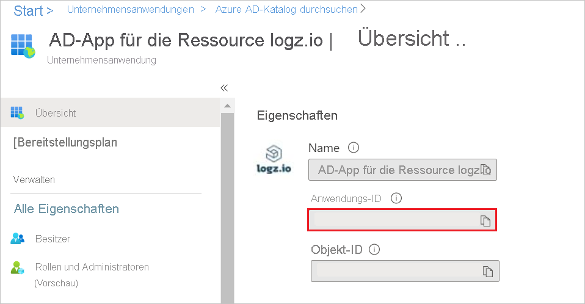
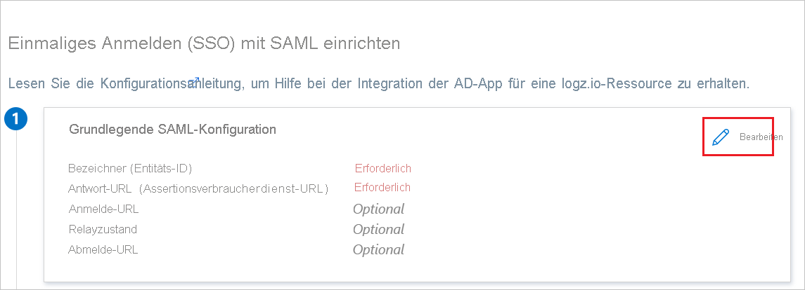
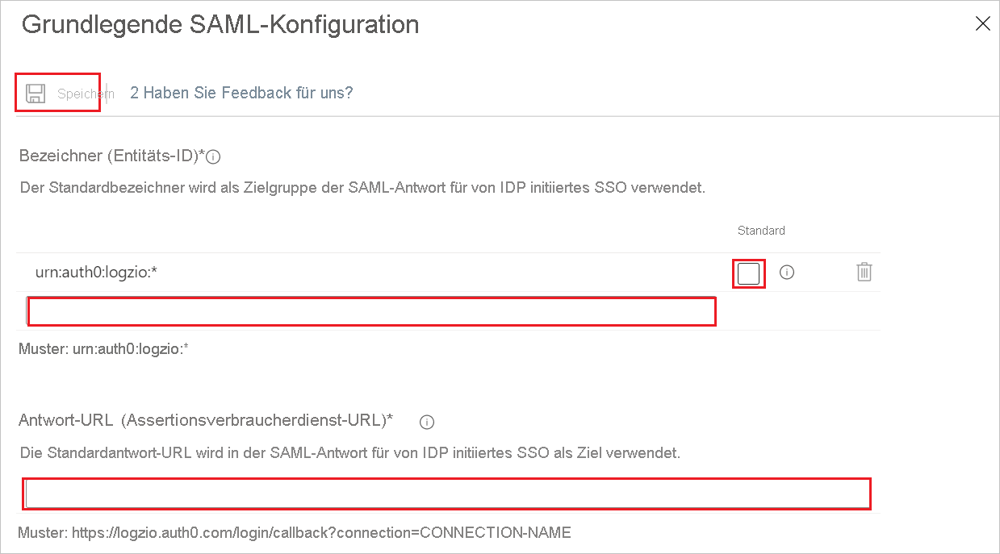
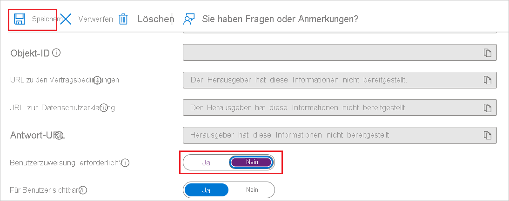
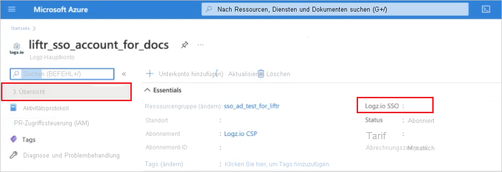

# Tutorial: Einrichten des einmaligen Anmeldens (Single Sign-On, SSO) von Azure Active Directory für „Logz.io – Azure AD Integration“

## Einmaliges Anmelden (Single Sign-On, SSO) für die Logz.io-Integration in das Azure-Portal

Logz.io ermöglicht eine Integration über den Azure Marketplace. Dieses Thema bietet Administratoren eine Anleitung zur Einrichtung von SSO für die Logz.io-Integration in das Azure-Portal, mit der ein SSO-Link für Benutzer bereitgestellt wird, die über den Microsoft Azure Marketplace auf Logz.io-Ressourcen zugreifen.

### Vorteile

Die Bereitstellung von Benutzerzugriff auf die Logz.io-Azure-Ressource per SSO hat folgende Vorteile: 

+ Es ist nicht erforderlich, für jeden Benutzer einen eindeutigen Benutzernamen und ein Kennwort festzulegen: Jeder Benutzer, der über den SSO-Link verfügt, kann sich bei der Anwendung anmelden.
+ Verbesserte Benutzersteuerung: Ein Benutzer muss im Azure-Konto definiert werden, um den SSO-Link verwenden zu können.

Bereiten Sie die SSO-Konnektivität vor, bevor Sie die Azure-Ressource für Logz.io einrichten. Sie benötigen die Anmeldeinformationen, die Sie in diesem Prozess erstellen, um die Ressource einzurichten. 

### Einrichten von SSO-Konnektivität für Ihre Logz.io-Ressource in Azure Active Directory 

Sie erstellen eine Azure Active Directory-Unternehmensanwendung (AD), damit Sie SSO nutzen können, um sich von Ihrer Azure-Ressource aus mit Ihrem Logz.io-Konto zu verbinden. 

### Voraussetzungen: 

Sie benötigen vorab die folgenden Berechtigungen:

* Zugriff auf Azure Active Directory (AAD)
* Berechtigungen zum Erstellen einer neuen Unternehmensanwendung
* Berechtigungen der Rolle „Besitzer“ für das Azure-Abonnement, für das Sie die Logz.io-Ressource erstellen 

Damit Benutzer auf den für eine Logz.io-Azure-Integrationsressource erstellten SSO-Link zugreifen und diesen nutzen können, müssen sie im zugeordneten Azure-Konto definiert sein. 

#### Einrichten eines SSO-Links für die Logz.io-Ressource im Azure-Portal

##### Hinzufügen von „Logz.io – Azure AD Integration“ aus dem Katalog

Um SSO für die Logz.io-Ressource im Azure-Portal zu konfigurieren, müssen Sie die App „Logz.io – Azure AD Integration“ aus dem Katalog zu Ihrer Liste der verwalteten SaaS-Apps hinzufügen.

1. Melden Sie sich mit einem Microsoft-Konto beim Azure-Portal an.
2. Wählen Sie im Azure-Portal unter **Logz.io | Übersicht** im Menü **+ Hinzufügen** die Option **Unternehmensanwendung** aus.

   
   
3. Navigieren Sie im Azure Active Directory-Katalog zur Anwendung **Logz.io – Azure AD Integration**, und wählen Sie sie aus.
4. Benennen Sie die Integration mit einem aussagekräftigen Namen um, und klicken Sie auf **Erstellen**. (In den nachfolgenden Schritten wird der Name **AD-App für eine logz.io-Ressource** verwendet.)

   

##### Kopieren der Anwendungs-ID

Kopieren Sie in **AD-App für eine logz.io-Ressource | Übersicht > Eigenschaften** die Eigenschaft **Anwendungs-ID**.

##### Konfigurieren des einmaligen Anmeldens (Single Sign-On, SSO) von Azure AD

1. Klicken Sie in **AD-App für eine logz.io-Ressource | Übersicht > Erste Schritte** unter **2. SSO einrichten** auf **Erste Schritte**, um die Seite **Einmaliges Anmelden** zu öffnen.

   

2. Wählen Sie in **AD-App für eine logz.io-Ressource | Einmaliges Anmelden** die Methode **SAML** aus.

   

##### Grundlegende SAML-Konfiguration   

1. Klicken Sie in **AD-App für eine logz.io-Ressource | SAML-basierte Anmeldung** auf **Bearbeiten**, um das Fenster **Grundlegende SAML-Konfiguration** zu öffnen.

   

2. Geben Sie im Textfeld **Bezeichner (Entitäts-ID)** einen Wert nach dem Muster `urn:auth0:logzio:*` ein: Ersetzen Sie `*` durch die **Anwendungs-ID**, die Sie in Verfahren 2 kopiert haben, und klicken Sie auf die Option **Standard**. 

3. Geben Sie im Textfeld **Antwort-URL (Assertionsverbraucherdienst-URL)** eine URL nach dem Muster `https://logzio.auth0.com/login/callback?connection=` ein: Ersetzen Sie `CONNECTION_NAME` durch die **Anwendungs-ID**, die Sie in Verfahren 2 kopiert haben.

4. Klicken Sie oben auf der Seite auf **Speichern**.

    

##### Konfigurieren der Benutzerzuweisungsoption    

Legen Sie in **AD-App für eine logz.io-Ressource | Eigenschaften (Verwalten > Eigenschaften)** die Einstellung **Benutzerzuweisung erforderlich?** auf **Nein** fest, und klicken Sie auf **Speichern**.  
Dieser Schritt ermöglicht es Benutzern mit Zugriff auf den SSO-Link, sich über das Microsoft Azure-Portal bei Logz.io anzumelden, ohne dass die einzelnen Benutzer im Active Directory vordefiniert werden müssen.

Mithilfe dieser Option kann jeder in Active Directory definierte Benutzer den SSO-Link verwenden, und Sie müssen nicht für jeden Benutzer spezifische Zugriffsrechte über die soeben erstellte AD-App definieren. 

Wenn Sie diese Option nicht konfigurieren möchten, muss Ihre Organisation jedem Benutzer spezifische Zugriffsrechte für Logz.io zuweisen.

### Aktivieren des einmaligen Anmeldens für Ihre Logz.io-Ressource über Azure Active Directory

Wenn Sie ein Logz.io-Konto erstellen, verwenden Sie die AD-App, die Sie für die Logz.io-Ressource erstellt haben, um das einmalige Anmelden mit Azure Active Directory zu aktivieren.  

Der Ressourcenname der Logz.io-AAD-App wird bei der Eingabe automatisch aufgefüllt.

Der SSO-Link wird angezeigt, wenn Sie sich bei Ihrer Logz.io-Ressource anmelden.   
Klicken Sie auf den Link, um in Logz.io auf Ihr Konto zuzugreifen. 

Wenn Sie beim Erstellen der Logz.io Ressource kein einmaliges Anmelden konfigurieren, können Sie die Konfiguration zu einem späteren Zeitpunkt auf dem Blatt „Einmaliges Anmelden“ nachholen.

Sie müssen Ihre Protokolle in Azure konfigurieren, um sicherzustellen, dass sie an Logz.io gesendet werden.

## Azure Active Directory-SSO für ein vorhandenes Logz.io Konto

In diesem Abschnitt erfahren Sie, wie Sie „Logz.io – Azure AD Integration“ in Azure Active Directory (Azure AD) integrieren. Die Integration von Logz.io – Azure AD-Integration in Azure AD ermöglicht Folgendes:

* Sie können in Azure AD steuern, wer Zugriff auf Logz.io – Azure AD-Integration haben soll.
* Sie können es Ihren Benutzern ermöglichen, sich mit ihrem Azure AD-Konto automatisch bei Logz.io – Azure AD-Integration anzumelden.
* Verwalten Sie Ihre Konten zentral im Azure-Portal.

### Voraussetzungen

Für die ersten Schritte benötigen Sie Folgendes:

* Ein Azure AD-Abonnement Falls Sie über kein Abonnement verfügen, können Sie ein [kostenloses Azure-Konto](https://azure.microsoft.com/free/) verwenden.
* Logz.io – Azure AD-Integration-Abonnement, für das einmaliges Anmelden aktiviert ist.

### Beschreibung des Szenarios

In diesem Tutorial konfigurieren und testen Sie das einmalige Anmelden von Azure AD in einer Testumgebung.

* Logz.io – Azure AD-Integration unterstützt **IDP**-initiiertes einmaliges Anmelden.

### Hinzufügen von Logz.io – Azure AD-Integration aus dem Katalog

Zum Konfigurieren der Integration von Logz.io – Azure AD-Integration in Azure AD müssen Sie Logz.io – Azure AD-Integration über den Katalog zur Liste mit den verwalteten SaaS-Apps hinzufügen.

1. Melden Sie sich mit einem Geschäfts-, Schul- oder Unikonto oder mit einem persönlichen Microsoft-Konto beim Azure-Portal an.
1. Wählen Sie im linken Navigationsbereich den Dienst **Azure Active Directory** aus.
1. Navigieren Sie zu **Unternehmensanwendungen**, und wählen Sie dann **Alle Anwendungen** aus.
1. Wählen Sie zum Hinzufügen einer neuen Anwendung **Neue Anwendung** aus.
1. Geben Sie im Abschnitt **Aus Katalog hinzufügen** den Suchbegriff **Logz.io – Azure AD-Integration** in das Suchfeld ein.
1. Wählen Sie im Ergebnisbereich **Logz.io – Azure AD-Integration** aus, und fügen Sie die App hinzu. Warten Sie einige Sekunden, während die App Ihrem Mandanten hinzugefügt wird.

### Konfigurieren und Testen des einmaligen Anmeldens von Azure AD für Logz.io – Azure AD-Integration

Konfigurieren und testen Sie das einmalige Anmelden von Azure AD mit Logz.io – Azure AD-Integration unter Verwendung eines Testbenutzers namens **B. Simon**. Damit das einmalige Anmelden funktioniert, muss eine Linkbeziehung zwischen einem Azure AD-Benutzer und dem entsprechenden Benutzer in Logz.io – Azure AD-Integration eingerichtet werden.

Führen Sie die folgenden Schritte aus, um das einmalige Anmelden von Azure AD mit Logz.io – Azure AD-Integration zu konfigurieren und zu testen:

1. **[Konfigurieren des einmaligen Anmeldens von Azure AD](#configure-azure-ad-sso)** , um Ihren Benutzern die Verwendung dieses Features zu ermöglichen.
    1. **[Erstellen eines Azure AD-Testbenutzers](#create-an-azure-ad-test-user)** , um das einmalige Anmelden von Azure AD mit dem Testbenutzer B. Simon zu testen.
    1. **[Zuweisen des Azure AD-Testbenutzers](#assign-the-azure-ad-test-user)** , um B. Simon die Verwendung des einmaligen Anmeldens von Azure AD zu ermöglichen.
1. **[Konfigurieren des einmaligen Anmeldens für Logz.io – Azure AD-Integration](#configure-logzio-azure-ad-integration-sso)** , um die Einstellungen für einmaliges Anmelden auf der Anwendungsseite zu konfigurieren.
    1. **[Erstellen eines Testbenutzers für Logz.io – Azure AD-Integration](#create-logzio-azure-ad-integration-test-user)** , um in Logz.io – Azure AD-Integration eine Entsprechung von Britta Simon zu erhalten, die mit der Benutzerdarstellung in Azure AD verknüpft ist.
1. **[Testen des einmaligen Anmeldens](#test-sso)** , um zu überprüfen, ob die Konfiguration funktioniert

### Konfigurieren des einmaligen Anmeldens (Single Sign-On, SSO) von Azure AD

Gehen Sie wie folgt vor, um das einmalige Anmelden von Azure AD im Azure-Portal zu aktivieren.

1. Navigieren Sie im Azure-Portal auf der Anwendungsintegrationsseite für **Logz.io - Azure AD-Integration** zum Abschnitt **Verwalten**, und wählen Sie **Einmaliges Anmelden** aus.
1. Wählen Sie auf der Seite **SSO-Methode auswählen** die Methode **SAML** aus.
1. Klicken Sie auf der Seite **Einmaliges Anmelden (SSO) mit SAML einrichten** auf das Stiftsymbol für **Grundlegende SAML-Konfiguration**, um die Einstellungen zu bearbeiten.

   

1. Führen Sie auf der Seite **Einmaliges Anmelden (SSO) mit SAML einrichten** die folgenden Schritte aus:

    a. Geben Sie im Textfeld **Bezeichner** einen Wert nach folgendem Muster ein: `urn:auth0:logzio:CONNECTION-NAME`

    b. Geben Sie im Textfeld **Antwort-URL** eine URL im folgenden Format ein: `https://logzio.auth0.com/login/callback?connection=CONNECTION-NAME`

    > [!NOTE]
    > Hierbei handelt es sich um Beispielwerte. Aktualisieren Sie diese Werte mit dem eigentlichen Bezeichner und der Antwort-URL. Wenden Sie sich an das [Kundensupportteam von Logz.io – Azure AD-Integration](mailto:help@logz.io), um diese Werte zu erhalten. Sie können sich auch die Muster im Abschnitt **Grundlegende SAML-Konfiguration** im Azure-Portal ansehen.

1. Logz.io – Azure AD-Integration erwartet die SAML-Assertionen in einem bestimmten Format. Daher müssen Sie Ihrer Konfiguration der SAML-Tokenattribute benutzerdefinierte Attributzuordnungen hinzufügen. Der folgende Screenshot zeigt die Liste der Standardattribute.

    

1. Darüber hinaus erwartet Logz.io – Azure AD-Integration, dass in der SAML-Antwort noch einige weitere Attribute zurückgegeben werden (siehe unten). Diese Attribute werden ebenfalls vorab aufgefüllt, Sie können sie jedoch nach Bedarf überprüfen.
    
    | Name |  Quellattribut|
    | ---------------| --------- |
    | session-expiration | user.session-expiration |
    | email | user.mail |
    | Group | user.groups |

1. Navigieren Sie auf der Seite **Einmaliges Anmelden (SSO) mit SAML einrichten** im Abschnitt **SAML-Signaturzertifikat** zum Eintrag **Zertifikat (Base64)** . Wählen Sie **Herunterladen** aus, um das Zertifikat herunterzuladen, und speichern Sie es auf Ihrem Computer.

    

1. Kopieren Sie im Abschnitt **Logz.io – Azure AD-Integration einrichten** die entsprechenden URLs basierend auf Ihren Anforderungen.

    

#### Erstellen eines Azure AD-Testbenutzers

In diesem Abschnitt erstellen Sie im Azure-Portal einen Testbenutzer mit dem Namen B. Simon.

1. Wählen Sie im linken Bereich des Microsoft Azure-Portals **Azure Active Directory** > **Benutzer** > **Alle Benutzer** aus.
1. Wählen Sie oben im Bildschirm die Option **Neuer Benutzer** aus.
1. Führen Sie unter den Eigenschaften für **Benutzer** die folgenden Schritte aus:
   1. Geben Sie im Feld **Name** die Zeichenfolge `B.Simon` ein.  
   1. Geben Sie im Feld **Benutzername** die Zeichenfolge username@companydomain.extension ein. Beispiel: `B.Simon@contoso.com`.
   1. Aktivieren Sie das Kontrollkästchen **Kennwort anzeigen**, und notieren Sie sich den Wert aus dem Feld **Kennwort**.
   1. Klicken Sie auf **Erstellen**.

#### Zuweisen des Azure AD-Testbenutzers

In diesem Abschnitt ermöglichen Sie B. Simon die Verwendung des einmaligen Anmeldens von Azure, indem Sie ihr Zugriff auf Logz.io – Azure AD-Integration gewähren.

1. Wählen Sie im Azure-Portal **Unternehmensanwendungen** > **Alle Anwendungen** aus.
1. Wählen Sie in der Anwendungsliste die Option **Logz.io – Azure AD-Integration** aus.
1. Navigieren Sie auf der Übersichtsseite der App zum Abschnitt **Verwalten**, und wählen Sie **Benutzer und Gruppen** aus.
1. Wählen Sie **Benutzer hinzufügen** und anschließend im Dialogfeld **Zuweisung hinzufügen** die Option **Benutzer und Gruppen** aus.
1. Wählen Sie im Dialogfeld **Benutzer und Gruppen** in der Liste „Benutzer“ den Eintrag **B. Simon** aus, und klicken Sie dann unten auf dem Bildschirm auf die Schaltfläche **Auswählen**.
1. Wenn Sie einen beliebigen Rollenwert in der SAML-Assertion erwarten, wählen Sie im Dialogfeld **Rolle auswählen** die entsprechende Rolle für den Benutzer in der Liste aus, und klicken Sie dann im unteren Bildschirmbereich auf die Schaltfläche **Auswählen**.
1. Klicken Sie im Dialogfeld **Zuweisung hinzufügen** auf die Schaltfläche **Zuweisen**.

### Konfigurieren des einmaligen Anmeldens für Logz.io – Azure AD-Integration

Zum Konfigurieren des einmaligen Anmeldens aufseiten von **Logz.io – Azure AD-Integration** müssen Sie das heruntergeladene **Zertifikat (Base64)** und die kopierten URLs aus dem Azure-Portal an das [Supportteam von Logz.io – Azure AD-Integration](mailto:help@logz.io) senden. Es führt die Einrichtung durch, damit die SAML-SSO-Verbindung auf beiden Seiten richtig festgelegt ist.

#### Erstellen eines Testbenutzers für Logz.io – Azure AD-Integration

In diesem Abschnitt erstellen Sie in Logz.io – Azure AD-Integration einen Benutzer namens Britta Simon. Wenden Sie sich an das [Supportteam von Logz.io – Azure AD-Integration](mailto:help@logz.io), um Benutzer zur Logz.io – Azure AD-Integration-Plattform hinzuzufügen. Benutzer müssen erstellt und aktiviert werden, damit Sie einmaliges Anmelden verwenden können.

### Testen des einmaligen Anmeldens 

In diesem Abschnitt testen Sie die Azure AD-Konfiguration für einmaliges Anmelden mit den folgenden Optionen:

* Klicken Sie im Azure-Portal auf „Diese Anwendung testen“. Dadurch sollten Sie automatisch bei der Logz.io Azure AD-Integration-Instanz angemeldet werden, für die Sie einmaliges Anmelden eingerichtet haben.

* Sie können „Meine Apps“ von Microsoft verwenden. Wenn Sie unter „Meine Apps“ auf die Kachel „Logz.io – Azure AD-Integration“ klicken, sollten Sie automatisch bei der Logz.io – Azure AD-Integration-Instanz angemeldet werden, für die Sie einmaliges Anmelden eingerichtet haben. Weitere Informationen zu „Meine Apps“ finden Sie in [dieser Einführung](https://support.microsoft.com/account-billing/sign-in-and-start-apps-from-the-my-apps-portal-2f3b1bae-0e5a-4a86-a33e-876fbd2a4510).

### Nächste Schritte

Nach dem Konfigurieren von Logz.io Azure AD-Integration können Sie die Sitzungssteuerung erzwingen, die in Echtzeit vor der Exfiltration und Infiltration vertraulicher Unternehmensdaten schützt. Die Sitzungssteuerung basiert auf bedingtem Zugriff. [Erfahren Sie, wie Sie die Sitzungssteuerung mit Microsoft Defender for Cloud Apps erzwingen.](/cloud-app-security/proxy-deployment-aad)
