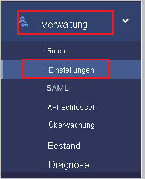
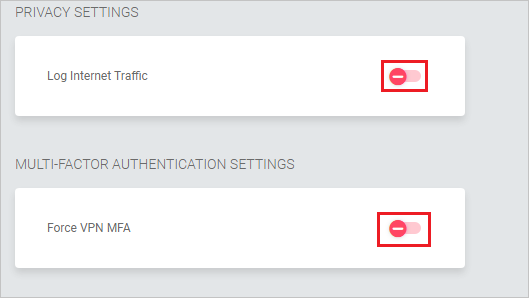
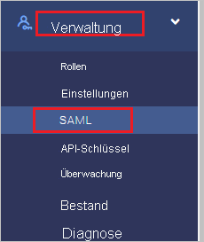
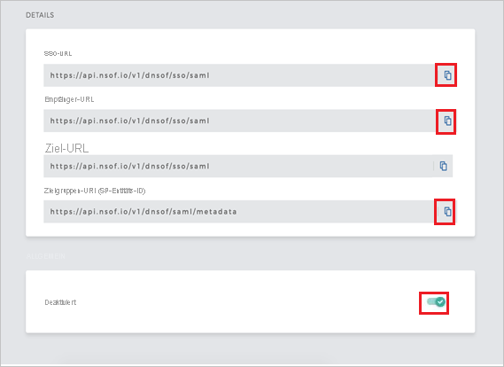
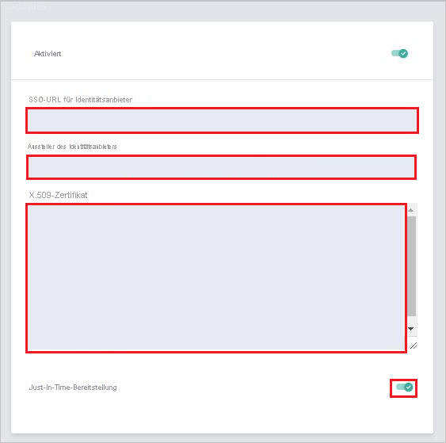

# Tutorial: Azure Active Directory-Integration mit Meta Networks Connector

In diesem Tutorial erfahren Sie, wie Sie Meta Networks Connector in Azure Active Directory (Azure AD) integrieren. Die Integration von Meta Networks Connector in Azure AD ermöglicht Folgendes:

* Sie können in Azure AD steuern, wer Zugriff auf Meta Networks Connector hat.
* Ermöglichen Sie Ihren Benutzern, sich mit ihren Azure AD-Konten automatisch bei Meta Networks Connector anzumelden.
* Verwalten Sie Ihre Konten zentral im Azure-Portal.

## Voraussetzungen

Für die ersten Schritte benötigen Sie Folgendes:

* Ein Azure AD-Abonnement Falls Sie über kein Abonnement verfügen, können Sie ein [kostenloses Azure-Konto](https://azure.microsoft.com/free/) verwenden.
* Meta Networks Connector-Abonnement, für das einmaliges Anmelden (SSO) aktiviert ist.

## Beschreibung des Szenarios

In diesem Tutorial konfigurieren und testen Sie das einmalige Anmelden von Azure AD in einer Testumgebung.

* Meta Networks Connector unterstützt **SP**- und **IDP**-initiiertes einmaliges Anmelden.
 
* Meta Networks Connector unterstützt die **Just-in-Time**-Bereitstellung.

* Meta Networks Connector unterstützt die [Automatisierte Benutzerbereitstellung](meta-networks-connector-provisioning-tutorial.md).

## Hinzufügen von Meta Networks Connector aus dem Katalog

Zum Konfigurieren der Integration von Meta Networks Connector in Azure AD müssen Sie Meta Networks Connector aus dem Katalog zur Liste der verwalteten SaaS-Apps hinzufügen.

1. Melden Sie sich mit einem Geschäfts-, Schul- oder Unikonto oder mit einem persönlichen Microsoft-Konto beim Azure-Portal an.
1. Wählen Sie im linken Navigationsbereich den Dienst **Azure Active Directory** aus.
1. Navigieren Sie zu **Unternehmensanwendungen**, und wählen Sie dann **Alle Anwendungen** aus.
1. Wählen Sie zum Hinzufügen einer neuen Anwendung **Neue Anwendung** aus.
1. Geben Sie im Abschnitt **Aus Katalog hinzufügen** den Suchbegriff **Meta Networks Connector** in das Suchfeld ein.
1. Wählen Sie im Ergebnisbereich **Meta Networks Connector** aus, und fügen Sie dann die App hinzu. Warten Sie einige Sekunden, während die App Ihrem Mandanten hinzugefügt wird.

## Konfigurieren und Testen des einmaligen Anmeldens von Azure AD für Meta Networks Connector

Konfigurieren und testen Sie das einmalige Anmelden von Azure AD mit Meta Networks Connector mithilfe eines Testbenutzers mit dem Namen **B. Simon**. Damit einmaliges Anmelden funktioniert, muss eine Linkbeziehung zwischen einem Azure AD-Benutzer und dem entsprechenden Benutzer in Meta Networks Connector eingerichtet werden.

Führen Sie zum Konfigurieren und Testen des einmaligen Anmeldens von Azure AD mit Meta Networks Connector die folgenden Schritte aus:

1. **[Konfigurieren des einmaligen Anmeldens von Azure AD](#configure-azure-ad-sso)** , um Ihren Benutzern die Verwendung dieses Features zu ermöglichen.
    1. **[Erstellen eines Azure AD-Testbenutzers](#create-an-azure-ad-test-user)** , um das einmalige Anmelden von Azure AD mit dem Testbenutzer B. Simon zu testen.
    1. **[Zuweisen des Azure AD-Testbenutzers](#assign-the-azure-ad-test-user)** , um B. Simon die Verwendung des einmaligen Anmeldens von Azure AD zu ermöglichen.
1. **[Konfigurieren des einmaligen Anmeldens für Meta Networks Connector](#configure-meta-networks-connector-sso)** , um die Einstellungen für einmaliges Anmelden auf der Anwendungsseite zu konfigurieren.
    1. **[Erstellen eines Meta Networks Connector-Testbenutzers](#create-meta-networks-connector-test-user)** , um eine Entsprechung von Britta Simon in Meta Networks Connector zu erhalten, die mit ihrer Darstellung in Azure AD verknüpft ist.
1. **[Testen des einmaligen Anmeldens](#test-sso)** , um zu überprüfen, ob die Konfiguration funktioniert

## Konfigurieren des einmaligen Anmeldens (Single Sign-On, SSO) von Azure AD

Gehen Sie wie folgt vor, um das einmalige Anmelden von Azure AD im Azure-Portal zu aktivieren.

1. Navigieren Sie im Azure-Portal auf der Anwendungsintegrationsseite für **Meta Networks Connector** zum Abschnitt **Verwalten**, und wählen Sie **Einmaliges Anmelden** aus.
1. Wählen Sie auf der Seite **SSO-Methode auswählen** die Methode **SAML** aus.
1. Klicken Sie auf der Seite **Einmaliges Anmelden (SSO) mit SAML einrichten** auf das Stiftsymbol für **Grundlegende SAML-Konfiguration**, um die Einstellungen zu bearbeiten.

   

4. Führen Sie im Abschnitt **Grundlegende SAML-Konfiguration** die folgenden Schritte aus, wenn Sie die Anwendung im **IDP**-initiierten Modus konfigurieren möchten:

    a. Geben Sie im Textfeld **Bezeichner** eine URL im folgenden Format ein: `https://login.nsof.io/v1/<ORGANIZATION-SHORT-NAME>/saml/metadata`

    b. Geben Sie im Textfeld **Antwort-URL** eine URL im folgenden Format ein: `https://login.nsof.io/v1/<ORGANIZATION-SHORT-NAME>/sso/saml`

5. Klicken Sie auf **Zusätzliche URLs festlegen**, und führen Sie den folgenden Schritt aus, wenn Sie die Anwendung im **SP-initiierten Modus** konfigurieren möchten:

    a. Geben Sie im Textfeld **Anmelde-URL** eine URL im folgenden Format ein: `https://<ORGANIZATION-SHORT-NAME>.metanetworks.com/login`

    b. Geben Sie im Textfeld **Relayzustand** eine URL nach folgendem Muster ein: `https://<ORGANIZATION-SHORT-NAME>.metanetworks.com/#/`

    > [!NOTE]
    > Hierbei handelt es sich um Beispielwerte. Ersetzen Sie diese Werte durch die tatsächlichen Werte für Bezeichner, Antwort-URL und Anmelde-URL. Darauf wird später im Tutorial eingegangen.

6. Die Meta Networks Connector-Anwendung erwartet die SAML-Assertionen in einem bestimmten Format. Daher müssen Sie Ihrer Konfiguration der SAML-Tokenattribute benutzerdefinierte Attributzuordnungen hinzufügen. Der folgende Screenshot zeigt die Liste der Standardattribute. Klicken Sie auf das Symbol **Bearbeiten**, um das Dialogfeld **Benutzerattribute** zu öffnen.

    
    
7. Darüber hinaus wird von der Meta Networks Connector-Anwendung erwartet, dass in der SAML-Antwort noch einige weitere Attribute zurückgegeben werden. Führen Sie im Dialogfeld **Benutzerattribute** im Abschnitt **Benutzeransprüche** die folgenden Schritte aus, um das SAML-Tokenattribut wie in der folgenden Tabelle gezeigt hinzuzufügen:
    
    | Name | Quellattribut | Namespace|
    | ---------------| --------------- | -------- |
    | firstname | user.givenname | |
    | lastname | user.surname | |
    | emailaddress| user.mail| `http://schemas.xmlsoap.org/ws/2005/05/identity/claims` |
    | name | user.userprincipalname| `http://schemas.xmlsoap.org/ws/2005/05/identity/claims` |
    | phone | user.telephonenumber | |

    a. Klicken Sie auf **Neuen Anspruch hinzufügen**, um das Dialogfeld **Benutzeransprüche verwalten** zu öffnen.

    

    

    b. Geben Sie im Textfeld **Name** den für die Zeile angezeigten Attributnamen ein.

    c. Lassen Sie den **Namespace** leer.

    d. Wählen Sie „Source“ als **Attribut** aus.

    e. Geben Sie in der Liste **Quellattribut** den für diese Zeile angezeigten Attributwert ein.

    f. Klicken Sie auf **OK**.

    g. Klicken Sie auf **Speichern**.

8. Klicken Sie auf der Seite **Einmaliges Anmelden (SSO) mit SAML einrichten** im Abschnitt **SAML-Signaturzertifikat** auf **Herunterladen**, um das Ihrer Anforderung entsprechende **Zertifikat (Base64)** aus den angegebenen Optionen herunterzuladen und auf Ihrem Computer zu speichern.

    

9. Kopieren Sie im Abschnitt **Meta Networks Connector einrichten** die entsprechenden URLs gemäß Ihren Anforderungen.

    

### Erstellen eines Azure AD-Testbenutzers 

In diesem Abschnitt erstellen Sie im Azure-Portal einen Testbenutzer mit dem Namen B. Simon.

1. Wählen Sie im linken Bereich des Microsoft Azure-Portals **Azure Active Directory** > **Benutzer** > **Alle Benutzer** aus.
1. Wählen Sie oben im Bildschirm die Option **Neuer Benutzer** aus.
1. Führen Sie unter den Eigenschaften für **Benutzer** die folgenden Schritte aus:
   1. Geben Sie im Feld **Name** die Zeichenfolge `B.Simon` ein.  
   1. Geben Sie im Feld **Benutzername** die Zeichenfolge username@companydomain.extension ein. Beispiel: `B.Simon@contoso.com`.
   1. Aktivieren Sie das Kontrollkästchen **Kennwort anzeigen**, und notieren Sie sich den Wert aus dem Feld **Kennwort**.
   1. Klicken Sie auf **Erstellen**.

### Zuweisen des Azure AD-Testbenutzers

In diesem Abschnitt gewähren Sie B. Simon Zugriff auf Meta Networks Connector, damit sie das einmalige Anmelden von Azure verwenden kann.

1. Wählen Sie im Azure-Portal **Unternehmensanwendungen** > **Alle Anwendungen** aus.
1. Wählen Sie in der Anwendungsliste **Meta Networks Connector** aus.
1. Navigieren Sie auf der Übersichtsseite der App zum Abschnitt **Verwalten**, und wählen Sie **Benutzer und Gruppen** aus.
1. Wählen Sie **Benutzer hinzufügen** und anschließend im Dialogfeld **Zuweisung hinzufügen** die Option **Benutzer und Gruppen** aus.
1. Wählen Sie im Dialogfeld **Benutzer und Gruppen** in der Liste „Benutzer“ den Eintrag **B. Simon** aus, und klicken Sie dann unten auf dem Bildschirm auf die Schaltfläche **Auswählen**.
1. Wenn den Benutzern eine Rolle zugewiesen werden soll, können Sie sie im Dropdownmenü **Rolle auswählen** auswählen. Wurde für diese App keine Rolle eingerichtet, ist die Rolle „Standardzugriff“ ausgewählt.
1. Klicken Sie im Dialogfeld **Zuweisung hinzufügen** auf die Schaltfläche **Zuweisen**.

## Konfigurieren des einmaligen Anmeldens für Meta Networks Connector

1. Öffnen Sie eine neue Registerkarte in Ihrem Browser, und melden Sie sich mit Ihrem Meta Networks Connector-Administratorkonto an.
    
    > [!NOTE]
    > Meta Networks Connector ist ein sicheres System. Vor dem Zugriff auf das Portal müssen Sie daher dafür sorgen, dass Ihre öffentliche IP-Adresse der entsprechenden Liste zugelassener IP-Adressen hinzugefügt wird. Klicken Sie zum Abrufen Ihrer öffentlichen IP-Adresse auf [diesen](https://whatismyipaddress.com/) Link. Senden Sie Ihre IP-Adresse an das [Supportteam für den Meta Networks Connector-Client](mailto:support@metanetworks.com), damit sie der Liste zugelassener IP-Adressen hinzugefügt werden kann.
    
2. Klicken Sie auf **Verwaltung** und dann auf **Einstellungen**.
    
    
    
3. Stellen Sie sicher, dass **Log Internet Traffic** (Internetdatenverkehr protokollieren) und **Force VPN MFA** (VPN-MFA erzwingen) deaktiviert sind.
    
    
    
4. Klicken Sie auf **Verwaltung** und dann auf **SAML**.
    
    
    
5. Führen Sie auf der Registerkarte **DETAILS** die folgenden Schritte aus:
    
    
    
    a. Kopieren Sie den Wert für **SSO-URL**, und fügen Sie ihn im Abschnitt **Domäne und URLs für Meta Networks Connector** ins Textfeld **Anmelde-URL** ein.
    
    b. Kopieren Sie den Wert für **Empfänger-URL**, und fügen Sie ihn im Abschnitt **Domäne und URLs für Meta Networks Connector** ins Textfeld **Antwort-URL** ein.
    
    c. Kopieren Sie den Wert für **Audience URI (SP Entity ID)** (Zielgruppen-URI (SP-Identitäts-ID)), und fügen Sie ihn im Abschnitt **Domäne und URLs für Meta Networks Connector** ins Textfeld **Bezeichner (Entitäts-ID)** ein.
    
    d. Aktivieren Sie die SAML.
    
6. Führen Sie auf der Registerkarte **GENERAL** (ALLGEMEIN) die folgenden Schritte aus:

    

    a. Fügen Sie den Wert der **Anmelde-URL**, den Sie aus dem Azure-Portal kopiert haben, in **URL für einmaliges Anmelden des Identitätsanbieters** ein.

    b. Fügen Sie in **Identity Provider Issuer** (Aussteller des Identitätsanbieters) den Wert von **Azure AD-Bezeichner** ein, den Sie aus dem Azure-Portal kopiert haben.

    c. Öffnen Sie das aus dem Azure-Portal heruntergeladene Zertifikat im Editor, und fügen Sie es in das Textfeld **X 509 Certificate** (X.509-Zertifikat) ein.

    d. Aktivieren Sie die **Just-in-Time-Bereitstellung**.

### Erstellen eines Meta Networks Connector-Testbenutzers

In diesem Abschnitt wird eine Benutzerin mit dem Namen „Britta Simon“ in Meta Networks Connector erstellt. Meta Networks Connector unterstützt die Just-in-Time-Bereitstellung, die standardmäßig aktiviert ist. Für Sie steht in diesem Abschnitt kein Aktionselement zur Verfügung. Falls in Meta Networks Connector nicht bereits ein Benutzer vorhanden ist, wird ein neuer erstellt, wenn Sie versuchen, auf Meta Networks Connector zuzugreifen.

>[!Note]
>Wenn Sie einen Benutzer manuell erstellen müssen, setzen Sie sich mit dem [Supportteam für den Meta Networks Connector-Client](mailto:support@metanetworks.com) in Verbindung.

Außerdem unterstützt Meta Networks die automatische Benutzerbereitstellung. Weitere Informationen zum Konfigurieren der automatischen Benutzerbereitstellung finden Sie [hier](./meta-networks-connector-provisioning-tutorial.md).

## Testen des einmaligen Anmeldens 

In diesem Abschnitt testen Sie die Azure AD-Konfiguration für einmaliges Anmelden mit den folgenden Optionen: 

#### SP-initiiert:

* Klicken Sie im Azure-Portal auf **Diese Anwendung testen**. Dadurch werden Sie zur Anmelde-URL für Meta Networks Connector weitergeleitet, wo Sie den Anmeldeflow initiieren können.  

* Rufen Sie direkt die Meta Networks Connector-Anmelde-URL auf, und initiieren Sie den Anmeldeflow.

#### IDP-initiiert:

* Klicken Sie im Azure-Portal auf **Diese Anwendung testen**. Dadurch sollten Sie automatisch bei der Meta Networks Connector-Instanz angemeldet werden, für die Sie einmaliges Anmelden eingerichtet haben. 

Sie können auch den Microsoft-Bereich „Meine Apps“ verwenden, um die Anwendung in einem beliebigen Modus zu testen. Beim Klicken auf die Kachel „Meta Networks Connector“ in „Meine Apps“ geschieht Folgendes: Wenn Sie die Anwendung im SP-Modus konfiguriert haben, werden Sie zum Initiieren des Anmeldeflows zur Anmeldeseite der Anwendung weitergeleitet. Wenn Sie die Anwendung im IDP-Modus konfiguriert haben, sollten Sie automatisch bei der Meta Networks Connector-Instanz angemeldet werden, für die Sie einmaliges Anmelden eingerichtet haben. Weitere Informationen zu „Meine Apps“ finden Sie in [dieser Einführung](https://support.microsoft.com/account-billing/sign-in-and-start-apps-from-the-my-apps-portal-2f3b1bae-0e5a-4a86-a33e-876fbd2a4510).

## Nächste Schritte

Nach dem Konfigurieren von Meta Networks Connector können Sie die Sitzungssteuerung erzwingen, die in Echtzeit vor der Exfiltration und Infiltration vertraulicher Unternehmensdaten schützt. Die Sitzungssteuerung basiert auf bedingtem Zugriff. [Erfahren Sie, wie Sie die Sitzungssteuerung mit Microsoft Defender for Cloud Apps erzwingen.](/cloud-app-security/proxy-deployment-aad)
