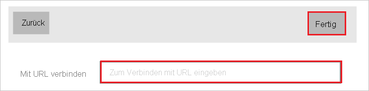
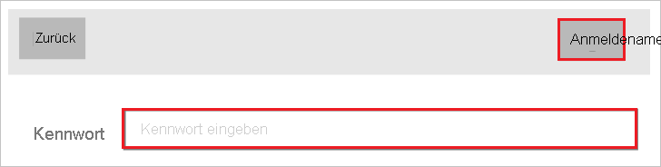
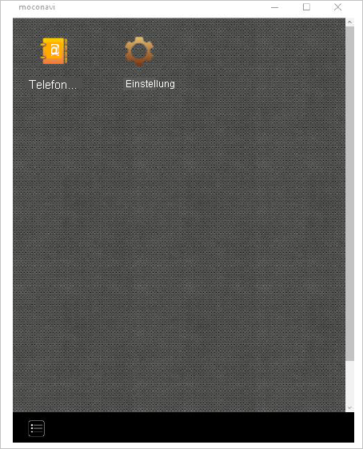

# Tutorial: Integration des einmaligen Anmeldens (Single Sign-On, SSO) von Azure AD mit moconavi

In diesem Tutorial erfahren Sie, wie Sie moconavi in Azure Active Directory (Azure AD) integrieren. Die Integration von moconavi in Azure AD ermöglicht Folgendes:

* Steuern Sie in Azure AD, wer Zugriff auf moconavi hat.
* Ermöglichen Sie es Ihren Benutzern, sich mit ihren Azure AD-Konten automatisch bei moconavi anzumelden.
* Verwalten Sie Ihre Konten zentral im Azure-Portal.

## Voraussetzungen

Für die ersten Schritte benötigen Sie Folgendes:

* Ein Azure AD-Abonnement Falls Sie über kein Abonnement verfügen, können Sie ein [kostenloses Azure-Konto](https://azure.microsoft.com/free/) verwenden.
* Ein moconavi-Abonnement, für das einmaliges Anmelden (SSO) aktiviert ist

## Beschreibung des Szenarios

In diesem Tutorial konfigurieren und testen Sie das einmalige Anmelden von Azure AD in einer Testumgebung.

* moconavi unterstützt **SP-initiiertes** einmaliges Anmelden.

## Hinzufügen von moconavi aus dem Katalog

Zum Konfigurieren der Integration von moconavi in Azure AD müssen Sie moconavi aus dem Katalog der Liste mit den verwalteten SaaS-Apps hinzufügen.

1. Melden Sie sich mit einem Geschäfts-, Schul- oder Unikonto oder mit einem persönlichen Microsoft-Konto beim Azure-Portal an.
1. Wählen Sie im linken Navigationsbereich den Dienst **Azure Active Directory** aus.
1. Navigieren Sie zu **Unternehmensanwendungen**, und wählen Sie dann **Alle Anwendungen** aus.
1. Wählen Sie zum Hinzufügen einer neuen Anwendung **Neue Anwendung** aus.
1. Geben Sie im Abschnitt **Aus Katalog hinzufügen** den Suchbegriff **moconavi** in das Suchfeld ein.
1. Wählen Sie im Ergebnisbereich den Eintrag **moconavi** aus, und fügen Sie dann die App hinzu. Warten Sie einige Sekunden, während die App Ihrem Mandanten hinzugefügt wird.

## Konfigurieren und Testen des einmaligen Anmeldens von Azure AD für moconavi

Konfigurieren und testen Sie das einmalige Anmelden von Azure AD mit moconavi anhand eines Testbenutzers mit dem Namen **B.Simon**. Damit einmaliges Anmelden funktioniert, muss eine Linkbeziehung zwischen einem Azure AD-Benutzer und dem entsprechenden Benutzer in moconavi eingerichtet werden.

Führen Sie zum Konfigurieren und Testen des einmaligen Anmeldens von Azure AD mit moconavi die folgenden Schritte aus:

1. **[Konfigurieren des einmaligen Anmeldens von Azure AD](#configure-azure-ad-sso)** , um Ihren Benutzern die Verwendung dieses Features zu ermöglichen.
    1. **[Erstellen eines Azure AD-Testbenutzers](#create-an-azure-ad-test-user)** , um das einmalige Anmelden von Azure AD mit dem Testbenutzer B. Simon zu testen.
    1. **[Zuweisen des Azure AD-Testbenutzers](#assign-the-azure-ad-test-user)** , um B. Simon die Verwendung des einmaligen Anmeldens von Azure AD zu ermöglichen.
1. **[Konfigurieren des einmaligen Anmeldens für moconavi](#configure-moconavi-sso)** , um die Einstellungen für einmaliges Anmelden auf der Anwendungsseite zu konfigurieren.
    1. **[Erstellen eines moconavi-Testbenutzers](#create-moconavi-test-user)** , um ein Pendant für B.Simon in moconavi zu erhalten, das mit dem äquivalenten Benutzer in Azure AD verknüpft ist.
1. **[Testen des einmaligen Anmeldens](#test-sso)** , um zu überprüfen, ob die Konfiguration funktioniert

## Konfigurieren des einmaligen Anmeldens (Single Sign-On, SSO) von Azure AD

Gehen Sie wie folgt vor, um das einmalige Anmelden von Azure AD im Azure-Portal zu aktivieren.

1. Navigieren Sie im Azure-Portal auf der Anwendungsintegrationsseite für **moconavi** zum Abschnitt **Verwalten**, und wählen Sie **Einmaliges Anmelden** aus.
1. Wählen Sie auf der Seite **SSO-Methode auswählen** die Methode **SAML** aus.
1. Klicken Sie auf der Seite **Einmaliges Anmelden (SSO) mit SAML einrichten** auf das Stiftsymbol für **Grundlegende SAML-Konfiguration**, um die Einstellungen zu bearbeiten.

   

4. Führen Sie im Abschnitt **Grundlegende SAML-Konfiguration** die folgenden Schritte aus:

    a. Geben Sie im Feld **Bezeichner** eine URL im folgenden Format ein: `https://<yourserverurl>/moconavi-saml2`.

    b. Geben Sie im Textfeld **Antwort-URL** eine URL im folgenden Format ein: `https://<yourserverurl>/moconavi-saml2/saml/SSO`

    c. Geben Sie im Textfeld **Anmelde-URL** eine URL im folgenden Format ein: `https://<yourserverurl>/moconavi-saml2/saml/login`

    > [!NOTE]
    > Hierbei handelt es sich um Beispielwerte. Ersetzen Sie diese Werte durch die tatsächlichen Werte für Bezeichner, Antwort-URL und Anmelde-URL. Wenden Sie sich an das [Supportteam von moconavi](mailto:support@recomot.co.jp), um diese Werte zu erhalten. Sie können sich auch die Muster im Abschnitt **Grundlegende SAML-Konfiguration** im Azure-Portal ansehen.

5. Klicken Sie auf der Seite **Einmaliges Anmelden (SSO) mit SAML einrichten** im Abschnitt **SAML-Signaturzertifikat** auf **Herunterladen**, um den Ihren Anforderungen entsprechenden **Verbundmetadaten-XML**-Code aus den verfügbaren Optionen herunterzuladen und auf Ihrem Computer zu speichern.

    

6. Kopieren Sie im Abschnitt **moconavi einrichten** die entsprechenden URLs gemäß Ihren Anforderungen.

    

### Erstellen eines Azure AD-Testbenutzers 

In diesem Abschnitt erstellen Sie im Azure-Portal einen Testbenutzer mit dem Namen B. Simon.

1. Wählen Sie im linken Bereich des Microsoft Azure-Portals **Azure Active Directory** > **Benutzer** > **Alle Benutzer** aus.
1. Wählen Sie oben im Bildschirm die Option **Neuer Benutzer** aus.
1. Führen Sie unter den Eigenschaften für **Benutzer** die folgenden Schritte aus:
   1. Geben Sie im Feld **Name** die Zeichenfolge `B.Simon` ein.  
   1. Geben Sie im Feld **Benutzername** die Zeichenfolge username@companydomain.extension ein. Beispiel: `B.Simon@contoso.com`.
   1. Aktivieren Sie das Kontrollkästchen **Kennwort anzeigen**, und notieren Sie sich den Wert aus dem Feld **Kennwort**.
   1. Klicken Sie auf **Erstellen**.

### Zuweisen des Azure AD-Testbenutzers

In diesem Abschnitt ermöglichen Sie B.Simon die Verwendung des einmaligen Anmeldens von Azure, indem Sie ihr Zugriff auf moconavi gewähren.

1. Wählen Sie im Azure-Portal **Unternehmensanwendungen** > **Alle Anwendungen** aus.
1. Wählen Sie in der Anwendungsliste **moconavi** aus.
1. Navigieren Sie auf der Übersichtsseite der App zum Abschnitt **Verwalten**, und wählen Sie **Benutzer und Gruppen** aus.
1. Wählen Sie **Benutzer hinzufügen** und anschließend im Dialogfeld **Zuweisung hinzufügen** die Option **Benutzer und Gruppen** aus.
1. Wählen Sie im Dialogfeld **Benutzer und Gruppen** in der Liste „Benutzer“ den Eintrag **B. Simon** aus, und klicken Sie dann unten auf dem Bildschirm auf die Schaltfläche **Auswählen**.
1. Wenn den Benutzern eine Rolle zugewiesen werden soll, können Sie sie im Dropdownmenü **Rolle auswählen** auswählen. Wurde für diese App keine Rolle eingerichtet, ist die Rolle „Standardzugriff“ ausgewählt.
1. Klicken Sie im Dialogfeld **Zuweisung hinzufügen** auf die Schaltfläche **Zuweisen**.

## Konfigurieren des einmaligen Anmeldens für moconavi

Zum Konfigurieren des einmaligen Anmeldens aufseiten von **moconavi** müssen Sie die heruntergeladene **Verbundmetadaten-XML** und die kopierten URLs aus dem Azure-Portal an das [Supportteam von moconavi](mailto:support@recomot.co.jp) senden. Es führt die Einrichtung durch, damit die SAML-SSO-Verbindung auf beiden Seiten richtig festgelegt ist.

### Erstellen eines moconavi-Testbenutzers

In diesem Abschnitt erstellen Sie in moconavi eine Benutzerin namens Britta Simon. Das [moconavi-Supportteam](mailto:support@recomot.co.jp) kann Sie dabei unterstützen, Benutzer der moconavi-Plattform hinzuzufügen. Benutzer müssen erstellt und aktiviert werden, damit Sie einmaliges Anmelden verwenden können.

## Testen des einmaligen Anmeldens

1. Installieren Sie moconavi über den Microsoft Store.

2. Starten Sie moconavi.

3. Klicken Sie auf die Schaltfläche **Connect setting** (Einstellung verbinden).

    

4. Geben Sie im Textfeld **Connect to URL** (Mit URL verbinden) den Wert `https://mcs-admin.moconavi.biz/gateway` ein, und klicken Sie dann auf die Schaltfläche **Done** (Fertig).

    

5. Führen Sie im folgenden Bildschirm diese Schritte aus:

    

    a. Geben Sie im Textfeld **Input Authentication Key** (Authentifizierungsschlüssel eingeben) den **Authentifizierungsschlüssel**`azureAD` ein.

    b. Geben Sie im Textfeld **Input User ID** (Benutzer-ID eingeben) die **Benutzer-ID**`your ad account` ein.

    c. Klicken Sie auf **LOGIN** (Anmelden).

6. Geben Sie im Textfeld **Password** (Kennwort) Ihr Azure AD-Kennwort ein, und klicken Sie auf die Schaltfläche **Login** (Anmelden).

    

7. Die Azure AD-Authentifizierung war erfolgreich, wenn das Menü angezeigt wird.

    

## Nächste Schritte

Nach dem Konfigurieren von moconavi können Sie die Sitzungssteuerung erzwingen, die Echtzeitschutz vor der Exfiltration und Infiltration vertraulicher Unternehmensdaten bietet. Die Sitzungssteuerung basiert auf bedingtem Zugriff. [Erfahren Sie, wie Sie die Sitzungssteuerung mit Microsoft Defender for Cloud Apps erzwingen.](/cloud-app-security/proxy-deployment-aad)
