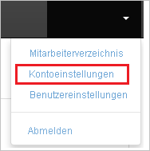
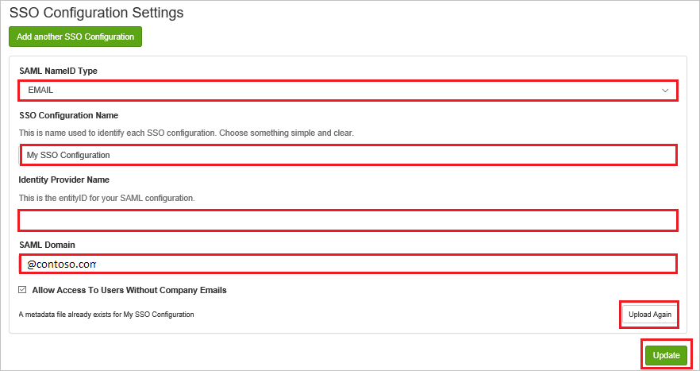

# Tutorial: Integration des einmaligen Anmeldens (Single Sign-On, SSO) von Azure AD mit Perception United States (Non-UltiPro)

In diesem Tutorial erfahren Sie, wie Sie Perception United States (Non-UltiPro) in Azure Active Directory (Azure AD) integrieren. Die Integration von Perception United States (Non-UltiPro) in Azure AD ermöglicht Folgendes:

* Steuern Sie in Azure AD, wer Zugriff auf Perception United States (Non-UltiPro) hat.
* Ermöglichen Sie es Ihren Benutzern, sich mit ihren Azure AD-Konten automatisch bei Perception United States (Non-UltiPro) anzumelden.
* Verwalten Sie Ihre Konten zentral im Azure-Portal.

## Voraussetzungen

Für die ersten Schritte benötigen Sie Folgendes:

* Ein Azure AD-Abonnement Falls Sie über kein Abonnement verfügen, können Sie ein [kostenloses Azure-Konto](https://azure.microsoft.com/free/) verwenden.
* Perception United States (Non-UltiPro)-Abonnement, für das einmaliges Anmelden (Single Sign-On, SSO) aktiviert ist

## Beschreibung des Szenarios

In diesem Tutorial konfigurieren und testen Sie das einmalige Anmelden von Azure AD in einer Testumgebung.

* Perception United States (Non-UltiPro) unterstützt **IDP**-initiiertes einmaliges Anmelden.

> [!NOTE]
> Der Bezeichner dieser Anwendung ist ein fester Zeichenfolgenwert, daher kann in einem Mandanten nur eine Instanz konfiguriert werden.

## Hinzufügen von Perception United States (Non-UltiPro) aus dem Katalog

Zum Konfigurieren der Integration von Perception United States (Non-UltiPro) in Azure AD müssen Sie Perception United States (Non-UltiPro) aus dem Katalog der Liste mit den verwalteten SaaS-Apps hinzufügen.

1. Melden Sie sich mit einem Geschäfts-, Schul- oder Unikonto oder mit einem persönlichen Microsoft-Konto beim Azure-Portal an.
1. Wählen Sie im linken Navigationsbereich den Dienst **Azure Active Directory** aus.
1. Navigieren Sie zu **Unternehmensanwendungen**, und wählen Sie dann **Alle Anwendungen** aus.
1. Wählen Sie zum Hinzufügen einer neuen Anwendung **Neue Anwendung** aus.
1. Geben Sie im Abschnitt **Aus Katalog hinzufügen** den Suchbegriff **Perception United States (Non-UltiPro)** in das Suchfeld ein.
1. Wählen Sie im Ergebnisbereich **Perception United States (Non-UltiPro)** aus, und fügen Sie die App hinzu. Warten Sie einige Sekunden, während die App Ihrem Mandanten hinzugefügt wird.

## Konfigurieren und Testen des einmaligen Anmeldens von Azure AD für Perception United States (Non-UltiPro)

Konfigurieren und testen Sie das einmalige Anmelden von Azure AD mit Perception United States (Non-UltiPro) mithilfe eines Testbenutzers mit dem Namen **B. Simon**. Damit einmaliges Anmelden funktioniert, muss eine Linkbeziehung zwischen einem Azure AD-Benutzer und dem entsprechenden Benutzer in Perception United States (Non-UltiPro) eingerichtet werden.

Führen Sie zum Konfigurieren und Testen des einmaligen Anmeldens von Azure AD mit Perception United States (Non-UltiPro) die folgenden Schritte aus:

1. **[Konfigurieren des einmaligen Anmeldens von Azure AD](#configure-azure-ad-sso)** , um Ihren Benutzern die Verwendung dieses Features zu ermöglichen.
    1. **[Erstellen eines Azure AD-Testbenutzers](#create-an-azure-ad-test-user)** , um das einmalige Anmelden von Azure AD mit dem Testbenutzer B. Simon zu testen.
    1. **[Zuweisen des Azure AD-Testbenutzers](#assign-the-azure-ad-test-user)** , um B. Simon die Verwendung des einmaligen Anmeldens von Azure AD zu ermöglichen.
1. **[Konfigurieren des einmaligen Anmeldens für Perception United States (Non-UltiPro)](#configure-perception-united-states-non-ultipro-sso)** , um die Einstellungen für einmaliges Anmelden auf der Anwendungsseite zu konfigurieren
    1. **[Erstellen eines Perception United States (Non-UltiPro)-Testbenutzers](#create-perception-united-states-non-ultipro-test-user)** , um eine Entsprechung von B. Simon in Perception United States (Non-UltiPro) zu erhalten, die mit ihrer Darstellung in Azure AD verknüpft ist
1. **[Testen des einmaligen Anmeldens](#test-sso)** , um zu überprüfen, ob die Konfiguration funktioniert

## Konfigurieren des einmaligen Anmeldens (Single Sign-On, SSO) von Azure AD

Gehen Sie wie folgt vor, um das einmalige Anmelden von Azure AD im Azure-Portal zu aktivieren.

1. Navigieren Sie im Azure-Portal auf der Anwendungsintegrationsseite für **Perception United States (Non-UltiPro)** zum Abschnitt **Verwalten**, und wählen Sie **Einmaliges Anmelden** aus.
1. Wählen Sie auf der Seite **SSO-Methode auswählen** die Methode **SAML** aus.
1. Klicken Sie auf der Seite **Einmaliges Anmelden (SSO) mit SAML einrichten** auf das Stiftsymbol für **Grundlegende SAML-Konfiguration**, um die Einstellungen zu bearbeiten.

   

4. Führen Sie auf der Seite **Grundlegende SAML-Konfiguration** die folgenden Schritte aus:

    a. Geben Sie im Textfeld **Bezeichner** die URL `https://perception.kanjoya.com/sp` ein.

    b. Geben Sie im Textfeld **Antwort-URL** eine URL im folgenden Format ein: `https://perception.kanjoya.com/sso?idp=<entity_id>`

    c. Für die Anwendung **Perception United States (Non-UltiPro)** benötigen Sie den Wert für den **Azure AD-Bezeichner** als „<entity_id>“ für die URI-Codierung. Sie erhalten diesen Wert unter **Perception United States (Non-UltiPro) einrichten**. Verwenden Sie den folgenden Link, um den URI-codierten Wert abzurufen: **http://www.url-encode-decode.com/** .

    d. Kombinieren Sie den URI-codierten Wert nach dem Abrufen mit der **Antwort-URL**, wie unten beschrieben.

    `https://perception.kanjoya.com/sso?idp=<URI encooded entity_id>`
    
    e. Fügen Sie den obigen Wert im Textfeld **Antwort-URL** ein.

5. Klicken Sie auf der Seite **Einmaliges Anmelden (SSO) mit SAML einrichten** im Abschnitt **SAML-Signaturzertifikat** auf **Herunterladen**, um den Ihren Anforderungen entsprechenden **Verbundmetadaten-XML**-Code aus den verfügbaren Optionen herunterzuladen und auf Ihrem Computer zu speichern.

    

6. Kopieren Sie im Abschnitt **Perception United States (Non-UltiPro) einrichten** die entsprechenden URLs gemäß Ihren Anforderungen.

    

### Erstellen eines Azure AD-Testbenutzers 

In diesem Abschnitt erstellen Sie im Azure-Portal einen Testbenutzer mit dem Namen B. Simon.

1. Wählen Sie im linken Bereich des Microsoft Azure-Portals **Azure Active Directory** > **Benutzer** > **Alle Benutzer** aus.
1. Wählen Sie oben im Bildschirm die Option **Neuer Benutzer** aus.
1. Führen Sie unter den Eigenschaften für **Benutzer** die folgenden Schritte aus:
   1. Geben Sie im Feld **Name** die Zeichenfolge `B.Simon` ein.  
   1. Geben Sie im Feld **Benutzername** die Zeichenfolge username@companydomain.extension ein. Beispiel: `B.Simon@contoso.com`.
   1. Aktivieren Sie das Kontrollkästchen **Kennwort anzeigen**, und notieren Sie sich den Wert aus dem Feld **Kennwort**.
   1. Klicken Sie auf **Erstellen**.

### Zuweisen des Azure AD-Testbenutzers

In diesem Abschnitt ermöglichen Sie B. Simon die Verwendung des einmaligen Anmeldens von Azure, indem Sie ihr Zugriff auf Perception United States (Non-UltiPro) gewähren.

1. Wählen Sie im Azure-Portal **Unternehmensanwendungen** > **Alle Anwendungen** aus.
1. Wählen Sie in der Anwendungsliste den Eintrag **Perception United States (Non-UltiPro)** aus.
1. Navigieren Sie auf der Übersichtsseite der App zum Abschnitt **Verwalten**, und wählen Sie **Benutzer und Gruppen** aus.
1. Wählen Sie **Benutzer hinzufügen** und anschließend im Dialogfeld **Zuweisung hinzufügen** die Option **Benutzer und Gruppen** aus.
1. Wählen Sie im Dialogfeld **Benutzer und Gruppen** in der Liste „Benutzer“ den Eintrag **B. Simon** aus, und klicken Sie dann unten auf dem Bildschirm auf die Schaltfläche **Auswählen**.
1. Wenn den Benutzern eine Rolle zugewiesen werden soll, können Sie sie im Dropdownmenü **Rolle auswählen** auswählen. Wurde für diese App keine Rolle eingerichtet, ist die Rolle „Standardzugriff“ ausgewählt.
1. Klicken Sie im Dialogfeld **Zuweisung hinzufügen** auf die Schaltfläche **Zuweisen**.

## Konfigurieren des einmaligen Anmeldens für Perception United States (Non-UltiPro)

1. Melden Sie sich in einem anderen Webbrowserfenster bei der Perception United States (Non-UltiPro)-Unternehmenswebsite als Administrator an.

2. Klicken Sie auf der Hauptsymbolleiste auf **Account Settings**.

    

3. Führen Sie auf der Seite **Account Settings** die folgenden Schritte aus:

    

    a. Geben Sie im Textfeld **Company Name** den Namen des **Unternehmens** ein.
    
    b. Geben Sie im Textfeld **Account Name** den Namen des **Kontos** ein.

    c. Geben Sie im Textfeld **Default Reply-To Email** die gültige **E-Mail-Adresse** ein.

    d. Wählen Sie für **SSO Identity Provider** die Option **SAML 2.0** aus.

4. Führen Sie auf der Seite **SSO Configuration** die folgenden Schritte aus:

    

    a. Wählen Sie als **SAML NameID Type** die Option **EMAIL** aus.

    b. Geben Sie im Textfeld **SSO Configuration Name** den Namen Ihrer **Konfiguration** ein.
    
    c. Fügen Sie in das Textfeld **Name des Identitätsanbieters** den Wert von **Azure AD-Bezeichner** ein, den Sie aus dem Azure-Portal kopiert haben. 

    d. Geben Sie im Textfeld **SAML-Domäne** die Domäne im Format @contoso.com ein.

    e. Klicken Sie auf **Upload Again**, um die **Metadaten-XML**-Datei hochzuladen.

    f. Klicken Sie auf **Aktualisieren**.

### Erstellen eines Perception United States (Non-UltiPro)-Testbenutzers

In diesem Abschnitt erstellen Sie in Perception United States (Non-UltiPro) einen Benutzer namens Britta Simon. Arbeiten Sie mit dem [Supportteam von Perception United States (Non-UltiPro)](https://www.ultimatesoftware.com/Contact/ContactUs) zusammen, um die Benutzer zur Perception United States (Non-UltiPro)-Plattform hinzuzufügen.

## Testen des einmaligen Anmeldens

In diesem Abschnitt testen Sie die Azure AD-Konfiguration für einmaliges Anmelden mit den folgenden Optionen:

* Klicken Sie im Azure-Portal auf „Diese Anwendung testen“. Dadurch sollten Sie automatisch bei der Perception United States (Non-UltiPro)-Instanz angemeldet werden, für die Sie einmaliges Anmelden eingerichtet haben.

* Sie können „Meine Apps“ von Microsoft verwenden. Wenn Sie unter „Meine Apps“ auf die Kachel „Perception United States (Non-UltiPro)“ klicken, sollten Sie automatisch bei der Instanz von Perception United States (Non-UltiPro) angemeldet werden, für die Sie einmaliges Anmelden eingerichtet haben. Weitere Informationen zu „Meine Apps“ finden Sie in [dieser Einführung](../user-help/my-apps-portal-end-user-access.md).

## Nächste Schritte

Nach dem Konfigurieren von Perception United States (Non-UltiPro) können Sie die Sitzungssteuerung erzwingen, die in Echtzeit vor der Exfiltration und Infiltration vertraulicher Unternehmensdaten schützt. Die Sitzungssteuerung basiert auf bedingtem Zugriff. [Erfahren Sie, wie Sie die Sitzungssteuerung mit Microsoft Defender for Cloud Apps erzwingen.](/cloud-app-security/proxy-deployment-aad)
