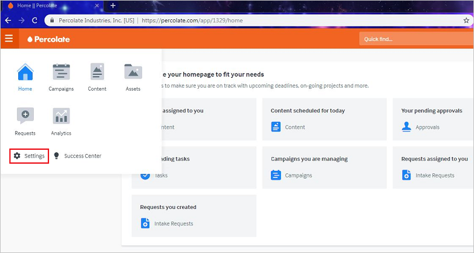
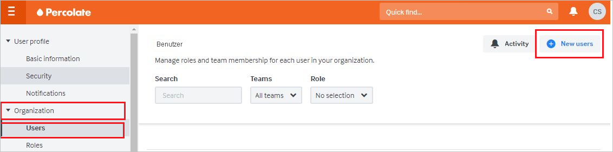

# Tutorial: Integration des einmaligen Anmeldens (Single Sign-On, SSO) von Azure AD mit Percolate

In diesem Tutorial erfahren Sie, wie Sie Percolate in Azure Active Directory (Azure AD) integrieren. Die Integration von Percolate in Azure AD ermöglicht Folgendes:

* Steuern Sie in Azure AD, wer Zugriff auf Percolate hat.
* Ermöglichen Sie es Ihren Benutzern, sich mit ihren Azure AD-Konten automatisch bei Percolate anzumelden.
* Verwalten Sie Ihre Konten zentral im Azure-Portal.

## Voraussetzungen

Um die Azure AD-Integration mit Percolate konfigurieren zu können, benötigen Sie Folgendes:

* Ein Azure AD-Abonnement Sollten Sie nicht über eine Azure AD-Umgebung verfügen, können Sie ein [kostenloses Konto](https://azure.microsoft.com/free/) verwenden.
* Ein Percolate-Abonnement, für das einmaliges Anmelden aktiviert ist.

## Beschreibung des Szenarios

In diesem Tutorial konfigurieren und testen Sie das einmalige Anmelden von Azure AD in einer Testumgebung.

* Percolate unterstützt SP- und IDP-initiiertes einmaliges Anmelden.

## Hinzufügen von Percolate über den Katalog

Um die Integration von Percolate in Azure AD zu konfigurieren, müssen Sie Percolate über den Katalog Ihrer Liste mit den verwalteten SaaS-Apps hinzufügen.

1. Melden Sie sich mit einem Geschäfts-, Schul- oder Unikonto oder mit einem persönlichen Microsoft-Konto beim Azure-Portal an.
1. Wählen Sie im linken Navigationsbereich den Dienst **Azure Active Directory** aus.
1. Navigieren Sie zu **Unternehmensanwendungen**, und wählen Sie dann **Alle Anwendungen** aus.
1. Wählen Sie zum Hinzufügen einer neuen Anwendung **Neue Anwendung** aus.
1. Geben Sie im Abschnitt **Aus dem Katalog hinzufügen** den Suchbegriff **Percolate** in das Suchfeld ein.
1. Wählen Sie im Ergebnisbereich **Percolate** aus, und fügen Sie dann die App hinzu. Warten Sie einige Sekunden, während die App Ihrem Mandanten hinzugefügt wird.

## Konfigurieren und Testen des einmaligen Anmeldens von Azure AD für Percolate

Konfigurieren und testen Sie das einmalige Anmelden von Azure AD mit Percolate mithilfe eines Testbenutzers mit dem Namen **B. Simon**. Damit einmaliges Anmelden funktioniert, muss eine Linkbeziehung zwischen einem Azure AD-Benutzer und dem entsprechenden Benutzer in Percolate eingerichtet werden.

Führen Sie zum Konfigurieren und Testen des einmaligen Anmeldens von Azure AD mit Percolate die folgenden Schritte aus:

1. **[Konfigurieren des einmaligen Anmeldens von Azure AD](#configure-azure-ad-sso)** , um Ihren Benutzern die Verwendung dieses Features zu ermöglichen.
    1. **[Erstellen eines Azure AD-Testbenutzers](#create-an-azure-ad-test-user)** , um das einmalige Anmelden von Azure AD mit dem Testbenutzer B. Simon zu testen.
    1. **[Zuweisen des Azure AD-Testbenutzers](#assign-the-azure-ad-test-user)** , um B. Simon die Verwendung des einmaligen Anmeldens von Azure AD zu ermöglichen.
1. **[Konfigurieren des einmaligen Anmeldens für Percolate](#configure-percolate-sso)** , um die Einstellungen für einmaliges Anmelden auf der Anwendungsseite zu konfigurieren
    1. **[Erstellen eines Percolate-Testbenutzers](#create-percolate-test-user)** , um in Percolate ein Pendant von B. Simon zu erhalten, das mit ihrer Darstellung in Azure AD verknüpft ist
1. **[Testen des einmaligen Anmeldens](#test-sso)** , um zu überprüfen, ob die Konfiguration funktioniert

## Konfigurieren des einmaligen Anmeldens (Single Sign-On, SSO) von Azure AD

Gehen Sie wie folgt vor, um das einmalige Anmelden von Azure AD im Azure-Portal zu aktivieren.

1. Navigieren Sie im Azure-Portal auf der Anwendungsintegrationsseite für **Percolate** zum Abschnitt **Verwalten**, und wählen Sie **Einmaliges Anmelden** aus.
1. Wählen Sie auf der Seite **SSO-Methode auswählen** die Methode **SAML** aus.
1. Klicken Sie auf der Seite **Einmaliges Anmelden (SSO) mit SAML einrichten** auf das Stiftsymbol für **Grundlegende SAML-Konfiguration**, um die Einstellungen zu bearbeiten.

   

4. Im Dialogfeld **Grundlegende SAML-Konfiguration** müssen Sie keine Aktion ausführen, um die Anwendung im IDP-initiierten Modus zu konfigurieren. Die App ist bereits in Azure integriert.

5. Wenn Sie die Anwendung im SP-initiierten Modus konfigurieren möchten, wählen Sie die Option **Zusätzliche URLs festlegen** aus, und geben Sie im Feld **Anmelde-URL** die Zeichenfolge **https://percolate.com/app/login** ein.

6. Wählen Sie auf der Seite **Einmaliges Anmelden (SSO) mit SAML einrichten** im Abschnitt **SAML-Signaturzertifikat** das **Kopiersymbol** aus, um die **App-Verbundmetadaten-URL** zu kopieren. Speichern Sie diese URL.

    

7. Kopieren Sie im Abschnitt **Percolate einrichten** die entsprechenden URLs gemäß Ihren Anforderungen.

    

### Erstellen eines Azure AD-Testbenutzers

In diesem Abschnitt erstellen Sie im Azure-Portal einen Testbenutzer mit dem Namen B. Simon.

1. Wählen Sie im linken Bereich des Microsoft Azure-Portals **Azure Active Directory** > **Benutzer** > **Alle Benutzer** aus.
1. Wählen Sie oben im Bildschirm die Option **Neuer Benutzer** aus.
1. Führen Sie unter den Eigenschaften für **Benutzer** die folgenden Schritte aus:
   1. Geben Sie im Feld **Name** die Zeichenfolge `B.Simon` ein.  
   1. Geben Sie im Feld **Benutzername** die Zeichenfolge username@companydomain.extension ein. Beispiel: `B.Simon@contoso.com`.
   1. Aktivieren Sie das Kontrollkästchen **Kennwort anzeigen**, und notieren Sie sich den Wert aus dem Feld **Kennwort**.
   1. Klicken Sie auf **Erstellen**.

### Zuweisen des Azure AD-Testbenutzers

In diesem Abschnitt ermöglichen Sie B. Simon die Verwendung des einmaligen Anmeldens von Azure, indem Sie ihr Zugriff auf Percolate gewähren.

1. Wählen Sie im Azure-Portal **Unternehmensanwendungen** > **Alle Anwendungen** aus.
1. Wählen Sie in der Anwendungsliste **Percolate** aus.
1. Navigieren Sie auf der Übersichtsseite der App zum Abschnitt **Verwalten**, und wählen Sie **Benutzer und Gruppen** aus.
1. Wählen Sie **Benutzer hinzufügen** und anschließend im Dialogfeld **Zuweisung hinzufügen** die Option **Benutzer und Gruppen** aus.
1. Wählen Sie im Dialogfeld **Benutzer und Gruppen** in der Liste „Benutzer“ den Eintrag **B. Simon** aus, und klicken Sie dann unten auf dem Bildschirm auf die Schaltfläche **Auswählen**.
1. Wenn den Benutzern eine Rolle zugewiesen werden soll, können Sie sie im Dropdownmenü **Rolle auswählen** auswählen. Wurde für diese App keine Rolle eingerichtet, ist die Rolle „Standardzugriff“ ausgewählt.
1. Klicken Sie im Dialogfeld **Zuweisung hinzufügen** auf die Schaltfläche **Zuweisen**.

## Konfigurieren des einmaligen Anmeldens für Percolate

1. Melden Sie sich in einem neuen Webbrowserfenster als Administrator bei Percolate an.

2. Wählen Sie auf der linken Seite der Homepage die Option **Setting** (Einstellungen) aus:
    
    

3. Wählen Sie im linken Bereich unter **Organization** (Organisation) die Option **SSO** aus:

    

    1. Fügen Sie im Feld **Login URL** (Anmelde-URL) den Wert für **Anmelde-URL** ein, den Sie aus dem Azure-Portal kopiert haben.

    1. Fügen Sie im Feld **Entity ID** (Entitäts-ID) den Wert für **Azure AD-Bezeichner** ein, den Sie aus dem Azure-Portal kopiert haben.

    1. Öffnen Sie im Editor das Base64-codierte Zertifikat, das Sie aus dem Azure-Portal heruntergeladen haben. Kopieren Sie den Inhalt, und fügen Sie ihn anschließend in das Feld **x509 certificates** (X509-Zertifikate) ein.

    1. Geben Sie im Feld **Email attribute** (E-Mail-Attribut) die Zeichenfolge **emailaddress** ein.

    1. Das Feld **Identity provider metadata URL** (Metadaten-URL des Identitätsanbieters) ist optional. Falls Sie eine **App-Verbundmetadaten-URL** aus dem Azure-Portal kopiert haben, können Sie diese in das Feld einfügen.

    1. Wählen Sie in der Liste **Should AuthNRequests be signed?** (Sollen Authentifizierungsanforderungen signiert werden?) die Option **No** (Nein) aus.

    1. Wählen Sie in der Liste **Enable SSO auto-Provisioning** (Automatische Bereitstellung für SSO aktivieren) die Option **No** (Nein) aus.

    1. Wählen Sie **Speichern** aus.

### Erstellen eines Percolate-Testbenutzers

Damit sich Azure AD-Benutzer an Percolate anmelden können, müssen Sie diese in Percolate hinzufügen. Sie müssen diese manuell hinzufügen.

Zum Erstellen eines Benutzerkontos führen Sie die folgenden Schritte aus:

1. Melden Sie sich bei Percolate als Administrator an.

2. Wählen Sie im linken Bereich unter **Organization** (Organisation) die Option **Users** (Benutzer) aus. Wählen Sie **New users** (Neue Benutzer) aus:

    

3. Führen Sie auf der Seite **Create users** (Benutzer erstellen) die folgenden Schritte aus.

    

    1. Geben Sie im Feld **Email** (E-Mail) die E-Mail-Adresse des Benutzers ein. Beispiel: brittasimon@contoso.com.

    1. Geben Sie im Feld **Full name** (Vollständiger Name) den Namen des Benutzers ein. Beispiel: **Brittasimon**

    1. Wählen Sie **Create users** (Benutzer erstellen) aus.

## Testen des einmaligen Anmeldens

In diesem Abschnitt testen Sie die Azure AD-Konfiguration für einmaliges Anmelden mit den folgenden Optionen: 

#### SP-initiiert:

* Klicken Sie im Azure-Portal auf **Diese Anwendung testen**. Dadurch werden Sie zur Anmelde-URL für Percolate weitergeleitet, wo Sie den Anmeldeflow initiieren können.  

* Rufen Sie direkt die Anmelde-URL für Percolate auf, und initiieren Sie den Anmeldeflow.

#### IDP-initiiert:

* Klicken Sie im Azure-Portal auf **Diese Anwendung testen**. Dadurch sollten Sie automatisch bei der Percolate-Instanz angemeldet werden, für die Sie einmaliges Anmelden eingerichtet haben. 

Sie können auch den Microsoft-Bereich „Meine Apps“ verwenden, um die Anwendung in einem beliebigen Modus zu testen. Beim Klicken auf die Kachel „Percolate“ unter „Meine Apps“ geschieht Folgendes: Wenn Sie die Anwendung im SP-Modus konfiguriert haben, werden Sie zum Initiieren des Anmeldeflows zur Anmeldeseite der Anwendung weitergeleitet. Wenn Sie die Anwendung im IDP-Modus konfiguriert haben, sollten Sie automatisch bei der Percolate-Instanz angemeldet werden, für die Sie einmaliges Anmelden eingerichtet haben. Weitere Informationen zu „Meine Apps“ finden Sie in [dieser Einführung](../user-help/my-apps-portal-end-user-access.md).

## Nächste Schritte

Nach dem Konfigurieren von Percolate können Sie die Sitzungssteuerung erzwingen, die in Echtzeit vor der Exfiltration und Infiltration vertraulicher Unternehmensdaten schützt. Die Sitzungssteuerung basiert auf bedingtem Zugriff. [Erfahren Sie, wie Sie die Sitzungssteuerung mit Microsoft Defender for Cloud Apps erzwingen.](/cloud-app-security/proxy-deployment-aad)
