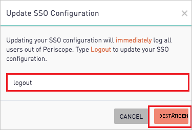

# Tutorial: Integration des einmaligen Anmeldens (Single Sign-On, SSO) von Azure AD mit Periscope Data

In diesem Tutorial erfahren Sie, wie Sie Periscope Data in Azure Active Directory (Azure AD) integrieren. Die Integration von Periscope Data in Azure AD ermöglicht Folgendes:

* Steuern Sie in Azure AD, wer Zugriff auf Periscope Data hat.
* Ermöglichen Sie es Ihren Benutzern, sich mit ihren Azure AD-Konten automatisch bei Periscope Data anzumelden.
* Verwalten Sie Ihre Konten zentral im Azure-Portal.

## Voraussetzungen

Für die ersten Schritte benötigen Sie Folgendes:

* Ein Azure AD-Abonnement Falls Sie über kein Abonnement verfügen, können Sie ein [kostenloses Azure-Konto](https://azure.microsoft.com/free/) verwenden.
* Periscope Data-Abonnement, für das einmaliges Anmelden (Single Sign-On, SSO) aktiviert ist

## Beschreibung des Szenarios

In diesem Tutorial konfigurieren und testen Sie das einmalige Anmelden von Azure AD in einer Testumgebung.

* Periscope Data unterstützt **SP**-initiiertes einmaliges Anmelden.

## Hinzufügen von Periscope Data aus dem Katalog

Zum Konfigurieren der Integration von Periscope Data in Azure AD müssen Sie Periscope Data aus dem Katalog der Liste mit den verwalteten SaaS-Apps hinzufügen.

1. Melden Sie sich mit einem Geschäfts-, Schul- oder Unikonto oder mit einem persönlichen Microsoft-Konto beim Azure-Portal an.
1. Wählen Sie im linken Navigationsbereich den Dienst **Azure Active Directory** aus.
1. Navigieren Sie zu **Unternehmensanwendungen**, und wählen Sie dann **Alle Anwendungen** aus.
1. Wählen Sie zum Hinzufügen einer neuen Anwendung **Neue Anwendung** aus.
1. Geben Sie im Abschnitt **Aus Katalog hinzufügen** den Suchbegriff **Periscope Data** in das Suchfeld ein.
1. Wählen Sie im Ergebnisbereich **Periscope Data** aus, und fügen Sie dann die App hinzu. Warten Sie einige Sekunden, während die App Ihrem Mandanten hinzugefügt wird.

## Konfigurieren und Testen des einmaligen Anmeldens von Azure AD für Periscope Data

Konfigurieren und testen Sie das einmalige Anmelden von Azure AD mit Periscope Data mithilfe eines Testbenutzers namens **B. Simon**. Damit einmaliges Anmelden funktioniert, muss eine Linkbeziehung zwischen einem Azure AD-Benutzer und dem entsprechenden Benutzer in Periscope Data eingerichtet werden.

Führen Sie zum Konfigurieren und Testen des einmaligen Anmeldens von Azure AD mit Periscope Data die folgenden Schritte aus:

1. **[Konfigurieren des einmaligen Anmeldens von Azure AD](#configure-azure-ad-sso)** , um Ihren Benutzern die Verwendung dieses Features zu ermöglichen.
    1. **[Erstellen eines Azure AD-Testbenutzers](#create-an-azure-ad-test-user)** , um das einmalige Anmelden von Azure AD mit dem Testbenutzer B. Simon zu testen.
    1. **[Zuweisen des Azure AD-Testbenutzers](#assign-the-azure-ad-test-user)** , um B. Simon die Verwendung des einmaligen Anmeldens von Azure AD zu ermöglichen.
1. **[Konfigurieren des einmaligen Anmeldens für Periscope Data](#configure-periscope-data-sso)**, um die Einstellungen für einmaliges Anmelden auf der Anwendungsseite zu konfigurieren
    1. **[Erstellen eines Periscope Data-Testbenutzers](#create-periscope-data-test-user)**, um eine Entsprechung von B. Simon in Periscope Data zu erhalten, die mit ihrer Darstellung in Azure AD verknüpft ist
1. **[Testen des einmaligen Anmeldens](#test-sso)** , um zu überprüfen, ob die Konfiguration funktioniert

## Konfigurieren des einmaligen Anmeldens (Single Sign-On, SSO) von Azure AD

Gehen Sie wie folgt vor, um das einmalige Anmelden von Azure AD im Azure-Portal zu aktivieren.

1. Navigieren Sie im Azure-Portal auf der Anwendungsintegrationsseite für **Periscope Data** zum Abschnitt **Verwalten**, und wählen Sie **Einmaliges Anmelden** aus.
1. Wählen Sie auf der Seite **SSO-Methode auswählen** die Methode **SAML** aus.
1. Klicken Sie auf der Seite **Einmaliges Anmelden (SSO) mit SAML einrichten** auf das Stiftsymbol für **Grundlegende SAML-Konfiguration**, um die Einstellungen zu bearbeiten.

   

4. Führen Sie im Abschnitt **Grundlegende SAML-Konfiguration** die folgenden Schritte aus:

    a. Geben Sie im Textfeld **Bezeichner (Entitäts-ID)** eine URL im folgenden Format ein: `https://app.periscopedata.com/<SITENAME>/sso`.

    b. Geben Sie im Textfeld **Anmelde-URL** eine URL in einem der folgenden Formate ein:
    
    | **Anmelde-URL** |
    |--------|
    | `https://app.periscopedata.com/` |
    | `https://app.periscopedata.com/app/<SITENAME>` |

    > [!NOTE]
    > Der Wert der Anmelde-URL entspricht nicht dem tatsächlichen Wert. Aktualisieren Sie die Werte mit der tatsächlichen Anmelde-URL. Wenden Sie sich an das [Kundensupportteam von Periscope Data](mailto:support@periscopedata.com), um diesen Wert zu erhalten. Den Bezeichnerwert erhalten Sie, indem Sie die Schritte im Abschnitt **Konfigurieren des einmaligen Anmeldens für Periscope Data** weiter unten ausführen. Sie können sich auch die Muster im Abschnitt **Grundlegende SAML-Konfiguration** im Azure-Portal ansehen.

5. Klicken Sie auf der Seite **Einmaliges Anmelden (SSO) mit SAML einrichten** im Abschnitt **SAML-Signaturzertifikat** auf die Schaltfläche „Kopieren“, um die **App-Verbundmetadaten-URL** zu kopieren, und speichern Sie sie auf Ihrem Computer.

    

### Erstellen eines Azure AD-Testbenutzers 

In diesem Abschnitt erstellen Sie im Azure-Portal einen Testbenutzer mit dem Namen B. Simon.

1. Wählen Sie im linken Bereich des Microsoft Azure-Portals **Azure Active Directory** > **Benutzer** > **Alle Benutzer** aus.
1. Wählen Sie oben im Bildschirm die Option **Neuer Benutzer** aus.
1. Führen Sie unter den Eigenschaften für **Benutzer** die folgenden Schritte aus:
   1. Geben Sie im Feld **Name** die Zeichenfolge `B.Simon` ein.  
   1. Geben Sie im Feld **Benutzername** die Zeichenfolge username@companydomain.extension ein. Beispiel: `B.Simon@contoso.com`.
   1. Aktivieren Sie das Kontrollkästchen **Kennwort anzeigen**, und notieren Sie sich den Wert aus dem Feld **Kennwort**.
   1. Klicken Sie auf **Erstellen**.

### Zuweisen des Azure AD-Testbenutzers

In diesem Abschnitt ermöglichen Sie B. Simon die Verwendung des einmaligen Anmeldens von Azure, indem Sie ihr Zugriff auf Periscope Data gewähren.

1. Wählen Sie im Azure-Portal **Unternehmensanwendungen** > **Alle Anwendungen** aus.
1. Wählen Sie in der Anwendungsliste **Periscope Data** aus.
1. Navigieren Sie auf der Übersichtsseite der App zum Abschnitt **Verwalten**, und wählen Sie **Benutzer und Gruppen** aus.
1. Wählen Sie **Benutzer hinzufügen** und anschließend im Dialogfeld **Zuweisung hinzufügen** die Option **Benutzer und Gruppen** aus.
1. Wählen Sie im Dialogfeld **Benutzer und Gruppen** in der Liste „Benutzer“ den Eintrag **B. Simon** aus, und klicken Sie dann unten auf dem Bildschirm auf die Schaltfläche **Auswählen**.
1. Wenn den Benutzern eine Rolle zugewiesen werden soll, können Sie sie im Dropdownmenü **Rolle auswählen** auswählen. Wurde für diese App keine Rolle eingerichtet, ist die Rolle „Standardzugriff“ ausgewählt.
1. Klicken Sie im Dialogfeld **Zuweisung hinzufügen** auf die Schaltfläche **Zuweisen**.

## Konfigurieren des einmaligen Anmeldens für Periscope Data

1. Melden Sie sich in einem anderen Webbrowserfenster als Administrator bei Periscope Data an.

2. Öffnen Sie das Zahnradmenü unten links und dann das Menü **Abrechnung** > **Sicherheit**, und führen Sie die folgenden Schritte aus. Nur Administratoren haben Zugriff auf diese Einstellungen.

    

    a. Kopieren Sie die **App-Verbundmetadaten-URL** aus „Schritt 5 **SAML-Signaturzertifikat**“, und öffnen Sie sie in einem Browser. Ein XML-Dokument wird geöffnet.

    b. Wählen Sie im Textfeld **Einmaliges Anmelden** die Option **Azure Active Directory**.

    c. Suchen Sie nach dem Tag **SingleSignOnService**, und fügen Sie den Wert **Standort** in das Textfeld **SSO-URL** ein.

    d. Suchen Sie nach dem Tag **SingleLogoutService**, und fügen Sie den Wert **Standort** in das Textfeld **SLO-URL** ein.

    e. Kopieren Sie den Wert von **Bezeichner** für Ihre Instanz, und fügen Sie ihn im Azure-Portal im Abschnitt **Grundlegende SAML-Konfiguration** in das Textfeld **Bezeichner (Entitäts-ID)** ein.

    f. Kopieren Sie für das erste Tag der XML-Datei den Wert von **entityID**, und fügen Sie ihn in das Textfeld **Aussteller** ein.

    g. Suchen nach dem Tag **IDPSSODescriptor** mit dem SAML-Protokoll. Suchen Sie in diesem Abschnitt nach dem Tag **KeyDescriptor** mit **use=signing**. Kopieren Sie den Wert von **X509Certificate**, und fügen Sie ihn in das Textfeld **Zertifikat** ein.

    h. Für Sites mit mehreren Bereichen kann der Standardbereich in der Dropdownliste **Standardbereich** ausgewählt werden. Dies ist der Bereich, dem neue Benutzer hinzugefügt werden, wenn sie sich zum ersten Mal an Periscope Data anmelden und über das einmalige Anmelden von Active Directory bereitgestellt werden.

    i. Klicken Sie abschließend auf **Speichern**, und **bestätigen** Sie die Änderung der SSO-Einstellungen, indem Sie **Logout** (Abmelden) eingeben.

    

### Erstellen eines Periscope Data-Testbenutzers

Um für Azure AD-Benutzer das Anmelden an Periscope Data zu ermöglichen, müssen diese in Periscope Data bereitgestellt werden. In Periscope Data ist die Bereitstellung eine manuelle Aufgabe.

**Führen Sie zum Bereitstellen eines Benutzerkontos die folgenden Schritte aus:**

1. Melden Sie sich an Periscope Data als Administrator an.

2. Klicken Sie unten links im Menü auf **Einstellungen**, und navigieren Sie zu **Berechtigungen**.

    

3. Klicken Sie auf **BENUTZER HINZUFÜGEN**, und führen Sie die folgenden Schritte aus:

      

    a. Geben Sie im Textfeld **First Name** (Vorname) den Vornamen des Benutzers ein, z.B. **Britta**.

    b. Geben Sie im Textfeld **Last Name** (Nachname) den Nachnamen des Benutzers ein, z.B. **Simon**.

    c. Geben Sie im Textfeld **Email** (E-Mail-Adresse) die E-Mail-Adresse des Benutzers ein, z. B. **brittasimon\@contoso.com**.

    d. Klicken Sie auf **HINZUFÜGEN**.

## Testen des einmaligen Anmeldens 

In diesem Abschnitt testen Sie die Azure AD-Konfiguration für einmaliges Anmelden mit den folgenden Optionen: 

* Klicken Sie im Azure-Portal auf **Diese Anwendung testen**. Dadurch werden Sie zur Anmelde-URL für Periscope Data weitergeleitet, wo Sie den Anmeldeflow initiieren können. 

* Rufen Sie direkt die Periscope Data-Anmelde-URL auf, und initiieren Sie den Anmeldeflow.

* Sie können „Meine Apps“ von Microsoft verwenden. Wenn Sie unter „Meine Apps“ auf die Kachel „Periscope Data“ klicken, werden Sie zur Anmelde-URL für Periscope Data weitergeleitet. Weitere Informationen zu „Meine Apps“ finden Sie in [dieser Einführung](../user-help/my-apps-portal-end-user-access.md).

## Nächste Schritte

Nach dem Konfigurieren von Periscope Data können Sie die Sitzungssteuerung erzwingen, die in Echtzeit vor der Exfiltration und Infiltration vertraulicher Unternehmensdaten schützt. Die Sitzungssteuerung basiert auf bedingtem Zugriff. [Erfahren Sie, wie Sie die Sitzungssteuerung mit Microsoft Defender for Cloud Apps erzwingen.](/cloud-app-security/proxy-deployment-aad)
