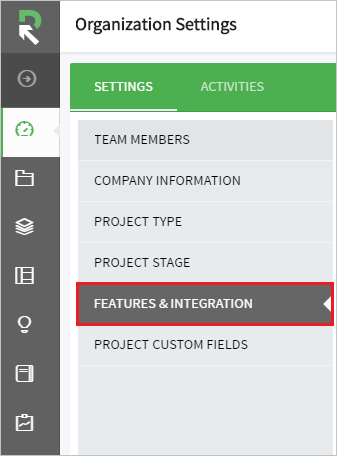
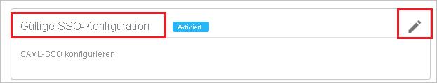
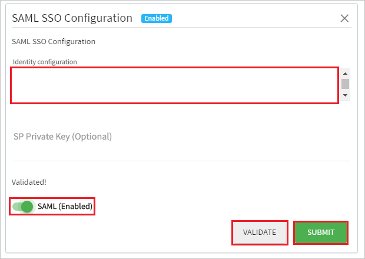
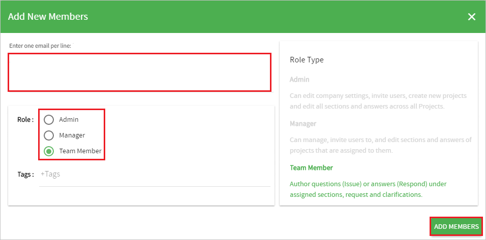

# Tutorial: Azure AD-SSO-Integration in RFPIO

In diesem Tutorial erfahren Sie, wie Sie RFPIO in Azure Active Directory (Azure AD) integrieren. Die Integration von RFPIO in Azure AD ermöglicht Folgendes:

* Steuern Sie in Azure AD, wer Zugriff auf RFPIO hat.
* Ermöglichen Sie es Ihren Benutzern, sich mit ihren Azure AD-Konten automatisch bei RFPIO anzumelden.
* Verwalten Sie Ihre Konten zentral im Azure-Portal.

## Voraussetzungen

Um die Azure AD-Integration mit RFPIO konfigurieren zu können, benötigen Sie Folgendes:

* Ein Azure AD-Abonnement Sollten Sie nicht über eine Azure AD-Umgebung verfügen, können Sie ein [kostenloses Konto](https://azure.microsoft.com/free/) verwenden.
* RFPIO-Abonnement, für das einmaliges Anmelden aktiviert ist.

## Beschreibung des Szenarios

In diesem Tutorial konfigurieren und testen Sie das einmalige Anmelden von Azure AD in einer Testumgebung.

* RFPIO unterstützt **SP- und IDP**-initiiertes einmaliges Anmelden.

* RFPIO unterstützt [automatisierte Benutzerbereitstellung](rfpio-provisioning-tutorial.md).

> [!NOTE]
> Der Bezeichner dieser Anwendung ist ein fester Zeichenfolgenwert, daher kann in einem Mandanten nur eine Instanz konfiguriert werden.

## Hinzufügen von RFPIO aus dem Katalog

Zum Konfigurieren der Integration von RFPIO in Azure AD müssen Sie RFPIO aus dem Katalog der Liste der verwalteten SaaS-Apps hinzufügen.

1. Melden Sie sich mit einem Geschäfts-, Schul- oder Unikonto oder mit einem persönlichen Microsoft-Konto beim Azure-Portal an.
1. Wählen Sie im linken Navigationsbereich den Dienst **Azure Active Directory** aus.
1. Navigieren Sie zu **Unternehmensanwendungen**, und wählen Sie dann **Alle Anwendungen** aus.
1. Wählen Sie zum Hinzufügen einer neuen Anwendung **Neue Anwendung** aus.
1. Geben Sie im Abschnitt **Aus Katalog hinzufügen** den Suchbegriff **RFPIO** in das Suchfeld ein.
1. Wählen Sie im Ergebnisbereich **RFPIO** aus, und fügen Sie dann die App hinzu. Warten Sie einige Sekunden, während die App Ihrem Mandanten hinzugefügt wird.

## Konfigurieren und Testen des einmaligen Anmeldens von Azure AD für RFPIO

Konfigurieren und testen Sie das einmalige Anmelden von Azure AD bei RFPIO mithilfe eines Testbenutzers namens **B. Simon**. Damit einmaliges Anmelden funktioniert, muss eine Linkbeziehung zwischen einem Azure AD-Benutzer und dem entsprechenden Benutzer in RFPIO eingerichtet werden.

Führen Sie zum Konfigurieren und Testen des einmaligen Anmeldens von Azure AD mit RFPIO die folgenden Schritte aus:

1. **[Konfigurieren des einmaligen Anmeldens von Azure AD](#configure-azure-ad-sso)** , um Ihren Benutzern die Verwendung dieses Features zu ermöglichen.
    1. **[Erstellen eines Azure AD-Testbenutzers](#create-an-azure-ad-test-user)** , um das einmalige Anmelden von Azure AD mit dem Testbenutzer B. Simon zu testen.
    1. **[Zuweisen des Azure AD-Testbenutzers](#assign-the-azure-ad-test-user)** , um B. Simon die Verwendung des einmaligen Anmeldens von Azure AD zu ermöglichen.
1. **[Konfigurieren des einmaligen Anmeldens für RFPIO](#configure-rfpio-sso)** , um die Einstellungen für einmaliges Anmelden auf der Anwendungsseite zu konfigurieren
    1. **[Erstellen eines RFPIO-Testbenutzers](#create-rfpio-test-user)** , um eine Entsprechung von B. Simon in RFPIO zu erhalten, die mit des Darstellung des Benutzers in Azure AD verknüpft ist
1. **[Testen des einmaligen Anmeldens](#test-sso)** , um zu überprüfen, ob die Konfiguration funktioniert

## Konfigurieren des einmaligen Anmeldens (Single Sign-On, SSO) von Azure AD

Gehen Sie wie folgt vor, um das einmalige Anmelden von Azure AD im Azure-Portal zu aktivieren.

1. Navigieren Sie im Azure-Portal auf der Anwendungsintegrationsseite für **RFPIO** zum Abschnitt **Verwalten**, und wählen Sie **Einmaliges Anmelden** aus.
1. Wählen Sie auf der Seite **SSO-Methode auswählen** die Methode **SAML** aus.
1. Klicken Sie auf der Seite **Einmaliges Anmelden (SSO) mit SAML einrichten** auf das Stiftsymbol für **Grundlegende SAML-Konfiguration**, um die Einstellungen zu bearbeiten.

   

1. Führen Sie im Abschnitt **Grundlegende SAML-Konfiguration** die folgenden Schritte aus, wenn Sie die Anwendung im **IDP-initiierten** Modus konfigurieren möchten:

    a. Geben Sie im Textfeld **Bezeichner** die URL `https://www.rfpio.com` ein.

    b. Klicken Sie auf **Zusätzliche URLs festlegen**.

    c. Geben Sie im Textfeld **Relayzustand** einen Zeichenfolgenwert ein. Wenden Sie sich an das [Supportteam von RFPIO](https://www.rfpio.com/contact/), um diesen Wert zu erhalten.

1. Klicken Sie auf **Zusätzliche URLs festlegen**, und führen Sie den folgenden Schritt aus, wenn Sie die Anwendung im **SP-initiierten Modus** konfigurieren möchten:

    Geben Sie im Textfeld **Anmelde-URL** die URL ein: `https://www.app.rfpio.com`.

1. Die Anwendung RFPIO erwartet die SAML-Assertionen in einem bestimmten Format. Daher müssen Sie Ihrer Konfiguration der SAML-Tokenattribute benutzerdefinierte Attributzuordnungen hinzufügen. Der folgende Screenshot zeigt die Liste der Standardattribute.

    

1. Darüber hinaus erwartet die RFPIO-Anwendung, dass in der SAML-Antwort noch einige weitere Attribute zurückgegeben werden (siehe unten). Diese Attribute werden ebenfalls vorab aufgefüllt, Sie können sie jedoch nach Bedarf überprüfen.

    | Name | Quellattribut|
    | ------- | --------- |
    | first_name | user.givenname |
    | last_name | user.surname |

1. Klicken Sie auf der Seite **Einmaliges Anmelden (SSO) mit SAML einrichten** im Abschnitt **SAML-Signaturzertifikat** auf **Herunterladen**, um den Ihren Anforderungen entsprechenden **Verbundmetadaten-XML**-Code aus den verfügbaren Optionen herunterzuladen und auf Ihrem Computer zu speichern.

    

1. Kopieren Sie im Abschnitt **RFPIO einrichten** die entsprechenden URLs gemäß Ihren Anforderungen.

    

### Erstellen eines Azure AD-Testbenutzers

In diesem Abschnitt erstellen Sie im Azure-Portal einen Testbenutzer mit dem Namen B. Simon.

1. Wählen Sie im linken Bereich des Microsoft Azure-Portals **Azure Active Directory** > **Benutzer** > **Alle Benutzer** aus.
1. Wählen Sie oben im Bildschirm die Option **Neuer Benutzer** aus.
1. Führen Sie unter den Eigenschaften für **Benutzer** die folgenden Schritte aus:
   1. Geben Sie im Feld **Name** die Zeichenfolge `B.Simon` ein.  
   1. Geben Sie im Feld **Benutzername** die Zeichenfolge username@companydomain.extension ein. Beispiel: `B.Simon@contoso.com`.
   1. Aktivieren Sie das Kontrollkästchen **Kennwort anzeigen**, und notieren Sie sich den Wert aus dem Feld **Kennwort**.
   1. Klicken Sie auf **Erstellen**.

### Zuweisen des Azure AD-Testbenutzers

In diesem Abschnitt ermöglichen Sie B. Simon die Verwendung des einmaligen Anmeldens von Azure, indem Sie Zugriff auf RFPIO gewähren.

1. Wählen Sie im Azure-Portal **Unternehmensanwendungen** > **Alle Anwendungen** aus.
1. Wählen Sie in der Anwendungsliste **RFPIO** aus.
1. Navigieren Sie auf der Übersichtsseite der App zum Abschnitt **Verwalten**, und wählen Sie **Benutzer und Gruppen** aus.
1. Wählen Sie **Benutzer hinzufügen** und anschließend im Dialogfeld **Zuweisung hinzufügen** die Option **Benutzer und Gruppen** aus.
1. Wählen Sie im Dialogfeld **Benutzer und Gruppen** in der Liste „Benutzer“ den Eintrag **B. Simon** aus, und klicken Sie dann unten auf dem Bildschirm auf die Schaltfläche **Auswählen**.
1. Wenn den Benutzern eine Rolle zugewiesen werden soll, können Sie sie im Dropdownmenü **Rolle auswählen** auswählen. Wurde für diese App keine Rolle eingerichtet, ist die Rolle „Standardzugriff“ ausgewählt.
1. Klicken Sie im Dialogfeld **Zuweisung hinzufügen** auf die Schaltfläche **Zuweisen**.

## Konfigurieren des einmaligen Anmeldens für RFPIO

1. Melden Sie sich in einem anderen Webbrowserfenster bei der **RFPIO**-Website als Administrator an.

1. Klicken Sie in der linken unteren Ecke auf die Dropdownliste.

    

1. Klicken Sie auf **Organization Settings** (Organisationseinstellungen). 

    

1. Klicken Sie auf **FEATURES & INTEGRATION**.

    

1. Klicken Sie unter **SAML SSO Configuration** (SAML-SSO-Konfiguration) auf **Edit** (Bearbeiten).

    

1. Führen Sie in diesem Abschnitt folgende Aktionen durch:

    
    
    a. Kopieren Sie den Inhalt der heruntergeladenen **XML-Metadatendatei**, und fügen Sie ihn in das Feld **identity configuration** (Identitätskonfiguration) ein.

    > [!NOTE]
    > Verwenden Sie zum Kopieren des Inhalts der heruntergeladenen **Verbundmetadaten-XML** das Programm **Notepad++** oder einen geeigneten **XML-Editor**.

    b. Klicken Sie auf **Überprüfen**.

    c. Schalten Sie nach dem Klicken auf **Überprüfen** die Einstellung **SAML(Enabled)** (SAML – aktiviert) auf „Ein“.

    d. Klicken Sie auf **Submit**(Senden).

### Erstellen eines RFPIO-Testbenutzers

1. Melden Sie sich bei der RFPIO-Unternehmenswebsite als Administrator an.

1. Klicken Sie in der linken unteren Ecke auf die Dropdownliste.

    

1. Klicken Sie auf **Organization Settings** (Organisationseinstellungen). 

    

1. Klicken Sie auf **TEAM MEMBERS** (TEAMMITGLIEDER).

    

1. Klicken Sie auf **ADD MEMBERS** (MITGLIEDER HINZUFÜGEN).

    

1. Im Abschnitt **Add New Members** (Neue Mitglieder hinzufügen) Führen Sie folgende Aktionen aus:

    

    a. Geben Sie die **E-Mail-Adresse** in das Feld **Enter one email per line** (eine E-Mail-Adresse pro Zeile eingeben) ein.

    b. Wählen Sie die **Rolle** entsprechend Ihren Anforderungen aus.

    c. Klicken Sie auf **ADD MEMBERS** (MITGLIEDER HINZUFÜGEN).

    > [!NOTE]
    > Der Besitzer des Azure Active Directory-Kontos erhält eine E-Mail und folgt einem Link zur Bestätigung des Kontos, bevor es aktiv wird.

> [!NOTE]
> Außerdem unterstützt RFPIO automatische Benutzerbereitstellung. Weitere Informationen zum Konfigurieren der automatischen Benutzerbereitstellung finden Sie [hier](./rfpio-provisioning-tutorial.md).  

## Testen des einmaligen Anmeldens

In diesem Abschnitt testen Sie die Azure AD-Konfiguration für einmaliges Anmelden mit den folgenden Optionen: 

#### SP-initiiert:

* Klicken Sie im Azure-Portal auf **Diese Anwendung testen**. Dadurch werden Sie zur Anmelde-URL für RFPIO weitergeleitet, wo Sie den Anmeldeflow initiieren können.  

* Rufen Sie direkt die Anmelde-URL für RFPIO auf, und initiieren Sie den Anmeldeflow.

#### IDP-initiiert:

* Klicken Sie im Azure-Portal auf **Diese Anwendung testen**. Dadurch sollten Sie automatisch bei der RFPIO-Instanz angemeldet werden, für die Sie das einmalige Anmelden eingerichtet haben. 

Sie können auch den Microsoft-Bereich „Meine Apps“ verwenden, um die Anwendung in einem beliebigen Modus zu testen. Beim Klicken auf die Kachel „RFPIO“ in „Meine Apps“ geschieht Folgendes: Wenn Sie die Anwendung im SP-Modus konfiguriert haben, werden Sie zum Initiieren des Anmeldeflows zur Anmeldeseite der Anwendung weitergeleitet. Wenn Sie die Anwendung im IDP-Modus konfiguriert haben, sollten Sie automatisch bei der RFPIO-Instanz angemeldet werden, für die Sie einmaliges Anmelden eingerichtet haben. Weitere Informationen zu „Meine Apps“ finden Sie in [dieser Einführung](https://support.microsoft.com/account-billing/sign-in-and-start-apps-from-the-my-apps-portal-2f3b1bae-0e5a-4a86-a33e-876fbd2a4510).

## Nächste Schritte

Nach dem Konfigurieren von RFPIO können Sie die Sitzungssteuerung erzwingen, die in Echtzeit vor der Exfiltration und Infiltration vertraulicher Unternehmensdaten schützt. Die Sitzungssteuerung basiert auf bedingtem Zugriff. [Erfahren Sie, wie Sie die Sitzungssteuerung mit Microsoft Defender for Cloud Apps erzwingen.](/cloud-app-security/proxy-deployment-aad)
