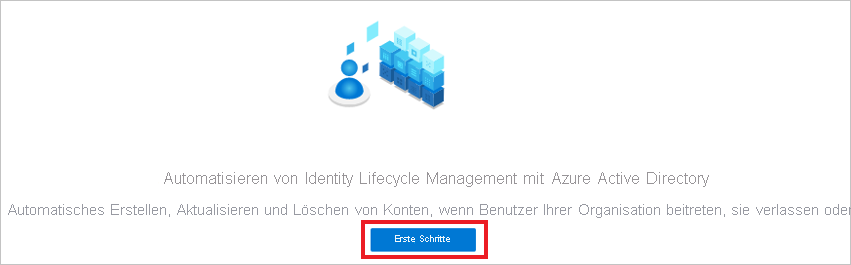
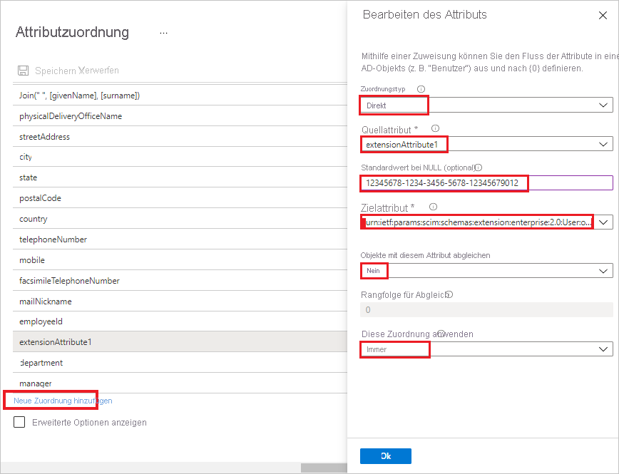

# Tutorial: Konfigurieren von SchoolStream ASA für die automatische Benutzerbereitstellung in SchoolStream ASA

In diesem Tutorial werden die Schritte beschrieben, die Sie sowohl in SchoolStream ASA als auch in Azure Active Directory (Azure AD) ausführen müssen, um die automatische Benutzerbereitstellung zu konfigurieren. Nach der Konfiguration stellt Azure AD mithilfe des Azure AD-Bereitstellungsdiensts automatisch Benutzer und Gruppen für [SchoolStream ASA](https://www.ssk12.com/) bereit bzw. hebt deren Bereitstellung auf. Wichtige Details zum Zweck und zur Funktionsweise dieses Diensts sowie häufig gestellte Fragen finden Sie unter [Automatisieren der Bereitstellung und Bereitstellungsaufhebung von Benutzern für SaaS-Anwendungen mit Azure Active Directory](../app-provisioning/user-provisioning.md). 

## Unterstützte Funktionen
> [!div class="checklist"]
> * Erstellen von Benutzern in SchoolStream ASA 
> * Entfernen von Benutzern aus SchoolStream ASA, wenn diese keinen Zugriff mehr benötigen
> * Synchronisieren von Benutzerattributen zwischen Azure AD und SchoolStream ASA
> * [Einmaliges Anmelden](../manage-apps/add-application-portal-setup-oidc-sso.md) bei SchoolStream ASA (empfohlen)

## Voraussetzungen

Das diesem Tutorial zu Grunde liegende Szenario setzt voraus, dass Sie bereits über die folgenden Voraussetzungen verfügen:

* [Azure AD-Mandant](../develop/quickstart-create-new-tenant.md) 
* Ein Benutzerkonto in Azure AD mit der [Berechtigung](../roles/permissions-reference.md) für die Konfiguration von Bereitstellungen (z. B. Anwendungsadministrator, Cloudanwendungsadministrator, Anwendungsbesitzer oder Globaler Administrator). 
* Eine SchoolStream-Website. Wenden Sie sich an den [SchoolStream-Support](mailto:support@rtresponse.com), falls Sie keine haben.

## Schritt 1: Planen der Bereitstellung
1. Erfahren Sie, [wie der Bereitstellungsdienst funktioniert](../app-provisioning/user-provisioning.md).
1. Bestimmen Sie, wer [in den Bereitstellungsbereich](../app-provisioning/define-conditional-rules-for-provisioning-user-accounts.md) einbezogen werden soll.
1. Legen Sie fest, welche Daten [zwischen Azure AD und SchoolStream ASA zugeordnet werden sollen](../app-provisioning/customize-application-attributes.md). 

## Schritt 2: Konfigurieren von SchoolStream ASA für die Unterstützung der Bereitstellung mit Azure AD

1. Fordern Sie die Integration von SchoolStream ASA beim [SchoolStream-Support](mailto:support@rtresponse.com) an. Sie müssen dabei Ihre **Azure AD-Mandanten-ID** und die **SchoolStream-Website-URL** angeben.

1. Nach der Zuordnung Ihrer SchoolStream-Website und Azure AD-Mandanten-ID durch SchoolStream erhalten Sie ein **geheimes Token** und die **Mandanten-URL** für SchoolStream ASA.

## Schritt 3: Hinzufügen von SchoolStream ASA aus dem Azure AD-Anwendungskatalog

Um mit der Verwaltung der Bereitstellung für SchoolStream ASA in Ihrer Azure AD-Instanz beginnen zu können, müssen Sie SchoolStream ASA aus dem Azure AD-Anwendungskatalog hinzufügen. 

1. Melden Sie sich mit einem Geschäfts-, Schul- oder Unikonto oder mit einem persönlichen Microsoft-Konto beim Azure-Portal an.
2. Wählen Sie im linken Navigationsbereich den Dienst **Azure Active Directory** aus.
3. Navigieren Sie zu **Unternehmensanwendungen**, und wählen Sie dann **Alle Anwendungen** aus.
4. Wählen Sie zum Hinzufügen einer neuen Anwendung **Neue Anwendung** aus.
5. Geben Sie im Abschnitt **Azure AD-Katalog durchsuchen** den Suchbegriff **SchoolStream ASA** in das Suchfeld ein.
6. Wählen Sie im Ergebnisbereich **SchoolStream ASA** aus, und **registrieren Sie sich für die App**. Warten Sie einige Sekunden, während die App Ihrem Mandanten hinzugefügt wird.

Wenn Sie SchoolStream ASA zuvor für einmaliges Anmelden eingerichtet haben, können Sie dieselbe Anwendung verwenden. Es ist jedoch empfehlenswert, beim erstmaligen Testen der Integration eine separate App zu erstellen. [Hier](../manage-apps/add-application-portal.md) erfahren Sie mehr über das Hinzufügen einer Anwendung aus dem Katalog. 

## Schritt 4. Definieren der Benutzer für den Bereitstellungsbereich 

Mit dem Azure AD-Bereitstellungsdienst können Sie anhand der Zuweisung zur Anwendung oder aufgrund von Attributen für den Benutzer/die Gruppe festlegen, wer in die Bereitstellung einbezogen werden soll. Wenn Sie sich dafür entscheiden, anhand der Zuweisung festzulegen, wer für Ihre App bereitgestellt werden soll, können Sie der Anwendung mithilfe der folgenden [Schritte](../manage-apps/assign-user-or-group-access-portal.md) Benutzer und Gruppen zuweisen. Wenn Sie allein anhand der Attribute des Benutzers oder der Gruppe auswählen möchten, wer bereitgestellt wird, können Sie einen [hier](../app-provisioning/define-conditional-rules-for-provisioning-user-accounts.md) beschriebenen Bereichsfilter verwenden. 

* Beim Zuweisen von Benutzern und Gruppen zu SchoolStream ASA müssen Sie eine andere Rolle als **Standardzugriff** auswählen. Benutzer mit der Rolle „Standardzugriff“ werden von der Bereitstellung ausgeschlossen und in den Bereitstellungsprotokollen als „nicht effektiv berechtigt“ gekennzeichnet. Wenn für die Anwendung nur die Rolle „Standardzugriff“ verfügbar ist, können Sie das [Anwendungsmanifest aktualisieren](../develop/howto-add-app-roles-in-azure-ad-apps.md) und weitere Rollen hinzufügen. 

* Fangen Sie klein an. Testen Sie die Bereitstellung mit einer kleinen Gruppe von Benutzern und Gruppen, bevor Sie sie für alle freigeben. Wenn der Bereitstellungsbereich auf zugewiesene Benutzer und Gruppen festgelegt ist, können Sie dies durch Zuweisen von einem oder zwei Benutzern oder Gruppen zur App kontrollieren. Ist der Bereich auf alle Benutzer und Gruppen festgelegt, können Sie einen [attributbasierten Bereichsfilter](../app-provisioning/define-conditional-rules-for-provisioning-user-accounts.md) angeben. 

## Schritt 5: Konfigurieren der automatischen Benutzerbereitstellung für SchoolStream ASA 

In diesem Abschnitt werden die Schritte erläutert, mit denen Sie den Azure AD-Bereitstellungsdienst zum Erstellen, Aktualisieren und Deaktivieren von Benutzern und/oder Gruppen in SchoolStream ASA auf der Grundlage von Benutzer- bzw. Gruppenzuweisungen in Azure AD konfigurieren.

### So konfigurieren Sie die automatische Benutzerbereitstellung für SchoolStream ASA in Azure AD:

1. Melden Sie sich beim [Azure-Portal](https://portal.azure.com) an. Wählen Sie **Unternehmensanwendungen** und dann **Alle Anwendungen**.

    

1. Wählen Sie in der Anwendungsliste **SchoolStream ASA** aus.

    

1. Wählen Sie die Registerkarte **Bereitstellung**.

    

1. Wenn Sie die Bereitstellung zum ersten Mal konfigurieren, wählen Sie **Erste Schritte** aus.

    
    
1. Legen Sie den **Bereitstellungsmodus** auf **Automatisch** fest.

    

1. Geben Sie im Abschnitt **Administratoranmeldeinformationen** die **Mandanten-URL** und das **geheime Token** für SchoolStream ASA ein. Klicken Sie auf **Verbindung testen**, um sicherzustellen, dass Azure AD eine Verbindung mit SchoolStream ASA herstellen kann. Vergewissern Sie sich bei einem Verbindungsfehler, dass Ihr SchoolStream ASA-Konto über Administratorberechtigungen verfügt, und wiederholen Sie den Vorgang.

    

1. Wählen Sie **Speichern** aus, um den Abschnitt **Einstellungen** anzuzeigen.

1. Geben Sie im Abschnitt **Einstellungen** im Feld **Benachrichtigungs-E-Mail** die E-Mail-Adresse einer Person oder Gruppe ein, die Benachrichtigungen zu Bereitstellungsfehlern erhalten soll, und aktivieren Sie das Kontrollkästchen **Bei Fehler E-Mail-Benachrichtigung senden**.

    

1. Wählen Sie im Abschnitt **Zuordnungen** die Option **Azure Active Directory-Benutzer bereitstellen** aus.

1. Wählen Sie unten **Neue Zuordnung hinzufügen** aus.

1. Gehen Sie im Dialogfeld **Attribut bearbeiten** wie folgt vor: 
    
   * Wählen Sie im Feld **Zuordnungstyp** in der Dropdownliste **Direkt** aus.
   * Wählen Sie im Feld **Quellattribut** in der Dropdownliste **extensionAttribute1** aus.
   * Geben Sie im Feld **Standardwert bei NULL (optional)** den Wert für Ihre **Azure AD-Mandanten-ID** ein.
   * Wählen Sie im Feld **Zielattribut** aus der Dropdownliste **urn:ietf:params:scim:schemas:extension:enterprise:2.0:User:organization** aus. 
   * Wählen Sie im Feld **Objekte mit diesem Attribut abgleichen** in der Dropdownliste **Nein** aus.
   * Wählen Sie im Feld **Diese Zuordnung anwenden** in der Dropdownliste **Immer** aus.
   * Klicken Sie auf **OK**.

       

1. Überprüfen Sie im Abschnitt **Attributzuordnung** die Benutzerattribute, die von Azure AD mit SchoolStream ASA synchronisiert werden. Mit den als **übereinstimmende** Eigenschaften ausgewählten Attributen werden die Benutzerkonten in SchoolStream ASA bei Updatevorgängen abgeglichen. Wenn Sie das [übereinstimmende Zielattribut](../app-provisioning/customize-application-attributes.md) ändern möchten, müssen Sie sicherstellen, dass die SchoolStream ASA-API das Filtern von Benutzern nach diesem Attribut unterstützt.

   |attribute|type|Unterstützung für das Filtern|
   |---|---|---|
   |userName|String|&check;
   |aktiv|Boolean|   
   |displayName|String|
   |emails[type eq "work"].value|String|
   |preferredLanguage|String|
   |name.givenName|String|
   |name.familyName|String|
   |name.formatted|String|
   |phoneNumbers[type eq "mobile"].value|String|
   |externalId|String|
   |urn:ietf:params:scim:schemas:extension:enterprise:2.0:User:organization|String| 

13. Wählen Sie die Schaltfläche **Speichern**, um alle Änderungen zu übernehmen. Sie können zur Registerkarte **Anwendung** zurückkehren und **Bereitstellung bearbeiten** auswählen, um den Vorgang fortzusetzen.

1. Wenn Sie Bereichsfilter konfigurieren möchten, lesen Sie die Anweisungen unter [Attributbasierte Anwendungsbereitstellung mit Bereichsfiltern](../app-provisioning/define-conditional-rules-for-provisioning-user-accounts.md).

1. Um den Azure AD-Bereitstellungsdienst für SchoolStream ASA zu aktivieren, ändern Sie im Abschnitt **Einstellungen** den **Bereitstellungsstatus** in **Ein**.

    

1. Legen Sie die Benutzer und/oder Gruppen fest, die in SchoolStream ASA bereitgestellt werden sollen. Wählen Sie dazu im Abschnitt **Einstellungen** unter **Bereich** die gewünschten Werte aus.

    

1. Wenn Sie fertig sind, klicken Sie auf **Speichern**.

    

Durch diesen Vorgang wird der erstmalige Synchronisierungszyklus für alle Benutzer und Gruppen gestartet, die im Abschnitt **Einstellungen** unter **Bereich** definiert wurden. Der erste Zyklus dauert länger als nachfolgende Zyklen, die ungefähr alle 40 Minuten erfolgen, solange der Azure AD-Bereitstellungsdienst ausgeführt wird. 

## Schritt 6: Überwachen der Bereitstellung
Nachdem Sie die Bereitstellung konfiguriert haben, können Sie mit den folgenden Ressourcen die Bereitstellung überwachen:

* Mithilfe der [Bereitstellungsprotokolle](../reports-monitoring/concept-provisioning-logs.md) können Sie ermitteln, welche Benutzer erfolgreich bzw. nicht erfolgreich bereitgestellt wurden.
* Anhand der [Fortschrittsleiste](../app-provisioning/application-provisioning-when-will-provisioning-finish-specific-user.md) können Sie den Status des Bereitstellungszyklus überprüfen und den Fortschritt der Bereitstellung verfolgen.
* Wenn sich die Bereitstellungskonfiguration in einem fehlerhaften Zustand zu befinden scheint, wird die Anwendung unter Quarantäne gestellt. Weitere Informationen zu den verschiedenen Quarantänestatus finden Sie [hier](../app-provisioning/application-provisioning-quarantine-status.md).  

## Weitere Ressourcen

* [Verwalten der Benutzerkontobereitstellung für Unternehmens-Apps](../app-provisioning/configure-automatic-user-provisioning-portal.md)
* [Was bedeuten Anwendungszugriff und einmaliges Anmelden mit Azure Active Directory?](../manage-apps/what-is-single-sign-on.md)

## Nächste Schritte

* [Erfahren Sie, wie Sie Protokolle überprüfen und Berichte zu Bereitstellungsaktivitäten abrufen.](../app-provisioning/check-status-user-account-provisioning.md)