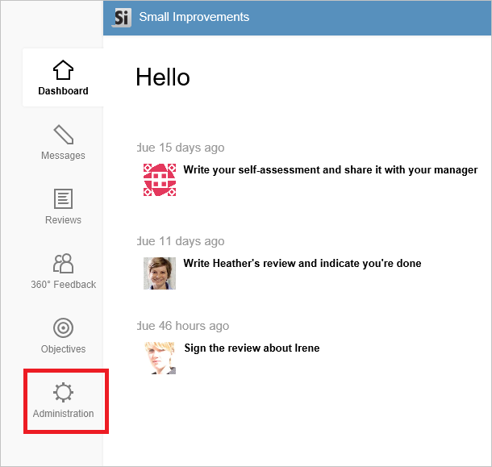
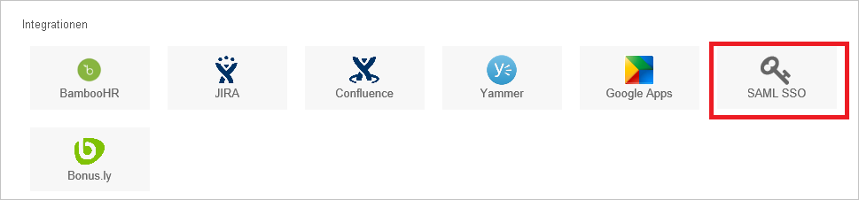
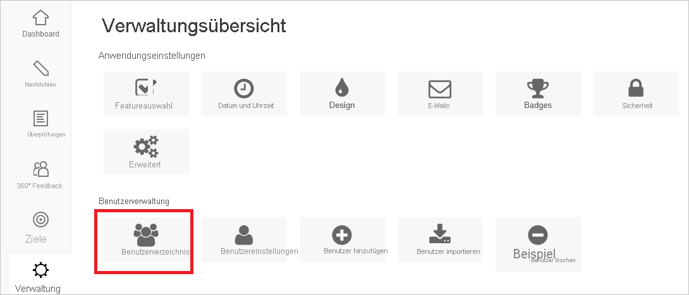

# Tutorial: Azure AD-SSO-Integration mit Small Improvements

In diesem Tutorial erfahren Sie, wie Sie Small Improvements mit Azure Active Directory (Azure AD) integrieren. Die Integration von Small Improvements mit Azure AD ermöglicht Folgendes:

* Steuern Sie in Azure AD, wer Zugriff auf Small Improvements hat.
* Ermöglichen Sie Ihren Benutzer*innen, sich mit ihren Azure AD-Konten automatisch bei Small Improvements anzumelden.
* Verwalten Sie Ihre Konten zentral im Azure-Portal.

## Voraussetzungen

Für die ersten Schritte benötigen Sie Folgendes:

* Ein Azure AD-Abonnement Falls Sie über kein Abonnement verfügen, können Sie ein [kostenloses Azure-Konto](https://azure.microsoft.com/free/) verwenden.
* Ein Small Improvements-Abonnement, für das einmaliges Anmelden (SSO) aktiviert ist

## Beschreibung des Szenarios

In diesem Tutorial konfigurieren und testen Sie das einmalige Anmelden von Azure AD in einer Testumgebung.

* Small Improvements unterstützt **SP-initiiertes** einmaliges Anmelden.

## Hinzufügen von Small Improvements aus dem Katalog

Zum Konfigurieren der Integration von Small Improvements in Azure AD müssen Sie Small Improvements aus dem Katalog der Liste der verwalteten SaaS-Apps hinzufügen.

1. Melden Sie sich mit einem Geschäfts-, Schul- oder Unikonto oder mit einem persönlichen Microsoft-Konto beim Azure-Portal an.
1. Wählen Sie im linken Navigationsbereich den Dienst **Azure Active Directory** aus.
1. Navigieren Sie zu **Unternehmensanwendungen**, und wählen Sie dann **Alle Anwendungen** aus.
1. Wählen Sie zum Hinzufügen einer neuen Anwendung **Neue Anwendung** aus.
1. Geben Sie im Abschnitt **Aus Katalog hinzufügen** den Suchbegriff **Small Improvements** in das Suchfeld ein.
1. Wählen Sie im Ergebnisbereich **Small Improvements** aus, und fügen Sie dann die App hinzu. Warten Sie einige Sekunden, während die App Ihrem Mandanten hinzugefügt wird.

## Konfigurieren und Testen des einmaligen Anmeldens von Azure AD für Small Improvements

Konfigurieren und testen Sie das einmalige Anmelden von Azure AD mit Small Improvements mithilfe einer Testbenutzerin mit dem Namen **B. Simon**. Damit einmaliges Anmelden funktioniert, muss eine Linkbeziehung zwischen einem Azure AD-Benutzer und dem entsprechenden Benutzer in Small Improvements eingerichtet werden.

Führen Sie zum Konfigurieren des einmaligen Anmeldens von Azure AD für Small Improvements die folgenden Schritte aus:

1. **[Konfigurieren des einmaligen Anmeldens von Azure AD](#configure-azure-ad-sso)** , um Ihren Benutzern die Verwendung dieses Features zu ermöglichen.
    1. **[Erstellen eines Azure AD-Testbenutzers](#create-an-azure-ad-test-user)** , um das einmalige Anmelden von Azure AD mit dem Testbenutzer B. Simon zu testen.
    1. **[Zuweisen des Azure AD-Testbenutzers](#assign-the-azure-ad-test-user)** , um B. Simon die Verwendung des einmaligen Anmeldens von Azure AD zu ermöglichen.
1. **[Konfigurieren des einmaligen Anmeldens für Small Improvements](#configure-small-improvements-sso)** , um die Einstellungen für einmaliges Anmelden auf der Anwendungsseite zu konfigurieren
    1. **[Erstellen einer Small Improvements-Testbenutzerin](#create-small-improvements-test-user)** , um eine Entsprechung von B. Simon in Small Improvements zu erhalten, die mit ihrer Darstellung in Azure AD verknüpft ist.
1. **[Testen des einmaligen Anmeldens](#test-sso)** , um zu überprüfen, ob die Konfiguration funktioniert

## Konfigurieren des einmaligen Anmeldens (Single Sign-On, SSO) von Azure AD

Gehen Sie wie folgt vor, um das einmalige Anmelden von Azure AD im Azure-Portal zu aktivieren.

1. Navigieren Sie im Azure-Portal auf der Anwendungsintegrationsseite für **Small Improvements** zum Abschnitt **Verwalten**, und wählen Sie **Einmaliges Anmelden** aus.
1. Wählen Sie auf der Seite **SSO-Methode auswählen** die Methode **SAML** aus.
1. Klicken Sie auf der Seite **Einmaliges Anmelden (SSO) mit SAML einrichten** auf das Stiftsymbol für **Grundlegende SAML-Konfiguration**, um die Einstellungen zu bearbeiten.

   

4. Führen Sie im Abschnitt **Grundlegende SAML-Konfiguration** die folgenden Schritte aus:

    a. Geben Sie im Textfeld **Bezeichner (Entitäts-ID)** eine URL im folgenden Format ein: `https://<subdomain>.small-improvements.com`.

    b. Geben Sie im Textfeld **Anmelde-URL** eine URL im folgenden Format ein: `https://<subdomain>.small-improvements.com`.

    > [!NOTE]
    > Hierbei handelt es sich um Beispielwerte. Ersetzen Sie diese Werte durch den tatsächlichen Bezeichner und die tatsächliche Anmelde-URL. Wenden Sie sich an das [Supportteam für den Small Improvements-Client](mailto:support@small-improvements.com), um diese Werte zu erhalten. Sie können sich auch die Muster im Abschnitt **Grundlegende SAML-Konfiguration** im Azure-Portal ansehen.

5. Klicken Sie auf der Seite **Einmaliges Anmelden (SSO) mit SAML einrichten** im Abschnitt **SAML-Signaturzertifikat** auf **Herunterladen**, um das Ihrer Anforderung entsprechende **Zertifikat (Base64)** aus den angegebenen Optionen herunterzuladen und auf Ihrem Computer zu speichern.

    

6. Kopieren Sie im Abschnitt **Small Improvements einrichten** die entsprechenden URLs gemäß Ihren Anforderungen.

    

### Erstellen eines Azure AD-Testbenutzers

In diesem Abschnitt erstellen Sie im Azure-Portal einen Testbenutzer mit dem Namen B. Simon.

1. Wählen Sie im linken Bereich des Microsoft Azure-Portals **Azure Active Directory** > **Benutzer** > **Alle Benutzer** aus.
1. Wählen Sie oben im Bildschirm die Option **Neuer Benutzer** aus.
1. Führen Sie unter den Eigenschaften für **Benutzer** die folgenden Schritte aus:
   1. Geben Sie im Feld **Name** die Zeichenfolge `B.Simon` ein.  
   1. Geben Sie im Feld **Benutzername** die Zeichenfolge username@companydomain.extension ein. Beispiel: `B.Simon@contoso.com`.
   1. Aktivieren Sie das Kontrollkästchen **Kennwort anzeigen**, und notieren Sie sich den Wert aus dem Feld **Kennwort**.
   1. Klicken Sie auf **Erstellen**.

### Zuweisen des Azure AD-Testbenutzers

In diesem Abschnitt ermöglichen Sie B. Simon die Verwendung des einmaligen Anmeldens von Azure, indem Sie ihr Zugriff auf Small Improvements gewähren.

1. Wählen Sie im Azure-Portal **Unternehmensanwendungen** > **Alle Anwendungen** aus.
1. Wählen Sie in der Anwendungsliste **Small Improvements** aus.
1. Navigieren Sie auf der Übersichtsseite der App zum Abschnitt **Verwalten**, und wählen Sie **Benutzer und Gruppen** aus.
1. Wählen Sie **Benutzer hinzufügen** und anschließend im Dialogfeld **Zuweisung hinzufügen** die Option **Benutzer und Gruppen** aus.
1. Wählen Sie im Dialogfeld **Benutzer und Gruppen** in der Liste „Benutzer“ den Eintrag **B. Simon** aus, und klicken Sie dann unten auf dem Bildschirm auf die Schaltfläche **Auswählen**.
1. Wenn den Benutzern eine Rolle zugewiesen werden soll, können Sie sie im Dropdownmenü **Rolle auswählen** auswählen. Wurde für diese App keine Rolle eingerichtet, ist die Rolle „Standardzugriff“ ausgewählt.
1. Klicken Sie im Dialogfeld **Zuweisung hinzufügen** auf die Schaltfläche **Zuweisen**.

## Konfigurieren des einmaligen Anmeldens für Small Improvements

1. Melden Sie sich in einem anderen Browserfenster bei der Small Improvements-Unternehmenswebsite als Administrator an.

1. Klicken Sie auf der Dashboard-Hauptseite links auf die Schaltfläche **Administration** .

     

1. Klicken Sie im Abschnitt **Integrationen** auf die Schaltfläche **SAML-SSO**.

     

1. Führen Sie auf der Seite für die SSO-Einrichtung die folgenden Schritte aus:

      

    a. Fügen Sie in das Textfeld **HTTP Endpoint** (HTTP-Endpunkt) den Wert der **Anmelde-URL** ein, den Sie aus dem Azure-Portal kopiert haben.

    b. Öffnen Sie das heruntergeladene Zertifikat im Editor, kopieren Sie den Inhalt und fügen Sie ihn anschließend in das Textfeld **x509 Certificate** ein. 

    c. Wenn Sie möchten, dass sich die Benutzer sowohl per einmaligem Anmelden (SSO, Single Sign-On) als auch über ein Anmeldeformular authentifizieren können, aktivieren Sie das Kontrollkästchen **Enable access via login/password too** (Zugriff auch per Anmeldung/Kennwort ermöglichen).  

    d. Geben Sie im Textfeld **SAML Prompt** einen geeigneten Namen für die SSO-Anmeldeschaltfläche ein.  

    e. Klicken Sie auf **Speichern**.

### Erstellen eines Small Improvements-Testbenutzers

Damit sich Azure AD-Benutzer bei Small Improvements anmelden können, müssen sie in Small Improvements bereitgestellt werden. Im Fall von Small Improvements ist die Bereitstellung eine manuelle Aufgabe.

**Führen Sie zum Bereitstellen eines Benutzerkontos die folgenden Schritte aus:**

1. Melden Sie sich bei der Small Improvements-Unternehmenswebsite als Administrator an.

1. Klicken Sie auf der Startseite links im Menü auf **Administration**.

1. Klicken Sie im Abschnitt „User Management“ auf die Schaltfläche **User Directory** .

     

1. Klicken Sie auf **Benutzer hinzufügen**.

     

1. Führen Sie im Dialogfeld **Benutzer hinzufügen** die folgenden Schritte aus: 

    

    a. Geben Sie den **Vornamen** des Benutzers ein, z.B. **Britta**.

    b. Geben Sie den **Nachnamen** des Benutzers ein, z.B. **Simon**.

    c. Geben Sie die **E-Mail-Adresse** des Benutzers ein, z.B. **brittasimon@contoso.com** .

    d. Im Feld **Send notification email** können Sie nach Wunsch eine persönliche Nachricht eingeben. Wenn Sie keine Benachrichtigung senden möchten, deaktivieren Sie dieses Kontrollkästchen.

    e. Klicken Sie auf **Create Users**.

## Testen des einmaligen Anmeldens

In diesem Abschnitt testen Sie die Azure AD-Konfiguration für einmaliges Anmelden mit den folgenden Optionen: 

* Klicken Sie im Azure-Portal auf **Diese Anwendung testen**. Dadurch werden Sie zur Anmelde-URL für Small Improvements weitergeleitet, wo Sie den Anmeldeflow initiieren können. 

* Rufen Sie direkt die Anmelde-URL für Small Improvements auf, und initiieren Sie den Anmeldeflow.

* Sie können „Meine Apps“ von Microsoft verwenden. Wenn Sie unter „Meine Apps“ auf die Kachel „Small Improvements“ klicken, werden Sie zur Anmelde-URL für Small Improvements weitergeleitet. Weitere Informationen zu „Meine Apps“ finden Sie in [dieser Einführung](../user-help/my-apps-portal-end-user-access.md).

## Nächste Schritte

Nach dem Konfigurieren von Small Improvements können Sie Sitzungssteuerung erzwingen, die in Echtzeit vor der Exfiltration und Infiltration vertraulicher Unternehmensdaten schützt. Die Sitzungssteuerung basiert auf bedingtem Zugriff. [Erfahren Sie, wie Sie die Sitzungssteuerung mit Microsoft Defender for Cloud Apps erzwingen.](/cloud-app-security/proxy-deployment-aad)
