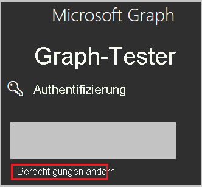
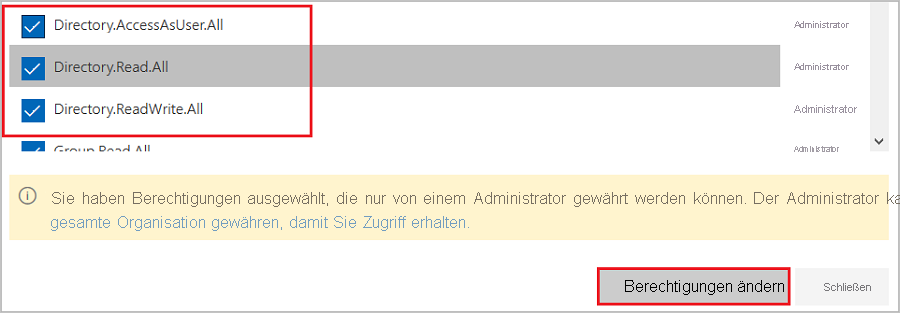
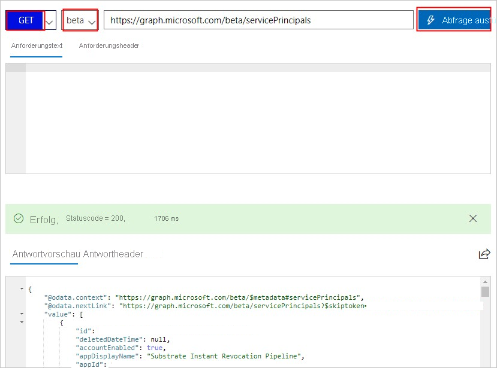

# <a name="tutorial-azure-ad-sso-integration-with-vida"></a>Tutorial: Azure AD-SSO-Integration in VIDA

In diesem Tutorial erfahren Sie, wie Sie VIDA in Azure Active Directory (Azure AD) integrieren. Die Integration von VIDA mit Azure AD ermöglicht Folgendes:

* Sie können in Azure AD steuern, wer Zugriff auf VIDA hat.
* Ermöglichen Sie es Ihren Benutzern, sich mit ihren Azure AD-Konten automatisch bei VIDA anzumelden.
* Verwalten Sie Ihre Konten zentral im Azure-Portal.

## <a name="prerequisites"></a>Voraussetzungen

Für die ersten Schritte benötigen Sie Folgendes:

* Ein Azure AD-Abonnement Falls Sie über kein Abonnement verfügen, können Sie ein [kostenloses Azure-Konto](https://azure.microsoft.com/free/) verwenden.
* VIDA-Abonnement, für das einmaliges Anmelden (Single Sign-On, SSO) aktiviert ist

## <a name="scenario-description"></a>Beschreibung des Szenarios

In diesem Tutorial konfigurieren und testen Sie das einmalige Anmelden von Azure AD in einer Testumgebung.

* VIDA unterstützt **SP-initiiertes** einmaliges Anmelden.

* VIDA unterstützt die **Just-In-Time**-Benutzerbereitstellung.

## <a name="adding-vida-from-the-gallery"></a>Hinzufügen von VIDA aus dem Katalog

Für die Konfiguration der Integration von VIDA in Azure AD müssen Sie VIDA über den Katalog Ihrer Liste mit verwalteten SaaS-Apps hinzufügen.

1. Melden Sie sich mit einem Geschäfts-, Schul- oder Unikonto oder mit einem persönlichen Microsoft-Konto beim Azure-Portal an.
1. Wählen Sie im linken Navigationsbereich den Dienst **Azure Active Directory** aus.
1. Navigieren Sie zu **Unternehmensanwendungen**, und wählen Sie dann **Alle Anwendungen** aus.
1. Wählen Sie zum Hinzufügen einer neuen Anwendung **Neue Anwendung** aus.
1. Geben Sie im Abschnitt **Aus Katalog hinzufügen** den Suchbegriff **VIDA** in das Suchfeld ein.
1. Wählen Sie im Ergebnisbereich **VIDA** aus, und fügen Sie dann die App hinzu. Warten Sie einige Sekunden, während die App Ihrem Mandanten hinzugefügt wird.


## <a name="configure-and-test-azure-ad-sso-for-vida"></a>Konfigurieren und Testen des einmaligen Anmeldens von Azure AD für VIDA

Konfigurieren und testen Sie das einmalige Anmelden von Azure AD mit VIDA mithilfe eines Testbenutzers mit dem Namen **B. Simon**. Damit einmaliges Anmelden funktioniert, muss eine Verknüpfung zwischen einem Azure AD-Benutzer und dem entsprechenden Benutzer in VIDA eingerichtet werden.

Führen Sie zum Konfigurieren und Testen des einmaligen Anmeldens von Azure AD mit VIDA die folgenden Schritte aus:

1. **[Konfigurieren des einmaligen Anmeldens von Azure AD](#configure-azure-ad-sso)** , um Ihren Benutzern die Verwendung dieses Features zu ermöglichen.
    1. **[Erstellen eines Azure AD-Testbenutzers](#create-an-azure-ad-test-user)** , um das einmalige Anmelden von Azure AD mit dem Testbenutzer B. Simon zu testen.
    1. **[Zuweisen des Azure AD-Testbenutzers](#assign-the-azure-ad-test-user)** , um B. Simon die Verwendung des einmaligen Anmeldens von Azure AD zu ermöglichen.
1. **[Konfigurieren des einmaligen Anmeldens für VIDA](#configure-vida-sso)** , um die Einstellungen für einmaliges Anmelden auf der Anwendungsseite zu konfigurieren
    1. **[Erstellen eines VIDA-Testbenutzers](#create-vida-test-user)** , um eine Entsprechung von B. Simon in VIDA zu erhalten, die mit der Benutzerdarstellung in Azure AD verknüpft ist
1. **[Testen des einmaligen Anmeldens](#test-sso)** , um zu überprüfen, ob die Konfiguration funktioniert

## <a name="configure-azure-ad-sso"></a>Konfigurieren des einmaligen Anmeldens (Single Sign-On, SSO) von Azure AD

Gehen Sie wie folgt vor, um das einmalige Anmelden von Azure AD im Azure-Portal zu aktivieren.

1. Navigieren Sie im Azure-Portal auf der Anwendungsintegrationsseite für **VIDA** zum Abschnitt **Verwalten**, und klicken Sie auf **Einmaliges Anmelden**.
1. Wählen Sie auf der Seite **SSO-Methode auswählen** die Methode **SAML** aus.
1. Klicken Sie auf der Seite **Einmaliges Anmelden (SSO) mit SAML einrichten** auf das Stiftsymbol für **Grundlegende SAML-Konfiguration**, um die Einstellungen zu bearbeiten.

   

1. Geben Sie im Abschnitt **Grundlegende SAML-Konfiguration** die Werte für die folgenden Felder ein:

    a. Geben Sie im Textfeld **Bezeichner (Entitäts-ID)** den folgenden Wert ein: `urn:amazon:cognito:sp:eu-west-2_IDmTxjGr6`.
    
    b. Geben Sie im Textfeld **Antwort-URL** die folgende URL ein: `https://vitruevida.auth.eu-west-2.amazoncognito.com/saml2/idpresponse`.
    
    c. Geben Sie im Textfeld **Anmelde-URL** eine URL im folgenden Format ein:
    
    `https://vitruevida.com/?teamid=<ID>&idp=<IDP_NAME>`

    > [!NOTE]
    > Der Wert der Anmelde-URL entspricht nicht dem tatsächlichen Wert. Ersetzen Sie diesen Wert durch die tatsächliche Anmelde-URL. Wenden Sie sich an das [Clientsupportteam von VIDA](mailto:support@vitruehealth.com), um diesen Wert zu erhalten. Sie können sich auch die Muster im Abschnitt **Grundlegende SAML-Konfiguration** im Azure-Portal ansehen.

1. VIDA erwartet die SAML-Assertionen in einem bestimmten Format. Daher müssen Sie Ihrer Konfiguration der SAML-Tokenattribute benutzerdefinierte Attributzuordnungen hinzufügen. Der folgende Screenshot zeigt die Liste der Standardattribute.

    

1. Darüber hinaus wird von der VIDA-Anwendung erwartet, dass in der SAML-Antwort noch einige weitere Attribute zurückgegeben werden (siehe unten). Diese Attribute werden ebenfalls vorab aufgefüllt, Sie können sie jedoch nach Bedarf überprüfen.
    
    | Name | Quellattribut|
    | ---------------- | --------- |
    | assignetzdroles | user.assignedroles |

1. Navigieren Sie auf der Seite **Einmaliges Anmelden (SSO) mit SAML einrichten** im Abschnitt **SAML-Signaturzertifikat** zu **Verbundmetadaten-XML**, und wählen Sie **Herunterladen** aus, um das Zertifikat herunterzuladen und auf Ihrem Computer zu speichern.

    

1. Kopieren Sie im Abschnitt **VIDA einrichten** die entsprechenden URLs gemäß Ihren Anforderungen.

    

### <a name="create-an-azure-ad-test-user"></a>Erstellen eines Azure AD-Testbenutzers

In diesem Abschnitt erstellen Sie im Azure-Portal einen Testbenutzer mit dem Namen B. Simon.

1. Wählen Sie im linken Bereich des Microsoft Azure-Portals **Azure Active Directory** > **Benutzer** > **Alle Benutzer** aus.
1. Wählen Sie oben im Bildschirm die Option **Neuer Benutzer** aus.
1. Führen Sie unter den Eigenschaften für **Benutzer** die folgenden Schritte aus:
   1. Geben Sie im Feld **Name** die Zeichenfolge `B.Simon` ein.  
   1. Geben Sie im Feld **Benutzername** die Zeichenfolge username@companydomain.extension ein. Beispiel: `B.Simon@contoso.com`.
   1. Aktivieren Sie das Kontrollkästchen **Kennwort anzeigen**, und notieren Sie sich den Wert aus dem Feld **Kennwort**.
   1. Klicken Sie auf **Erstellen**.

### <a name="assign-the-azure-ad-test-user"></a>Zuweisen des Azure AD-Testbenutzers

In diesem Abschnitt ermöglichen Sie B. Simon die Verwendung des einmaligen Anmeldens von Azure, indem Sie dem Benutzer Zugriff auf VIDA gewähren.

1. Wählen Sie im Azure-Portal **Unternehmensanwendungen** > **Alle Anwendungen** aus.
1. Wählen Sie in der Anwendungsliste die Option **VIDA** aus.
1. Navigieren Sie auf der Übersichtsseite der App zum Abschnitt **Verwalten**, und wählen Sie **Benutzer und Gruppen** aus.
1. Wählen Sie **Benutzer hinzufügen** und anschließend im Dialogfeld **Zuweisung hinzufügen** die Option **Benutzer und Gruppen** aus.
1. Wählen Sie im Dialogfeld **Benutzer und Gruppen** in der Liste „Benutzer“ den Eintrag **B. Simon** aus, und klicken Sie dann unten auf dem Bildschirm auf die Schaltfläche **Auswählen**.
1. Wenn den Benutzern eine Rolle zugewiesen werden soll, können Sie sie im Dropdownmenü **Rolle auswählen** auswählen. Wurde für diese App keine Rolle eingerichtet, ist die Rolle „Standardzugriff“ ausgewählt.
1. Klicken Sie im Dialogfeld **Zuweisung hinzufügen** auf die Schaltfläche **Zuweisen**.

## <a name="configure-role-based-single-sign-on-in-vida"></a>Konfigurieren von rollenbasiertem SSO in VIDA

1. Um dem Azure AD-Benutzer eine VIDA-Rolle zuzuordnen, müssen Sie eine Rolle in Azure AD erstellen, indem Sie die folgenden Schritte ausführen:

    a. Melden Sie sich beim [Microsoft Graph-Tester](https://developer.microsoft.com/graph/graph-explorer) an.

    b. Klicken Sie auf **Berechtigungen ändern** , um die erforderlichen Berechtigungen zum Erstellen einer Rolle zu erhalten.

    

    c. Wählen Sie die folgenden Berechtigungen aus der Liste aus, und klicken Sie auf **Berechtigungen ändern**, wie in der folgenden Abbildung dargestellt.

    

    >[!NOTE]
    >Nach dem Zuweisen der Berechtigungen melden Sie sich wieder beim Graph-Tester an.

    d. Wählen Sie auf die Graph-Tester Seite aus der ersten Dropdownliste **GET** und aus der zweiten Dropdownliste **beta** aus. Geben Sie dann `https://graph.microsoft.com/beta/servicePrincipals` in das Feld neben den Dropdownlisten ein, und klicken Sie auf **Abfrage ausführen**.

    

    >[!NOTE]
    >Wenn Sie mehrere Verzeichnisse verwenden, können Sie `https://graph.microsoft.com/beta/contoso.com/servicePrincipals` in das Feld der Abfrage eingeben.

    e. Extrahieren Sie im Abschnitt **Antwortvorschau** die appRoles-Eigenschaft aus „Dienstprinzipal“ für die zukünftige Verwendung.

    

    >[!NOTE]
    >Die appRoles-Eigenschaft finden Sie durch Eingabe von `https://graph.microsoft.com/beta/servicePrincipals/<objectID>` in das Feld der Abfrage. Beachten Sie, dass `objectID` die Objekt-ID ist, die Sie auf der Azure AD-Seite **Eigenschaften** kopiert haben.

    f. Wechseln Sie zurück zum Graph-Tester, ändern Sie die Methode von **GET** zu **PATCH**, fügen Sie den folgenden Inhalt in den Abschnitt **Anforderungstext** ein und klicken Sie auf **Abfrage ausführen**:
    
   ```
   { 
   "appRoles": [
       {
           "allowedMemberTypes": [
           "User"
           ],
           "description": "User",
           "displayName": "User",
           "id": "18d14569-c3bd-439b-9a66-3a2aee01****",
           "isEnabled": true,
           "origin": "Application",
           "value": null
       },
       {
           "allowedMemberTypes": [
           "User"
           ],
           "description": "msiam_access",
           "displayName": "msiam_access",
           "id": "b9632174-c057-4f7e-951b-be3adc52****",
           "isEnabled": true,
           "origin": "Application",
           "value": null
       },
       {
       "allowedMemberTypes": [
           "User"
       ],
       "description": "VIDACompanyAdmin",
       "displayName": "VIDACompanyAdmin",
       "id": "293414bb-2215-48b4-9864-64520937d437",
       "isEnabled": true,
       "origin": "ServicePrincipal",
       "value": "VIDACompanyAdmin"
       },
       {
       "allowedMemberTypes": [
           "User"
       ],
       "description": "VIDATeamAdmin",
       "displayName": "VIDATeamAdmin",
       "id": "2884f1ae-5c0d-4afd-bf28-d7d11a3d7b2c",
       "isEnabled": true,
       "origin": "ServicePrincipal",
       "value": "VIDATeamAdmin"
       },
       {
       "allowedMemberTypes": [
           "User"
       ],
       "description": "VIDAUser",
       "displayName": "VIDAUser",
       "id": "37b3218c-0c06-484f-90e6-4390ce5a8787",
       "isEnabled": true,
       "origin": "ServicePrincipal",
       "value": "VIDAUser"
       }
   ]
   }
   ```
   > [!NOTE]
   > Azure AD sendet den Wert dieser Rollen als Anspruchswert in der SAML-Antwort. Neue Rollen können Sie jedoch nur nach dem `msiam_access`-Teil für den Patchvorgang hinzufügen. Um den Erstellungsprozess zu optimieren, empfehlen wir Ihnen, einen ID-Generator, wie beispielsweise den GUID-Generator, zu verwenden, um IDs in Echtzeit zu generieren.

   g. Nachdem der Dienstprinzipal mit der erforderlichen Rolle gepatcht wurde, fügen Sie die Rolle mit dem Azure AD-Benutzer (B. Simon) hinzu, indem Sie die Schritte im Abschnitt **Zuweisen des Azure AD-Testbenutzers** des Tutorials ausführen.

## <a name="configure-vida-sso"></a>Konfigurieren des einmaligen Anmeldens für VIDA

Zum Konfigurieren des einmaligen Anmeldens für **VIDA** müssen Sie die heruntergeladene **XML-Datei mit Verbundmetadaten** und die kopierten URLs aus dem Azure-Portal an das [Supportteam von VIDA](mailto:support@vitruehealth.com) senden. Es führt die Einrichtung durch, damit die SAML-SSO-Verbindung auf beiden Seiten richtig festgelegt ist.

### <a name="create-vida-test-user"></a>Erstellen eines Testbenutzers für VIDA

In diesem Abschnitt wird in VIDA ein Benutzer mit dem Namen Britta Simon erstellt. VIDA unterstützt die Just-in-Time-Benutzerbereitstellung, die standardmäßig aktiviert ist. Für Sie steht in diesem Abschnitt kein Aktionselement zur Verfügung. Ist ein Benutzer noch nicht in VIDA vorhanden, wird nach der Authentifizierung ein neuer Benutzer erstellt.

## <a name="test-sso"></a>Testen des einmaligen Anmeldens 

In diesem Abschnitt testen Sie die Azure AD-Konfiguration für einmaliges Anmelden mit den folgenden Optionen: 

* Klicken Sie im Azure-Portal auf **Diese Anwendung testen**. Dadurch werden Sie zur Anmelde-URL für VIDA weitergeleitet. Dort können Sie den Anmeldeflow initiieren. 

* Navigieren Sie direkt zur Anmelde-URL für VIDA, und initiieren Sie dort den Anmeldeflow.

* Sie können „Meine Apps“ von Microsoft verwenden. Wenn Sie in „Meine Apps“ auf die Kachel „VIDA“ klicken, werden Sie zur Anmelde-URL für VIDA weitergeleitet. Weitere Informationen zu „Meine Apps“ finden Sie in [dieser Einführung](../user-help/my-apps-portal-end-user-access.md).

## <a name="next-steps"></a>Nächste Schritte

Nach dem Konfigurieren von VIDA können Sie die Sitzungssteuerung erzwingen, die in Echtzeit vor der Exfiltration und Infiltration vertraulicher Unternehmensdaten schützt. Die Sitzungssteuerung basiert auf bedingtem Zugriff. [Erfahren Sie, wie Sie die Sitzungssteuerung mit Microsoft Defender for Cloud Apps erzwingen.](/cloud-app-security/proxy-deployment-aad)
