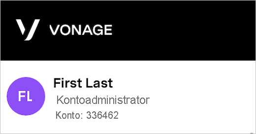
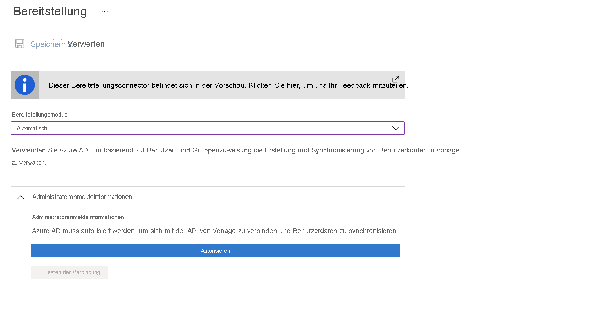

# Tutorial: Konfigurieren von Vonage für die automatische Benutzerbereitstellung

In diesem Tutorial werden die Schritte beschrieben, die Sie sowohl in Vonage als auch in Azure Active Directory (Azure AD) ausführen müssen, um die automatische Benutzerbereitstellung zu konfigurieren. Nach der Konfiguration stellt Azure AD mithilfe des Azure AD-Bereitstellungsdiensts automatisch Benutzer und Gruppen für [Vonage](https://www.vonage.com/) bereit bzw. hebt die Bereitstellung von Benutzern und Gruppen auf. Wichtige Details zum Zweck und zur Funktionsweise dieses Diensts sowie häufig gestellte Fragen finden Sie unter [Automatisieren der Bereitstellung und Bereitstellungsaufhebung von Benutzern für SaaS-Anwendungen mit Azure Active Directory](../app-provisioning/user-provisioning.md). 

## Unterstützte Funktionen
> [!div class="checklist"]
> * Erstellen von Benutzern in Vonage
> * Entfernen von Benutzern aus Vonage, wenn diese keinen Zugriff mehr benötigen
> * Synchronisieren von Benutzerattributen zwischen Azure AD und Vonage
> * [Einmaliges Anmelden](vonage-tutorial.md) bei Vonage (empfohlen)

## Voraussetzungen

Das diesem Tutorial zu Grunde liegende Szenario setzt voraus, dass Sie bereits über die folgenden Voraussetzungen verfügen:

* [Einen Azure AD-Mandanten](../develop/quickstart-create-new-tenant.md) 
* Ein Benutzerkonto in Azure AD mit der [Berechtigung](../roles/permissions-reference.md) für die Konfiguration von Bereitstellungen (z. B. Anwendungsadministrator, Cloudanwendungsadministrator, Anwendungsbesitzer oder Globaler Administrator). 
* Ein [Vonage](https://www.vonage.com/)-Mandant
* Ein Benutzerkonto in Vonage mit Administratorberechtigung (Kontoadministrator)

## Schritt 1: Planen der Bereitstellung
1. Erfahren Sie, [wie der Bereitstellungsdienst funktioniert](../app-provisioning/user-provisioning.md).
1. Bestimmen Sie, wer [in den Bereitstellungsbereich](../app-provisioning/define-conditional-rules-for-provisioning-user-accounts.md) einbezogen werden soll.
1. Legen Sie fest, welche Daten [zwischen Azure AD und Vonage zugeordnet werden sollen](../app-provisioning/customize-application-attributes.md). 

## Schritt 2: Konfigurieren von Vonage für die Unterstützung der Bereitstellung mit Azure AD

1. Melden Sie sich als Administratorbenutzer beim [Vonage-Verwaltungsportal](http://admin.vonage.com) an.

   

1. Navigieren Sie im Menü auf der linken Seite zu **Account > Single Sign-On Settings** (Konto > Einstellungen für einmaliges Anmelden).

   

1. Wählen Sie die Registerkarte **User Settings** (Benutzereinstellungen) aus, aktivieren Sie **Enable SCIM user provisioning** (SCIM-Benutzerbereitstellung aktivieren), und klicken Sie auf **Save** (Speichern).

## Schritt 3: Hinzufügen von Vonage aus dem Azure AD-Anwendungskatalog

Fügen Sie Vonage aus dem Azure AD-Anwendungskatalog hinzu, um mit dem Verwalten der Bereitstellung in Vonage zu beginnen. Wenn Sie Vonage zuvor für das einmalige Anmelden (Single Sign-On, SSO) eingerichtet haben, können Sie dieselbe Anwendung verwenden. Es ist jedoch empfehlenswert, beim erstmaligen Testen der Integration eine separate App zu erstellen. [Hier](../manage-apps/add-application-portal.md) erfahren Sie mehr über das Hinzufügen einer Anwendung aus dem Katalog.

## Schritt 4. Definieren der Benutzer für den Bereitstellungsbereich 

Mit dem Azure AD-Bereitstellungsdienst können Sie anhand der Zuweisung zur Anwendung oder aufgrund von Attributen für den Benutzer/die Gruppe festlegen, wer in die Bereitstellung einbezogen werden soll. Wenn Sie sich dafür entscheiden, anhand der Zuweisung festzulegen, wer für Ihre App bereitgestellt werden soll, können Sie der Anwendung mithilfe der folgenden [Schritte](../manage-apps/assign-user-or-group-access-portal.md) Benutzer und Gruppen zuweisen. Wenn Sie allein anhand der Attribute des Benutzers oder der Gruppe auswählen möchten, wer bereitgestellt wird, können Sie einen [hier](../app-provisioning/define-conditional-rules-for-provisioning-user-accounts.md) beschriebenen Bereichsfilter verwenden. 

* Beim Zuweisen von Benutzern und Gruppen zu Vonage müssen Sie eine andere Rolle als **Standardzugriff** auswählen. Benutzer mit der Rolle „Standardzugriff“ werden von der Bereitstellung ausgeschlossen und in den Bereitstellungsprotokollen als „nicht effektiv berechtigt“ gekennzeichnet. Wenn für die Anwendung nur die Rolle „Standardzugriff“ verfügbar ist, können Sie das [Anwendungsmanifest aktualisieren](../develop/howto-add-app-roles-in-azure-ad-apps.md) und weitere Rollen hinzufügen. 

* Fangen Sie klein an. Testen Sie die Bereitstellung mit einer kleinen Gruppe von Benutzern und Gruppen, bevor Sie sie für alle freigeben. Wenn der Bereitstellungsbereich auf zugewiesene Benutzer und Gruppen festgelegt ist, können Sie dies durch Zuweisen von einem oder zwei Benutzern oder Gruppen zur App kontrollieren. Ist der Bereich auf alle Benutzer und Gruppen festgelegt, können Sie einen [attributbasierten Bereichsfilter](../app-provisioning/define-conditional-rules-for-provisioning-user-accounts.md) angeben. 

## Schritt 5: Konfigurieren der automatischen Benutzerbereitstellung in Vonage 

> [!NOTE]
>  Jeder Benutzer, der Vonage hinzugefügt wird, muss über Vorname, Nachname und E-Mail-Adresse verfügen. Andernfalls tritt bei der Integration ein Fehler auf.

In diesem Abschnitt werden die Schritte zum Konfigurieren des Azure AD-Bereitstellungsdiensts zum Erstellen, Aktualisieren und Deaktivieren von Benutzern bzw. Gruppen in Vonage auf der Grundlage von Benutzer- oder Gruppenzuweisungen in Azure AD erläutert.

### So konfigurieren Sie die automatische Benutzerbereitstellung für Vonage in Azure AD:

1. Melden Sie sich beim [Azure-Portal](https://portal.azure.com) an. Wählen Sie **Unternehmensanwendungen** und dann **Alle Anwendungen**.

    

1. Wählen Sie in der Anwendungsliste **Vonage** aus.

    

1. Wählen Sie die Registerkarte **Bereitstellung**.

    

1. Legen Sie den **Bereitstellungsmodus** auf **Automatisch** fest.

    

1. Stellen Sie vor dem nächsten Schritt sicher, dass Sie als Kontoadministrator autorisiert sind. Um zu überprüfen, ob der Benutzer ein Kontoadministrator ist, melden Sie sich beim [Vonage-Verwaltungsportal](http://admin.vonage.com) an.
   Oben links sollte etwa Folgendes angezeigt werden:

   

1. Klicken Sie im Abschnitt **Admin Credentials** (Administratoranmeldeinformationen) auf „Authorize“ (Autorisieren), und achten Sie darauf, die Anmeldeinformationen des Kontoadministrators einzugeben. Werden Sie nicht zur Eingabe von Anmeldeinformationen aufgefordert, überprüfen Sie, ob Sie als Kontoadministrator angemeldet sind. (Sie können dies unter http://admin.vonage.com/ in der linken oberen Ecke überprüfen. Unter Ihrem Namen muss „Account Super User“ (Kontoadministrator) angezeigt werden.) Klicken Sie auf **Verbindung testen**, um sicherzustellen, dass Azure AD eine Verbindung mit Vonage herstellen kann. Wenn beim Herstellen der Verbindung ein Fehler auftritt, stellen Sie sicher, dass Ihr Vonage-Konto über Administratorberechtigungen verfügt, und wiederholen Sie den Vorgang.

   
1. Geben Sie im Feld **Benachrichtigungs-E-Mail** die E-Mail-Adresse einer Person oder Gruppe ein, die Benachrichtigungen zu Bereitstellungsfehlern erhalten soll, und aktivieren Sie das Kontrollkästchen **Bei Fehler E-Mail-Benachrichtigung senden**.

    

1. Wählen Sie **Speichern** aus.

1. Wählen Sie im Abschnitt **Zuordnungen** die Option **Azure Active Directory-Benutzer mit Vonage synchronisieren** aus.

1. Überprüfen Sie im Abschnitt **Attributzuordnungen** die Benutzerattribute, die von Azure AD mit Vonage synchronisiert werden. Mit den als **übereinstimmende** Eigenschaften ausgewählten Attribute werden die Benutzerkonten in Vonage bei Updatevorgängen abgeglichen. Wenn Sie sich dafür entscheiden, das [übereinstimmende Zielattribut](../app-provisioning/customize-application-attributes.md) zu ändern, müssen Sie sicherstellen, dass die Vonage-API das Filtern von Benutzern anhand dieses Attributs unterstützt. Wählen Sie die Schaltfläche **Speichern**, um alle Änderungen zu übernehmen.

   |attribute|Typ|Unterstützung für das Filtern|
   |---|---|---|
   |userName|String|&check;
   |aktiv|Boolean|   
   |emails[type eq "work"].value|String|
   |name.givenName|String|
   |name.familyName|String|

1. Wenn Sie Bereichsfilter konfigurieren möchten, lesen Sie die Anweisungen unter [Attributbasierte Anwendungsbereitstellung mit Bereichsfiltern](../app-provisioning/define-conditional-rules-for-provisioning-user-accounts.md).

1. Um den Azure AD-Bereitstellungsdienst für Vonage zu aktivieren, ändern Sie im Abschnitt **Einstellungen** den **Bereitstellungsstatus** in **Ein**.

    

1. Legen Sie die Benutzer bzw. Gruppen fest, die in Vonage bereitgestellt werden sollen. Wählen Sie dazu im Abschnitt **Einstellungen** unter **Bereich** die gewünschten Werte aus.

    

1. Wenn Sie fertig sind, klicken Sie auf **Speichern**.

    

Durch diesen Vorgang wird der erstmalige Synchronisierungszyklus für alle Benutzer und Gruppen gestartet, die im Abschnitt **Einstellungen** unter **Bereich** definiert wurden. Der erste Zyklus dauert länger als nachfolgende Zyklen, die ungefähr alle 40 Minuten erfolgen, solange der Azure AD-Bereitstellungsdienst ausgeführt wird. 

## Schritt 6: Überwachen der Bereitstellung
Nachdem Sie die Bereitstellung konfiguriert haben, können Sie mit den folgenden Ressourcen die Bereitstellung überwachen:

* Mithilfe der [Bereitstellungsprotokolle](../reports-monitoring/concept-provisioning-logs.md) können Sie ermitteln, welche Benutzer erfolgreich bzw. nicht erfolgreich bereitgestellt wurden.
* Anhand der [Fortschrittsleiste](../app-provisioning/application-provisioning-when-will-provisioning-finish-specific-user.md) können Sie den Status des Bereitstellungszyklus überprüfen und den Fortschritt der Bereitstellung verfolgen.
* Wenn sich die Bereitstellungskonfiguration in einem fehlerhaften Zustand zu befinden scheint, wird die Anwendung unter Quarantäne gestellt. Weitere Informationen zu den verschiedenen Quarantänestatus finden Sie [hier](../app-provisioning/application-provisioning-quarantine-status.md).  

## Weitere Ressourcen

* [Verwalten der Benutzerkontobereitstellung für Unternehmens-Apps](../app-provisioning/configure-automatic-user-provisioning-portal.md)
* [Was bedeuten Anwendungszugriff und einmaliges Anmelden mit Azure Active Directory?](../manage-apps/what-is-single-sign-on.md)

## Nächste Schritte

* [Erfahren Sie, wie Sie Protokolle überprüfen und Berichte zu Bereitstellungsaktivitäten abrufen.](../app-provisioning/check-status-user-account-provisioning.md)