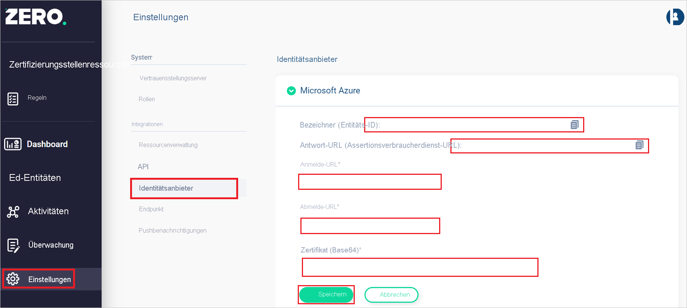

# Tutorial: Integration des einmaligen Anmeldens (Single Sign-On, SSO) von Azure AD mit Zero Networks

In diesem Tutorial erfahren Sie, wie Sie Zero Networks in Azure Active Directory (Azure AD) integrieren. Die Integration von Zero Networks in Azure AD ermöglicht Folgendes:

* Steuern Sie in Azure AD, wer Zugriff auf Zero Networks hat.
* Ermöglichen Sie es Ihren Benutzern, sich mit ihren Azure AD-Konten automatisch bei Zero Networks anzumelden.
* Verwalten Sie Ihre Konten zentral im Azure-Portal.

## Voraussetzungen

Für die ersten Schritte benötigen Sie Folgendes:

* Ein Azure AD-Abonnement Falls Sie über kein Abonnement verfügen, können Sie ein [kostenloses Azure-Konto](https://azure.microsoft.com/free/) verwenden.
* Ein Zero Networks-Abonnement, das für das einmalige Anmelden (Single Sign-On, SSO) aktiviert ist.

## Beschreibung des Szenarios

In diesem Tutorial konfigurieren Sie das einmalige Anmelden von Azure AD für das Zero Networks-Verwaltungsportal und das Zugriffsportal.

* Zero Networks unterstützt das **SP**-initiierte einmalige Anmelden.

> [!NOTE]
> Der Bezeichner dieser Anwendung ist ein fester Zeichenfolgenwert, daher kann in einem Mandanten nur eine Instanz konfiguriert werden.

## Hinzufügen von Zero Networks aus dem Katalog

Zum Konfigurieren der Integration von Zero Networks in Azure AD müssen Sie Zero Networks aus dem Katalog zu Ihrer Liste mit verwalteten SaaS-Apps hinzufügen.

1. Melden Sie sich mit einem Geschäfts-, Schul- oder Unikonto von Microsoft beim Azure-Portal an.
1. Wählen Sie im linken Navigationsbereich den Dienst **Azure Active Directory** aus.
1. Navigieren Sie zu **Unternehmensanwendungen**, und wählen Sie dann **Alle Anwendungen** aus.
1. Wählen Sie zum Hinzufügen einer neuen Anwendung **Neue Anwendung** aus.
1. Geben Sie im Abschnitt **Aus Katalog hinzufügen** den Suchbegriff **Zero Networks** in das Suchfeld ein.
1. Wählen Sie **Zero Networks** aus dem Ergebnisbereich aus, und fügen Sie die App dann hinzu. Warten Sie einige Sekunden, während die App Ihrem Mandanten hinzugefügt wird.

## Konfigurieren des einmaligen Anmeldens (Single Sign-On, SSO) von Azure AD

Gehen Sie wie folgt vor, um das einmalige Anmelden von Azure AD im Azure-Portal zu aktivieren.

1. Navigieren Sie im Azure-Portal auf der Anwendungsintegrationsseite für **Zero Networks** zum Abschnitt **Verwalten**, und wählen Sie **Einmaliges Anmelden** aus.
1. Wählen Sie auf der Seite **SSO-Methode auswählen** die Methode **SAML** aus.
1. Klicken Sie auf der Seite **Einmaliges Anmelden (SSO) mit SAML einrichten** auf das Stiftsymbol für **Grundlegende SAML-Konfiguration**, um die Einstellungen zu bearbeiten.

   

1. Führen Sie im Abschnitt **Grundlegende SAML-Konfiguration** den folgenden Schritt aus.

    a. Geben Sie im Textfeld **Anmelde-URL** die URL ein: `https://portal.zeronetworks.com/#/login`.

1. Navigieren Sie auf der Seite **Einmaliges Anmelden (SSO) mit SAML einrichten** im Abschnitt **SAML-Signaturzertifikat** zum Eintrag **Zertifikat (Base64)** . Wählen Sie **Herunterladen** aus, um das Zertifikat herunterzuladen, und speichern Sie es auf Ihrem Computer.

    

1. Kopieren Sie im Abschnitt **Zero Networks einrichten** die entsprechenden URLs gemäß Ihren Anforderungen.

    

## Konfigurieren des einmaligen Anmeldens für Zero Networks

1. Melden Sie sich als Administrator beim Zero Networks-Verwaltungsportal an.

1. Navigieren Sie zu **Settings** > **Identity Providers** (Einstellungen > Identitätsanbieter).

1. Klicken Sie auf **Microsoft Azure**, und führen Sie die folgenden Schritte aus.
    
    

    1. Kopieren Sie den Wert für **Identifier (Entity ID)** (Bezeichner (Entitäts-ID)), und fügen Sie diesen Wert im Azure-Portal im Abschnitt **Grundlegende SAML-Konfiguration** in das Textfeld **Bezeichner** ein.

    1. Kopieren Sie den Wert für **Reply URL (Assertion Consumer Service URL)** (Antwort-URL (Assertionsverbraucherdienst-URL)), und fügen Sie ihn im Azure-Portal im Abschnitt **Grundlegende SAML-Konfiguration** in das Feld **Antwort-URL** ein.

    1. Fügen Sie im Textfeld **Login URL** (Anmelde-URL) den Wert der **Anmelde-URL** ein, den Sie aus dem Azure-Portal kopiert haben.

    1. Fügen Sie im Textfeld **Logout URL** (Abmelde-URL) den Wert der **Abmelde-URL** ein, den Sie aus dem Azure-Portal kopiert haben.

    1. Öffnen Sie das aus dem Azure-Portal heruntergeladene **Zertifikat (Base64)** im Editor, und fügen Sie den Inhalt in das Textfeld **Certificate(Base64)** ein.

    1. Klicken Sie auf **Speichern**.

## Konfigurieren der Benutzerzuweisungsanforderung

1. Navigieren Sie im Azure-Portal auf der Anwendungsintegrationsseite für **Zero Networks** zum Abschnitt **Verwalten**, und wählen Sie **Eigenschaften** aus.
1. Ändern Sie die Option **Benutzerzuweisung erforderlich?** in **Nein**.

## Testen des einmaligen Anmeldens 

In diesem Abschnitt testen Sie die Azure AD-Konfiguration für einmaliges Anmelden mit den folgenden Optionen: 

* Klicken Sie im Azure-Portal auf **Diese Anwendung testen**. Dadurch werden Sie zur Anmelde-URL für Zero Networks weitergeleitet, wo Sie den Anmeldeflow initiieren können. 

* Rufen Sie direkt die Zero Networks-Anmelde-URL auf, und initiieren Sie den Anmeldeflow.

* Sie können „Meine Apps“ von Microsoft verwenden. Wenn Sie in „Meine Apps“ auf die Kachel „Zero Networks“ klicken, werden Sie zur Anmelde-URL von Zero Networks weitergeleitet. Weitere Informationen zu „Meine Apps“ finden Sie in [dieser Einführung](../user-help/my-apps-portal-end-user-access.md).
