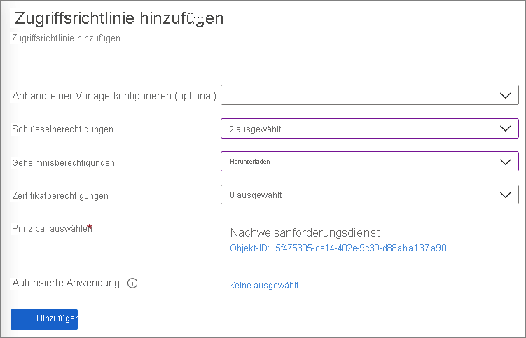
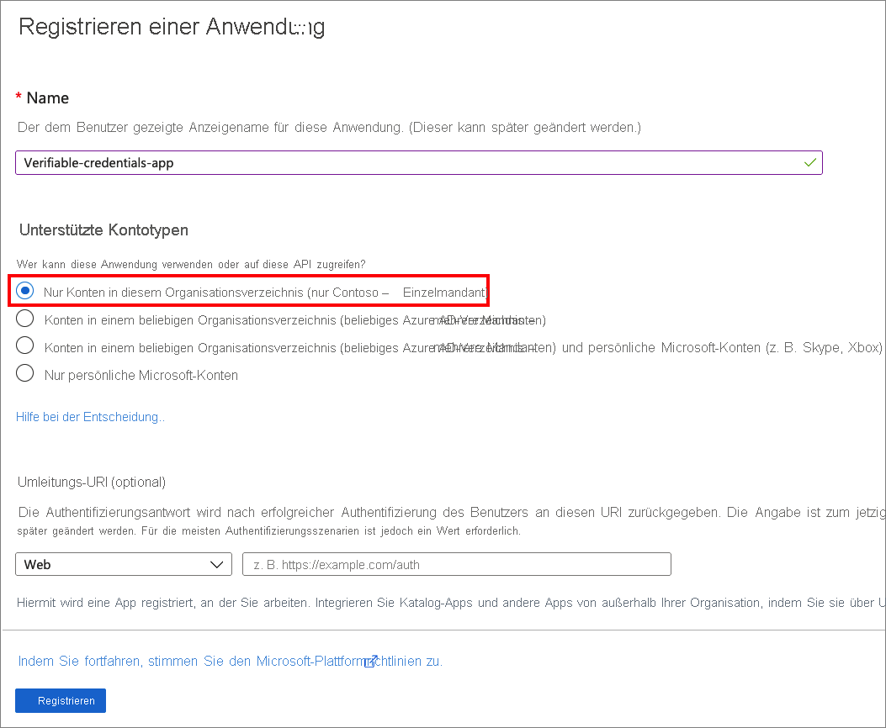
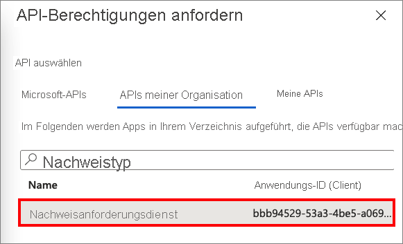
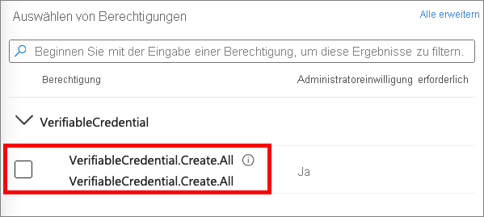
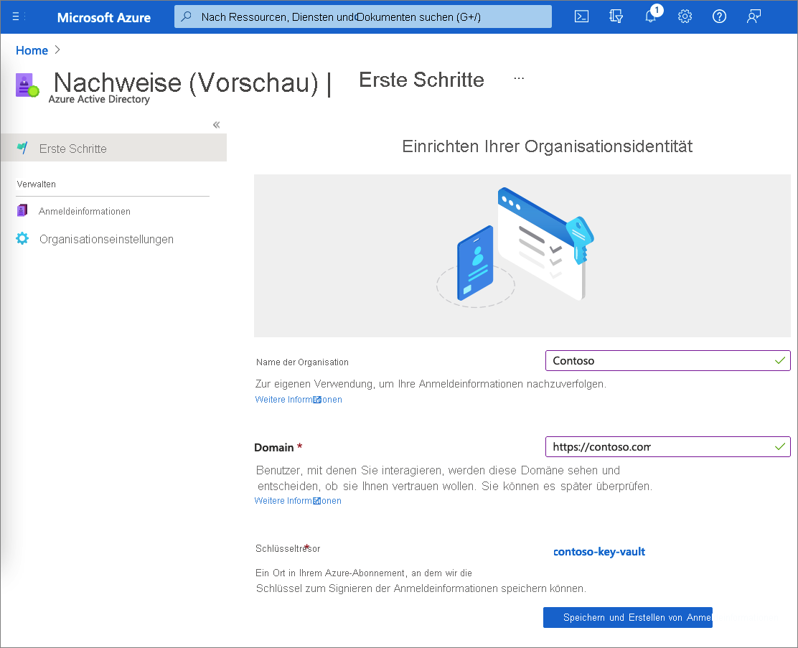

# <a name="configure-your-tenant-for-azure-ad-verifiable-credentials-preview"></a>Konfigurieren Ihres Mandanten für Azure AD-Nachweise (Vorschau)

Azure AD-Nachweise (Azure Active Directory) schützen Ihre Organisation mit einer nahtlosen und dezentralisierten Identitätslösung. Mit dem Dienst können Sie Nachweise ausgeben und überprüfen. Für Aussteller stellt Azure AD einen Dienst zur Verfügung, den sie anpassen und verwenden können, um ihre eigenen Nachweise auszustellen. Für Überprüfer bietet der Dienst eine kostenlose REST-API, die das Anfordern und Akzeptieren von Nachweisen in Ihren Apps und Diensten vereinfacht.

In diesem Tutorial erfahren Sie, wie Sie Ihren Azure AD-Mandanten so konfigurieren, dass er diesen Nachweisdienst verwenden kann.

Dabei wird insbesondere Folgendes vermittelt:

> [!div class="checklist"]
>
> - Einrichten eines Dienstprinzipals
> - Erstellen eines Schlüsseltresors in Azure Key Vault
> - Registrieren einer Anwendung in Azure AD
> - Einrichten des Nachweisdiensts

Im folgenden Diagramm sind die Architektur für Azure AD-Nachweise und die Komponente dargestellt, die Sie konfigurieren:


## <a name="prerequisites"></a>Voraussetzungen

- Wenn Sie kein Azure-Abonnement besitzen, können Sie ein [kostenloses Konto erstellen](https://azure.microsoft.com/free/?WT.mc_id=A261C142F).
- Registrieren Sie sich für ein Abonnement für [Azure Active Directory Premium-Editionen](../../active-directory/fundamentals/active-directory-get-started-premium.md) in Ihrem Mandanten.
- Vergewissern Sie sich, dass Sie über die Berechtigung [Globaler Administrator](../../active-directory/roles/permissions-reference.md#global-administrator) für das zu konfigurierende Verzeichnis verfügen.
- Stellen Sie sicher, dass [PowerShell](/powershell/scripting/install/installing-powershell) 7.0.6 LTS-x64, PowerShell 7.1.3-x64 oder eine höhere Version installiert ist.

## <a name="set-up-a-service-principal"></a>Einrichten eines Dienstprinzipals

Erstellen Sie einen Dienstprinzipal für die Anforderungsdienst-API. Die Dienst-API ist der Microsoft-Dienst, den Sie zum Ausstellen oder Überprüfen von Azure AD-Nachweisen verwenden.

So erstellen Sie den Dienstprinzipal

1. Führen Sie die folgenden PowerShell-Befehle aus: Mit diesen Befehlen wird das Modul `AzureAD` installiert und importiert. Weitere Informationen finden Sie unter [Installieren des Azure Az PowerShell-Moduls](/powershell/azure/install-az-ps#installation).

    ```powershell
    if ((Get-Module -ListAvailable -Name "AzureAD") -eq $null) {  Install-Module "AzureAD" -Scope CurrentUser }  Import-Module AzureAD
    ```

1. Führen Sie den folgenden PowerShell-Befehl aus, um eine Verbindung mit Ihrem Azure AD-Mandanten herzustellen. Ersetzen Sie \<*your-tenant-ID*> durch die [Azure AD-Mandanten-ID](../../active-directory/fundamentals/active-directory-how-to-find-tenant.md).

    ```powershell
    Connect-AzureAD -TenantId <your-tenant-ID>
    ```

1. Führen Sie in der gleichen PowerShell-Sitzung den folgenden Befehl aus. `AppId` `bbb94529-53a3-4be5-a069-7eaf2712b826` bezieht sich auf den Microsoft-Dienst für Nachweise.

    ```powershell
    New-AzureADServicePrincipal -AppId "bbb94529-53a3-4be5-a069-7eaf2712b826" -DisplayName "Verifiable Credential Request Service" 
    ```

## <a name="create-a-key-vault"></a>Erstellen eines Schlüsseltresors

[Azure Key Vault](../../key-vault/general/basic-concepts.md) ist ein Clouddienst, der das sichere Speichern von Geheimnissen und Schlüsseln und den sicheren Zugriff darauf ermöglicht. Ihr Nachweisdienst speichert öffentliche und private Schlüssel in Azure Key Vault. Diese Schlüssel werden zum Signieren und Überprüfen von Nachweisen verwendet.

Wenn Sie nicht über eine Instanz von Azure Key Vault verfügen, führen Sie die folgenden Schritte aus, um mithilfe des Azure-Portal einen Schlüsseltresor zu erstellen.

>[!NOTE]
>Standardmäßig ist das Konto, mit dem der Schlüsseltresor erstellt wird, das einzige mit Zugriff. Der Nachweisdienst benötigt Zugriff auf den Schlüsseltresor. Sie müssen den Schlüsseltresor mit einer Zugriffsrichtlinie konfigurieren, die es dem während der Konfiguration verwendeten Konto ermöglicht, Schlüssel zu erstellen und zu löschen. Das während der Konfiguration verwendete Konto erfordert außerdem die Berechtigung zum Signieren, um die Domänenbindung für Nachweise zu erstellen. Wenn Sie beim Testen dasselbe Konto verwenden, ändern Sie die Standardrichtlinie, um dem Konto die Berechtigung „Signieren“ zusätzlich zu den Standardberechtigungen zu erteilen, die Tresorerstellern erteilt wurden.

### <a name="set-access-policies-for-the-key-vault"></a>Festlegen von Zugriffsrichtlinien für den Schlüsseltresor

Nach der Erstellung Ihres Schlüsseltresors werden mit Nachweisen Schlüssel generiert, die die Nachrichtensicherheit gewährleisten. Diese Schlüssel werden in Key Vault gespeichert. Sie verwenden einen Schlüsselsatz zum Signieren, Aktualisieren und Wiederherstellen von Nachweisen.

Eine Key Vault-[Zugriffsrichtlinie](../../key-vault/general/assign-access-policy.md) legt fest, ob ein bestimmter Sicherheitsprinzipal Vorgänge für Key Vault-Geheimnisse und -Schlüssel ausführen kann. Legen Sie Zugriffsrichtlinien in Ihrem Schlüsseltresor sowohl für das Administratorkonto des Azure AD-Nachweisdiensts als auch für den von Ihnen erstellten Prinzipal der Anforderungsdienst-API fest.

1. Navigieren Sie im [Azure-Portal](https://portal.azure.com/) zu dem für dieses Tutorial verwendeten Schlüsseltresor.

1. Wählen Sie unter **Einstellungen** die Option **Zugriffsrichtlinien** aus.

1. Wählen Sie unter **Zugriffsrichtlinie hinzufügen** unter **BENUTZER** das Konto aus, das Sie für dieses Tutorial verwenden möchten.

1. Überprüfen Sie unter **Schlüsselberechtigungen**, ob die folgenden Berechtigungen ausgewählt wurden: **Erstellen**, **Löschen** und **Signieren**. Standardmäßig sind **Erstellen** und **Löschen** bereits aktiviert. **Signieren** sollte die einzige Schlüsselberechtigung sein, die Sie aktualisieren müssen.

    

1. Wählen Sie zum Speichern der Änderungen **Speichern** aus.

1. Wählen Sie **+ Zugriffsrichtlinie hinzufügen** aus, um dem Dienstprinzipal des **Nachweisanforderungsdiensts** eine Berechtigung hinzuzufügen.

1. Gehen Sie unter **Zugriffsrichtlinie hinzufügen** wie folgt vor:

    1. Wählen Sie unter **Schlüsselberechtigungen** die Optionen **Abrufen** und **Signieren** aus.

    1. Wählen Sie unter **Geheimnisberechtigungen** die Option **Abrufen** aus.

    1. Wählen Sie unter **Prinzipal auswählen** die Option **Verifiable Credential Request Service** (Nachweisanforderungsdienst) aus.

    1. Wählen Sie **Hinzufügen**.  
        
       

1. Wählen Sie **Speichern** aus, um die von Ihnen erstellte neue Richtlinie zu speichern.

## <a name="register-an-application-in-azure-ad"></a>Registrieren einer Anwendung in Azure AD

Der Azure AD-Nachweisanforderungsdienst muss Zugriffstoken für die Ausstellung und Überprüfung abrufen können. Registrieren Sie zum Abrufen von Zugriffstoken eine Webanwendung, und erteilen Sie API-Berechtigungen für den API-Nachweisanforderungsdienst, den Sie im vorherigen Schritt eingerichtet haben.

1. Melden Sie sich mit Ihrem Administratorkonto beim [Azure-Portal](https://portal.azure.com/) an.

1. Wenn Sie Zugriff auf mehrere Mandanten besitzen, wählen Sie das Symbol **Verzeichnis + Abonnement** :::image type="icon" source="media/verifiable-credentials-configure-tenant/portal-directory-subscription-filter.png" border="false"::: aus. Suchen Sie dann nach Ihrer Instanz von **Azure Active Directory**, und wählen Sie sie aus.

1. Wählen Sie unter **Verwalten** Folgendes aus: **App-Registrierungen** > **Neue Registrierung**.  

   

1. Geben Sie einen Anzeigenamen für Ihre Anwendung ein. Beispiel: *verifiable-credentials-app*

1. Wählen Sie unter **Unterstützte Kontotypen** die Option **Nur Konten in diesem Organisationsverzeichnis (nur Standardverzeichnis – einzelner Mandant)** aus.

1. Wählen Sie **Registrieren** aus, um die Anwendung zu erstellen.

   

### <a name="grant-permissions-to-get-access-tokens"></a>Erteilen von Berechtigungen zum Abrufen von Zugriffstoken

In diesem Schritt gewähren Sie dem in [Schritt 1](#set-up-a-service-principal) erstellten Prinzipal des Nachweisanforderungsdiensts Berechtigungen.

Führen Sie die folgenden Schritte aus, um die erforderlichen Berechtigungen hinzuzufügen:

1. Bleiben Sie auf der Seite mit den Details für die Anwendung **verifiable-credentials-app**. Klicken Sie auf **API-Berechtigungen** > **Berechtigung hinzufügen**.
    
    

1. Wählen Sie **Von meiner Organisation verwendete APIs** aus.

1. Suchen Sie nach dem Dienstprinzipal, den Sie zuvor für den **Nachweisanforderungsdienst** erstellt haben, und wählen Sie ihn aus.
    
    

1. Wählen Sie **Anwendungsberechtigung** aus, und erweitern Sie **VerifiableCredential.Create.All**.

    

1. Wählen Sie **Berechtigungen hinzufügen** aus.

1. Wählen Sie **Administratoreinwilligung erteilen für\<your tenant name\>** aus.

## <a name="set-up-verifiable-credentials"></a>Einrichten von Nachweisen 

Führen Sie zum Einrichten von Azure AD-Nachweisen die folgenden Schritte aus:

1. Suchen Sie im [Azure-Portal](https://portal.azure.com/) nach *Nachweise*. Wählen Sie dann **Nachweise (Vorschau)** aus.

1. Wählen Sie im Menü auf der linken Seite **Erste Schritte** aus.

1. Richten Sie Ihre Organisation ein, indem Sie die folgenden Informationen bereitstellen:

    1. **Organisationsname**: Geben Sie einen Namen ein, um in den überprüfbaren Anmeldeinformationen auf Ihr Unternehmen zu verweisen. Dieser Name wird Kunden nicht angezeigt.

    1. **Domäne:** Geben Sie eine Domäne ein, die einem Dienstendpunkt in Ihrem DID-Dokument (Decentralized Identity, dezentralisierte Identität) hinzugefügt wird. Die Domäne bindet Ihre DID an etwas Konkretes, das der Benutzer möglicherweise über Ihr Unternehmen kennt. Microsoft Authenticator und andere digitale Geldbörsen überprüfen anhand dieser Informationen, ob Ihre DID mit Ihrer Domäne verknüpft ist. Wenn das Wallet die DID überprüfen kann, wird ein verifiziertes Symbol angezeigt. Wenn das Wallet die DID nicht überprüfen kann, wird der Benutzer darüber informiert, dass die Anmeldeinformationen von einer Organisation ausgestellt wurden, die nicht überprüfen werden konnte.   
            
        >[!IMPORTANT]
        > Die Domäne kann keine Umleitung sein. Andernfalls können DID und Domäne nicht verknüpft werden. Achten Sie darauf, HTTPS für die Domäne zu verwenden. Beispiel: `https://contoso.com`.

    1. **Schlüsseltresor:** Geben Sie den Namen des Schlüsseltresors ein, den Sie zuvor erstellt haben.

1. Wählen Sie **Anmeldeinformation speichern und erstellen** aus.  
    
    

## <a name="next-steps"></a>Nächste Schritte

- [Erfahren Sie, wie Sie Azure AD-Nachweise über eine Webanwendung ausstellen.](verifiable-credentials-configure-issuer.md)
- [Informieren Sie sich über das Überprüfen von Azure AD-Nachweisen.](verifiable-credentials-configure-verifier.md)
