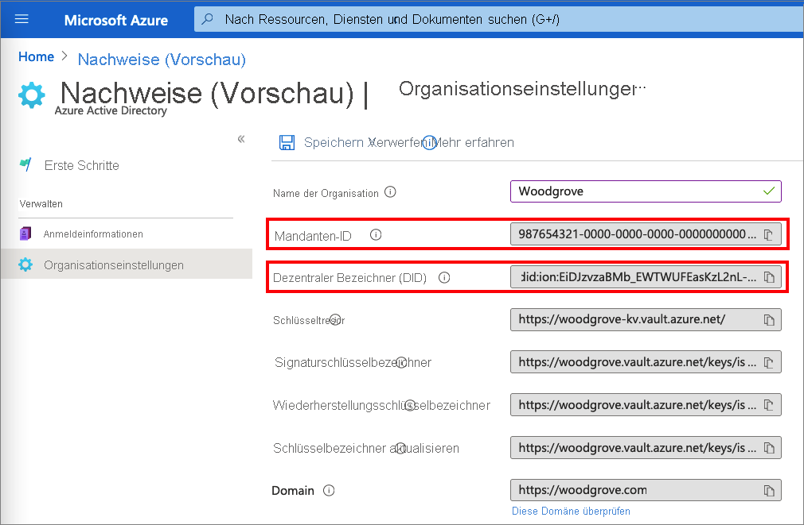
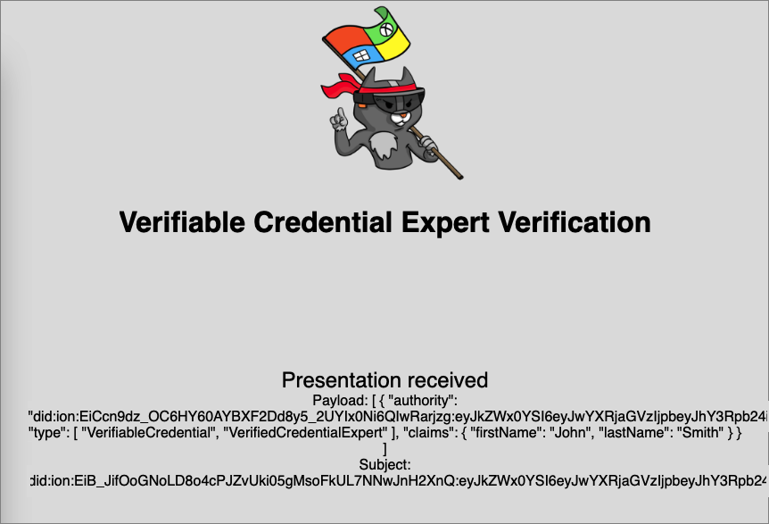

# <a name="configure-azure-ad-verifiable-credentials-verifier-preview"></a>Konfigurieren eines Azure AD-Nachweisprüfers (Vorschau)

Unter [Ausstellen von Azure AD-Nachweisen über eine Anwendung (Vorschau)](verifiable-credentials-configure-issuer.md) erfahren Sie, wie Sie Nachweise mithilfe desselben Azure AD-Mandanten (Azure Active Directory) ausstellen und überprüfen. In diesem Tutorial erfahren Sie, welche Schritte erforderlich sind, um Ihren ersten Nachweis zu präsentieren und zu überprüfen: eine Karte für Nachweisexperten.

Als Prüfer geben Sie Berechtigungen für Antragsteller frei, die Karten für Nachweisexperten besitzen. In diesem Tutorial führen Sie eine Beispielanwendung auf Ihrem lokalen Computer aus, die Sie zum Vorlegen einer Karte für Nachweisexperten auffordert und diese dann überprüft.

In diesem Artikel werden folgende Vorgehensweisen behandelt:

> [!div class="checklist"]
>
> - Herunterladen des Beispielanwendungscodes auf Ihren lokalen Computer
> - Einrichten von Azure AD-Nachweisen für Ihren Azure AD-Mandanten
> - Sammeln von Nachweis- und Umgebungsdetails, um Ihre Beispielanwendung einzurichten und die Beispielanwendung mit den Details Ihrer Karte für Nachweisexperten zu aktualisieren
> - Ausführen der Beispielanwendung und Initiieren des Prozesses zur Ausstellung von Nachweisen

## <a name="prerequisites"></a>Voraussetzungen

- [Einrichten eines Mandanten für Azure AD-Nachweise](verifiable-credentials-configure-tenant.md)
- Wenn Sie das Repository klonen möchten, das als Host für die Beispiel-App fungiert, installieren Sie [Git](https://git-scm.com/downloads).
- [Visual Studio Code](https://code.visualstudio.com/Download) oder ein ähnlicher Code-Editor
- [.NET 5.0](https://dotnet.microsoft.com/download/dotnet/5.0)
- [ngrok](https://ngrok.com/) (kostenlos)
- Ein mobiles Gerät mit Microsoft Authenticator:
  - Installation von Android, Version 6.2108.5654 oder höher
  - Installation von iOS, Version 6.5.82 oder höher

## <a name="gather-tenant-details-to-set-up-your-sample-application"></a>Sammeln von Mandantendetails zum Einrichten Ihrer Beispielanwendung

Sie haben den Azure AD-Nachweisdienst eingerichtet und sammeln nun einige Informationen zu Ihrer Umgebung und den festgelegten Nachweisen. Sie verwenden diese Informationen beim Einrichten Ihrer Beispielanwendung.

1. Wählen Sie unter **Nachweise (Vorschau)** die Option **Organisationseinstellungen** aus.
1. Kopieren Sie den Wert unter **Mandantenbezeichner**, und notieren Sie ihn zur späteren Verwendung.
1. Kopieren Sie den Wert unter **Dezentraler Bezeichner**, und notieren Sie ihn zur späteren Verwendung.

Auf dem folgenden Screenshot wird gezeigt, wie Sie die erforderlichen Werte kopieren:



## <a name="download-the-sample-code"></a>Herunterladen des Beispielcodes

Die Beispielanwendung ist in .NET verfügbar, und der Code wird in einem GitHub-Repository verwaltet. Laden Sie den Beispielcode aus dem [GitHub-Repository](https://github.com/Azure-Samples/active-directory-verifiable-credentials-dotnet) herunter, oder klonen Sie das Repository auf Ihrem lokalen Computer:

```bash
git clone git@github.com:Azure-Samples/active-directory-verifiable-credentials-dotnet.git 
```

## <a name="configure-the-verifiable-credentials-app"></a>Konfigurieren der Nachweis-App

Erstellen Sie einen geheimen Clientschlüssel für die von Ihnen erstellte registrierte Anwendung. Die Beispielanwendung verwendet den geheimen Clientschlüssel beim Anfordern von Token als Identitätsnachweis.

1. Navigieren Sie in Azure AD zu **App-Registrierungen**.

1. Wählen Sie die zuvor erstellte Anwendung **verifiable-credentials-app** aus.

1. Wählen Sie den Namen aus, der in den **Details der App-Registrierungen** angezeigt werden soll.

1. Kopieren Sie den Wert unter **Anwendungs-ID (Client)** , und speichern Sie ihn zur späteren Verwendung. 

    

1. Wählen Sie unter **App-Registrierungsdetails** im Hauptmenü unter **Verwalten** die Option **Zertifikate und Geheimnisse** aus.

1. Wählen Sie **Neuer geheimer Clientschlüssel**.

    1. Geben Sie im Feld **Beschreibung** eine Beschreibung für den geheimen Clientschlüssel ein (z. B. „vc-sample-secret“).

    1. Wählen Sie unter **Gültig bis** einen Gültigkeitszeitraum für das Geheimnis (beispielsweise sechs Monate) aus. Wählen Sie anschließend **Hinzufügen**.

    1. Notieren Sie den **Wert** des Geheimnisses. Dieser Wert wird in einem späteren Schritt für die Konfiguration verwendet. Der Wert des Geheimnisses wird nicht erneut angezeigt und kann auch nicht auf andere Weise abgerufen werden. Daher sollten Sie ihn notieren, sobald er angezeigt wird.

An diesem Punkt sollten Sie über alle erforderlichen Informationen verfügen, die Sie zum Einrichten Ihrer Beispielanwendung benötigen.

## <a name="update-the-sample-application"></a>Aktualisieren der Beispielanwendung

Nehmen Sie nun Änderungen am Ausstellercode der Beispiel-App vor, um ihn mit Ihrer Nachweis-URL zu aktualisieren. Dieser Schritt ermöglicht es Ihnen, überprüfbare Anmeldeinformationen mit Ihrem eigenen Mandanten auszugeben.

1. Öffnen Sie im Verzeichnis *active-directory-verifiable-credentials-dotnet-main* **Visual Studio Code**. Wählen Sie das Projekt im Verzeichnis *1. asp-net-core-api-idtokenhint* aus.

1. Öffnen Sie im Projektstammordner die Datei *appsettings.json*. Diese Datei enthält Informationen zu Ihren Nachweisen in den Azure AD-Nachweisen. Aktualisieren Sie die folgenden Eigenschaften mit den Informationen, die Sie in den vorherigen Schritten notiert haben:

    1. **TenantID**: Ihre Mandanten-ID
    1. **ClientID**: Ihre Client-ID
    1. **ClientSecret**: Ihr geheimer Clientschlüssel
    1. **VerifierAuthority**: Ihr dezentraler Bezeichner
    1. **CredentialManifest**: Die URL für das Ausstellen von Nachweisen

1. Speichern Sie die *appsettings.json*-Datei.

Der folgende JSON-Code zeigt die vollständige Datei *appsettings.json*:

```json
{

 "AppSettings": {
   "Endpoint": "https://beta.did.msidentity.com/v1.0/{0}/verifiablecredentials/request",
   "VCServiceScope": "bbb94529-53a3-4be5-a069-7eaf2712b826/.default",
   "Instance": "https://login.microsoftonline.com/{0}",
   "TenantId": "987654321-0000-0000-0000-000000000000",
   "ClientId": "555555555-0000-0000-0000-000000000000",
   "ClientSecret": "123456789012345678901234567890",
   "VerifierAuthority": "did:ion:EiDJzvzaBMb_EWTWUFEasKzL2nL-BJPhQTzYWjA_rRz3hQ:eyJkZWx0YSI6eyJwYXRjaGVzIjpbeyJhY3Rpb24iOiJyZXBsYWNlIiwiZG9jdW1lbnQiOnsicHVibGljS2V5cyI6W3siaWQiOiJzaWdfMmNhMzY2YmUiLCJwdWJsaWNLZXlKd2siOnsiY3J2Ijoic2VjcDI1NmsxIiwia3R5IjoiRUMiLCJ4IjoiZDhqYmduRkRGRElzR1ZBTWx5aDR1b2RwOGV4Q2dpV3dWUGhqM0N...",
   "CredentialManifest": " https://beta.did.msidentity.com/v1.0/987654321-0000-0000-0000-000000000000/verifiableCredential/contracts/VerifiedCredentialExpert"
 }
}
```

## <a name="run-and-test-the-sample-app"></a>Ausführen und Testen der Beispiel-App

Sie können jetzt Ihre erste Karte für Nachweisexperten präsentieren und überprüfen, indem Sie die Beispielanwendung ausführen.

1. Führen Sie in Visual Studio Code das Projekt *Verifiable_credentials_DotNet* aus. Führen Sie alternativ in der Befehlsshell die folgenden Befehle aus:

    ```bash
    cd active-directory-verifiable-credentials-dotnet/1. asp-net-core-api-idtokenhint  dotnet build "asp-net-core-api-idtokenhint.csproj" -c Debug -o .\bin\Debug\netcoreapp3.1  
    dotnet run
    ```

1. Führen Sie in einem anderen Terminal den folgenden Befehl aus. Mit diesem Befehl wird [ngrok](https://ngrok.com/) ausgeführt, um eine URL an 3000 einzurichten und öffentlich im Internet verfügbar zu machen.

    ```bash
    ngrok http 3000 
    ```
    
    >[!NOTE]
    > Auf einigen Computern müssen Sie den Befehl unter Umständen im folgenden Format ausführen: `./ngrok http 3000`.

1. Öffnen Sie die HTTPS-URL, die von ngrok generiert wird.

    

1. Wählen Sie im Webbrowser **Verify Credential** (Nachweis überprüfen) aus.

    

1. Scannen Sie den QR-Code mithilfe von Authenticator oder direkt mit der Kamera des Mobilgeräts.

1. Wenn die Warnmeldung *Diese App oder Website weist möglicherweise Risiken auf.* angezeigt wird, wählen Sie **Erweitert** aus. Diese Warnung wird angezeigt, weil Ihre Domäne nicht überprüft wurde. In diesem Tutorial können Sie die Domänenregistrierung überspringen.  

    
    

1. Wählen Sie in der Warnung zur riskanten Website die Option **Trotzdem fortfahren (unsicher)** aus.  
 
    

1. Genehmigen Sie die Anforderung, indem Sie **Zulassen** auswählen.

    

1. Nach dem Genehmigen der Anforderung sehen Sie, dass die Anforderung genehmigt wurde. Sie können auch das Protokoll überprüfen. Wählen Sie zum Anzeigen des Protokolls den Nachweis aus:

    

1. Wählen Sie dann **Letzte Aktivität** aus.  

    

1. Unter **Letzte Aktivität** werden die zuletzt durchgeführten Aktivitäten für Ihren Nachweis angezeigt.

    

1. Kehren Sie zur Beispiel-App zurück. Sie sehen, dass die Präsentation der Nachweise empfangen wurde.

    

## <a name="next-steps"></a>Nächste Schritte

Informieren Sie sich über das [Anpassen Ihrer Nachweise](credential-design.md).
