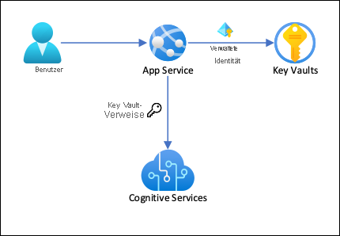
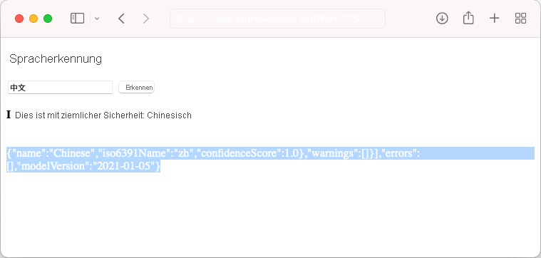

# <a name="tutorial-secure-cognitive-service-connection-from-app-service-using-key-vault"></a>Tutorial: Sichere Verbindung des Cognitive Service vom App Service aus mit Key Vault

[Azure App Service](overview.md) kann [verwaltete Identitäten](overview-managed-identity.md) verwenden, um sich ohne Verbindungsstring mit Back-End-Diensten zu verbinden. Dadurch müssen keine Verbindungsgeheimnisse mehr verwaltet werden und die Back-End-Konnektivität bleibt in einer Produktionsumgebung sicher. Für Back-End-Dienste, die keine verwalteten Identitäten unterstützen und dennoch Verbindungsgeheimnisse benötigen, können Sie Key Vault zur Verwaltung von Verbindungsgeheimnissen verwenden. Dieses Tutorial zeigt Ihnen am Beispiel von Cognitive Services, wie das in der Praxis funktioniert. Wenn Sie fertig sind, haben Sie eine App, die programmgesteuert Cognitive Services aufruft, ohne Verbindungsgeheimnisse im App Service zu speichern.

> [!TIP]
> Azure Cognitive Services unterstützen [die Authentifizierung durch verwaltete Identitäten](../cognitive-services/authentication.md#authorize-access-to-managed-identities), aber dieses Tutorial verwendet die [Abonnementschlüssel-Authentifizierung](../cognitive-services/authentication.md#authenticate-with-a-single-service-subscription-key), um zu demonstrieren, wie Sie sich mit einem Azure-Dienst verbinden können, der keine verwalteten Identitäten von App Services unterstützt.



Mit dieser Architektur: 

- Die Verbindung zum Key Vault ist durch verwaltete Identitäten gesichert
- Der App-Dienst greift auf die Geheimnisse zu, indem er [Key Vault-Referenzen](app-service-key-vault-references.md) als App-Einstellungen verwendet.
- Der Zugriff auf den Schlüsseltresor ist auf die App beschränkt. App-Beitragende, wie z. B. Administratoren, können die vollständige Kontrolle über die App-Service-Ressourcen haben, haben aber gleichzeitig keinen Zugriff auf die Geheimnisse des Key Vault.
- Wenn Ihr Anwendungscode bereits über die Anwendungseinstellungen auf Verbindungsgeheimnisse zugreift, ist keine Änderung erforderlich.

Sie lernen Folgendes:

> [!div class="checklist"]
> * Aktivieren von verwalteten Identitäten
> * Verwaltete Identitäten für die Verbindung mit Key Vault verwenden
> * Verwenden von Key Vault-Verweisen
> * Zugang zu kognitiven Diensten

## <a name="prerequisites"></a>Voraussetzungen

Bereiten Sie die Umgebung für die Azure CLI vor.

[!INCLUDE [azure-cli-prepare-your-environment-no-header.md](../../includes/azure-cli-prepare-your-environment-no-header.md)]

## <a name="create-app-with-connectivity-to-cognitive-services"></a>App mit Konnektivität zu Cognitive Services erstellen

1. Erstellen Sie eine Ressourcengruppe, die alle Ihre Ressourcen enthält:

    ```azurecli-interactive
    # Save resource group name as variable for convenience
    groupName=myKVResourceGroup
    region=westeurope

    az group create --name $groupName --location $region
    ```

1. Erstellen Sie eine Cognitive Services-Ressource. Ersetzen Sie *\<cs-resource-name>* durch einen eindeutigen Namen Ihrer Wahl.

    ```azurecli-interactive
    # Save resource name as variable for convenience. 
    csResourceName=<cs-resource-name>

    az cognitiveservices account create --resource-group $groupName --name $csResourceName --location $region --kind TextAnalytics --sku F0 --custom-domain $csResourceName
    ```

    > [!NOTE]
    > `--sku F0` erstellt eine frei verfügbare Ressource für kognitive Dienste. Jedes Abonnement ist auf ein Kontingent von einer Ressource der freien Ebene `TextAnalytics` beschränkt. Wenn Sie die Quote bereits überschritten haben, verwenden Sie stattdessen `--sku S`.

1. Klonen Sie das Beispiel-Repository lokal und stellen Sie die Beispielanwendung im App Service bereit. Ersetzen Sie *\<app-name>* durch einen eindeutigen Namen.

    ### <a name="net-5"></a>[.NET 5](#tab/dotnet)

    ```azurecli-interactive
    # Save app name as variable for convenience
    appName=<app-name>

    # Clone sample application
    git clone https://github.com/Azure-Samples/app-service-language-detector.git
    cd app-service-language-detector/dotnet
    
    az webapp up --sku F1 --resource-group $groupName --name $appName --plan $appName --location $region
    ```

    ### <a name="php"></a>[PHP](#tab/php)

    ```azurecli-interactive
    # Clone and prepare sample application
    git clone https://github.com/Azure-Samples/app-service-language-detector.git
    cd app-service-language-detector/php
    zip default.zip index.php
    
    # Save app name as variable for convenience
    appName=<app-name>

    az appservice plan create --resource-group $groupName --name $appName --sku FREE --location $region
    az webapp create --resource-group $groupName --plan $appName --name $appName
    az webapp deployment source config-zip --resource-group $groupName --name $appName --src ./default.zip
    ```

    -----

1. Konfigurieren Sie die Cognitive Services-Geheimnisse als App-Einstellungen `CS_ACCOUNT_NAME` und `CS_ACCOUNT_KEY`.

    ```azurecli-interactive
    # Get subscription key for Cognitive Services resource
    csKey1=$(az cognitiveservices account keys list --resource-group $groupName --name $csResourceName --query key1 --output tsv)

    az webapp config appsettings set --resource-group $groupName --name $appName --settings CS_ACCOUNT_NAME="$csResourceName" CS_ACCOUNT_KEY="$csKey1"
    ````

1. Navigieren Sie im Browser zu Ihrer bereitgestellten Anwendung unter `<app-name>.azurewebsites.net` und testen Sie den Sprachdetektor mit Strings in verschiedenen Sprachen.

    

    Wenn Sie sich den Anwendungscode ansehen, werden Sie feststellen, dass die Debug-Ausgabe für die Erkennungsergebnisse die gleiche Schriftfarbe hat wie der Hintergrund. Sie können dies erkennen, indem Sie versuchen, die weiße Fläche direkt unter dem Ergebnis zu markieren.

## <a name="secure-back-end-connectivity"></a>Sichere Backend-Konnektivität

Derzeit werden die Verbindungsgeheimnisse als App-Einstellungen in Ihrer App Service-App gespeichert. Bei diesem Ansatz werden bereits die Verbindungsgeheimnisse aus der Codebasis Ihrer Anwendung gesichert. Allerdings kann jeder Mitwirkende, der Ihre App verwalten kann, auch die App-Einstellungen einsehen. In diesem Schritt verschieben Sie die Verbindungsgeheimnisse in einen Schlüsseltresor und sperren den Zugriff, so dass nur Sie sie verwalten können und nur die App Service App sie mit ihrer verwalteten Identität lesen kann.

1. Erstellen eines Schlüsseltresors Ersetzen Sie *\<vault-name>* durch einen eindeutigen Namen.

    ```azurecli-interactive
    # Save app name as variable for convenience
    vaultName=<vault-name>

    az keyvault create --resource-group $groupName --name $vaultName --location $region --sku standard --enable-rbac-authorization
    ```

    Der Parameter `--enable-rbac-authorization` [ legt die rollenbasierte Zugriffskontrolle (RBAC) von Azure als Berechtigungsmodell fest](../key-vault/general/rbac-guide.md#using-azure-rbac-secret-key-and-certificate-permissions-with-key-vault). Diese Einstellung macht standardmäßig alle Zugriffsrichtlinienberechtigungen ungültig.

1. Geben Sie sich selbst die *Key Vault Secrets Officer* RBAC-Rolle für den Tresor.
    
    ```azurecli-interactive
    vaultResourceId=$(az keyvault show --name $vaultName --query id --output tsv)
    myId=$(az ad signed-in-user show --query objectId --output tsv)
    az role assignment create --role "Key Vault Secrets Officer" --assignee-object-id $myId --assignee-principal-type User --scope $vaultResourceId
    ```

1. Aktivieren Sie die vom System zugewiesene verwaltete Identität für Ihre Anwendung, und geben Sie ihr die *Key Vault Secrets User* RBAC-Rolle für den Tresor.

    ```azurecli-interactive
    az webapp identity assign --resource-group $groupName --name $appName --scope $vaultResourceId --role  "Key Vault Secrets User"
    ```

1. Fügen Sie den Namen der Cognitive Services-Ressource und den Abonnementschlüssel als Geheimnisse zum Tresor hinzu und speichern Sie ihre IDs als Umgebungsvariablen für den nächsten Schritt.

    ```azurecli-interactive
    csResourceKVUri=$(az keyvault secret set --vault-name $vaultName --name csresource --value $csResourceName --query id --output tsv)
    csKeyKVUri=$(az keyvault secret set --vault-name $vaultName --name cskey --value $csKey1 --query id --output tsv)
    ```

1. Zuvor haben Sie die Geheimnisse als App-Einstellungen `CS_ACCOUNT_NAME` und `CS_ACCOUNT_KEY` in Ihrer App festgelegt. Legen Sie sie stattdessen als [Schlüsseltresorverweise](app-service-key-vault-references.md) fest.

    ```azurecli-interactive
    az webapp config appsettings set --resource-group $groupName --name $appName --settings CS_ACCOUNT_NAME="@Microsoft.KeyVault(SecretUri=$csResourceKVUri)" CS_ACCOUNT_KEY="@Microsoft.KeyVault(SecretUri=$csKeyKVUri)"
    ```

1. Navigieren Sie im Browser erneut zu `<app-name>.azurewebsites.net`. Wenn Sie Erkennungsergebnisse zurückerhalten, stellen Sie eine Verbindung mit dem Cognitive Services-Endpunkt mit wichtigen Tresorverweisen her.

Herzlichen Glückwunsch, Ihre Anwendung stellt jetzt eine Verbindung zu Cognitive Services her und verwendet dabei die in Ihrem Schlüsseltresor gespeicherten Geheimnisse, ohne dass Sie den Code Ihrer Anwendung ändern müssen.

## <a name="clean-up-resources"></a>Bereinigen von Ressourcen

In den vorherigen Schritten haben Sie Azure-Ressourcen in einer Ressourcengruppe erstellt. Wenn Sie diese Ressourcen in Zukunft nicht mehr benötigen, löschen Sie die Ressourcengruppe, indem Sie den folgenden Befehl in Cloud Shell ausführen:

```azurecli-interactive
az group delete --name $groupName
```

Die Ausführung dieses Befehls kann eine Minute in Anspruch nehmen.

## <a name="next-steps"></a>Nächste Schritte

- [ Tutorial: Isolierung der Back-End-Kommunikation mit virtueller Netzwerkintegration](tutorial-networking-isolate-vnet.md)
- [Integrieren Ihrer App in ein Azure Virtual Network](overview-vnet-integration.md)
- [App Service-Netzwerkfunktionen](networking-features.md)