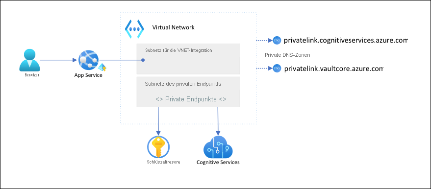

# <a name="tutorial-isolate-back-end-communication-in-azure-app-service-with-virtual-network-integration"></a>Tutorial: Isolieren der Back-End-Kommunikation in Azure App Service mit Virtual Network-Integration

In diesem Artikel konfigurieren Sie eine App Service-App mit sicherer, netzwerkisolierter Kommunikation mit Back-End-Diensten. Das verwendete Beispielszenario befindet sich in [Tutorial: Sichere Verbindung des Cognitive Service vom App Service aus mit Key Vault](tutorial-connect-msi-key-vault.md). Wenn Sie fertig sind, verfügen Sie über eine App Service-App, die über ein [virtuelles Azure-Netzwerk](../virtual-network/virtual-networks-overview.md) (VNet) auf Key Vault und Cognitive Services zugreift, und kein anderer Datenverkehr kann auf diese Back-End-Ressourcen zugreifen. Der gesamte Datenverkehr wird innerhalb Ihres virtuellen Netzwerks mithilfe der [VNet-Integration](web-sites-integrate-with-vnet.md) und [privater Endpunkte](../private-link/private-endpoint-overview.md) isoliert.

Da es sich um einen mehrinstanzenfähigen Dienst handelt, teilt sich der von Ihrer App Service-App an andere Azure-Dienste ausgehende Datenverkehr die gleiche Umgebung mit anderen Apps oder sogar anderen Abonnements. Während der Datenverkehr selbst verschlüsselt werden kann, ist in bestimmten Szenarien möglicherweise eine zusätzliche Sicherheitsstufe erforderlich, indem die Back-End-Kommunikation vom übrigen Netzwerkdatenverkehr isoliert wird. Diese Szenarien sind in der Regel nur für große Unternehmen mit einem hohen Maß an Fachwissen zugänglich, aber App Service bietet diese Möglichkeit mithilfe der VNet-Integration.  



Bei dieser Architektur: 

- Öffentlicher Datenverkehr zu den Back-End-Diensten wird blockiert.
- Ausgehender Datenverkehr von App Service wird an das VNet weitergeleitet und kann die Back-End-Dienste erreichen.
- App Service ist in der Lage, die DNS-Auflösung für die Back-End-Dienste über die privaten DNS-Zonen durchzuführen.

Sie lernen Folgendes:

> [!div class="checklist"]
> * Erstellen eines virtuellen Netzwerks und von Subnetzen für die VNet-Integration in App Service
> * Create private DNS zones (Erstellen von privaten DNS-Zonen)
> * Erstellen privater Endpunkte
> * Konfigurieren der VNet-Integration in App Service

## <a name="prerequisites"></a>Voraussetzungen

Das Tutorial setzt voraus, dass Sie das [Tutorial: Sichere Verbindung des Cognitive Service vom App Service aus mit Key Vault](tutorial-connect-msi-key-vault.md) befolgt und die Spracherkennungs-App erstellt haben. 

Im Tutorial werden weiterhin die folgenden Umgebungsvariablen aus dem vorherigen Tutorial verwendet. Stellen Sie sicher, dass Sie sie ordnungsgemäß festlegen.

```azurecli-interactive
    groupName=myKVResourceGroup
    region=westeurope
    csResourceName=<cs-resource-name>
    appName=<app-name>
    vaultName=<vault-name>
```

## <a name="create-vnet-and-subnets"></a>Erstellen des virtuellen Netzwerks und der Subnetze

1. Erstellen eines VNET Ersetzen Sie *\<virtual-network-name>* durch einen eindeutigen Namen.

    ```azurecli-interactive
    # Save vnet name as variable for convenience
    vnetName=<virtual-network-name>

    az network vnet create --resource-group $groupName --location $region --name $vnetName --address-prefixes 10.0.0.0/16
    ```

1. Erstellen Sie ein Subnetz für die VNet-Integration in App Service.

    ```azurecli-interactive
    az network vnet subnet create --resource-group $groupName --vnet-name $vnetName --name vnet-integration-subnet --address-prefixes 10.0.0.0/24 --delegations Microsoft.Web/serverfarms
    ```

    Für App Service wird empfohlen, dass das Subnetz für die VNet-Integration einen CIDR-Block von mindestens `/26` besitzt (siehe [Voraussetzungen für das Subnetz der VNet-Integration](overview-vnet-integration.md#subnet-requirements)). `/24` ist mehr als ausreichend. `--delegations Microsoft.Web/serverfarms` gibt an, dass das Subnetz für die [VNet-Integration in App Service delegiert wird](../virtual-network/subnet-delegation-overview.md).

1. Erstellen Sie ein weiteres Subnetz für die privaten Endpunkte.

    ```azurecli-interactive
    az network vnet subnet create --resource-group $groupName --vnet-name $vnetName --name private-endpoint-subnet --address-prefixes 10.0.1.0/24 --disable-private-endpoint-network-policies
    ```

    Für Subnetze privater Endpunkte müssen Sie die [Netzwerkrichtlinien für private Endpunkte deaktivieren](../private-link/disable-private-endpoint-network-policy.md).

## <a name="create-private-dns-zones"></a>Create private DNS zones (Erstellen von privaten DNS-Zonen)

Da Ihre Key Vault- und Cognitive Services-Ressourcen hinter [privaten Endpunkten](../private-link/private-endpoint-overview.md) liegen, müssen Sie für sie [private DNS-Zonen](../dns/private-dns-privatednszone.md) definieren. Diese Zonen werden verwendet, um die DNS-Einträge für private Endpunkte zu hosten und es den Clients zu ermöglichen, die Back-End-Dienste anhand ihres Namens zu finden. 

1. Erstellen Sie zwei private DNS-Zonen, eine für Ihre Cognitive Services-Ressource und eine für Ihren Schlüsseltresor.

    ```azurecli-interactive
    az network private-dns zone create --resource-group $groupName --name privatelink.cognitiveservices.azure.com
    az network private-dns zone create --resource-group $groupName --name privatelink.vaultcore.azure.net
    ```

    Weitere Informationen zu diesen Einstellungen finden Sie unter [DNS-Konfiguration für private Azure-Endpunkte](../private-link/private-endpoint-dns.md#azure-services-dns-zone-configuration).

1. Verknüpfen Sie die privaten DNS-Zonen mit dem VNet.

    ```azurecli-interactive
    az network private-dns link vnet create --resource-group $groupName --name cognitiveservices-zonelink --zone-name privatelink.cognitiveservices.azure.com --virtual-network $vnetName --registration-enabled False
    az network private-dns link vnet create --resource-group $groupName --name vaultcore-zonelink --zone-name privatelink.vaultcore.azure.net --virtual-network $vnetName --registration-enabled False
    ```

## <a name="create-private-endpoints"></a>Erstellen privater Endpunkte

1. Erstellen Sie im Subnetz des privaten Endpunkts Ihres virtuellen Netzwerks einen privaten Endpunkt für Ihren Schlüsseltresor.

    ```azurecli-interactive
    # Get Cognitive Services resource ID
    csResourceId=$(az cognitiveservices account show --resource-group $groupName --name $csResourceName --query id --output tsv)

    az network private-endpoint create --resource-group $groupName --name securecstext-pe --location $region --connection-name securecstext-pc --private-connection-resource-id $csResourceId --group-id account --vnet-name $vnetName --subnet private-endpoint-subnet
    ```

1. Erstellen Sie eine DNS-Zonengruppe für den privaten Cognitive Services-Endpunkt. Die DNS-Zonengruppe ist eine Verknüpfung zwischen der privaten DNS-Zone und dem privaten Endpunkt. Mit diesem Link können Sie die private DNS-Zone automatisch aktualisieren, wenn ein Update für den privaten Endpunkt vorliegt.  

    ```azurecli-interactive
    az network private-endpoint dns-zone-group create --resource-group $groupName --endpoint-name securecstext-pe --name securecstext-zg --private-dns-zone privatelink.cognitiveservices.azure.com --zone-name privatelink.cognitiveservices.azure.com
    ```

1. Blockieren Sie öffentlichen Datenverkehr für die Cognitive Services-Ressource.

    ```azurecli-interactive
    az rest --uri $csResourceId?api-version=2021-04-30 --method PATCH --body '{"properties":{"publicNetworkAccess":"Disabled"}}' --headers 'Content-Type=application/json'

    # Repeat following command until output is "Succeeded"
    az cognitiveservices account show --resource-group $groupName --name $csResourceName --query properties.provisioningState
    ```

    > [!NOTE]
    > Stellen Sie sicher, dass der Bereitstellungsstatus Ihrer Änderung `"Succeeded"` lautet. Anschließend können Sie die Behavior Change in der Beispiel-App beobachten. Sie können die App immer noch laden, aber wenn Sie versuchen, auf die Schaltfläche **Erkennen** zu klicken, erhalten Sie einen `HTTP 500`-Fehler. Die Verbindung der App mit der Cognitive Services-Ressource über das freigegebene Netzwerk wurde getrennt.

1. Wiederholen Sie die angegebenen Schritte für den Schlüsseltresor.

    ```azurecli-interactive
    # Create private endpoint for key vault
    vaultResourceId=$(az keyvault show --name $vaultName --query id --output tsv)
    az network private-endpoint create --resource-group $groupName --name securekeyvault-pe --location $region --connection-name securekeyvault-pc --private-connection-resource-id $vaultResourceId --group-id vault --vnet-name $vnetName --subnet private-endpoint-subnet
    # Create DNS zone group for the endpoint
    az network private-endpoint dns-zone-group create --resource-group $groupName --endpoint-name securekeyvault-pe --name securekeyvault-zg --private-dns-zone privatelink.vaultcore.azure.net --zone-name privatelink.vaultcore.azure.net
    # Block public traffic to key vault
    az keyvault update --name $vaultName --default-action Deny
    ```

1. Erzwingen Sie einen sofortigen Neuabruf der [Schlüssltresorverweise](app-service-key-vault-references.md) in Ihrer App, indem Sie die App-Einstellungen zurücksetzen (weitere Informationen finden Sie unter [Rotation](app-service-key-vault-references.md#rotation)).

    ```azurecli-interactive
    az webapp config appsettings set --resource-group $groupName --name $appName --settings CS_ACCOUNT_NAME="@Microsoft.KeyVault(SecretUri=$csResourceKVUri)" CS_ACCOUNT_KEY="@Microsoft.KeyVault(SecretUri=$csKeyKVUri)"
    ```

    <!-- If above is not run then it takes a whole day for references to update? https://docs.microsoft.com/en-us/azure/app-service/app-service-key-vault-references#rotation -->

    > [!NOTE]
    > Auch hier können Sie die Behavior Change in der Beispiel-App beobachten. Sie können die App nicht mehr laden, da sie nicht mehr auf die Schlüsseltresorverweise zugreifen kann. Die Verbindung der App mit dem Schlüsseltresor über das freigegebene Netzwerk wurde getrennt.

Die beiden privaten Endpunkte sind nur für Clients innerhalb des von Ihnen erstellten virtuellen Netzwerks zugänglich. Sie können nicht einmal über die Seite **Geheimnisse** im Azure-Portal auf die Geheimnisse im Schlüsseltresor zugreifen, da das Portal über das öffentliche Internet auf sie zugreift (weitere Informationen finden Sie unter [Verwalten gesperrter Ressourcen](#manage-the-locked-down-resources)).

## <a name="configure-vnet-integration-in-your-app"></a>Konfigurieren der VNet-Integration in Ihrer App

1. Skalieren Sie die App auf den **Standard**-Tarif hoch. Für die VNet-Integration ist der **Standard**-Tarif oder höher erforderlich (weitere Informationen finden Sie unter [Integrieren Ihrer App in ein Azure Virtual Network](overview-vnet-integration.md)).

    ```azurecli-interactive
    az appservice plan update --name $appName --resource-group $groupName --sku S1
    ```

1. Unabhängig von unserem Szenario, aber auch wichtig, erzwingen Sie HTTPS für eingehende Anforderungen.

    ```azurecli-interactive
    az webapp update --resource-group $groupName --name $appName --https-only
    ```

1. Aktivieren Sie die VNet-Integration in Ihrer App.

    ```azurecli-interactive
    az webapp vnet-integration add --resource-group $groupName --name $appName --vnet $vnetName --subnet vnet-integration-subnet
    ```
    
    Durch die VNet-Integration kann der ausgehende Datenverkehr direkt in das VNet gelangen. Standardmäßig wird nur der in [RFC-1918](https://tools.ietf.org/html/rfc1918#section-3) definierte lokale IP-Datenverkehr an das VNet weitergeleitet. Dies ist für die privaten Endpunkte erforderlich. Informationen zum Weiterleiten des gesamten Datenverkehrs an das VNet finden Sie unter [Verwalten des VNet-Integrationsroutings](configure-vnet-integration-routing.md). Das Routing des gesamten Datenverkehrs kann auch verwendet werden, wenn Sie den Internetdatenverkehr durch Ihr VNet leiten möchten, z. B. durch eine [Azure VNet NAT](../virtual-network/nat-gateway/nat-overview.md)- oder eine [Azure Firewall](../firewall/overview.md)-Instanz.

1. Navigieren Sie im Browser erneut zu `<app-name>.azurewebsites.net` und warten Sie, bis die Integration wirksam wird. Wenn Sie einen HTTP 500-Fehler erhalten, warten Sie ein paar Minuten, und versuchen Sie es erneut. Wenn Sie die Seite laden und Erkennungsergebnisse abrufen können, stellen Sie eine Verbindung mit dem Cognitive Services-Endpunkt mit wichtigen Schlüsseltresorverweisen her.

    >[!NOTE]
    > Wenn Sie nach langer Zeit immer wieder HTTP-500-Fehler erhalten, kann es helfen, wie folgt einen erneuten Abruf der [Schlüsseltresorverweise](app-service-key-vault-references.md) zu erzwingen:
    >
    > ```azurecli-interactive
    > az webapp config appsettings set --resource-group $groupName --name $appName --settings CS_ACCOUNT_NAME="@Microsoft.KeyVault(SecretUri=$csResourceKVUri)" CS_ACCOUNT_KEY="@Microsoft.KeyVault(SecretUri=$csKeyKVUri)"
    > ```


## <a name="manage-the-locked-down-resources"></a>Verwalten gesperrter Ressourcen

Abhängig von Ihren Szenarien können Sie die durch einen privaten Endpunkt geschützten Ressourcen möglicherweise nicht über das Azure-Portal, die Azure CLI oder Azure PowerShell (z. B. Key Vault) verwalten. Diese Tools führen alle REST-API-Aufrufe durch, um über das öffentliche Internet auf die Ressourcen zuzugreifen, und werden durch Ihre Konfiguration blockiert. Hier sind einige Optionen für den Zugriff auf die gesperrten Ressourcen:

- Für Key Vault fügen Sie die öffentliche IP-Adresse Ihres lokalen Computers hinzu, um die Geheimnisse des privaten Endpunkts anzuzeigen oder zu aktualisieren.
- Wenn Ihr lokales Netzwerk über ein [VPN Gateway](../vpn-gateway/vpn-gateway-about-vpngateways.md) oder [ExpressRoute](../expressroute/expressroute-introduction.md) in das Azure VNet erweitert wird, können Sie die durch einen privaten Endpunkt geschützten Ressourcen direkt über Ihr lokales Netzwerk verwalten. 
- Verwalten Sie die durch private Endpunkte geschützten Ressourcen von einem [Jumpserver](https://wikipedia.org/wiki/Jump_server) im VNet aus.
- [Stellen Sie Cloud Shell im VNet bereit](../cloud-shell/private-vnet.md).

## <a name="clean-up-resources"></a>Bereinigen von Ressourcen

In den vorherigen Schritten haben Sie Azure-Ressourcen in einer Ressourcengruppe erstellt. Wenn Sie diese Ressourcen in Zukunft nicht mehr benötigen, löschen Sie die Ressourcengruppe, indem Sie den folgenden Befehl in Cloud Shell ausführen:

```azurecli-interactive
az group delete --name $groupName
```

Die Ausführung dieses Befehls kann eine Minute in Anspruch nehmen.

## <a name="next-steps"></a>Nächste Schritte

- [Integrieren Ihrer App in ein Azure Virtual Network](overview-vnet-integration.md)
- [App Service-Netzwerkfunktionen](networking-features.md)