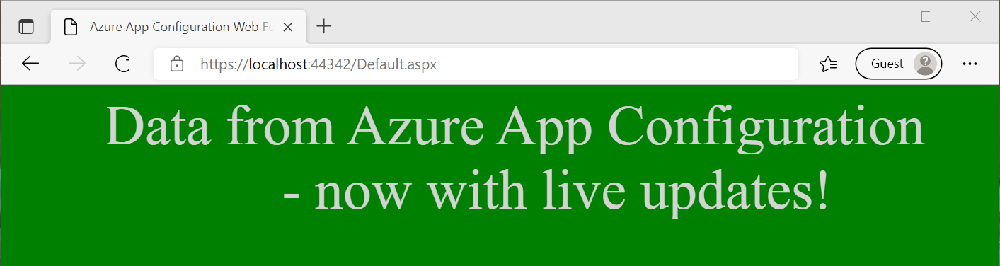

# <a name="tutorial-use-dynamic-configuration-in-an-aspnet-web-application-net-framework"></a>Tutorial: Verwenden der dynamischen Konfiguration in einer ASP.NET-Webanwendung (.NET Framework)

Daten aus App Configuration können als App-Einstellungen in eine .NET Framework-Anwendung geladen werden. Weitere Informationen finden Sie im [Schnellstart](./quickstart-dotnet-app.md). Wie im .NET Framework vorgesehen, können die App-Einstellungen jedoch nur beim Neustart der Anwendung aktualisiert werden. Der .NET-Anbieter von App Configuration ist eine .NET Standard-Bibliothek. Sie unterstützt das dynamische Zwischenspeichern und Aktualisieren der Konfiguration ohne Anwendungsneustart. In diesem Tutorial wird veranschaulicht, wie Sie dynamische Konfigurationsaktualisierungen in einer ASP.NET Web Forms-Anwendung implementieren können. Das gleiche Verfahren gilt für .NET Framework MVC-Anwendungen.

In diesem Tutorial lernen Sie, wie die folgenden Aufgaben ausgeführt werden:

> [!div class="checklist"]
> * Einrichten Ihrer ASP.NET-Webanwendung für die Aktualisierung der Konfiguration als Reaktion auf Änderungen in einem App Configuration-Speicher
> * Einfügen der aktuellen Konfiguration in Anforderungen an Ihre Anwendung

## <a name="prerequisites"></a>Voraussetzungen

- Azure-Abonnement – [Erstellen eines kostenlosen Kontos](https://azure.microsoft.com/free/)
- [Visual Studio](https://visualstudio.microsoft.com/vs)
- [.NET Framework 4.7.2 oder höher](https://dotnet.microsoft.com/download/dotnet-framework)

## <a name="create-an-app-configuration-store"></a>Erstellen eines App Configuration-Speichers

[!INCLUDE[Azure App Configuration resource creation steps](../../includes/azure-app-configuration-create.md)]

7. Wählen Sie **Vorgänge** > **Konfigurations-Explorer** > **Erstellen** > **Schlüssel-Wert** aus, um die folgenden Schlüssel-Wert-Paare hinzuzufügen:

    | Key                                | Wert                               |
    |------------------------------------|-------------------------------------|
    | *TestApp:Settings:BackgroundColor* | *Weiß*                             |
    | *TestApp:Settings:FontColor*       | *Schwarz*                             |
    | *TestApp:Settings:FontSize*        | *40*                                |
    | *TestApp:Settings:Message*         | *Daten aus Azure App Configuration* |
    | *TestApp:Settings:Sentinel*        | *v1*                                |

    Lassen Sie **Bezeichnung** und **Inhaltstyp** leer.

## <a name="create-an-aspnet-web-application"></a>Erstellen einer ASP.NET-Webanwendung

1. Starten Sie Visual Studio, und wählen Sie **Neues Projekt erstellen** aus.

1. Wählen Sie **ASP.NET-Webanwendung (.NET Framework)** mit C# in der Projektvorlagenliste aus, und klicken Sie auf **Weiter**.

1. Geben Sie unter **Neues Projekt konfigurieren** einen Projektnamen ein. Wählen Sie unter **Framework** die Option **.NET Framework 4.7.2** oder höher aus. Klicken Sie auf **Erstellen**.

1. Wählen Sie unter **Neue ASP.NET-Webanwendung** erstellen die Option **Web Forms** aus. Klicken Sie auf **Erstellen**.

## <a name="reload-data-from-app-configuration"></a>Erneutes Laden von Daten aus App Configuration

1. Klicken Sie mit der rechten Maustaste auf Ihr Projekt, und wählen Sie **NuGet-Pakete verwalten** aus. Suchen Sie auf der Registerkarte **Durchsuchen** die nach der aktuellen Version des folgenden NuGet-Pakets, und fügen Sie sie Ihrem Projekt hinzu.

   *Microsoft.Extensions.Configuration.AzureAppConfiguration*

1. Öffnen Sie die Datei *Global.asax.cs*, und fügen Sie die folgenden Namespaces hinzu.
    ```csharp
    using Microsoft.Extensions.Configuration;
    using Microsoft.Extensions.Configuration.AzureAppConfiguration;
    ```

1. Fügen Sie die folgenden zwei statischen Membervariablen zur Klasse `Global` hinzu.
    ```csharp
    public static IConfiguration Configuration;
    private static IConfigurationRefresher _configurationRefresher;
    ```

1. Fügen Sie der Klasse `Global` die Methode `Application_Start` hinzu. Wenn die Methode bereits vorhanden ist, fügen Sie ihr den folgenden Code hinzu.
    ```csharp
    protected void Application_Start(object sender, EventArgs e)
    {
        ConfigurationBuilder builder = new ConfigurationBuilder();
        builder.AddAzureAppConfiguration(options =>
        {
            options.Connect(Environment.GetEnvironmentVariable("ConnectionString"))
                    // Load all keys that start with `TestApp:`.
                    .Select("TestApp:*")
                    // Configure to reload configuration if the registered key 'TestApp:Settings:Sentinel' is modified.
                    .ConfigureRefresh(refresh => 
                    {
                        refresh.Register("TestApp:Settings:Sentinel", refreshAll:true);
                               .SetCacheExpiration(new TimeSpan(0, 5, 0));
                    });
            _configurationRefresher = options.GetRefresher();
        });

        Configuration = builder.Build();
    }
    ```
    Die `Application_Start`-Methode wird bei der ersten Anforderung an Ihre Webanwendung aufgerufen. Sie wird während des Lebenszyklus der Anwendung nur einmal aufgerufen. Daher ist dies ein geeigneter Ort, um Ihr `IConfiguration`-Objekt zu initialisieren und Daten aus App Configuration zu laden.

    In der Methode `ConfigureRefresh` wird ein Schlüssel in Ihrem App Configuration-Speicher für die Änderungsüberwachung registriert. Mit dem Parameter `refreshAll` der Methode `Register` wird angegeben, dass alle Konfigurationswerte aktualisiert werden sollen, wenn sich der registrierte Schlüssel ändert. In diesem Beispiel handelt es sich bei *TestApp:Settings:Sentinel* um einen *Sentinel-Schlüssel*, den Sie aktualisieren, nachdem Sie die Änderung aller anderen Schlüssel abgeschlossen haben. Wird eine Änderung erkannt, werden alle Konfigurationswerte von Ihrer Anwendung aktualisiert. Dieser Ansatz trägt dazu bei, die Konsistenz der Konfiguration in Ihrer Anwendung zu gewährleisten, anstatt alle Schlüssel auf Änderungen zu überwachen.
    
    Durch die Methode `SetCacheExpiration` wird angegeben, wie viel Zeit mindestens verstreichen muss, bevor eine neue Anforderung an App Configuration gesendet wird, um nach Konfigurationsänderungen zu suchen. In diesem Beispiel setzen Sie die standardmäßige Ablaufzeit von 30 Sekunden außer Kraft und geben stattdessen einen Wert von 5 Minuten an. Dadurch wird die Anzahl potenzieller Anforderungen verringert, die an Ihren App Configuration-Speicher gesendet werden.


1. Fügen Sie der Klasse `Global` die Methode `Application_BeginRequest` hinzu. Wenn die Methode bereits vorhanden ist, fügen Sie ihr den folgenden Code hinzu.
    ```csharp
    protected void Application_BeginRequest(object sender, EventArgs e)
    {
        _ = _configurationRefresher.TryRefreshAsync();
    }
    ```
    Das Aufrufen der Methode `ConfigureRefresh` allein führt nicht dazu, dass die Konfiguration automatisch aktualisiert wird. Sie rufen die Methode `TryRefreshAsync` am Anfang jeder Anforderung auf, um eine Aktualisierung zu signalisieren. Durch diesen Entwurf wird sichergestellt, dass Ihre Anwendung nur Anforderungen an App Configuration sendet, wenn sie aktiv Anforderungen empfängt. 
    
    Ein Aufruf von `TryRefreshAsync` vor Verstreichen der konfigurierten Cacheablaufzeit ist keine Option, sodass die Auswirkungen auf die Leistung minimal sind. Beim Senden einer Anforderung an App Configuration wird die Konfiguration asynchron aktualisiert, ohne die Ausführung der aktuellen Anforderung zu blockieren, da Sie nicht auf die Aufgabe warten. Die aktuelle Anforderung erhält möglicherweise nicht die aktualisierten Konfigurationswerte, nachfolgende Anforderungen dagegen schon.

    Wenn der Aufruf `TryRefreshAsync` aus einem beliebigen Grund fehlschlägt, verwendet Ihre Anwendung weiterhin die zwischengespeicherte Konfiguration. Ein weiterer Versuch wird unternommen, wenn die konfigurierte Cacheablaufzeit erneut verstrichen ist und der `TryRefreshAsync`-Aufruf durch eine neue Anforderung an Ihre Anwendung ausgelöst wird.

## <a name="use-the-latest-configuration-data"></a>Verwenden der aktuellsten Konfigurationsdaten

1. Öffnen Sie *Default.aspx*, und ersetzen Sie ihren Inhalt durch folgenden Markup. Stellen Sie sicher, dass das Attribut *Inherits* mit dem Namespace und dem Klassennamen Ihrer Anwendung übereinstimmt.
    ```xml
    <%@ Page Language="C#" AutoEventWireup="true" CodeBehind="Default.aspx.cs" Inherits="WebFormApp.Default" %>

    <!DOCTYPE html>

    <html xmlns="http://www.w3.org/1999/xhtml">
    <head runat="server">
        <title>Azure App Configuration Web Forms Demo</title>
    </head>
    <body id="body" runat="server">
        <form id="form1" runat="server">
            <div style="text-align: center">
                <asp:Label ID="message" runat="server" />
            </div>
        </form>
    </body>
    </html>
    ```

1. Öffnen Sie *Default.aspx.cs*, und aktualisieren Sie ihren Inhalt mit dem folgenden Code.
    ```cs
    using System;
    using System.Web.UI.WebControls;

    namespace WebFormApp
    {
        public partial class Default : System.Web.UI.Page
        {
            protected void Page_Load(object sender, EventArgs e)
            {
                // Read configuration from the IConfiguration object loaded from Azure App Configuration
                string messageText = Global.Configuration["TestApp:Settings:Message"] ?? "Please add the key \"TestApp:Settings:Message\" in your Azure App Configuration store.";
                string messageFontSize = Global.Configuration["TestApp:Settings:FontSize"] ?? "20";
                string messageFontColor = Global.Configuration["TestApp:Settings:FontColor"] ?? "Black";
                string backgroundColor = Global.Configuration["TestApp:Settings:BackgroundColor"] ?? "White";

                message.Text = messageText;
                message.Font.Size = FontUnit.Point(int.Parse(messageFontSize));
                message.ForeColor = System.Drawing.Color.FromName(messageFontColor);
                body.Attributes["bgcolor"] = backgroundColor;
            }
        }
    }
    ```

## <a name="build-and-run-the-application"></a>Erstellen und Ausführen der Anwendung

1. Legen Sie eine Umgebungsvariable namens **ConnectionString** auf die Verbindungszeichenfolge mit schreibgeschütztem Schlüssel fest, die Sie bei der Erstellung Ihres App Configuration-Speichers erhalten haben.

    Führen Sie bei Verwendung der Windows-Eingabeaufforderung den folgenden Befehl aus:
    ```console
    setx ConnectionString "connection-string-of-your-app-configuration-store"
    ```

    Führen Sie bei Verwendung von Windows PowerShell den folgenden Befehl aus:
    ```powershell
    $Env:ConnectionString = "connection-string-of-your-app-configuration-store"
    ```

1. Starten Sie Visual Studio, damit die Änderung wirksam wird. 

1. Drücken Sie STRG+F5, um die Anwendung zu kompilieren und auszuführen.

    

1. Navigieren Sie im Azure-Portal zum **Konfigurations-Explorer** Ihres App Configuration-Speichers, und aktualisieren Sie den Wert der folgenden Schlüssel. Denken Sie daran, den Sentinel-Schlüssel *TestApp:Settings:Sentinel* zuletzt zu aktualisieren.

    | Key                                | Wert                                                        |
    |------------------------------------|--------------------------------------------------------------|
    | *TestApp:Settings:BackgroundColor* | *Grün*                                                      |
    | *TestApp:Settings:FontColor*       | *LightGray*                                                  |
    | *TestApp:Settings:Message*         | *Daten aus Azure App Configuration – jetzt mit Liveupdates!* |
    | *TestApp:Settings:Sentinel*        | *v2*                                                         |

1. Aktualisieren Sie die Browserseite, um die neuen Konfigurationseinstellungen anzuzeigen. Möglicherweise müssen Sie mehrere Aktualisierungen durchführen, damit die Änderungen widergespiegelt werden. Alternativ können Sie die Cacheablaufzeit auf weniger als 5 Minuten festlegen. 

    

> [!NOTE]
> Sie können den in diesem Tutorial verwendeten Beispielcode aus dem [GitHub-Repository für Azure App Configuration](https://github.com/Azure/AppConfiguration/tree/main/examples/DotNetFramework/WebFormApp) herunterladen.

## <a name="clean-up-resources"></a>Bereinigen von Ressourcen

[!INCLUDE [azure-app-configuration-cleanup](../../includes/azure-app-configuration-cleanup.md)]

## <a name="next-steps"></a>Nächste Schritte

In diesem Tutorial haben Sie Ihre ASP.NET Web Forms-Anwendung für eine dynamische Aktualisierung der Konfigurationseinstellungen aus App Configuration eingerichtet. Fahren Sie mit dem nächsten Tutorial fort, um zu erfahren, wie Sie die dynamische Konfiguration in einer .NET Framework-App aktivieren:

> [!div class="nextstepaction"]
> [Aktivieren der dynamischen Konfiguration in .NET Framework-Apps](./enable-dynamic-configuration-dotnet.md)

Fahren Sie mit dem nächsten Tutorial fort, um zu erfahren, wie Sie mithilfe einer von Azure verwaltete Identität den Zugriff auf App Configuration optimieren:

> [!div class="nextstepaction"]
> [Integration der verwalteten Identität](./howto-integrate-azure-managed-service-identity.md)
