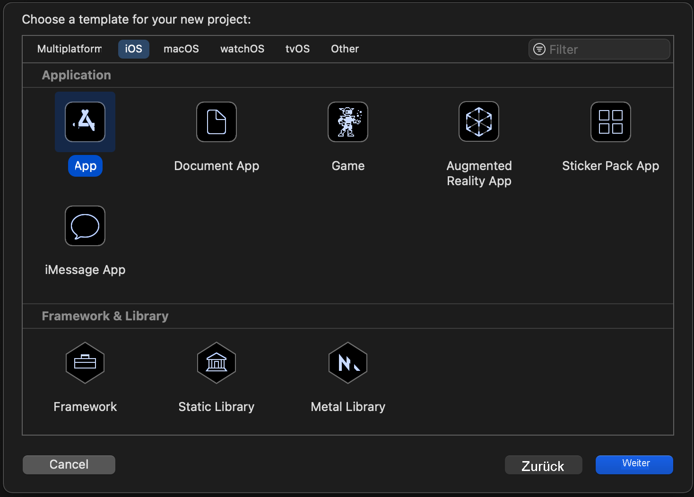
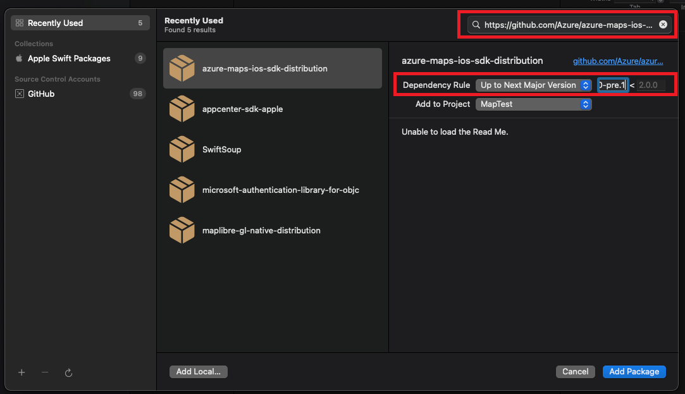
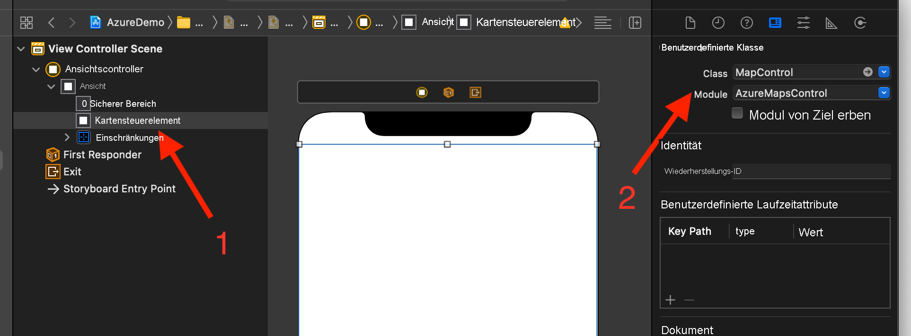

# Erstellen einer iOS-App (Public Preview)

In diesem Artikel wird beschrieben, wie Sie Azure Maps einer iOS-App hinzufügen. Die folgenden grundlegenden Schritte werden erläutert:

* Einrichten Ihrer Entwicklungsumgebung
* Erstellen eines eigenen Azure Maps-Kontos
* Abrufen Ihres primären Azure Maps-Schlüssels für die Verwendung in der App
* Verweisen auf die Azure Maps-Bibliotheken aus dem Projekt
* Hinzufügen eines Azure Maps-Steuerelements zur App

## Voraussetzungen

* Erstellen Sie ein Azure Maps-Konto, indem Sie sich beim [Azure-Portal](https://portal.azure.com/) anmelden. Sollten Sie über kein Azure-Abonnement verfügen, können Sie zunächst ein [kostenloses Konto](https://azure.microsoft.com/free/) erstellen.
* [Erstellen eines Azure Maps-Kontos](quick-demo-map-app.md#create-an-azure-maps-account)
* [Rufen Sie einen Primärschlüssel ab](quick-demo-map-app.md#get-the-primary-key-for-your-account) (auch primärer Schlüssel oder Abonnementschlüssel genannt). Weitere Informationen zur Authentifizierung in Azure Maps finden Sie unter [Verwalten der Authentifizierung in Azure Maps](how-to-manage-authentication.md).
* Laden Sie [‎Xcode](https://apps.apple.com/cz/app/xcode/id497799835?mt=12) kostenlos aus dem Mac App Store herunter.

## Erstellen eines Azure Maps-Kontos

Erstellen Sie mithilfe der folgenden Schritte ein neues Azure Maps-Konto:

1. Wählen Sie im [Azure-Portal](https://portal.azure.com/) in der linken oberen Ecke die Option **Ressource erstellen** aus.

2. Geben Sie im Feld _Marketplace durchsuchen_ die Begriffe **Azure Maps** ein.

3. Wählen Sie unter _Ergebnisse_ die Option **Azure Maps** und anschließend die unter der Karte angezeigte Schaltfläche **Erstellen** aus.

4. Geben Sie auf der Seite **Azure Maps-Konto erstellen** die folgenden Werte ein:

   * _Abonnement_, das Sie für dieses Konto verwenden möchten
   * Name der _Ressourcengruppe_ für dieses Konto. Sie können für die Ressourcengruppe die Option _Neu erstellen_ oder die Option _Vorhandene verwenden_ auswählen.
   * _Name_ des neuen Kontos
   * Der _Tarif_ für dieses Konto.
   * Lesen Sie die _Lizenzbedingungen_ und die _Datenschutzerklärung_, und aktivieren Sie zum Akzeptieren der Bestimmungen das Kontrollkästchen.
   * Wählen Sie die Schaltfläche **Erstellen**.

    

## Abrufen des Primärschlüssels für Ihr Konto

Rufen Sie nach der Erstellung des Maps-Kontos den Primärschlüssel ab, mit dem Sie die Maps-APIs abfragen können.

1. Öffnen Sie Ihr Maps-Konto im Portal.

2. Wählen Sie im Abschnitt „Einstellungen“ die Option **Authentifizierung** aus.

3. Kopieren Sie den **Primärschlüssel** in die Zwischenablage. Speichern Sie ihn lokal zur späteren Verwendung in diesem Tutorial.

>[!NOTE]
> In dieser Schnellstartanleitung wird zu Demonstrationszwecken der Ansatz zur Authentifizierung mit [gemeinsam verwendetem Schlüssel](azure-maps-authentication.md#shared-key-authentication) verwendet. Der bevorzugte Ansatz für jede Produktionsumgebung ist jedoch die Verwendung der Authentifizierung über [Azure Active Directory](azure-maps-authentication.md#azure-ad-authentication).
<!--
> If you use the Azure subscription key instead of the Azure Maps primary key, your map won't render properly. Also, for security purposes, it is recommended that you rotate between your primary and secondary keys. To rotate keys, update your app to use the secondary key, deploy, then press the cycle/refresh button beside the primary key to generate a new primary key. The old primary key will be disabled. For more information on key rotation, see [Set up Azure Key Vault with key rotation and auditing](../key-vault/secrets/tutorial-rotation-dual.md)
-->

## Erstellen eines Projekts in Xcode

Erstellen Sie zunächst ein neues iOS-App-Projekt. Gehen Sie wie folgt vor, um ein Xcode-Projekt zu erstellen:

1. Wählen Sie unter **Datei** die Option **Neu** -> **Projekt** aus.

2. Wählen Sie auf der Registerkarte **iOS** die Option **App** und dann **Weiter** aus.

3. Geben Sie den App-Namen und die Paket-ID ein, und wählen Sie **Weiter** aus.

Weitere Hilfe zum Erstellen eines neuen Projekts finden Sie unter [Erstellen eines Xcode-Projekts für eine App](https://developer.apple.com/documentation/xcode/creating-an-xcode-project-for-an-app).

## Installieren des iOS SDK für Azure Maps

Als Nächstes müssen Sie zur Erstellung Ihrer Anwendung das iOS SDK für Azure Maps installieren. Führen Sie die folgenden Schritte aus, um das SDK zu installieren:

1. Wenn Sie das gewünschte Xcode-iOS-Projekt im **Projektnavigator** ausgewählt haben, wählen Sie die Schaltfläche **+** für **Add package dependency** (Paketabhängigkeit hinzufügen) aus.

   

2. Geben Sie im angezeigten Dialogfeld Folgendes ein:
   * Geben Sie in die in der oberen rechten Ecke angezeigten Suchleiste `https://github.com/Azure/azure-maps-ios-sdk-distribution.git` ein.
   * Wählen Sie im Feld **Dependency Rule** (Abhängigkeitsregel) die Option `Up to Next Major Version` aus.
   * Geben Sie in das Versionsfeld von **Dependency Rule** (Abhängigkeitsregel) den Wert `1.0.0-pre.1` ein.

   

3. Nachdem das Paket zusammen mit seinen Abhängigkeiten aufgelöst wurde, wählen Sie die Schaltfläche **Paket hinzufügen** aus, um die Einrichtung der Abhängigkeit abzuschließen.

   

## Hinzufügen der MapControl-Ansicht

1. Fügen Sie dem Ansichtscontroller das benutzerdefinierte `UIView`-Element hinzu.

1. Wählen Sie die Klasse `MapControl` aus dem Modul `AzureMapsControl` aus.

   

1. Gehen Sie in der Datei **AppDelegate.swift** folgendermaßen vor:

   * Fügen Sie einen Import für das Azure Maps SDK hinzu.
   * Festlegen Ihrer Azure Maps-Authentifizierungsinformationen

Wenn Sie die Authentifizierungsinformationen für die AzureMaps-Klasse global über die Methode `AzureMaps.configure(subscriptionKey:)` oder `AzureMaps.configure(aadClient:aadAppId:aadTenant:)` festlegen, müssen Sie nicht für jede Ansicht Ihre Authentifizierungsinformationen hinzufügen.

1. Klicken Sie wie in der folgenden Grafik dargestellt auf die Schaltfläche „Ausführen“ (bzw. drücken Sie `CMD` + `R`), um Ihre Anwendung zu erstellen.

   

Es dauert ein paar Sekunden, bis Xcode die Anwendung erstellt hat. Nach Abschluss des Builds können Sie Ihre Anwendung auf dem simulierten iOS-Gerät testen. Es sollte eine Zuordnung wie diese angezeigt werden:

## Bereinigen von Ressourcen

<!--
> [!WARNING]
> The tutorials listed in the [Next Steps](#next-steps) section detail how to use and configure Azure Maps with your account. Don't clean up the resources created in this quickstart if you plan to continue to the tutorials.
-->

Führen Sie die folgenden Schritte aus, um die in dieser Schnellstartanleitung erstellten Ressourcen zu bereinigen:

1. Schließen Sie Xcode, und löschen Sie das erstellte Projekt.

2. Falls Sie die Anwendung auf einem externen Gerät getestet haben, sollten Sie die Anwendung auf diesem Gerät deinstallieren.

Gehen Sie wie folgt vor, falls Sie die Entwicklungsarbeit mit dem iOS SDK für Azure Maps nicht fortsetzen möchten:

1. Navigieren Sie zur Seite mit dem Azure-Portal. Wählen Sie auf der Hauptseite des Portals **Alle Ressourcen** aus. Oder wählen Sie das Menüsymbol in der oberen linken Ecke und dann **Alle Ressourcen** aus.

2. Wählen Sie Ihr Azure Maps-Konto aus. Wählen Sie oben auf der Seite **Löschen** aus.

3. Sie können Xcode deinstallieren, falls Sie die Entwicklung von iOS-Apps nicht fortsetzen möchten.

## Zusätzliche Informationen

Weitere Codebeispiele finden Sie in den folgenden Artikeln:

* [Verwalten der Authentifizierung in Azure Maps](how-to-manage-authentication.md).

<!--
## Additional information

See the following articles for additional code examples:

* [Manage authentication in Azure Maps](how-to-manage-authentication.md)
* [Change map styles in iOS maps](set-map-style-ios-sdk.md)
* [Add a symbol layer](add-symbol-layer-ios.md)
* [Add a line layer](add-line-layer-to-map-ios.md)
* [Add a polygon layer](add-polygon-layer-map-ios.md)

## Next steps

In this quickstart, you created your Azure Maps account and created a demo application. Take a look at the following tutorials to learn more about Azure Maps:

> [!div class="nextstepaction"]

> [Load GeoJSON data into Azure Maps](tutorial-load-geojson-file-ios.md)
-->
