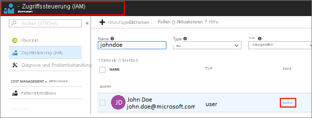

# Erstellen eines Video Analyzer for Media-Kontos

Beim Erstellen eines Kontos für Azure Video Analyzer for Media (vormals Video Indexer) können Sie ein kostenloses Testkonto (für das Sie eine bestimmte Anzahl von kostenlosen Indizierungsminuten erhalten) oder eine kostenpflichtige Option (ohne Kontingentgrenze) auswählen. Bei der kostenlosen Testversion von Video Analyzer for Media erhalten Benutzer bis zu 600 kostenlose Indizierungsminuten bzw. bis zu 2.400 kostenlose Indizierungsminuten, wenn sie die Video Analyzer-API im [Entwicklerportal](https://aka.ms/avam-dev-portal) abonnieren. Bei den kostenpflichtigen Optionen können für Azure Video Analyzer for Media zwei Arten von Konten genutzt werden: klassische Konten (allgemeine Verfügbarkeit) und ARM-basierte Konten (Public Preview). Der Hauptunterschied zwischen den beiden Konten besteht in der Verwaltungsplattform. Während klassische Konten auf API Management beruhen, baut die ARM-basierte Kontoverwaltung auf Azure auf und ermöglicht die native Anwendung der Zugriffssteuerung auf alle Dienste mit rollenbasierter Zugriffssteuerung (Role-Based Access Control, RBAC).

* Sie können ein **klassisches** Video Analyzer for Media-Konto über unsere [API](https://aka.ms/avam-dev-portal) erstellen.

* Sie können ein **ARM-basiertes** Video Analyzer for Media-Konto erstellen, indem Sie eines der folgenden Verfahren verwenden:

  1.  [Video Analyzer for Media-Portal](https://aka.ms/vi-portal-link)

  2.  [Azure-Portal](https://ms.portal.azure.com/#home)

  3.  [Schnellstart für ARM-Vorlage](https://github.com/Azure-Samples/media-services-video-indexer/tree/master/ARM-Samples/Create-Account)

### Weitere Informationen zum Erstellen eines **neuen ARM-basierten** Video Analyzer for Media-Kontos finden Sie in [diesem Artikel](create-video-analyzer-for-media-account.md).

## Erstellen von klassischen Konten
In diesem Artikel wird veranschaulicht, wie Sie ein klassisches Video Analyzer for Media-Konto erstellen. Außerdem werden die Schritte zur Verbindungsherstellung mit Azure unter Verwendung des automatischen Flows (Standard) vorgestellt. Darüber hinaus wird gezeigt, wie Sie eine manuelle Verbindung mit Azure herstellen (erweitert).

Wenn Sie von einem *Testkonto* zu einem *kostenpflichtigen ARM-basierten* Konto für Video Analyzer for Media wechseln, haben Sie die Möglichkeit, alle Videos und Modellanpassungen in das neue Konto zu kopieren. Dies ist im Abschnitt [Importieren Ihrer Inhalte aus dem Testkonto](#import-your-content-from-the-trial-account) beschrieben.

Der Artikel behandelt auch das [Verknüpfen eines Video Analyzer for Media-Kontos mit Azure Government](#video-analyzer-for-media-in-azure-government).

## Voraussetzungen zum Herstellen einer Verbindung mit Azure

* Ein Azure-Abonnement.

    Wenn Sie noch kein Azure-Abonnement haben, können Sie sich für ein [kostenloses Azure-Testkonto](https://azure.microsoft.com/free/) anmelden.
* Eine Azure Active Directory-Domäne (Azure AD).

    Wenn Sie nicht über eine Azure AD-Domäne verfügen, können Sie diese mit Ihrem Azure-Abonnement erstellen. Weitere Informationen finden Sie unter [Verwalten von benutzerdefinierten Domänennamen in Ihrem Azure AD](../../active-directory/enterprise-users/domains-manage.md).
* Ein Benutzer in Ihrer Azure AD-Domäne mit der Rolle **Anwendungsadministrator**. Sie verwenden dieses Mitglied beim Herstellen der Verbindung für Ihr Video Analyzer for Media-Konto mit Azure.

    Bei diesem Benutzer sollte es sich um einen Azure AD Benutzer mit einem Geschäfts-, Schul-oder Unikonto handeln. Verwenden Sie kein persönliches Konto, wie outlook.com, live.com oder hotmail.com.

    

### Zusätzliche Voraussetzungen für den automatischen Flow

* Einen Benutzer und ein Mitglied in Ihrer Azure AD-Domäne.

    Sie verwenden dieses Mitglied beim Herstellen der Verbindung für Ihr Video Analyzer for Media-Konto mit Azure.

    Dieser Benutzer muss ein Mitglied Ihres Azure-Abonnements sein, der entweder der Rolle **Besitzer** oder den beiden Rollen **Mitwirkender** und **Benutzerzugriffsadministrator** zugewiesen sein muss. Ein Benutzer kann zweimal mit zwei Rollen hinzugefügt werden. Einmal mit „Mitwirkender“ und einmal mit „Benutzerzugriffsadministrator“. Weitere Informationen finden Sie unter [Anzeigen, welchen Zugriff ein Benutzer auf Azure-Ressourcen hat](../../role-based-access-control/check-access.md).

    

### Zusätzliche Voraussetzungen für den manuellen Flow

* Registrieren Sie den EventGrid-Ressourcenanbieter mit dem Azure-Portal.

    Wechseln Sie im [Azure-Portal](https://portal.azure.com/) zu **Abonnements** > [Abonnement] > **ResourceProviders**.

    Suchen Sie nach **Microsoft.Media** und **Microsoft.EventGrid**. Klicken Sie auf **Registrieren**, falls der Status nicht „Registriert“ lautet. Die Registrierung nimmt einige Minuten in Anspruch.

    

## Manuelle Verbindungsherstellung mit Azure (erweiterte Option)

Wenn die Verbindungsherstellung mit Azure nicht erfolgreich war, können Sie versuchen, das Problem über eine manuelle Verbindungsherstellung zu beheben.

> [!NOTE]
> Es ist obligatorisch, dass sich die folgenden drei Konten in derselben Region befinden: das Video Analyzer for Media-Konto, für das Sie die Verbindung mit dem Media Services-Konto herstellen, und das mit demselben Media Services-Konto verbundene Azure Storage-Konto.

### Erstellen und Konfigurieren eines Media Services-Konto

1. Verwenden Sie das [Azure](https://portal.azure.com/)-Portal, um ein Azure Media Services-Konto zu erstellen, wie beschrieben unter [Erstellen eines Kontos](../../media-services/previous/media-services-portal-create-account.md).

     Stellen Sie sicher, dass das Media Services-Konto mit den klassischen APIs erstellt wurde. 
 
    

    Wenn Sie ein Speicherkonto für Ihr Media Services-Konto erstellen, wählen Sie als Kontoart **StorageV2** und für die Replikation **Georedundant** (GRS) aus.

    

    > [!NOTE]
    > Notieren Sie sich die Media Services-Ressource und die Kontonamen. Sie benötigen diese Informationen für die Schritte im nächsten Abschnitt.

1. Damit Sie Ihre Videos in der Video Analyzer for Media-Web-App abspielen können, müssen Sie den standardmäßigen **Streamingendpunkt** des neuen Media Services-Kontos starten.

    Wählen Sie im neuen Media Services-Konto **Streamingendpunkte** aus. Wählen Sie dann den Streamingendpunkt aus, und klicken Sie auf „Starten“.

    
4. Für die Video Analyzer for Media-Authentifizierung bei der Media Services-API muss eine AD-App erstellt werden. Die folgenden Schritte leiten Sie durch den Azure AD-Authentifizierungsvorgang, der in [Erste Schritte mit der Azure AD-Authentifizierung mithilfe des Azure-Portals](../../media-services/previous/media-services-portal-get-started-with-aad.md) beschrieben wird:

    1. Wählen Sie im neuen Media Services-Konto **API-Zugriff** aus.
    2. Wählen Sie die [Dienstprinzipalauthentifizierung](../../media-services/previous/media-services-portal-get-started-with-aad.md) aus.
    3. Abrufen der Client-ID und des geheimen Clientschlüssels

        Nachdem Sie **Einstellungen**->**Schlüssel** ausgewählt, eine **Beschreibung** hinzugefügt und auf **Speichern** geklickt haben, wird der Schlüsselwert aufgefüllt.

        Wenn der Schlüssel abläuft, muss der Kontobesitzer sich an den Video Analyzer for Media-Support wenden, um den Schlüssel zu erneuern.

        > [!NOTE]
        > Notieren Sie sich den Schlüsselwert und die Anwendungs-ID. Diese Informationen benötigen Sie für die Schritte im nächsten Abschnitt.

### Manuelle Verbindungsherstellung

Klicken Sie auf der [Video Analyzer for Media](https://www.videoindexer.ai/)-Seite im Dialogfeld **Neues Konto für ein Azure-Abonnement erstellen** auf den Link **Zur manuellen Konfiguration wechseln**.

Geben Sie im Dialogfeld die folgenden Informationen ein:

|Einstellung|Beschreibung|
|---|---|
|Video Analyzer for Media-Kontoregion|Der Name der Region des Video Analyzer for Media-Kontos. Zur Verbesserung der Leistung und Senkung der Kosten wird dringend empfohlen, den Namen der Region anzugeben, in der sich die Azure Media Services-Ressourcen und das Azure Storage-Konto befinden. |
|Azure AD-Mandant|Der Name des Azure AD-Mandanten, z.B. „contoso.onmicrosoft.com“. Die Informationen zum Mandanten können über das Azure-Portal abgerufen werden. Platzieren Sie den Cursor in der oberen rechten Ecke über dem Namen des angemeldeten Benutzers. Der Name befindet sich rechts neben **Domäne**.|
|Abonnement-ID|Wählen Sie das Azure-Abonnement aus, unter dem die Verbindung erstellt werden soll. Die Abonnement-ID kann über das Azure-Portal abgerufen werden. Wählen Sie im linken Navigationsbereich **Alle Dienste** aus, und suchen Sie nach „Abonnements“. Wählen Sie **Abonnements** und dann in der Liste Ihrer Abonnements die gewünschte ID aus.|
|Name der Azure Media Services-Ressourcengruppen|Der Name der Ressourcengruppe, in der Sie das Media Services-Konto erstellt haben.|
|Name der Media Services-Ressource|Der Name des Azure Media Services-Kontos, das Sie im vorherigen Abschnitt erstellt haben.|
|Anwendungs-ID|Die Azure AD-Anwendungs-ID (mit Berechtigungen für das angegebene Media Services-Konto), die Sie im vorherigen Abschnitt erstellt haben.|
|Anwendungsschlüssel|Der Azure AD-Anwendungsschlüssel, den Sie im vorherigen Abschnitt erstellt haben. |

### Importieren Ihrer Inhalte aus dem *Testkonto*

Beim Erstellen eines neuen **ARM-basierten** Kontos haben Sie die Möglichkeit, Ihre Inhalte aus dem *Testkonto* kostenlos in das neue **ARM-basierte** Konto zu importieren.
> [!NOTE]
> * Der Import aus der Testversion kann nur einmal pro Testkonto durchgeführt werden.
> * Das ARM-basierte Zielkonto muss erstellt worden und verfügbar sein, bevor der Import zugewiesen wird.  
> * Das ARM-basierte Zielkonto muss ein leeres Konto sein (keinerlei Indizierung von Mediendateien).

Führen Sie die folgenden Schritte aus, um Ihre Daten zu importieren:
 1. Navigieren Sie zum [Azure Video Analyzer for Media-Portal](https://aka.ms/vi-portal-link).
 2. Wählen Sie Ihr Testkonto aus, und navigieren Sie zur Seite *Kontoeinstellungen*.
 3. Klicken Sie auf *Inhalte in ein ARM-basiertes Konto importieren*.
 4. Wählen Sie im Dropdownmenü das ARM-basierte Konto aus, in das Sie die Daten importieren möchten.
   * Falls die Konto-ID nicht angezeigt wird, können Sie sie aus dem Azure-Portal oder der Kontoliste kopieren, die sich im Azure Video Analyzer for Media-Portal auf dem seitlich angeordneten Blatt befindet.
 5. Klicken Sie auf **Inhalt importieren**.  

Alle Anpassungen der Medien und des Inhaltsmodells werden aus dem *Testkonto* in das neue ARM-basierte Konto kopiert.

> [!NOTE]
>
> Das *Testkonto* ist in der Azure Government-Cloud nicht verfügbar.

## Überlegungen zu Azure Media Services

Für Azure Media Services gilt Folgendes:

* Wenn Sie beabsichtigen, eine Verbindung mit einem vorhandenen Media Services Konto herzustellen, stellen Sie sicher, dass das Media Services-Konto mit den klassischen APIs erstellt wurde. 
 
    
* Falls Sie eine Verbindung mit einem vorhandenen Media Services-Konto hergestellt haben, ändert Video Analyzer for Media die vorhandene Konfiguration für **Reservierte Einheiten für Medien** nicht.

   Unter Umständen müssen Sie den Typ und die Anzahl von reservierten Einheiten für Medien gemäß Ihrer geplanten Last anpassen. Beachten Sie hierbei Folgendes: Wenn die Last hoch ist und Sie nicht über genügend Einheiten oder eine ausreichend hohe Geschwindigkeit verfügen, kann es bei der Videoverarbeitung zu Timeoutfehlern kommen.
* Bei der Verbindungsherstellung mit einem neuen Media Services-Konto startet Video Analyzer for Media dafür automatisch den standardmäßigen **Streamingendpunkt**:

    

    Streamingendpunkte benötigen relativ viel Zeit zum Starten. Deshalb kann es einige Minuten dauern, bis Ihre Videos gestreamt und in der Video Analyzer for Media-Web-App angesehen werden können.
* Falls Sie eine Verbindung mit einem vorhandenen Media Services-Konto hergestellt haben, ändert Video Analyzer for Media die Konfiguration für den standardmäßigen Streamingendpunkt nicht. Wenn kein ausgeführter **Streamingendpunkt** vorhanden ist, können Sie keine Videos über dieses Media Services-Konto oder in Video Analyzer for Media ansehen.
* Bei der automatischen Verbindungsherstellung legt Video Analyzer for Media die Einstellung für **Reservierte Einheiten für Medien** auf 10 S3-Einheiten fest:

    
    
## Automatisieren der Video Analyzer for Media-Kontoerstellung

Die Automatisierung des Erstellens des Kontos ist ein Prozess in zwei Schritten:
 
1. Verwenden von Azure Resource Manager zum Erstellen eines Azure Media Services-Kontos und einer Azure AD-Anwendung.

    Ein Beispiel für die Vorlage zum Erstellen eines Media Services-Kontos finden Sie [hier](https://github.com/Azure-Samples/media-services-v3-arm-templates).
1. Aufrufen von [Create-Account mit Media Services und der Azure AD-Anwendung](https://videoindexer.ai.azure.us/account/login?source=apim).

## Video Analyzer for Media in Azure Government

### Voraussetzungen zum Herstellen einer Verbindung mit Azure Government

-   Ein Abonnement in [Azure Government](../../azure-government/index.yml)
- Ein Azure AD-Konto in Azure Government
- Alle Voraussetzungen für Berechtigungen und Ressourcen, wie oben unter [Voraussetzungen zum Herstellen einer Verbindung mit Azure](#prerequisites-for-connecting-to-azure) beschrieben. Informieren Sie sich über die [zusätzlichen Voraussetzungen für den automatischen Flow](#additional-prerequisites-for-automatic-flow) und die [zusätzlichen Voraussetzungen für den manuellen Flow](#additional-prerequisites-for-manual-flow).

### Erstellen eines neuen Kontos über das Azure Government-Portal

> [!NOTE]
> Die Azure Government-Cloud umfasst keine *Testversion* von Video Analyzer for Media.

So erstellen Sie ein kostenpflichtiges Konto über das Video Analyzer for Media-Portal:

1. Besuchen Sie https://videoindexer.ai.azure.us. 
1. Melden Sie sich mit Ihrem Azure AD-Konto für Azure Government an.
1.  Wenn Sie über keine Video Analyzer for Media-Konten in Azure Government verfügen, bei denen Sie Besitzer oder Mitwirkender sind, erhalten Sie eine leere Umgebung, von der aus Sie Ihr Konto erstellen können. 

    Der Rest des Flows ist wie oben beschrieben. Nur die Regionen, aus denen ausgewählt wird, sind Government-Regionen, in denen Video Analyzer for Media verfügbar ist. 

    Wenn Sie bereits Mitwirkender oder Administrator eines bestehenden Video Analyzer for Media-Kontos in Azure Government sind, werden Sie zu diesem Konto weitergeleitet und können von dort aus bei Bedarf die Schritte zum Erstellen eines weiteren Kontos ausführen (wie oben beschrieben).
    
### Erstellen eines neuen Kontos über die API in Azure Government

Um ein kostenpflichtiges Konto in Azure Government zu erstellen, folgen Sie den Anweisungen zum [Erstellen eines kostenpflichtigen Kontos](). Dieser API-Endpunkt umfasst nur Government-Cloudregionen.

### Einschränkungen von Video Analyzer for Media in Azure Government

*   In der Government-Cloud ist keine manuelle Inhaltsmoderation verfügbar. 

    Wenn in der öffentlichen Cloud Inhalte aufgrund einer Inhaltsmoderation als anstößig erachtet werden, kann der Kunde einen Mitarbeiter anfordern, der sich diese Inhalte ansieht und die Entscheidung möglicherweise rückgängig machen kann.  
*   Keine Testkonten. 
* Bing-Beschreibung – In der Government-Cloud werden wir keine Beschreibung der identifizierten Prominenten und benannten Entitäten präsentieren. Dies ist nur eine Funktion der Benutzeroberfläche. 

## Bereinigen von Ressourcen

Nachdem Sie dieses Tutorial abgeschlossen haben, löschen Sie Ressourcen, die Sie nicht verwenden möchten.

### Löschen eines Video Analyzer for Media-Kontos

Wenn Sie ein Video Analyzer for Media-Konto löschen möchten, ist dies auf der Video Analyzer for Media-Website möglich. Sie müssen der Besitzer sein, um das Konto zu löschen.

Klicken Sie auf das Konto und dann auf **Einstellungen** -> **Dieses Konto löschen**. 

Das Konto wird in 90 Tagen dauerhaft gelöscht.

## Firewall

Weitere Informationen finden Sie unter [Speicherkonto befindet sich hinter einer Firewall](faq.yml#can-a-storage-account-connected-to-the-media-services-account-be-behind-a-firewall).

## Nächste Schritte

Sie können programmgesteuert mit Ihrem Testkonto und/oder mit Ihren Video Analyzer for Media-Konten interagieren, die mit Azure verbunden sind. Befolgen Sie hierzu die Anweisungen unter [Verwenden von APIs](video-indexer-use-apis.md).

Sie sollten hierfür denselben Azure AD-Benutzer verwenden, den Sie beim Herstellen der Verbindung mit Azure genutzt haben.
