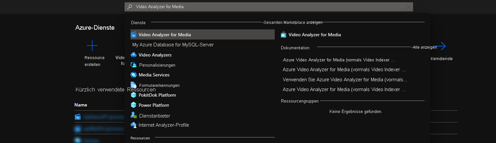
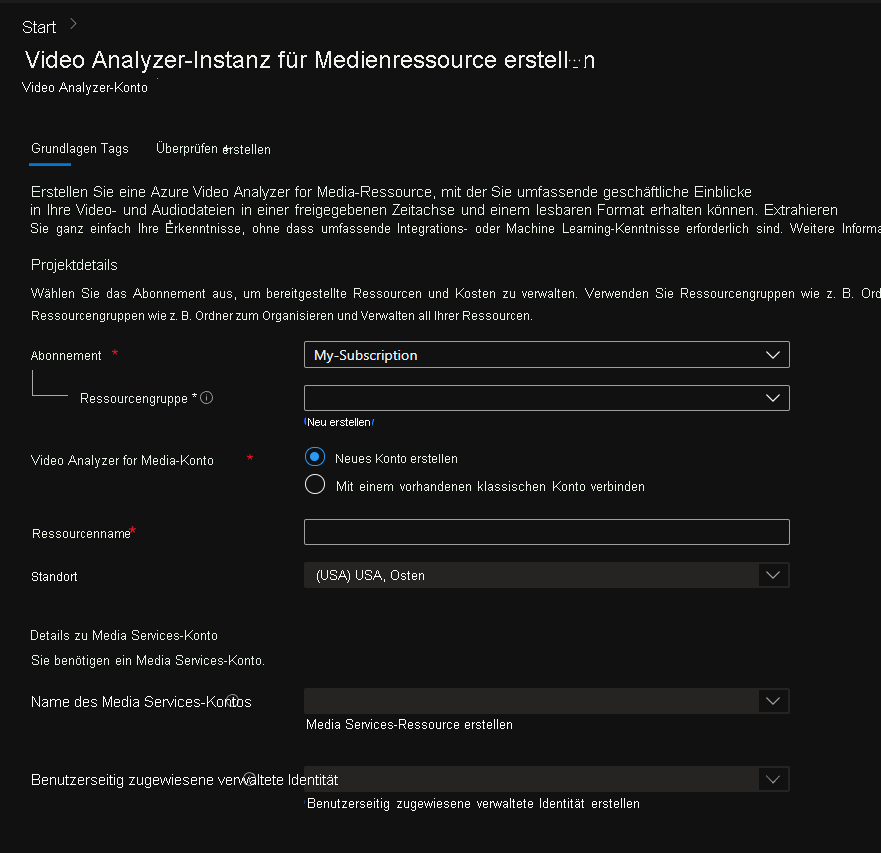

# Erste Schritte mit Azure Video Analyzer for Media im Azure-Portal

In dieser Schnellstartanleitung werden Sie durch die ersten Schritte mit Azure Video Analyzer for Media geführt. Sie erstellen im Azure-Portal ein Azure Video Analyzer for Media-Konto und die zugehörigen Ressourcen.

Um mit der Verwendung von Azure Video Analyzer for Media zu beginnen, müssen Sie ein Video Analyzer for Media-Konto erstellen. Das Konto muss einer [Media Services][docs-ms]-Ressource und einer [benutzerseitig zugewiesenen verwalteten Identität][docs-uami] zugeordnet werden. Die verwaltete Identität muss über die Rolle „Mitwirkender“ für die Media Services verfügen.

## Voraussetzungen
> [!NOTE]
> Sie benötigen ein Azure-Abonnement, in dem Sie Zugriff auf folgende Rollen haben: „Mitwirkender“ und „Benutzerzugriffsadministrator“ für die Ressourcengruppe, in der Sie neue Ressourcen erstellen, und „Mitwirkender“ sowohl für Azure Media Services als auch für die benutzerseitig zugewiesene verwaltete Identität. Wenn Sie nicht über die richtigen Berechtigungen verfügen, wenden Sie sich an Ihren Kontoadministrator, damit er Ihnen diese Berechtigungen erteilt. Die zugeordneten Azure Media Services müssen sich in derselben Region wie das Video Analyzer für Media-Konto befinden.

## Azure-Portal

### Erstellen eines Video Analyzer for Media-Kontos im Azure-Portal

1. Melden Sie sich beim [Azure-Portal](https://portal.azure.com/) an.
1. Geben Sie in der Suchleiste im oberen Bereich **Video Analyzer for Media** ein.
1. Klicken Sie unter *Dienste* auf *Video Analyzer for Media*.

    

1. Klicken Sie auf **Erstellen**.
1. Geben Sie im Abschnitt **Video Analyzer for Media-Ressource erstellen** die erforderlichen Werte ein.

    

 
| Name | BESCHREIBUNG |
| ---|---|
|**Abonnement**|Wählen Sie das Abonnement aus, das Sie zum Erstellen des Video Analyzer for Media-Kontos verwenden möchten.|
|**Ressourcengruppe**|Wählen Sie eine Ressourcengruppe aus, in der Sie das Video Analyzer for Media-Konto erstellen möchten, oder wählen Sie **Neu erstellen** aus, um eine Ressourcengruppe zu erstellen.|
|**Video Analyzer for Media-Konto**|Wählen Sie die Option *Neues Konto erstellen* aus.|
|**Ressourcenname**|Geben Sie den Namen des neuen Video Analyzer for Media-Kontos ein. Der Name kann Buchstaben, Zahlen und Bindestriche, aber keine Leerzeichen enthalten.|
|**Location**|Wählen Sie die geografische Region aus, die zum Bereitstellen des Video Analyzer for Media-Kontos verwendet werden soll. Der Standort entspricht dem von Ihnen ausgewählten **Ressourcengruppenstandort**. Wenn Sie den ausgewählten Standort ändern möchten, ändern Sie die ausgewählte Ressourcengruppe, oder erstellen Sie eine neue am bevorzugten Standort. [Azure-Region, in der Video Analyzer for Media verfügbar ist](https://azure.microsoft.com/global-infrastructure/services/?products=cognitive-services&regions=all)|
|**Name des Media Services-Kontos**|Wählen Sie eine Media Services-Instanz aus, die das neue Video Analyzer for Media-Konto zum Verarbeiten der Videos verwenden soll. Sie können eine vorhandene Media Services-Instanz auswählen oder eine neue erstellen. Die Media Services-Instanz muss sich am selben Standort befinden, den Sie ausgewählt haben.| 
|**Benutzerseitig zugewiesene verwaltete Identität**|Wählen Sie eine benutzerseitig zugewiesene verwaltete Identität aus, die das neue Video Analyzer for Media-Konto für den Zugriff auf die Media Services-Instanz verwenden soll. Sie können eine vorhandene benutzerseitig zugewiesene verwaltete Identität auswählen oder eine neue erstellen. Der benutzerseitig zugewiesenen verwalteten Identität wird die Rolle „Mitwirkender“ für die Media Services-Instanz zugewiesen.|

1. Klicken Sie unten im Formular auf **Überprüfen + erstellen**.

### Überprüfen der bereitgestellten Ressource

Sie können das Azure-Portal verwenden, um das Azure Video Analyzer for Media-Konto und andere erstellte Ressourcen zu überprüfen. Wählen Sie nach Abschluss der Bereitstellung **Zu Ressource wechseln** aus, um Ihr neues Video Analyzer for Media-Konto anzuzeigen.

### Übersicht

Klicken Sie auf *Portal von Video Analyzer for Media erkunden*, um Ihr neues Konto im [Azure Video Analyzer for Media-Portal](https://aka.ms/vi-portal-link) anzuzeigen.

### Verwaltungs-API

Verwenden Sie die Registerkarte *Verwaltungs-API*, um manuell Zugriffstoken für das Konto zu generieren.
Dieses Token kann zum Authentifizieren von API-Aufrufen für dieses Konto verwendet werden. Jedes Token ist eine Stunde lang gültig.

Wählen Sie Folgendes aus:
* Berechtigungstyp: **Mitwirkender** oder **Leser**
* Umfang: **Konto**, **Projekt** oder **Video**
    * Für **Projekt** oder **Video** sollten Sie auch die passende ID einfügen.
* Klicken Sie auf **Generieren**.

---

### Nächste Schritte

Erfahren Sie, wie Sie [ein Video mit C# hochladen](https://github.com/Azure-Samples/media-services-video-indexer/tree/master/ApiUsage/ArmBased).

<!-- links -->
[docs-uami]: ../../active-directory/managed-identities-azure-resources/overview.md
[docs-ms]: ../../media-services/latest/media-services-overview.md
[docs-role-contributor]: ../../role-based-access-control/built-in-roles.md#contibutor
[docs-contributor-on-ms]: ./add-contributor-role-on-the-media-service.md
