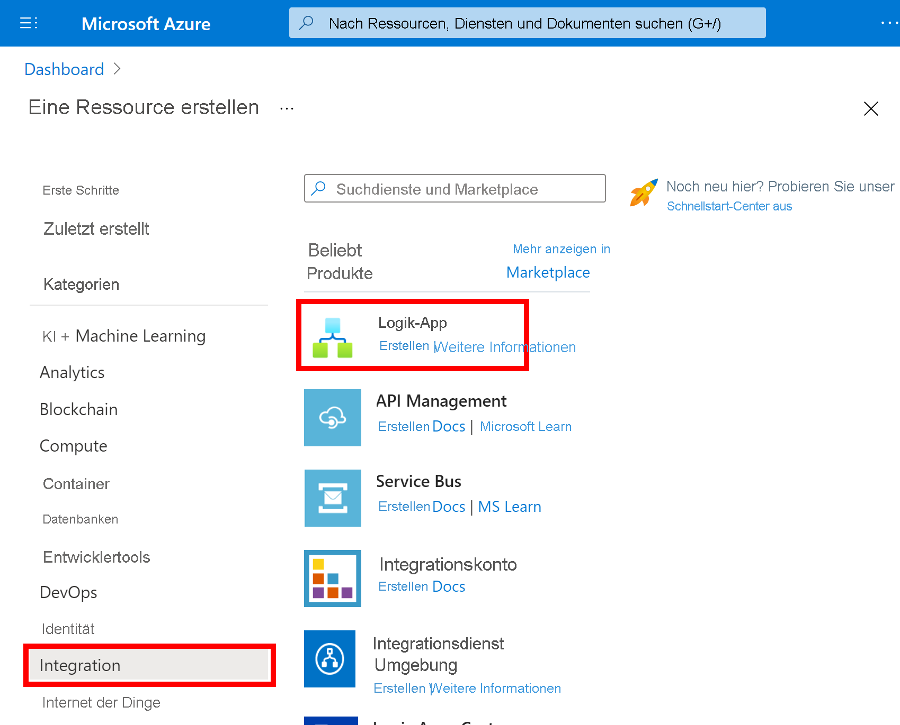
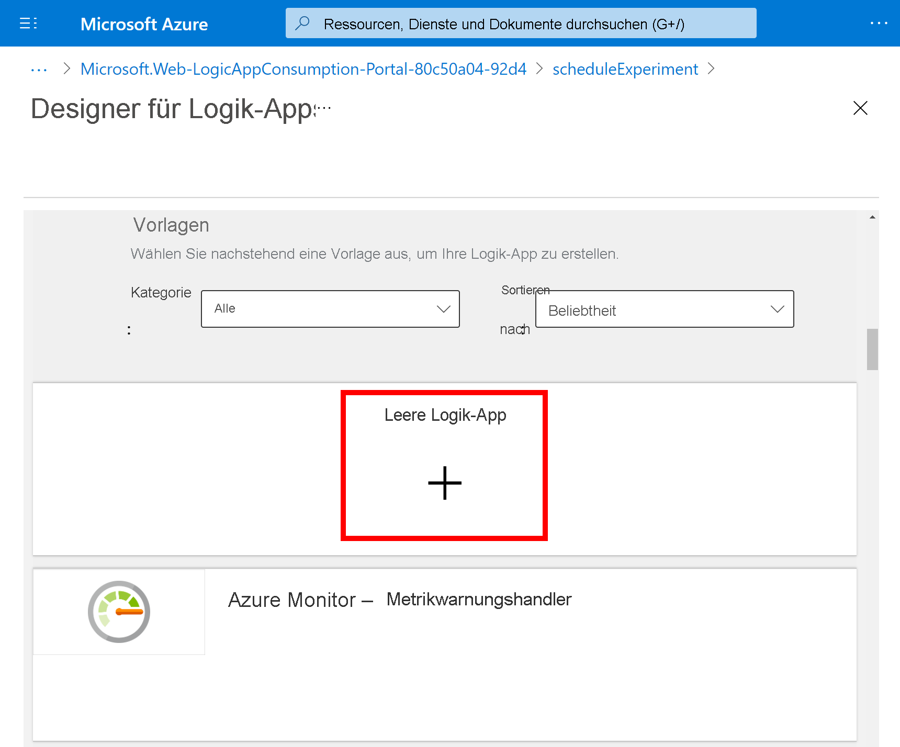
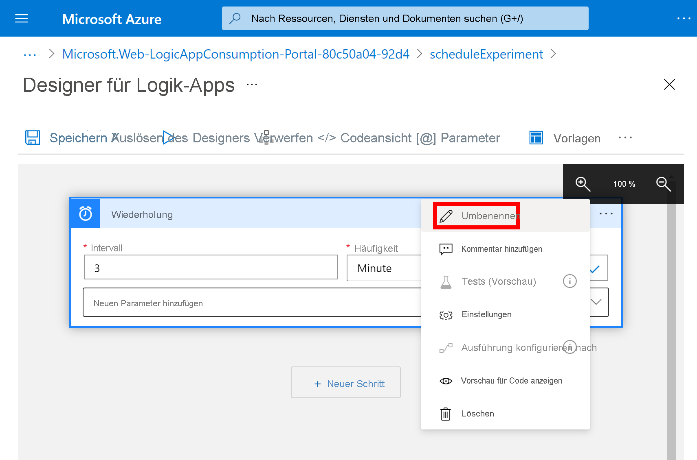
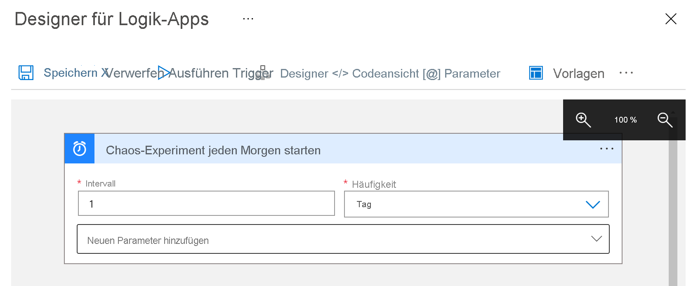
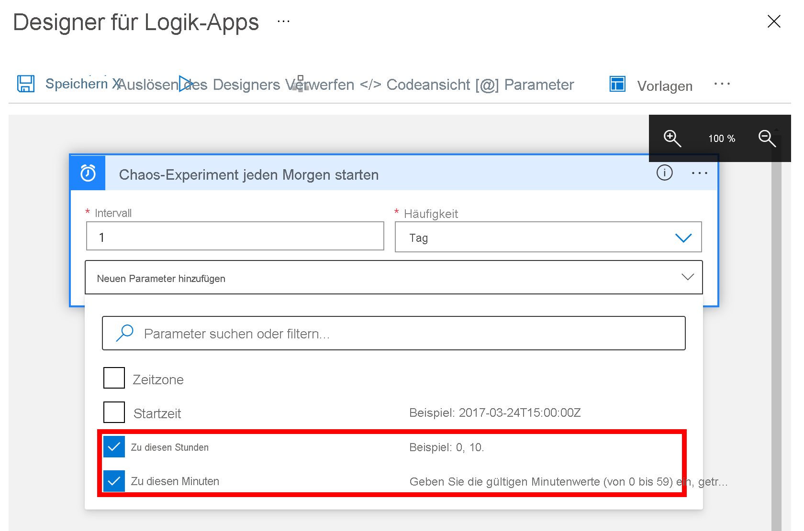
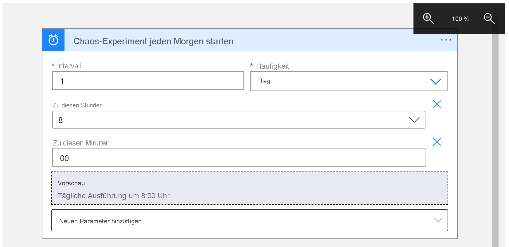
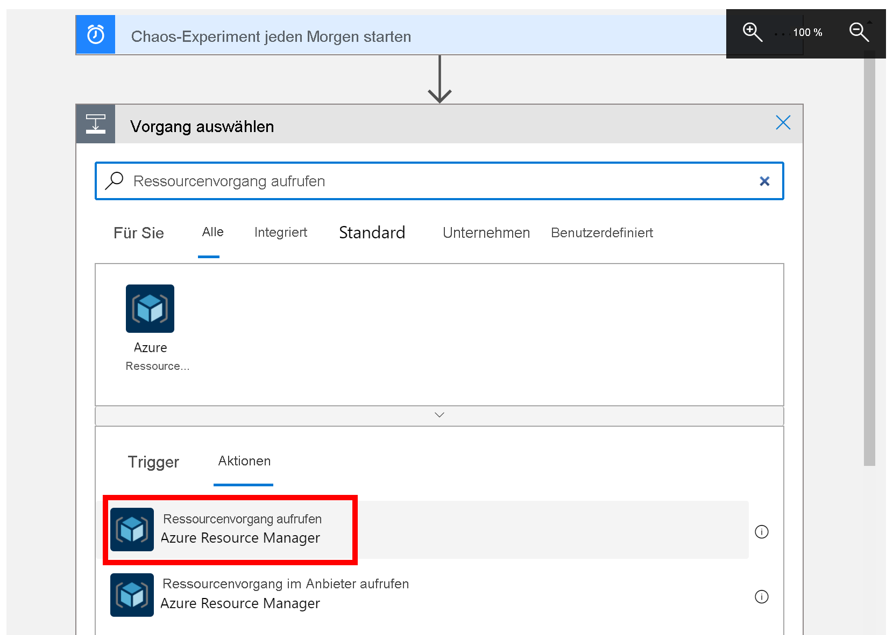
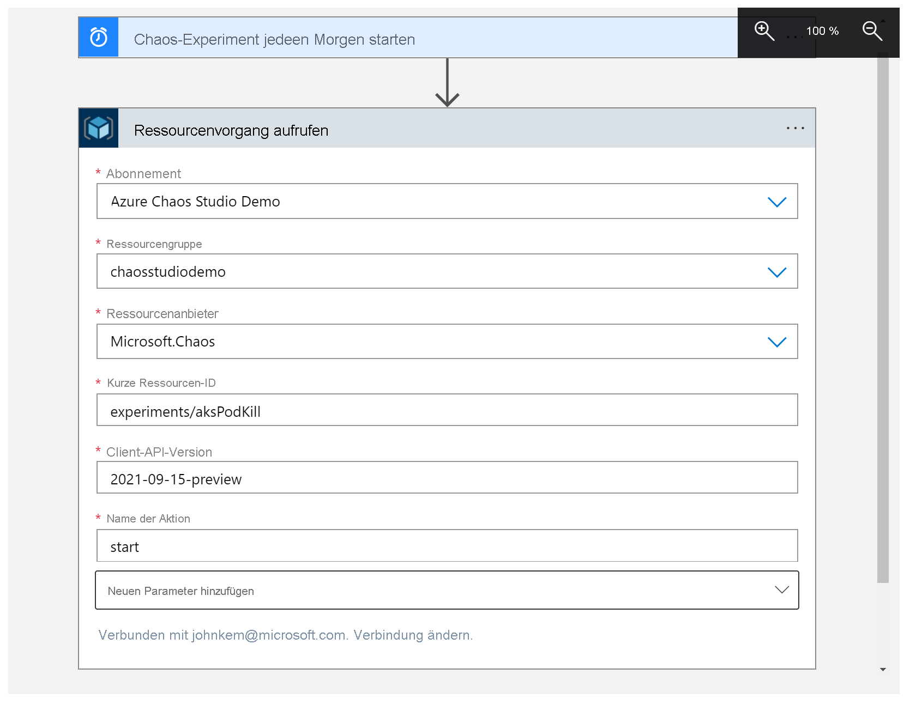

# Tutorial: Planen eines wiederholten Experiments mit Azure Chaos Studio

Mit Azure Chaos Studio können Sie Chaos-Experimente ausführen, bei denen ein Teil Ihrer Anwendung oder Ihres Diensts absichtlich fehlschlägt, um sicherzustellen, dass sie bzw. er diesen Fehlern gegenüber resilient ist. Es kann hilfreich sein, diese Chaos-Experimente in regelmäßigen Abständen durchzuführen, um sicherzustellen, dass die Resilienz Ihrer Anwendung nicht nachgelassen hat, oder um Complianceanforderungen zu erfüllen. In diesem Tutorial verwenden Sie eine [Logik-App](../logic-apps/logic-apps-overview.md), um einmal pro Tag die Ausführung eines Experiments auszulösen.

In diesem Tutorial lernen Sie Folgendes:

> [!div class="checklist"]
> * Erstellen einer Logik-App 
> * Konfigurieren der Logik-App zum Auslösen eines täglich gestarteten Chaos-Experiments
> * Testen, ob die Logik-App ordnungsgemäß konfiguriert ist

## Voraussetzungen

- Ein Azure-Konto mit einem aktiven Abonnement. Sie können [kostenlos ein Konto erstellen](https://azure.microsoft.com/free/?WT.mc_id=A261C142F).
- Ein Chaos-Experiment. Erstellen Sie anhand [dieser Schnellstartanleitung](chaos-studio-quickstart-azure-portal.md) ein Chaos-Experiment.
- Alle Ressourcen in diesem Chaos-Experiment müssen [in Chaos Studio integriert werden](chaos-studio-targets-capabilities.md).

## Erstellen einer Logik-App
Eine Logik-App ist ein automatisierter Workflow, der basierend auf einem Zeitplan ausgeführt werden kann. Die in diesem Tutorial verwendete Logik-App startet ein Chaos-Experiment mithilfe eines Wiederholungszeitplans.

1. Melden Sie sich mit den Anmeldeinformationen Ihres Azure-Kontos beim [Azure-Portal](https://portal.azure.com) an. Wählen Sie auf der Azure-Startseite **Ressource erstellen** aus.

1. Wählen Sie im Azure Marketplace-Menü **Integration** > **Logik-App** aus.

   

1. Geben Sie im Bereich **Logik-App** die hier beschriebenen Informationen zu der Logik-App an, die Sie erstellen möchten.

   

   | Eigenschaft | Wert | Beschreibung |
   |----------|-------|-------------|
   | **Abonnement** | <*Name des Azure-Abonnements*> | Den Namen Ihres Azure-Abonnements In diesem Beispiel wird `Azure Chaos Studio Demo` verwendet. |
   | **Ressourcengruppe** | chaosstudiodemo | Der Name der [Azure-Ressourcengruppe](../azure-resource-manager/management/overview.md), die zum Organisieren verwandter Ressourcen verwendet wird. In diesem Beispiel wird eine neue Ressourcengruppe namens `chaosstudiodemo` erstellt. |
   | **Type** | Nutzung | Der [Logik-App-Ressourcentyp](../logic-apps/single-tenant-overview-compare.md). Legen Sie ihn auf **Verbrauch** fest. |
   | **Name** | scheduleExperiment | Der Name Ihrer Logik-App. Er darf nur Buchstaben, Ziffern, Bindestriche (`-`), Unterstriche (`_`), Klammern (`(`, `)`) und Punkte (`.`) enthalten. In diesem Beispiel wird `scheduleExperiment` verwendet. |
   | **Location** | East US | Die Region, in der die Informationen zu Ihrer Logik-App gespeichert werden sollen. In diesem Beispiel wird `East US` verwendet. |
   | **Aktivieren von Log Analytics** | Nein | Richten Sie die Diagnoseprotokollierung für die Logik-App ein. Legen Sie **No** fest. |

1. Wählen Sie abschließend **Überprüfen + erstellen** aus. Warten Sie, bis Azure die Informationen zu Ihrer Logik-App überprüft hat, und wählen Sie anschließend **Erstellen** aus.

1. Warten Sie, bis Azure Ihre App bereitgestellt hat, und wählen Sie anschließend **Zu Ressource wechseln** aus.

   Azure öffnet den Bereich zum Auswählen einer Logic Apps-Vorlage. Hier finden Sie ein Einführungsvideo, häufig verwendete Trigger sowie Logik-App-Vorlagenmuster.

## Hinzufügen des Serientriggers
Fügen Sie als Nächstes den [Trigger](../logic-apps/logic-apps-overview.md#logic-app-concepts) „Serie“ hinzu, durch den der Workflow auf der Grundlage des angegebenen Zeitplans ausgeführt wird. Jede Logik-App beginnt mit einem Trigger, der ausgelöst wird, wenn ein bestimmtes Ereignis eintritt oder neue Daten eine bestimmte Bedingung erfüllen.

1. Scrollen Sie am Video und an den gängigen Triggern vorbei nach unten zum Abschnitt **Vorlagen**, und wählen Sie **Leere Logik-App** aus.

   

1. Geben Sie im Suchfeld des Designers für Logik-Apps den Suchtext `recurrence` ein, und wählen Sie den Trigger mit dem Namen **Serie** aus.

   

1. Wählen Sie Bereich **Serie** die Schaltfläche mit den **Auslassungspunkten** ( **...** ) und anschließend **Umbenennen** aus. Nennen Sie den Trigger wie folgt: `Start chaos experiment every morning`

   

1. Ändern Sie innerhalb des Triggers die folgenden Eigenschaften wie hier beschrieben und gezeigt:

   

   | Eigenschaft | Erforderlich | Wert | BESCHREIBUNG |
   |----------|----------|-------|-------------|
   | **Intervall** | Ja | 1 | Die Anzahl von Warteintervallen zwischen Überprüfungen |
   | **Frequency** | Ja | Tag | Die Zeiteinheit für die Wiederholung |

1. Öffnen Sie unter **Intervall** und **Frequenz** die Liste **Neuen Parameter hinzufügen**, und wählen Sie die folgenden Eigenschaften aus, um sie dem Trigger hinzuzufügen:

   * **Zu diesen Stunden**
   * **Zu diesen Minuten**

   

1. Legen Sie als Nächstes die Werte für die Eigenschaften wie hier gezeigt und beschrieben fest:

   

   | Eigenschaft | Wert | Beschreibung |
   |----------|-------|-------------|
   | **Zu diesen Stunden** | 8 | Diese Einstellung ist nur verfügbar, wenn Sie **Frequenz** auf **Woche** oder **Tag** festlegen. Wählen Sie für diese Serie die Stunden des Tages aus. Dieses Beispiel wird um `8` Uhr ausgeführt. |
   | **Zu diesen Minuten** | 00 | Diese Einstellung ist nur verfügbar, wenn Sie **Frequenz** auf **Woche** oder **Tag** festlegen. Wählen Sie für diese Serie die Minuten des Tages aus. Dieses Beispiel wird einmal um 0 Uhr ausgeführt. |

   Dieser Trigger wird an jedem Wochentag um 8:00 Uhr ausgelöst. Im Feld **Vorschau** wird der Wiederholungszeitplan angezeigt. Weitere Informationen finden Sie unter [Planen von regelmäßig ausgeführten Aufgaben und Workflows mit Logik-Apps](../connectors/connectors-native-recurrence.md) und [Trigger und Aktionen für Logik-App-Workflows](../logic-apps/logic-apps-workflow-actions-triggers.md#recurrence-trigger).

1. Speichern Sie Ihre Logik-App. Wählen Sie auf der Symbolleiste des Designers **Speichern** aus.

## Hinzufügen einer Aktion zum Ausführen eines Chaos-Experiments
Sie verfügen über einen Trigger und können nun eine [Aktion](../logic-apps/logic-apps-overview.md#logic-app-concepts) hinzufügen, die das Experiment startet. In diesem Tutorial wird die Aktion **Invoke resource operation** (Ressourcenvorgang aufrufen) verwendet, um das Experiment zu starten.

1. Wählen Sie im Designer für Logik-Apps unter dem Serientrigger die Option **Neuer Schritt** aus.

1. Geben Sie unter **Vorgang auswählen** den Text `Invoke resource operation` ein, und wählen Sie unter **Aktionen** die Option **Invoke resource operation** (Ressourcenvorgang aufrufen) aus.

    

1. Legen Sie den richtigen **Mandanten** fest, in dem Ihr Experiment gespeichert ist, und klicken Sie auf **Anmelden**.

1. Melden Sie sich bei Ihrem Azure-Konto für diesen Mandanten an.

1. Legen Sie als Nächstes die Werte für die Aktionseigenschaften wie hier gezeigt und beschrieben fest.

   

   | Eigenschaft | Wert | BESCHREIBUNG |
   |----------|-------|-------------|
   | **Abonnement** | <*Name des Azure-Abonnements*> | Der Name des Azure-Abonnements, in dem Ihr Chaos-Experiment bereitgestellt wird. In diesem Beispiel wird `Azure Chaos Studio Demo` verwendet. |
   | **Ressourcengruppe** | <*Resource-group-name*> | Der Name der Ressourcengruppe, in der Ihr Chaos-Experiment bereitgestellt wird. In diesem Beispiel wird `chaosstudiodemo` verwendet. |
   | **Ressourcenanbieter** | `Microsoft.Chaos` | Der Chaos Studio-Ressourcenanbieter |
   | **Short Resource Id** (Kurze Ressourcen-ID) | `experiments/`<*Resource-group-name*> | Der Name Ihres Chaos-Experiments, dem `experiments/` vorangestellt ist |
   | **Client-API-Version** | `2021-09-15-preview` | Die Version der Chaos Studio-REST-API |
   | **Name der Aktion** | `start` | Der Name der Chaos Studio-Experimentaktion. Immer `start`. |

1. Speichern Sie Ihre Logik-App. Wählen Sie auf der Symbolleiste des Designers **Speichern** aus.

## Testen der Logik-App
Testen Sie nun die Logik-App, um sicherzustellen, dass ihr Experiment von ihr erfolgreich gestartet wird.

1. Schließen Sie den Logic Apps-Designer.

1. Wählen Sie in der Logik-App-Übersicht **Trigger ausführen** und dann **Ausführen** aus.

    

1. Navigieren Sie im Azure-Portal zu Ihrem Chaos-Experiment, und überprüfen Sie, ob der **Status** auf **Wird ausgeführt** festgelegt ist.

    

## Bereinigen von Ressourcen

Falls Sie diese Anwendung nicht mehr benötigen, löschen Sie die Logik-App wie folgt:

1. Klicken Sie in der Übersicht der Logik-App auf **Löschen**.
1. Geben Sie den Namen der Logik-App ein, und klicken Sie dann auf **Löschen**.

## Nächste Schritte

Sie haben einen Zeitplan für Ihr Experiment festgelegt und können nun folgende Aktionen ausführen:
> [!div class="nextstepaction"]
> [Ausführen und Verwalten des Experiments](chaos-studio-run-experiment.md)
