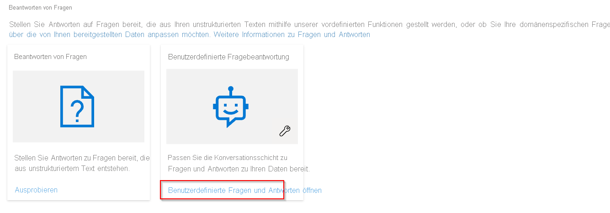
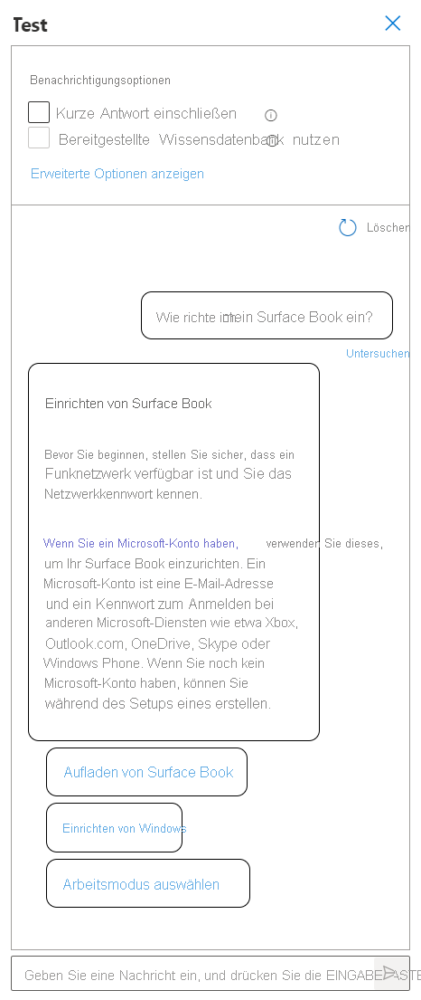

# Erstellen, Testen und Bereitstellen eines benutzerdefinierten Fragen und Antworten-Projekts

Sie können ein Fragen und Antworten-Projekt aus eigenen Inhalten erstellen, z. B. aus häufig gestellten Fragen oder Produkthandbüchern. Dieser Artikel enthält ein Beispiel zum Erstellen eines Fragen und Antworten-Projekts auf Grundlage eines Produkthandbuchs zum Beantworten von Fragen.

## Voraussetzungen

> [!div class="checklist"]
> * Wenn Sie kein Azure-Abonnement besitzen, können Sie ein [kostenloses Konto](https://azure.microsoft.com/free/cognitive-services/) erstellen, bevor Sie beginnen.
> * Eine [Sprachressource](https://aka.ms/create-language-resource) mit aktiviertem Feature „Benutzerdefinierte Fragen und Antworten“.

## Erstellen Ihres ersten Fragen und Antworten-Projekts

1. Melden Sie sich mit Ihren Azure-Anmeldeinformationen bei [Language Studio](https://language.azure.com/) an.

2. Scrollen Sie nach unten zum Abschnitt **Fragen beantworten,** und wählen Sie **„Benutzerdefinierte Fragen und Antworten“ öffnen** aus.

    > [!div class="mx-imgBorder"]
    > 

3. Wenn Ihre Ressource noch nicht mit Azure Search verbunden ist, wählen Sie **Verbinden mit Azure Search** aus. Dadurch wird eine neue Browserregisterkarte mit dem Bereich **Features** Ihrer Ressource im Azure-Portal geöffnet.

    > [!div class="mx-imgBorder"]
    > 

4. Wählen Sie **Benutzerdefinierte Fragen und Antworten aktivieren**, die zu verknüpfende Azure Search-Ressource und dann **Anwenden** aus.

    > [!div class="mx-imgBorder"]
    > 

5. Kehren Sie zur Registerkarte „Language Studio“ zurück. Möglicherweise müssen Sie diese Seite aktualisieren, damit die Änderung Ihrer Ressource registriert wird. Wählen Sie **Neues Projekt erstellen** aus.

6. Wählen Sie die Option **Ich möchte die Sprache für alle Projekte festlegen, die in dieser Ressource erstellt wurden** > **Englisch** > **Weiter** aus.

7. Geben Sie den Projektnamen **Sample-project** sowie die Beschreibung **My first question answering project**  ein, und übernehmen Sie die Einstellung **Keine Antwort gefunden** für die Standardantwort.

8. Überprüfen Sie Ihre Auswahl, und wählen Sie **Projekt erstellen** aus.

9. Wählen Sie auf der Seite **Quellen verwalten** die Option **Quelle hinzufügen** > **URLs** aus.

10. Wählen Sie **URL hinzufügen** aus, geben Sie die folgenden Werte ein, und wählen Sie dann **Alle hinzufügen** aus:

    |URL-Name|URL-Wert|
    |--------|---------|
    |Surface Book Benutzerhandbuch |https://download.microsoft.com/download/7/B/1/7B10C82E-F520-4080-8516-5CF0D803EEE0/surface-book-user-guide-EN.pdf |

    Der Extraktionsvorgang nimmt einen Moment in Anspruch, um das Dokument zu lesen sowie Fragen und Antworten zu identifizieren. Mit „Fragen und Antworten“ wird bestimmt, ob der zugrunde liegende Inhalt strukturiert oder unstrukturiert ist.

    Nachdem die Quelle erfolgreich hinzugefügt wurde, können Sie den Quellinhalt bearbeiten, um weitere benutzerdefinierte Fragen und Antworten-Sätze hinzuzufügen.

## Testen des Projekts

1. Wählen Sie den Link zu Ihrer Quelle aus. Daraufhin wird die Seite „Wissensdatenbank bearbeiten“ geöffnet.

2. Wählen Sie in der Menüleiste **Test** aus, und geben Sie die Frage **How do I setup my surface book?** ein. Eine Antwort wird basierend auf den Frage-Antwort-Paaren generiert, die automatisch ermittelt und aus Ihrer Quell-URL extrahiert wurden:

    > [!div class="mx-imgBorder"]
    > 

    Wenn Sie das Kontrollkästchen **Kurze Antwort einbeziehen** aktivieren, wird auch eine genaue Antwort (falls verfügbar) zusammen mit der Antwort im Testbereich angezeigt, wenn Sie eine Frage stellen.

3. Wählen Sie  **Untersuchen**  aus, um die Antwort ausführlicher zu untersuchen. Das Testfenster wird verwendet, um Änderungen am Projekt zu testen, bevor das Projekt bereitgestellt wird.

    > [!div class="mx-imgBorder"]
    > 

    In der **Untersuchen**-Benutzeroberfläche können Sie das Konfidenzniveau sehen, das angibt, wie gut diese Antwort die Frage beantwortet, und ein bestimmtes Frage-Antwort-Antwortpaar direkt bearbeiten.

## Bereitstellen des Projekts

1. Wählen Sie das Symbol „Wissensdatenbank bereitstellen“ aus, um das Menü „Wissensdatenbank bereitstellen“ zu öffnen.

    > [!div class="mx-imgBorder"]
    > 

    Wenn Sie ein Projekt bereitstellen, wird der Inhalt Ihres Projekts vom `test`-Index in einen `prod`-Index in Azure Search verschoben.

2. Wählen Sie **Bereitstellen** aus, und wählen Sie dann erneut **Bereitstellen** aus, wenn Sie dazu aufgefordert werden.

    > [!div class="mx-imgBorder"]
    > 

    Das Projekt wurde nun erfolgreich bereitgestellt. Sie können den Endpunkt verwenden, um Fragen in Ihrer eigenen benutzerdefinierten Anwendung oder in einem Bot zu beantworten.

## Bereinigen von Ressourcen

Wenn Sie die benutzerdefinierten Fragen und Antworten nicht weiter testen, können Sie die zugehörige Ressource löschen.

## Nächste Schritte

> [!div class="nextstepaction"]
> [Hinzufügen von Fragen mit Metadaten](../../../qnamaker/quickstarts/add-question-metadata-portal.md)
