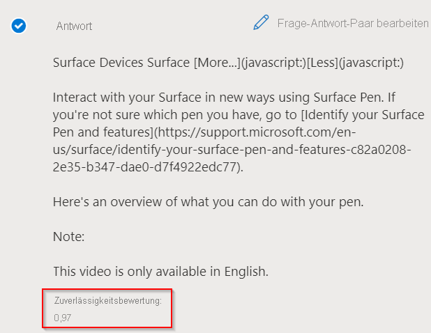

# <a name="improve-quality-of-response-with-synonyms"></a>Verbessern der Antwortqualität mit Synonymen

In diesem Tutorial lernen Sie Folgendes:

> [!div class="checklist"]
> * Hinzufügen von Synonymen zur Verbesserung der Qualität Ihrer Antworten
> * Auswerten der Antwortqualität über die Überprüfungsoption des Testbereichs

In diesem Tutorial erfahren Sie, wie Sie die Qualität Ihrer Antworten mithilfe von Synonymen verbessern können. Angenommen, Benutzer erhalten keine genaue Antwort auf ihre Fragen, wenn sie Varianten, Synonyme oder Akronyme eines Worts verwenden. Über die [Erstellungs-API](/rest/api/cognitiveservices-qnamaker/QnAMaker4.0/Alterations) sollen nun Synonyme für Schlüsselwörter hinzugefügt werden, um die Antwortqualität zu verbessern.

## <a name="add-synonyms-using-authoring-api"></a>Hinzufügen von Synonymen mithilfe der Erstellungs-API

Fügen wir die folgenden Wörter und alternative Begriffe hinzu, um die Ergebnisse zu verbessern:

|Word | Alternative Begriffe|
|--------------|--------------------------------|
| fix problems (Probleme behandeln) | `troubleshoot`, `trouble-shoot`|
| whiteboard   | `white-board`, `white board`   |
| Bluetooth    | `blue-tooth`, `blue tooth`     |

```json
{
    "synonyms": [
        {
            "alterations": [
                "fix problems",
                "troubleshoot",
                "trouble-shoot",
                ]
        },
        {
            "alterations": [
                "whiteboard",
                "white-board",
                "white board"
            ]
        },
        {
            "alterations": [
                "bluetooth",
                "blue-tooth",
                "blue tooth"
            ]
        }
    ]
}

```

Für das Frage-Antwort-Paar „Fix problems with Surface Pen“ (Probleme mit Surface Pen behandeln) werden nun die Antworten verglichen, wenn anstelle von „fix problems“ die englische Alternative „troubleshoot“ verwendet wird.

## <a name="response-before-addition-of-synonym"></a>Antwort vor dem Hinzufügen des Synonyms

> [!div class="mx-imgBorder"]
> [  ]( ../media/adding-synonyms/score.png#lightbox)

## <a name="response-after-addition-of-synonym"></a>Antwort nach dem Hinzufügen des Synonyms

> [!div class="mx-imgBorder"]
> [  ]( ../media/adding-synonyms/score-improvement.png#lightbox)

Wie Sie sehen, haben wir, bevor `troubleshoot` als Synonym hinzugefügt wurde, eine Antwort mit geringer Zuverlässigkeitsbewertung auf die Frage „How to troubleshoot your surface pen“ erhalten. Nachdem `troubleshoot` als Synonym für „fix problems“ hinzugefügt wurde, wurde die richtige Antwort auf die Frage mit einer höheren Zuverlässigkeitsbewertung zurückgegeben. Nach dem Hinzufügen dieser Synonyme verbesserte sich die Relevanz der Ergebnisse und damit die Benutzerfreundlichkeit.

> [!NOTE]
> Bei Synonymen wird die Groß-/Kleinschreibung nicht berücksichtigt. Synonyme funktionieren möglicherweise nicht wie erwartet, wenn Sie Stoppwörter als Synonyme hinzufügen. Die Liste der Stoppwörter finden Sie hier: [Liste der Stoppwörter](https://github.com/Azure-Samples/azure-search-sample-data/blob/master/STOPWORDS.md).
> Beispiel: In der englischen Sprache ist **it** (es) ein Stoppwort. Wenn in dieser Sprache die Abkürzung **IT** für Informationstechnologie hinzugefügt wird, erkennt das System den Begriff möglicherweise nicht, da „it“ ein Stoppwort ist, das bei der Verarbeitung der Abfrage herausgefiltert wird.

## <a name="next-steps"></a>Nächste Schritte

> [!div class="nextstepaction"]
> [Erstellen von Wissensdatenbanken in mehreren Sprachen](multiple-languages.md)
