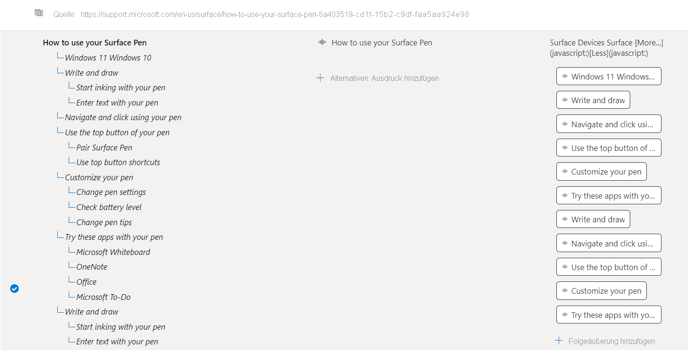
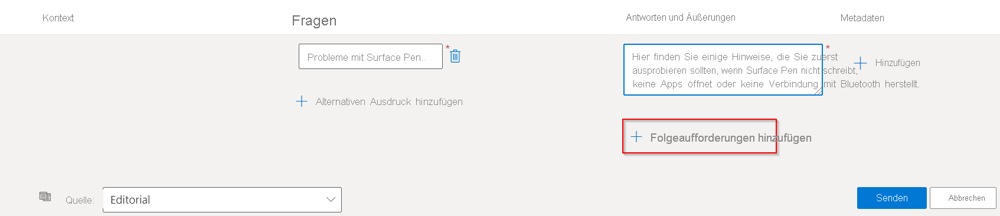
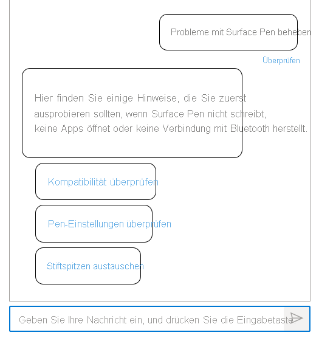

# Hinzufügen strukturierter Unterhaltungen mit mehrteiligen Äußerungen

In diesem Tutorial lernen Sie Folgendes:

> [!div class="checklist"]
> * Hinzufügen neuer Frage-Antwort-Paare zu Ihrem vorhandenen Projekt
> * Hinzufügen von Folgeäußerungen zum Erstellen strukturierter Unterhaltungen
> * Testen der mehrteiligen Äußerungen

## Voraussetzungen

 In diesem Tutorial verwenden wir [Surface Pen-FAQ](https://support.microsoft.com/surface/how-to-use-your-surface-pen-8a403519-cd1f-15b2-c9df-faa5aa924e98), um eine Wissensdatenbank zu erstellen.

Wenn Sie noch nie ein Fragen und Antworten-Projekt erstellt haben, wird empfohlen, mit dem Artikel für [erste Schritte](../how-to/create-test-deploy.md) zu beginnen, der Sie Schritt für Schritt durch den Prozess führt.

## Anzeigen des Kontexts des Frage-Antwort-Paars

In diesem Beispiel gehen wir davon aus, dass Benutzer nach zusätzlichen Details zum Surface Pen-Produkt fragen (insbesondere zur Problembehandlung), aber nicht die richtigen Antworten erhalten. Deshalb fügen wir weitere Äußerungen hinzu, um zusätzliche Szenarien zu unterstützen und die Benutzer mithilfe der mehrteiligen Äußerungen zu den richtigen Antworten weiterzuleiten.

Mehrteilige Äußerungen, die Frage-Antwort-Paaren zugeordnet sind, können angezeigt werden, indem Sie **Spalten anzeigen** > **Kontext** auswählen. Standardmäßig sollte dies bereits auf der Seite **Wissensdatenbank bearbeiten** auf der Language Studio-Benutzeroberfläche für Fragen und Antworten aktiviert sein.

> [!div class="mx-imgBorder"]
> 

Dadurch wird die Kontextstruktur mit allen Folgeäußerungen angezeigt, die mit einem F&A-Paar verknüpft sind: 

> [!div class="mx-imgBorder"]
> 

## Hinzufügen eines Fragepaars mit Folgeäußerungen

Um Benutzern bei der Lösung von Problemen mit dem Surface Pen zu unterstützen, fügen wir Folgeäußerungen hinzu:

- Hinzufügen eines neuen Fragepaars mit zwei Folgeäußerungen
- Hinzufügen einer Folgeäußerung zu einer der neu hinzugefügten Äußerungen

1. Hinzufügen eines neuen F&A-Paars mit zwei Folgeäußerungen: **Kompatibilität überprüfen** und **Stifteinstellungen überprüfen** Mithilfe des Editors fügen wir ein neues F&A-Paar mit einer Folgeäußerung hinzu, indem wir auf **Fragepaar hinzufügen** klicken.

    > [!div class="mx-imgBorder"]
    > 
    
    Im **Editorial** wird eine neue Zeile erstellt, in der wir das Frage-Antwort-Paar wie nachfolgend dargestellt eingeben:
    
    |Feld|Wert|
    |-----|----|
    |Fragen | Beheben von Problemen mit Surface |
    |Antworten und Äußerungen | Im Anschluss finden Sie einige Hinweise, die Sie zuerst ausprobieren sollten, wenn Surface Pen nicht schreibt, keine Apps öffnet oder keine Verbindung mit Bluetooth herstellt.|
    
2. Anschließend fügen wir dem neu erstellten Fragepaar eine Folgeäußerung hinzu, indem wir **Folgeäußerungen hinzufügen** auswählen. Füllen Sie die Details für die Äußerung wie gezeigt aus:
    
    > [!div class="mx-imgBorder"]
    > 
    
    Wir stellen **Kompatibilität überprüfen** als „Anzeigetext“ für die Äußerung zur Verfügung und versuchen, sie mit einem F&A-Paar zu verknüpfen. Da kein entsprechendes F&A-Paar verfügbar ist, das mit der Äußerung verknüpft werden kann, wenn wir nach „Surface Pen-Kompatibilität überprüfen“ suchen, erstellen wir ein neues Fragepaar, indem wir auf **Link zum neuen Link erstellen** klicken und **Fertig** auswählen. Wählen Sie anschließend **Änderungen speichern** aus.
    
    > [!div class="mx-imgBorder"]
    > 
    
3. Auf ähnliche Weise fügen wir eine weitere Äußerung **Stifteinstellungen überprüfen** hinzu, um den Benutzer bei der Problembehandlung des Produkts zu unterstützen. Auch hier fügen wir wieder ein Fragepaar hinzu.
    
    > [!div class="mx-imgBorder"]
    > 

4. Fügen Sie eine weitere Folgeäußerung zur neu erstellten Äußerung hinzu. Wir fügen nun „Stiftspitze ersetzen“ als Folgeäußerung zu der zuvor erstellten Äußerung „Stifteinstellungen überprüfen“ hinzu.

    > [!div class="mx-imgBorder"]
    > 
    
5. Speichern Sie die Änderungen, und testen Sie die Äußerungen im Bereich **Test**:
    
    > [!div class="mx-imgBorder"]
    > 
    
    Für die Benutzerabfrage **Probleme mit dem Surface Pen** gibt das System eine Antwort zurück und stellt dem Benutzer die neu hinzugefügten Äußerungen vor. Der Benutzer wählt dann eine der Äußerungen aus **(Stifteinstellungen überprüfen)** und daraufhin wird ihm die zugehörige Antwort mit einer weiteren Äußerung **(Stiftspitze ersetzen)** zurückgegeben. Wenn diese Option ausgewählt wird, erhält der Benutzer weitere Informationen. Mehrteilige Äußerungen werden also verwendet, um den Benutzer bei der Suche nach der benötigten Antwort zu unterstützen.
    
    > [!div class="mx-imgBorder"]
    > 

## Nächste Schritte

> [!div class="nextstepaction"]
> [Erweitern Ihrer Wissensdatenbank durch aktives Lernen](active-learning.md)
