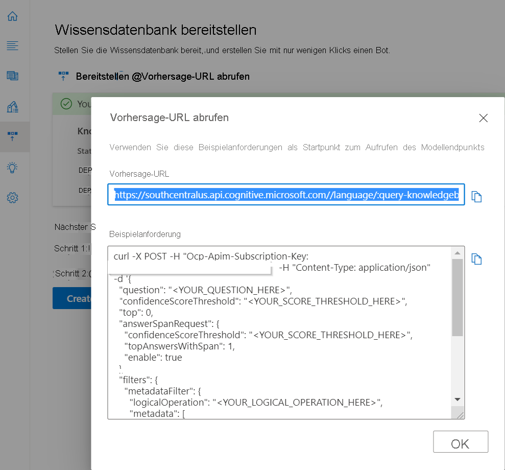
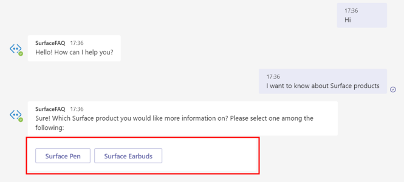
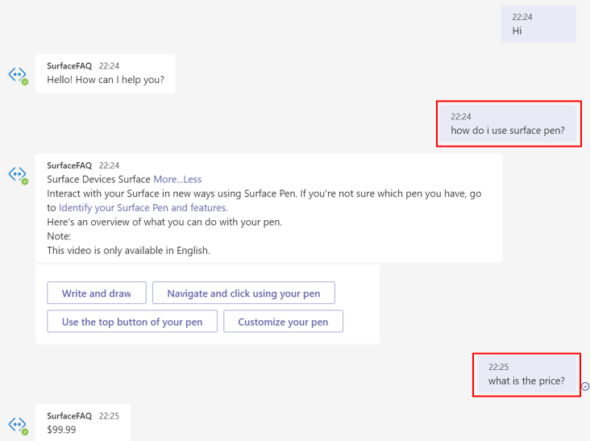

# <a name="add-multiple-categories-to-your-faq-bot"></a>Hinzufügen mehrerer Kategorien zu Ihrem FAQ-Bot

In diesem Tutorial lernen Sie Folgendes:

> [!div class="checklist"]
> * Erstellen eines Projekts und Markieren von Frage-Antwort-Paaren in unterschiedlichen Kategorien mit Metadaten
> * Erstellen eines separaten Projekts für jede Domäne
> * Erstellen einer separaten Sprachressource für jede Domäne

Wenn Sie einen FAQ-Bot erstellen, werden Sie möglicherweise auf Anwendungsfälle stoßen, bei denen Sie Abfragen aus verschiedenen Domänen beantworten müssen. Angenommen, das Marketingteam von Microsoft möchte einen Bot für den Kundensupport erstellen, der häufige Abfragen von Benutzern zu verschiedenen Surface-Produkten beantwortet. Der Einfachheit halber verwenden wir hier zwei FAQ-URLs für [Surface Pen](https://support.microsoft.com/surface/how-to-use-your-surface-pen-8a403519-cd1f-15b2-c9df-faa5aa924e98) und [Surface Earbuds](https://support.microsoft.com/surface/use-surface-earbuds-aea108c3-9344-0f11-e5f5-6fc9f57b21f9), um das Projekt zu erstellen.

## <a name="create-project-with-domain-specific-metadata"></a>Erstellen eines Projekts mit domänenspezifischen Metadaten

Die Inhaltsautoren können Dokumente verwenden, um Frage-Antwort-Paare zu extrahieren oder dem Projekt/der Wissensdatenbank benutzerdefinierte Frage-Antwort-Paare hinzuzufügen. Um diese Fragen und Antworten in bestimmte Domänen oder Kategorien zu gruppieren, können Sie Metadaten hinzufügen.

Für den Bot für Surface-Produkte können Sie die folgenden Schritte ausführen, um einen Bot zu erstellen, der Abfragen für beide Produkttypen beantwortet:

1. Fügen Sie die folgenden FAQ-URLs als Quellen hinzu. Wählen Sie dazu **Quelle hinzufügen** > **URLs** > **Alle hinzufügen** aus, wenn Sie die folgenden URLs hinzugefügt haben:
   
   [FAQ zu Surface Pen](https://support.microsoft.com/surface/how-to-use-your-surface-pen-8a403519-cd1f-15b2-c9df-faa5aa924e98)<br>[FAQ zu Surface Earbuds](https://support.microsoft.com/surface/use-surface-earbuds-aea108c3-9344-0f11-e5f5-6fc9f57b21f9)

    >[!div class="mx-imgBorder"]
    >[](../media/multiple-domains/add-url.png#lightbox)

2. In dieser Wissensdatenbank gibt es Frage-Antwort-Paare für zwei Produkte, und wir möchten zwischen ihnen unterscheiden, damit wir in Fragen und Antworten für ein bestimmtes Produkt nach Antworten suchen können. Hierzu könnten wir das Metadatenfeld für die Frage-Antwort-Paare aktualisieren.

   Wie Sie im Beispiel unten sehen können, haben wir ein Metadatenelement mit **Produkt** als Schlüssel und **surface_pen** oder **surface_earbuds** an den entsprechenden Stellen als Werte hinzugefügt. Sie können dieses Beispiel so erweitern, dass Daten für mehrere Produkte extrahiert werden und für jedes Produkt ein anderer Wert hinzugefügt wird.

   >[!div class="mx-imgBorder"]
   >[](../media/multiple-domains/product-metadata.png#lightbox)

4. Um nun das System auf die Suche nach der Antwort für ein bestimmtes Produkt einzuschränken, müssten Sie dieses Produkt als Filter in der API für Fragen und Antworten übergeben.

    Die REST-API-Vorhersage-URL kann aus dem Bereich „Wissensdatenbank bereitstellen“ abgerufen werden:

   >[!div class="mx-imgBorder"]
   >[](../media/multiple-domains/prediction-url.png#lightbox)

    Im JSON-Rumpf des API-Aufrufs haben wir *surface_pen* als Wert für die Metadaten zu *product* übergeben. Daher sucht das System nur nach der Antwort unter den QnA-Paaren mit den gleichen Metadaten.

    ```json
        {
          "question": "What is the price?",
          "top": 3
        },
        "answerSpanRequest": {
          "enable": true,
          "confidenceScoreThreshold": 0.3,
          "topAnswersWithSpan": 1
        },
        "filters": {
          "metadataFilter": {
            "metadata": [
              {
                "key": "product",
                "value": "surface_pen"
              }
            ]
          }
        }
    ```

    Sie können Metadatenwerte auf Grundlage von Benutzereingaben auf folgende Weisen abrufen: 

    * Verwenden Sie die Domäne explizit als Eingabe des Benutzers über den Botclient. Zum Beispiel können Sie, wie unten gezeigt, die Produktkategorie als Eingabe vom Benutzer übernehmen, wenn die Unterhaltung eingeleitet wird.

      

    * Identifizieren Sie die Domäne implizit anhand des Kontexts des Bots. Wenn sich die vorherige Frage z. B. auf ein bestimmtes Surface-Produkt bezog, kann sie vom Client als Kontext gespeichert werden. Wenn der Benutzer das Produkt bei der nächsten Abfrage nicht angibt, könnten Sie den Kontext des Bots als Metadaten an die GenerateAnswer-API weitergeben.

      

    * Extrahieren Sie die Entität aus der Abfrage des Benutzers, um die Domäne zu bestimmen, die als Metadatenfilter verwendet werden soll. Sie können andere Cognitive Services-Features verwenden, z. B. [Erkennung benannter Entitäten (Named Entity Recognition, NER)](../../named-entity-recognition/overview.md) und [Unterhaltungssprachverständnis](../../conversational-language-understanding/overview.md) für die Entitätsextraktion.

      

### <a name="how-large-can-our-projects-be"></a>Wie groß können unsere Projekte sein?

Sie können einem einzelnen Projekt/einer einzelnen Wissensdatenbank bis zu 50.000 Frage-Antwort-Paare hinzufügen. Wenn Ihre Daten 50.000 Frage-Antwort-Paare überschreiten, sollten Sie erwägen, die Wissensdatenbank aufzuteilen.

## <a name="create-a-separate-project-for-each-domain"></a>Erstellen eines separaten Projekts für jede Domäne

Sie können auch ein separates Projekt/eine separate Wissensdatenbank für jede Domäne erstellen und die Projekte separat verwalten. Alle APIs erfordern, dass der Benutzer die Projekt-ID übergibt, um eine Aktualisierung der Wissensdatenbank vorzunehmen oder eine Antwort auf die Frage des Benutzers abzurufen.  

Wenn die Frage des Benutzers vom Dienst empfangen wird, müssen Sie `projectName` im gezeigten REST-API-Endpunkt übergeben, um eine Antwort aus der entsprechenden Wissensdatenbank abzurufen. Sie finden die URL auf der Seite **Wissensdatenbank bereitstellen** unter **Vorhersage-URL abrufen**:

`https://southcentralus.api.cognitive.microsoft.com/language/:query-knowledgebases?projectName=Test-Project-English&api-version=2021-10-01&deploymentName=production`

## <a name="create-a-separate-language-resource-for-each-domain"></a>Erstellen einer separaten Sprachressource für jede Domäne

Angenommen, das Marketingteam von Microsoft möchte einen Bot für den Kundensupport erstellen, der häufige Abfragen von Benutzern zu Surface- und Xbox-Produkten beantwortet. Geplant ist, verschiedenen Teams den Zugriff auf die Wissensdatenbanken für Surface und Xbox zuzuweisen. In diesem Fall ist es ratsam, zwei Ressourcen für Fragen und Antworten zu erstellen: eine für Surface und eine für Xbox. Sie können jedoch unterschiedliche Rollen für Benutzer definieren, die auf dieselbe Ressource zugreifen.
